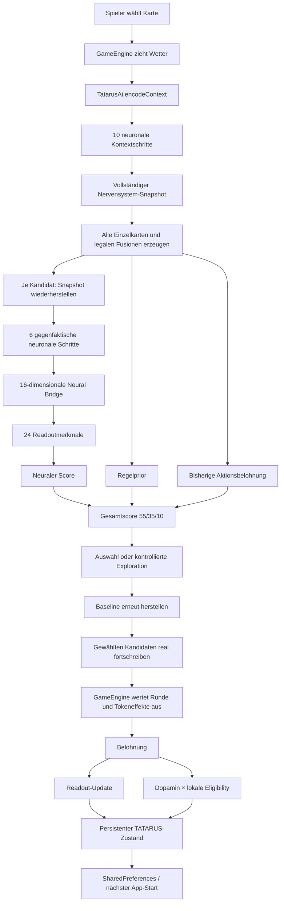

# TATARUS in Runenkrieg

## Technische und funktionale Dokumentation des persistenten synthetischen Gegners

**Projekt:** Runenkrieg: TATARUS
**System:** TATARUS – A Persistent Synthetic Nervous System
**Android-Version:** 1.4.0
**Dokumentationsstand:** 30. Juli 2026
**Implementierung:** Kotlin/JVM für Android, vollständig offline ausführbar

---

## 1. Zweck dieser Dokumentation

Diese Dokumentation beschreibt den tatsächlich im Android-Spiel
implementierten TATARUS-Gegner. Sie erklärt:

- welche Informationen TATARUS aus einer Spielrunde erhält,
- wie Spielzustände in neuronale Eingaben übersetzt werden,
- wie das rekurrente Spiking-Netzwerk arbeitet,
- wie Karten und Fusionen bewertet werden,
- welche Zustände während einer hypothetischen Bewertung zurückgesetzt werden,
- welche Zustände nach einer gewählten Handlung bestehen bleiben,
- wie Belohnung, Eligibility-Spuren und Readout zusammen lernen,
- wie das Modell gespeichert und wiederhergestellt wird,
- was im TATARUS-Labor angezeigt wird,
- welche Eigenschaften getestet sind,
- und welche Grenzen diese mobile Integration besitzt.

Die Dokumentation ist keine Beschreibung eines beliebigen Zielsystems,
sondern bezieht sich auf den Quellcode in:

- `app/src/main/java/de/runenkrieg/game/ai/GameOpponent.kt`
- `app/src/main/java/de/runenkrieg/game/ai/TatarusAi.kt`
- `app/src/main/java/de/runenkrieg/game/ai/TatarusNervousSystem.kt`
- `app/src/main/java/de/runenkrieg/game/engine/GameEngine.kt`
- `app/src/main/java/de/runenkrieg/game/model/RuleBook.kt`
- `app/src/main/java/de/runenkrieg/game/model/Models.kt`
- `app/src/main/java/de/runenkrieg/game/GameViewModel.kt`

---

## 2. Kurzfassung

TATARUS ersetzt den früheren Contextual-Bandit-Gegner. Im Standardmodus
**Reines TATARUS** entsteht die Spielentscheidung aus zwei lernbaren Ebenen:

1. Ein persistentes, rekurrentes E/I-Spiking-Netzwerk verarbeitet den
   aktuellen Spielkontext und jede mögliche TATARUS-Aktion.
2. Ein linearer, begrenzter Readout bewertet den vom Nervensystem erzeugten
   Zustand für die jeweilige Kartenklasse.

Die endgültige Standardbewertung einer Handlung \(a\) lautet:

\[
S(a)=S_{\mathrm{neural}}(a)
\]

Abgeleitete Regelmerkmale wie der fertig berechnete Elementvorteil,
Wetterbonus und Regel-Gesamtscore werden in diesem Modus auf null gesetzt.
Das Netz erhält weiterhin die Rohmerkmale von Karten, Elementen, Wetter,
Tokens und Verlauf und muss deren Nutzen über Belohnung lernen.

Für Forschung und Vergleich sind zusätzlich Hybrid-, Regel-, Zufalls-,
Frozen- und Mechanismusablationsmodi eingebaut.

---

## 3. Abgrenzung zum vollständigen Forschungsprojekt

Die Android-Integration ist ein nativer, verkleinerter Gameplay-Adapter des
TATARUS-Forschungssystems.

Sie enthält:

- ein dauerhaft fortgeschriebenes neuronales Zustandsmodell,
- exzitatorische und inhibitorische Neuronen,
- rekurrente synaptische Übertragung,
- passive dendritische Zustände,
- individuelle Axonverzögerungen,
- einen exportierten Generated Operator,
- lokale vorzeichenbehaftete Eligibility-Spuren,
- synaptische Ressourcen und Facilitation,
- adaptive Schwellen und Homeostase,
- einen Energiehaushalt,
- belohnungsmodulierte Plastizität,
- langsame Konsolidierungszustände,
- konkurrierende Assemblies,
- einen begrenzten neuronalen Readout,
- deterministische Snapshots für gegenfaktische Rollouts,
- und persistente Speicherung zwischen App-Starts.

Sie enthält nicht:

- die Windows-Forschungsoberfläche,
- den vollständigen Experimentkatalog des Desktop-Projekts,
- dessen große Populationen und mehrstufige Lebenslaufumwelten,
- automatische Mehrseed-Statistik,
- Signifikanztests oder Konfidenzintervalle,
- eine GPU-/OpenCL-Ausführung,
- eine vollständige biologische Zell- oder Nervensimulation,
- und keinen Nachweis allgemeiner Intelligenz.

Der mobile Kern ist ein deterministisches, biologisch inspiriertes
Rechensubstrat für einen Spielgegner. Aussagen über seine Eigenschaften
sollten auf diesen Umfang begrenzt werden.

---

## 4. Systemarchitektur



### 4.1 Verantwortungsgrenzen

Die Schnittstelle `GameOpponent` trennt das Spiel vom Gegner. Die
`GameEngine` kennt keine Spannungen, Spikes, Synapsen oder Readoutgewichte.
Sie kann nur:

- eine Zusammenfassung anfordern,
- eine gegnerische Handlung anfordern,
- eine aufgelöste Handlung belohnen,
- Selbsttraining auslösen,
- oder das Modell zurücksetzen.

Diese Trennung verhindert, dass Spielregeln direkt auf interne neuronale
Zustände zugreifen. Zugleich kann später ein anderer Gegner implementiert
werden, ohne die Rundenauswertung zu verändern.

| Komponente | Verantwortung |
|---|---|
| `GameEngine` | Spielablauf, Wetter, Kampfwerte, Gewinner, Token und Mechaniken |
| `GameOpponent` | Stabile Schnittstelle zwischen Spiel und Gegner |
| `TatarusAi` | Kodierung, Aktionssuche, Readout, Lernen, Training, Persistenz |
| `TatarusNervousSystem` | Neuronale Zustände, Synapsen, Spikes, Assemblies |
| `GameViewModel` | Lebenszyklus, Hintergrundtraining und UI-Zustand |
| `GameScreen` | Darstellung des Spiels und des TATARUS-Labors |

---

## 5. Lebenszyklus in der Android-App

### 5.1 App-Start

Beim Erzeugen des `GameViewModel` wird genau eine Instanz von `TatarusAi`
angelegt. Deren Konstruktor:

1. erzeugt zunächst einen deterministischen TATARUS-Kern,
2. öffnet den SharedPreferences-Bereich `runenkrieg_tatarus`,
3. versucht das gespeicherte Modell `tatarus_opponent_v3` zu laden,
4. verwirft inkonsistente oder inkompatible Daten kontrolliert,
5. und stellt bei einem Ladefehler einen frischen Grundzustand her.

Wenn nach dem Laden noch keine Beobachtung existiert, startet die App
automatisch ein Grundtraining über 500 simulierte Runden.

### 5.2 Laufende Partie

Ein neues Spiel setzt das Nervensystem nicht zurück. Es werden nur Karten,
Helden, Tokens, Wetter und Rundenhistorie des aktuellen Duells neu erzeugt.
Der TATARUS-Zustand bleibt über:

- Runden,
- Partien,
- Activity-Neuerstellungen,
- und App-Neustarts

erhalten.

Das ist der zentrale Unterschied zu einer Gegnerfunktion, die in jeder Runde
zustandslos neu berechnet wird.

### 5.3 Explizites Zurücksetzen

Nur die Schaltfläche **TATARUS-Zustand zurücksetzen** löscht:

- den Nervensystemzustand,
- alle Readoutgewichte,
- alle Aktionsstatistiken,
- alle bekannten Kontexthashes,
- noch ausstehende Entscheidungsmerkmale,
- Beobachtungs- und Belohnungszähler,
- die Zahl der Trainingsläufe,
- und das persistierte JSON-Modell.

Ein Reset während eines laufenden Hintergrundtrainings wird von der UI
blockiert.

---

## 6. Welche Informationen TATARUS im Spiel erhält

Runenkrieg ist in der aktuellen Implementierung kein verdecktes
Simultanspiel. Der Ablauf lautet:

1. Der Spieler wählt seine Karte.
2. Die `GameEngine` zieht das Wetter.
3. TATARUS erhält Spielerkarte, eigenes Blatt, Spielzustand und Wetter.
4. TATARUS wählt daraufhin seine Antwort.

TATARUS kennt bei der Entscheidung daher:

- das Element, die Fähigkeit und den Typ der Spielerkarte,
- das aktuelle Wetter,
- beide Helden,
- beide Tokenstände,
- die Rundenhistorie,
- die eigenen legal verfügbaren Karten,
- und alle daraus erzeugbaren legalen Fusionen.

TATARUS kennt keine zukünftigen Ersatzkarten oder zukünftigen Wetterwerte.

---

## 7. Kontextkodierung: 32 Eingabewerte

Der aktuelle Spielkontext wird in einen Vektor

\[
\mathbf{x}_{\mathrm{Kontext}}\in\mathbb{R}^{32}
\]

überführt. Die meisten Werte liegen im Bereich \([0,1]\).

| Index | Kontextmerkmal | Kodierung |
|---:|---|---|
| 0–9 | Element der Spielerkarte | One-hot über 10 Elemente |
| 10 | Stärke der Fähigkeit | `power / 13` |
| 11 | Kartentyp | Ordinalwert geteilt durch 4 |
| 12–14 | Wetter | One-hot für Regen, Windsturm, Erdbeben |
| 15 | Spieler-Tokens | `playerTokens / 12`, begrenzt |
| 16 | TATARUS-Tokens | `aiTokens / 12`, begrenzt |
| 17 | Tokenbalance | `(aiTokens - playerTokens + 10) / 20` |
| 18 | Spielerheld | Ordinalwert, normalisiert |
| 19 | TATARUS-Held | Ordinalwert, normalisiert |
| 20 | Rundenfortschritt | `round / 100` |
| 21 | Letzte Runde: TATARUS-Sieg | 0 oder 1 |
| 22 | Letzte Runde: Spieler-Sieg | 0 oder 1 |
| 23 | Letzte Runde: Unentschieden | 0 oder 1 |
| 24–31 | Häufigkeit früherer Spielerelemente | Je Element Zähler/10, begrenzt |

Bei den historischen Elementkanälen werden derzeit die ersten acht Elemente
der Enum-Reihenfolge erfasst: Feuer, Wasser, Erde, Luft, Blitz, Eis, Magie
und Schatten.

### 7.1 Tatsächliche neuronale Verdrahtung des Eingangs

Seit Android-Version 1.3.0 sind alle 32 Kanäle an neuronale Zustände
angeschlossen:

| Eingabekanäle | Zielneuronen | Eingangsstärke | Funktion |
|---|---|---:|---|
| 0–23 | Sensorische Neuronen 0–23 | 26 | Karte, Wetter, Tokens, Helden und Rundenzustand |
| 24–27 | Exzitatorische Eingangsneuronen 24–27 | 16 | erste vier erweiterten Kontext-/Kandidatenmerkmale |
| 28–31 | Kontextneuronen 64–67 | 16 | letzte vier Kontext-/Kandidatenmerkmale |

Damit existiert kein kodierter Kanal mehr, der bei der neuronalen
Verarbeitung verworfen wird. Die Kanäle 24–27 besitzen eine Doppelrolle:
Sie empfangen externen Eingang und bleiben zugleich Teil des rekurrenten
exzitatorischen Pools. Ihr Signal kann dadurch über ihre ausgehenden
Synapsen, Delays und Eligibility-Spuren in das gesamte Netzwerk gelangen.

Ein automatisierter Test vergleicht für jeden Kanal einen Nullreiz mit einem
Einzelkanalreiz bei identischem Seed. Alle 32 Einzelkanalreize müssen einen
anderen vollständigen Nervensystemhash erzeugen.

---

## 8. Erzeugung der möglichen TATARUS-Handlungen

Für eine Entscheidung werden zunächst alle legalen Optionen erzeugt.

### 8.1 Einzelkarten

Jede Karte in der TATARUS-Hand bildet eine Option. Das Blatt enthält
normalerweise vier Karten.

### 8.2 Fusionen

Alle Karten mit der Mechanik `FUSION` werden paarweise kombiniert. Bei
\(n\) Fusionskarten entstehen:

\[
\binom{n}{2}=\frac{n(n-1)}{2}
\]

zusätzliche Kandidaten.

Bei vier Fusionskarten wären das sechs Fusionen zusätzlich zu vier
Einzelkarten.

Eine Fusion:

- verbraucht beide Ausgangskarten,
- addiert deren Fähigkeitsstärken und begrenzt das Ergebnis auf `Avatar`,
- vereinigt ihre Mechaniken,
- erhält immer die Fusionsmechanik,
- verwendet bei unterschiedlichen Typen den Typ `Beschwörung`,
- und wird als eigene Aktionsklasse mit `fused = true` behandelt.

Fusionen erhalten in der TATARUS-Vorbewertung einen festen Zusatz:

\[
S_{\mathrm{FusionPrior}} = 1{,}25
\]

Dieser Zusatz betrifft den Regelprior, nicht direkt die neuronale Ausgabe.

---

## 9. Kandidatenkodierung: Was eine mögliche Antwort beschreibt

Jede Einzelkarte oder Fusion wird als eigener
32-dimensionaler Kandidatenvektor kodiert.

| Index | Kandidatenmerkmal | Kodierung |
|---:|---|---|
| 0–9 | Element der TATARUS-Karte | One-hot |
| 10 | Fähigkeit/Stärke | `power / 13` |
| 11 | Kartentyp | Ordinalwert geteilt durch 4 |
| 12 | Fusion | 0 oder 1 |
| 13 | Anteil vorhandener Mechaniken | Anzahl / 7 |
| 14 | Elementvorteil gegen Spielerkarte | `(advantage + 3) / 6` |
| 15 | Wettermodifikator | `(modifier + 2) / 4` |
| 16 | TATARUS-Tokens | `aiTokens / 12` |
| 17 | Spieler-Tokens | `playerTokens / 12` |
| 18 | Held passt zum Kartenelement | 0 oder 1 |
| 19 | Ketteneffekt vorhanden | 0 oder 1 |
| 20 | Resonanz vorhanden | 0 oder 1 |
| 21 | Überladung vorhanden | 0 oder 1 |
| 22 | Fusion vorhanden | 0 oder 1 |
| 23 | Wetterbindung vorhanden | 0 oder 1 |
| 24 | Verbündeter vorhanden | 0 oder 1 |
| 25 | Segen/Fluch vorhanden | 0 oder 1 |
| 26 | Typ Artefakt | 0 oder 1 |
| 27 | Typ Beschwörung | 0 oder 1 |
| 28 | normalisierter Regelprior | `(ruleScore + 10) / 35` |
| 29 | Zahl verbrauchter Karten | 0,5 oder 1,0 |
| 30 | gleiche TATARUS-Elemente in letzten 4 Runden | Anzahl / 4 |
| 31 | konstanter Bias-/Aktivierungskanal | 1 |

Auch hier gilt die physische Eingangsverdrahtung aus Abschnitt 7.1. Alle
Kandidatenkanäle erreichen das Nervensystem. Die Indizes 24–27 treiben die
exzitatorischen Eingangsneuronen 24–27; die Indizes 28–31 treiben die vier
Kontextneuronen. Ausgewählte Kandidatenmerkmale werden zusätzlich direkt in
den Readout übernommen.

---

## 10. Aufbau des mobilen Nervensystems

### 10.1 Neuronenpopulation

Der Kern besitzt 72 Neuronen:

| Indexbereich | Anzahl | Rolle |
|---|---:|---|
| 0–23 | 24 | Sensorische Eingangsneuronen |
| 24–27 | 4 | Exzitatorische Eingangs- und rekurrente Neuronen |
| 28–51 | 24 | Rekurrente exzitatorische Neuronen |
| 52–63 | 12 | Rekurrente inhibitorische Neuronen |
| 64–67 | 4 | Kontextneuronen |
| 68–71 | 4 | Motor-/Ausgangsneuronen |

Nur Neuronen 52–63 sind inhibitorisch. Alle anderen Neuronen besitzen
positive ausgehende Gewichte. Damit enthält das Gesamtnetz:

- 60 exzitatorisch wirkende Quellen,
- 12 inhibitorisch wirkende Quellen,
- also ungefähr 83,3 % exzitatorische und 16,7 % inhibitorische Quellen.

### 10.2 Rekurrente Topologie

Jedes Neuron erhält bei der Initialisierung genau sechs verschiedene
Ausgangsziele:

- keine Selbstverbindung,
- zufällige, aber durch den Seed deterministische Ziele,
- individuelle ganzzahlige Verzögerung von 1 bis 5 Schritten.

Damit entstehen:

\[
72 \cdot 6 = 432
\]

gerichtete Synapsen.

Der Standardseed ist:

```text
0x54415441
```

Die Topologie ist daher bei jedem frischen Modell identisch.

### 10.3 Dale-Konformität

Das Vorzeichen einer Synapse wird ausschließlich durch ihr
präsynaptisches Neuron festgelegt:

\[
w_{ij}>0 \quad \text{für exzitatorische Quelle }j
\]

\[
w_{ij}<0 \quad \text{für inhibitorische Quelle }j
\]

Initiale Beträge:

- exzitatorisch: zufällig in \([2{,}5,5{,}5)\),
- inhibitorisch: zufällig in \([4,7)\).

Lernen darf das Vorzeichen nicht umkehren. Gewichte werden begrenzt auf:

\[
w_{\mathrm{E}}\in[0{,}05,8]
\]

\[
w_{\mathrm{I}}\in[-8,-0{,}05]
\]

---

## 11. Dynamik eines neuronalen Schritts

Ein Aufruf von `observe` führt zwischen 1 und 64 diskrete Schritte aus.
Die Spielintegration verwendet:

- 10 Schritte für den Kontext,
- 6 Schritte je Kandidat,
- 4 Schritte für die Konsequenz/Belohnung.

Die Konstanten sind in Millisekunden benannt. Der Code verwendet einen
impliziten Schritt von ungefähr 1 ms; es gibt im Android-Adapter aber keine
separat konfigurierbare Variable \(\Delta t\).

### 11.1 Dendritischer Zustand

Für jedes Neuron wird zunächst der passive dendritische Zustand aktualisiert:

\[
D_i(t+1)
=
D_i(t)
+
\frac{
V_{\mathrm{rest}}-D_i(t)
+I_i^{\mathrm{rek}}(t)
+I_i^{\mathrm{extern}}(t)
}{
\tau_D
}
\]

mit:

\[
V_{\mathrm{rest}}=-65\ \mathrm{mV},
\qquad
\tau_D=35
\]

Sensorische Neuronen erhalten einen maximalen externen Faktor von 26,
Kontextneuronen einen Faktor von 16.

### 11.2 Somadynamik

Danach folgt die Membranspannung:

\[
V_i(t+1)
=
V_i(t)
+
\frac{
V_{\mathrm{rest}}-V_i(t)
+c_D(D_i(t)-V_i(t))
+I_{\mathrm{basis}}
}{
\tau_V
}
\]

mit:

\[
c_D=0{,}22,\qquad
I_{\mathrm{basis}}=12{,}5,\qquad
\tau_V=20
\]

### 11.3 Adaptive Schwelle und Spike

Die wirksame Schwelle lautet:

\[
\theta_i(t)
=
-50
+A_i(t)
+H_i(t)
\]

Ein Spike entsteht, wenn:

\[
V_i(t)\ge\theta_i(t)
\quad\land\quad
E_i(t)\ge0{,}025
\]

Nach einem Spike:

\[
V_i\leftarrow -70\ \mathrm{mV}
\]

\[
A_i\leftarrow A_i+1{,}2
\]

\[
E_i\leftarrow E_i-0{,}025
\]

Die Adaptation zerfällt pro Schritt:

\[
A_i(t+1)=0{,}99A_i(t)
\]

Der aktuelle mobile Kern besitzt keinen separaten Refraktärzeitzähler.
Reset, Adaptation, Energiebedarf und Homeostase begrenzen die unmittelbare
Wiedererregung indirekt.

### 11.4 Schnelle und langsame Aktivitätsraten

Für jedes Neuron werden zwei exponentiell gefilterte Aktivitätswerte geführt:

\[
r_i^{\mathrm{fast}}(t+1)
=
0{,}88r_i^{\mathrm{fast}}(t)
+0{,}12s_i(t)
\]

\[
r_i^{\mathrm{slow}}(t+1)
=
0{,}995r_i^{\mathrm{slow}}(t)
+0{,}005s_i(t)
\]

mit \(s_i(t)\in\{0,1\}\).

### 11.5 Homeostase

Die lokale Schwellenkorrektur verfolgt eine Zielrate von 8 Hz:

\[
H_i(t+1)
=
\operatorname{clip}
\left(
H_i(t)
+0{,}00003
\left[
1000r_i^{\mathrm{fast}}(t)-8
\right],
-8,8
\right)
\]

Hohe schnelle Aktivität hebt dadurch langfristig die Schwelle an, geringe
Aktivität senkt sie.

### 11.6 Energie

Jedes Neuron startet mit:

\[
E_i=1
\]

Kosten:

- Spike: \(0{,}025\),
- jede ausgehende Übertragung: \(0{,}0004\).

Erholung pro Schritt:

\[
E_i(t+1)=\min(1,E_i(t)+0{,}0015)
\]

Ein Neuron ohne ausreichend Energie kann keinen Spike erzeugen.

---

## 12. Lokale Eligibility-Spur

Jede Synapse \(j\rightarrow i\) führt eine eigene, vorzeichenbehaftete
Eligibility-Spur \(e_{ji}\).

### 12.1 Zerfall

\[
e_{ji}(t+1)
=
e_{ji}(t)
\exp\left(-\frac{1}{400}\right)
\]

### 12.2 Prä-/Post-Kausalität

Wenn Plastizität für den aktuellen Rollout aktiviert ist:

\[
c_{ji}(t)
=
s_i(t)\,\mathrm{trace}_j(t)
-
s_j(t)\,\mathrm{trace}_i(t)
\]

\[
e_{ji}(t+1)
=
\operatorname{clip}
\left(
e_{ji}(t+1)+0{,}35c_{ji}(t),
-4,4
\right)
\]

Damit können unterschiedliche Spike-Reihenfolgen verschiedene Vorzeichen
erzeugen.

Der neuronale Spike-Trace zerfällt als:

\[
\mathrm{trace}_i(t+1)
=
0{,}95\,\mathrm{trace}_i(t)+s_i(t)
\]

### 12.3 Zwei Funktionen derselben Spur

Die lokale Spur hat im mobilen Gegner zwei Aufgaben:

1. Sie moduliert bereits die spätere synaptische Übertragung.
2. Sie markiert Synapsen für ein später eintreffendes Belohnungssignal.

Sie ist damit nicht nur ein passiver Diagnosewert.

---

## 13. Ereigniskausale synaptische Übertragung

### 13.1 E/I-Balance

Aus externem und rekurrentem Strom wird zunächst eine normalisierte Balance
gebildet:

\[
b(t)
=
\frac{
I_{\mathrm{exc}}(t)-I_{\mathrm{inh}}(t)
}{
I_{\mathrm{exc}}(t)+I_{\mathrm{inh}}(t)+\varepsilon
}
\]

mit \(b(t)\in[-1,1]\).

### 13.2 Eingabe des Generated Operators

Für eine feuernde Quelle \(j\) und Ziel \(i\):

\[
\phi_{ji}(t)
=
\operatorname{clip}
\left(
b(t)
+0{,}2[
\mathrm{trace}_j(t)-\mathrm{trace}_i(t)
],
-1,1
\right)
\]

Das Gate hängt damit vom Netzwerkzustand im Emissionsmoment und von der
lokalen Spikehistorie der beteiligten Neuronen ab.

### 13.3 Generated-Operator-Gate

Der exportierte skalare Kernel wird als \(K(\phi)\) aufgerufen:

\[
g_{ji}(t)
=
\operatorname{clip}
\left(
\frac{1+\tanh(K(\phi_{ji}(t)))}{2},
0{,}05,
0{,}95
\right)
\]

Die Implementierung verwendet numerische Schutzfunktionen:

\[
\operatorname{sanitize}(x)
=
\begin{cases}
\operatorname{clip}(x,-10^6,10^6), & x\text{ endlich}\\
0, & \text{sonst}
\end{cases}
\]

\[
\operatorname{safeDivide}(a,b)
=
\frac{\operatorname{sanitize}(a)}
{|\operatorname{sanitize}(b)|+10^{-6}}
\]

\[
\operatorname{logAbs}(x)=\ln(|\operatorname{sanitize}(x)|+10^{-9})
\]

Der Kotlin-Code in `generatedKernel` ist der maßgebliche exakte
Operatorausdruck. Für Audits sollte diese Funktion direkt mit dem
entsprechenden TATARUS-Export verglichen werden.

### 13.4 Kurzzeitige synaptische Zustände

Jede Synapse führt:

- Ressource \(R_{ji}\in[0,1]\),
- Facilitation \(F_{ji}\in[0,0{,}8]\),
- kumulierte Nutzung,
- Gewicht,
- konsolidiertes Gewicht,
- Eligibility.

Freisetzungswahrscheinlichkeit:

\[
p_{ji}
=
\operatorname{clip}(0{,}18+F_{ji},0{,}02,0{,}95)
\]

Eligibility-Modulation:

\[
m_{ji}
=
\operatorname{clip}
\left(
1+0{,}5\tanh(e_{ji}),
0{,}25,
2
\right)
\]

Übertragungsamplitude:

\[
A_{ji}
=
w_{ji}\,
p_{ji}\,
R_{ji}\,
g_{ji}\,
m_{ji}
\]

Die Amplitude wird in den Verzögerungsring für den individuellen
Synapsendelay von 1 bis 5 Schritten eingetragen.

Nach einer Emission:

\[
R_{ji}
\leftarrow
R_{ji}(1-0{,}35p_{ji})
\]

\[
F_{ji}
\leftarrow
\operatorname{clip}
\left(
F_{ji}+0{,}12(1-F_{ji}),
0,0{,}8
\right)
\]

Ohne Emission erholt sich die Ressource in Richtung 1:

\[
R_{ji}(t+1)
=
R_{ji}(t)+\frac{1-R_{ji}(t)}{180}
\]

Die Facilitation zerfällt pro Schritt mit dem Faktor \(0{,}9917\).

---

## 14. Assemblies und Neuheit

Seit Version 1.4.0 verwendet die Assembly-Bildung alle 32 verdrahteten
Eingabekanäle und die zugehörige neuronale Antwort. Für Kanal \(k\):

\[
n_k
=
\tanh\left(
r_k^{\mathrm{fast}}-r_k^{\mathrm{slow}}
+\frac{D_k-V_{\mathrm{rest}}}{20}
\right)
\]

\[
z_k
=
0{,}55(x_k-\bar{x})+0{,}45n_k
\]

Anschließend wird das gesamte Muster mittelwertzentriert und auf
Einheitslänge normalisiert. Dadurch können nicht mehr alle überwiegend
positiven Zustände allein aufgrund derselben Richtung in eine Assembly
fallen.

Der Vergleich verwendet gleichzeitig:

- Kosinusähnlichkeit,
- euklidische Distanz der normalisierten Muster.

### 14.1 Neue Assembly

Eine neue Assembly entsteht, wenn:

- noch keine Assembly existiert, oder
- die beste Ähnlichkeit kleiner als \(0{,}78\) ist oder
  die Distanz größer als \(0{,}70\) ist,
- und noch weniger als 16 Assemblies gespeichert sind.

### 14.2 Bestehende Assembly

Bei einer passenden Assembly wird deren Prototyp angepasst:

\[
P_k
\leftarrow
P_k+0{,}12(z_k-P_k)
\]

Danach wird auch der Prototyp erneut zentriert und normalisiert. Ist die
maximale Zahl von 16 Assemblies erreicht und ein Muster passt zu keiner,
wird es der nächsten Assembly zugeordnet, ohne deren Prototyp zu verwischen.

Zusätzlich werden gespeichert und angezeigt:

- Belegung je Assembly,
- normalisierte Belegungsentropie,
- mittlere paarweise Trennung,
- Zahl echter Reaktivierungen,
- kombinierte Neuheit aus Ähnlichkeit und Distanz.

### 14.3 Wann Assemblies verändert werden

Assemblies werden aktualisiert nach:

- dem realen Kontextrollout,
- dem festgeschriebenen Kandidatenrollout,
- dem Konsequenzrollout nach der Runde.

Während der hypothetischen Prüfung nicht gewählter Kandidaten ist
`updateAssemblies = false`. Dadurch hinterlassen bloß gedachte Alternativen
keine dauerhaften Assembly-Prototypen.

---

## 15. Neural Bridge: Ausgang des Nervensystems

Das Nervensystem gibt keinen Kartennamen direkt aus. Es erzeugt einen
16-dimensionalen Zustandsvektor:

\[
\mathbf{z}\in\mathbb{R}^{16}
\]

| Index | Bridge-Merkmal |
|---:|---|
| 0–3 | schnelle Aktivität der vier Motorneuronen |
| 4 | mittlere schnelle sensorische Aktivität |
| 5 | mittlere schnelle exzitatorische Aktivität |
| 6 | mittlere schnelle inhibitorische Aktivität |
| 7 | mittlere schnelle Kontextaktivität |
| 8 | mittlere neuronale Energie |
| 9 | `tanh` der mittleren Eligibility |
| 10 | mittlere synaptische Ressource |
| 11 | normalisierte ID der aktiven Assembly |
| 12 | Neuheit des aktuellen Musters |
| 13 | Abweichung der E-Aktivität von der Zielrate |
| 14 | `tanh` des Dopaminzustands |
| 15 | konstanter Biaswert 1 |

Diese Bridge ist die kontrollierte Grenze zwischen dynamischem Nervensystem
und Aktionsreadout.

---

## 16. Gegenfaktische Kandidatenprüfung

TATARUS muss mehrere mögliche Karten mit demselben Ausgangszustand
vergleichen. Ohne Snapshot würde die zuerst geprüfte Karte das Nervensystem
verändern und spätere Karten unter anderen Bedingungen bewertet werden.

### 16.1 Vollständiger Snapshot

Vor der Kandidatenschleife werden kopiert:

- Membranspannungen,
- dendritische Zustände,
- Adaptation,
- Homeostase,
- Energie,
- schnelle und langsame Aktivität,
- Spike-Traces,
- alle Delay-Puffer,
- Gewicht, Konsolidierung, Eligibility, Ressource, Facilitation und Nutzung
  jeder Synapse,
- Assembly-Prototypen,
- aktive Assembly und Neuheit,
- Schritt-, Spike- und Übertragungszähler,
- Dopaminzustand.

### 16.2 Hypothetischer Rollout

Für jeden Kandidaten:

1. Baseline-Snapshot wiederherstellen,
2. Kandidatenvektor einspeisen,
3. sechs neuronale Schritte ausführen,
4. Eligibility-Schreiben deaktivieren,
5. Assembly-Update deaktivieren,
6. Neural Bridge lesen,
7. Kandidat bewerten.

Auch bei deaktiviertem Eligibility-Schreiben laufen Spannungen,
Spikebildung, Raten, Ressourcen und andere dynamische Prozesse während des
hypothetischen Rollouts weiter. Da danach die Baseline wiederhergestellt
wird, bleiben diese Änderungen nicht bestehen.

### 16.3 Festschreiben der gewählten Handlung

Nach der Auswahl:

1. Baseline nochmals wiederherstellen,
2. nur den gewählten Kandidaten erneut einspeisen,
3. sechs Schritte mit aktivierter lokaler Plastizität ausführen,
4. Assemblies aktualisieren,
5. die resultierenden Policy-Merkmale für die spätere Belohnung vormerken.

Damit beeinflusst nur die tatsächlich gewählte Antwort den dauerhaften
Nervenzustand.

---

## 17. Readout und endgültige Aktionsbewertung

### 17.1 24 Policy-Merkmale

Der Readout erhält:

- alle 16 Werte der Neural Bridge,
- plus acht direkte Kandidatenmerkmale.

Die direkten Kandidatenindizes sind:

```text
10, 12, 13, 14, 15, 18, 21, 28
```

Sie entsprechen:

| Policy-Index | Herkunft | Bedeutung |
|---:|---:|---|
| 0–15 | Bridge 0–15 | neuronaler Zustand |
| 16 | Kandidat 10 | Kartenstärke |
| 17 | Kandidat 12 | Fusion ja/nein |
| 18 | Kandidat 13 | Mechanikanteil |
| 19 | Kandidat 14 | Elementvorteil |
| 20 | Kandidat 15 | Wetterwert |
| 21 | Kandidat 18 | Heldenpassung |
| 22 | Kandidat 21 | Überladung |
| 23 | Kandidat 28 | normalisierter Regelprior |

Der Readout ist somit nicht ausschließlich neuronensystembasiert. Acht
strukturierte Kartenmerkmale werden direkt ergänzt.

### 17.2 Aktionsklassen

Eine Aktionsklasse wird durch den `learningKey` bestimmt:

```text
ELEMENT|ABILITY|TYPE|FUSED
```

Konkrete Karten-IDs sind nicht Teil des Keys. Zwei Karten mit gleichen
semantischen Eigenschaften teilen daher Readout und Statistik.

### 17.3 Initialisierung

Jede Aktionsklasse besitzt 24 Gewichte. Sie werden beim ersten Auftreten
deterministisch aus:

```text
actionKey.hashCode() XOR 0x54415255
```

im Bereich:

\[
[-0{,}025,0{,}025)
\]

initialisiert.

### 17.4 Neuraler Score

\[
S_{\mathrm{neural}}
=
\tanh(\mathbf{w}_a^\top\mathbf{f}_a)
\]

Für die Rückgabe an die UI wird zusätzlich ein Wert in \([0,1]\) gebildet:

\[
S_{\mathrm{learned}}
=
\frac{S_{\mathrm{neural}}+1}{2}
\]

### 17.5 Regelprior

Der Regelwert basiert auf der normalen Runenkrieg-Kampfformel:

\[
S_{\mathrm{Kampf}}
=
\mathrm{Stärke}
+\mathrm{Risiko/Wetter}
+\mathrm{Elementvorteil}
+\mathrm{Heldenbonus}
+\mathrm{Moral}
+\mathrm{Synergie}
\]

Zusätzliche TATARUS-Korrekturen:

- Überladung bei höchstens zwei eigenen Tokens: \(-3\),
- Kette nach einer eigenen Kettenkarte: \(+1\),
- Resonanz: \(+0{,}35\) je gleiches Element auf der Hand,
- Segen/Fluch bei Rückstand: \(+1\),
- Fusion: \(+1{,}25\).

Normalisierung:

\[
S_{\mathrm{regel}}
=
\tanh\left(\frac{S_{\mathrm{ruleScore}}}{18}\right)
\]

### 17.6 Empirischer Score

Für jede Aktionsklasse werden Besuche und die Summe der Belohnungen
gespeichert:

\[
\bar{R}_a
=
\frac{\sum R_a}{N_a}
\]

\[
S_{\mathrm{empirisch}}
=
2\bar{R}_a-1
\]

Für noch nie ausgeführte Aktionen ist der empirische Score 0.

### 17.7 Gesamtscore

Im Standardmodus:

\[
\boxed{S(a)=S_{\mathrm{neural}}}
\]

Nur im expliziten Hybrid-Kontrollmodus:

\[
\boxed{
S(a)
=
0{,}55S_{\mathrm{neural}}
+0{,}35S_{\mathrm{regel}}
+0{,}10S_{\mathrm{empirisch}}
}
\]

Weitere Modi:

| Modus | Auswahl und Lernmechanik |
|---|---|
| Reines TATARUS | nur neuronaler Score, abgeleitete Regelkanäle deaktiviert |
| Hybrid 55/35/10 | neuronaler Score, Regelprior und Aktionsstatistik |
| Nur Regeln | deterministischer Regelprior, kein neuronales Lernen |
| Zufall | zufällige legale Einzelkarte oder Fusion |
| TATARUS eingefroren | neuronale Entscheidung ohne Plastizität |
| Ohne Eligibility | kein Eligibility-Schreiben, keine Modulation und kein synaptisches Rewardupdate |
| Ohne Generated Operator | konstantes Kontrollgate 0,5 |
| Ohne Assemblies | keine Assembly-Updates und Bridgewerte 11/12 gleich null |

Ohne Exploration wird der Kandidat mit dem größten für den aktiven Modus
geltenden Score gewählt.

---

## 18. Exploration

TATARUS verwendet eine abnehmende Erkundungsrate:

\[
\epsilon(N)
=
\max
\left(
\frac{0{,}16}
{\sqrt{1+N/2000}},
0{,}035
\right)
\]

mit \(N\) als Zahl gelernter Beobachtungen.

Das bedeutet:

- zu Beginn ungefähr 16 % Exploration,
- mit wachsender Erfahrung sinkende Exploration,
- niemals weniger als 3,5 %.

Bei Exploration wählt TATARUS nicht völlig zufällig aus allen Karten. Es
ermittelt die geringste Besuchszahl unter den aktuellen Kandidaten und wählt
zufällig aus genau den am wenigsten erprobten Aktionsklassen.

Damit konzentriert sich Exploration auf Wissenslücken.

---

## 19. Belohnung nach einer realen Runde

Die `GameEngine` berechnet die Belohnung erst nach:

- Kampfwertvergleich,
- Elementeffekt,
- Ketteneffekt,
- Resonanz,
- Überladung,
- Wetterbindung,
- Verbündetenmechanik,
- Segen oder Fluch,
- und der endgültigen Tokenänderung.

### 19.1 Basisbelohnung

| Ergebnis | Basisbelohnung |
|---|---:|
| TATARUS gewinnt | 0,9 |
| Unentschieden | 0,5 |
| Spieler gewinnt | 0,1 |

### 19.2 Token-Swing

\[
\Delta_{\mathrm{AI}}
=
T_{\mathrm{AI,neu}}-T_{\mathrm{AI,alt}}
\]

\[
\Delta_{\mathrm{Spieler}}
=
T_{\mathrm{Spieler,neu}}-T_{\mathrm{Spieler,alt}}
\]

\[
\mathrm{Swing}
=
\Delta_{\mathrm{AI}}-\Delta_{\mathrm{Spieler}}
\]

Die an TATARUS übergebene Belohnung ist:

\[
R_{\mathrm{roh}}
=
R_{\mathrm{Basis}}
+0{,}05\,
\operatorname{clip}(\mathrm{Swing},-2,2)
\]

In `TatarusAi.learn` wird sie anschließend auf \([0,1]\) begrenzt:

\[
R=\operatorname{clip}(R_{\mathrm{roh}},0,1)
\]

und für neuronales Lernen zentriert:

\[
R_c=2R-1
\]

Somit gilt:

- \(R_c>0\): verstärkendes Ergebnis,
- \(R_c=0\): neutral,
- \(R_c<0\): abschwächendes Ergebnis.

---

## 20. Wie TATARUS lernt

Das Lernen geschieht gleichzeitig auf drei Ebenen.

### 20.1 Ebene A: Readoutlernen

Für die gewählte Aktionsklasse:

\[
\hat{R}
=
\tanh(\mathbf{w}^\top\mathbf{f})
\]

\[
\delta
=
R_c-\hat{R}
\]

\[
w_k
\leftarrow
\operatorname{clip}
\left(
w_k+0{,}035\,\delta f_k,
-3,3
\right)
\]

Das ist eine lokale Delta-Regel auf dem linearen Aktionsreadout.

Falls die zur Entscheidung gespeicherten Merkmale unerwartet fehlen, wird
als defensive Rückfallebene ein Nullvektor mit Bias 1 verwendet.

### 20.2 Ebene B: Aktionsstatistik

Für die Aktionsklasse werden:

- Besuchszahl um 1 erhöht,
- begrenzte Belohnung addiert.

Diese Statistik liefert später den 10-%-Anteil des empirischen Scores und
steuert die Exploration.

### 20.3 Ebene C: belohnungsmodulierte Synapsenplastizität

Der Dopaminzustand wird geglättet:

\[
d(t+1)
=
\operatorname{clip}
\left(
0{,}88d(t)+0{,}12R_c,
-1,1
\right)
\]

Für jede Synapse:

\[
\Delta w_{ji}
=
0{,}006\,d\,e_{ji}
\]

Danach wird das Gewicht unter Erhalt seines Dale-Vorzeichens begrenzt.

Die langsame Konsolidierungsvariable folgt:

\[
w_{ji}^{\mathrm{cons}}
\leftarrow
w_{ji}^{\mathrm{cons}}
+
0{,}002
|d\,e_{ji}|
\left(
w_{ji}-w_{ji}^{\mathrm{cons}}
\right)
\]

Die Konsolidierungsvariable wird vollständig gespeichert. Im aktuellen
Adapter dient sie als langsamer Gedächtniszustand; sie wird jedoch noch nicht
als eigener Wiederherstellungsanker oder Schlaf-/Replay-Mechanismus
verwendet.

### 20.4 Konsequenzreiz

Nach dem Gewichtsupdate wird ein 32-dimensionaler Konsequenzreiz erzeugt:

| Index | Wert |
|---:|---|
| 0 | begrenzte Belohnung \(R\) |
| 1 | \(1-R\) |
| 30 | positiver Anteil von \(R_c\) |
| 31 | Betrag des negativen Anteils von \(R_c\) |
| übrige | 0 |

Dieser Reiz wird vier Schritte mit aktivierter Plastizität verarbeitet. Das
Ergebnis beeinflusst Spannungen, Spuren, Assemblies und den fortlaufenden
Nervenzustand der nächsten Runde.

---

## 21. Selbsttraining im TATARUS-Labor

### 21.1 Automatisches Grundtraining

Bei einem vollständig neuen Modell führt die App 500 Trainingsrunden im
Hintergrund aus.

### 21.2 Manuelles Training

Die Schaltfläche **1.000 Runden TATARUS trainieren** startet 1.000
simulierte Runden. Die allgemeine API begrenzt einen Batch auf maximal 5.000
Iterationen.

### 21.3 Verteilung der Trainingsaufgaben

Jede simulierte Runde erzeugt:

- eine zufällige Spielerkarte,
- vier zufällige TATARUS-Karten,
- zufälliges Wetter,
- zufällige Tokenstände von 1 bis 10,
- zufällige Helden.

Der Kartentyp wird deterministisch aus Element- und Fähigkeitsordinal
abgeleitet, entsprechend der Decklogik.

### 21.4 Trainingsziel

Im Selbsttraining wird der Gewinner aus den beiden Kampfwerten bestimmt:

| Ergebnis | Trainingsbelohnung |
|---|---:|
| TATARUS-Sieg | 1,0 |
| Unentschieden | 0,5 |
| Spieler-Sieg | 0,0 |

Das Selbsttraining simuliert keine vollständige mehrstufige Partie:

- die Rundenhistorie ist leer,
- es gibt keine nachgelagerte Element-/Tokenauflösung,
- die Belohnung enthält keinen Token-Swing,
- Langzeitmechaniken werden nur über ihre Vorbewertung erfasst.

Es ist daher ein Grundtraining der Antwortwahl, kein vollständiges
Lebenslauftraining.

### 21.5 Ausführung

Training läuft im `Dispatchers.Default`-Hintergrundkontext. Der Fortschritt
wird mindestens alle 25 Iterationen aktualisiert. Während eines Trainings
kann kein zweites Training und kein Reset gestartet werden.

Zwischen den einzelnen Trainingsrunden wird nicht in SharedPreferences
geschrieben. Nach dem vollständigen Batch wird der gesamte Zustand einmal
persistiert.

---

## 22. Persistenz

### 22.1 Speicherort

Das Modell wird als JSON-String in Android `SharedPreferences` gespeichert:

```text
Preferences: runenkrieg_tatarus
Key:         tatarus_opponent_v3
Version:     3
```

Die App selbst benötigt keine Internetberechtigung. Die Android-Konfiguration
erlaubt jedoch SharedPreferences in System-Backups und Gerätetransfers.
Abhängig von den Geräteeinstellungen kann der Zustand daher durch den
Android-Backupdienst gesichert oder auf ein neues Gerät übertragen werden.

Die Version 3 markiert den reinen TATARUS-Standardmodus, die neue
Assembly-Geometrie, 64-Bit-Kontexthashes und die getrennten Real- und
Trainingsstatistiken. Ältere Modelle werden nicht mit inkompatiblen
Assembly-Prototypen weiterverwendet. Beim ersten Start von Version 1.4.0 wird
ein wissenschaftlich sauberer neuer Grundzustand mit anschließendem
Grundtraining erzeugt.

### 22.2 Persistierte Gegnerdaten

- Modellversion,
- Beobachtungszahl,
- gesamte Belohnung,
- getrennte reale und simulierte Beobachtungen und Belohnungen,
- reale Rundensiege, Unentschieden und Niederlagen,
- Trainingsläufe,
- aktiver Forschungsmodus,
- bis zu 50.000 stabile 64-Bit-Kontexthashes,
- Readoutgewichte je Aktionsklasse,
- Besuchs- und Belohnungsstatistik je Aktionsklasse,
- kompletter Nervensystemzustand.

### 22.3 Persistierter Nervensystemzustand

- Schritte, Spikes und Übertragungen,
- aktive Assembly,
- Neuheit,
- Dopamin,
- Spannungen,
- dendritische Zustände,
- Adaptationen,
- Homeostase,
- Energiewerte,
- schnelle und langsame Raten,
- Spike-Traces,
- sämtliche Delay-Puffer,
- synaptische Gewichte,
- konsolidierte Gewichte,
- Eligibility-Spuren,
- Ressourcen,
- Facilitation,
- Nutzungswerte,
- Assembly-Prototypen,
- Assembly-Belegungszähler,
- Reaktivierungszähler.

### 22.4 Nicht persistierte Daten

- offene `pendingFeatures` zwischen Wahl und Belohnung,
- der lokale Trainingskarten-ID-Zähler,
- ein laufender Coroutine-/UI-Fortschritt,
- die aktuelle Partie selbst.

Im normalen Ablauf folgen Auswahl und Belohnung unmittelbar innerhalb der
Rundenauflösung, sodass `pendingFeatures` nicht über einen App-Neustart
benötigt werden.

### 22.5 Fehlerbehandlung

Beim Laden werden geprüft:

- äußere Modellversion,
- Nervensystem-Schemas,
- Arraygrößen,
- Synapsenzahl,
- endliche numerische Werte,
- Energiegrenzen,
- Dale-konforme Gewichtsvorzeichen.

Schlägt eine Prüfung fehl, wird das persistierte Modell gelöscht und ein
frischer deterministischer TATARUS-Zustand erzeugt. Beschädigte Daten werden
nicht teilweise weiterverwendet.

---

## 23. Metriken im TATARUS-Labor

| UI-Metrik | Bedeutung |
|---|---|
| Lernbeobachtungen | Zahl tatsächlicher Modellupdates |
| Reale Runden/Siegrate/Belohnung | ausschließlich menschliche Spielrunden |
| Selbsttrainingsrunden/-belohnung | ausschließlich simulierte Trainingsdaten |
| Kontext-Hashes | Zahl unterschiedlicher stabiler 64-Bit-Kontexte |
| Bewertete Aktionsklassen | Zahl bekannter semantischer Kartenaktionen |
| Erkundungsrate | aktuell berechnetes \(\epsilon(N)\) |
| Trainingsbatches | Zahl abgeschlossener Selbsttrainings |
| Neuronale Schritte | kumulierte festgeschriebene Simulationsschritte |
| Spikes/Feuerrate | kumulierte Ereignisse und populationsnormierte Hz |
| Übertragungen | kumulierte tatsächlich emittierte Synapsenereignisse |
| Synapsen gesamt/kürzlich aktiv | Topologie versus abklingende Nutzung |
| Gewichtssättigung | Anteil nahe der Gewichtsgrenzen |
| Assemblies/Entropie/Trennung/Reaktivierung | Repräsentationsbildung |
| Energie Mittel/P10/Minimum/Kosten | Verteilung und Rechenaufwand |
| Eligibility Vorzeichenmittel/Betrag/Streuung/Maximum | Spurverteilung |
| Eligibility aktiv/positiv/negativ/gesättigt | Struktur der lokalen Spuren |

### 23.1 Interpretationsgrenzen der Metriken

- **Kontext-Hashes** zählen keine vollständigen Kontextobjekte. Durch 64 Bit
  sind Kollisionen wesentlich unwahrscheinlicher, aber theoretisch möglich.
- Das **Eligibility-Vorzeichenmittel** kann nahe null liegen, obwohl Synapsen
  starke positive und negative Spuren besitzen, weil sich Vorzeichen
  aufheben. Deshalb werden Betrag, Streuung und Anteile separat gezeigt.
- **Kürzlich aktive Synapsen** verwenden einen Schwellenwert auf der
  abklingenden Nutzungsvariable und sind nicht mit strukturell vorhandenen
  Synapsen gleichzusetzen.
- Spikes aus verworfenen hypothetischen Kandidaten werden durch den
  Snapshot-Restore ebenfalls verworfen und nicht dauerhaft gezählt.

---

## 24. Determinismus und Tests

### 24.1 Nervensystemtests

`TatarusNervousSystemTest` prüft:

1. Jeder der 32 Eingabekanäle verändert bei identischem Seed nachweislich
   den vollständigen neuronalen Zustand.
2. Gleicher Seed und gleiche Eingabe erzeugen exakt gleiche Bridge und
   gleichen vollständigen Zustandshash.
3. Ein Snapshot stellt nach abweichender Aktivität den vollständigen
   Ausgangszustand exakt wieder her.
4. Längere Aktivität mit positiver und negativer Belohnung erhält endliche
   Werte, Energiegrenzen, 432 Synapsen, zulässige Assemblyzahl und
   Dale-Konformität.
5. Deutlich verschiedene Reize bilden mehrere getrennte Assemblies mit
   positiver Belegungsentropie.
6. Erweiterte Eligibility-, Energie- und Synapsenmetriken erfüllen ihre
   mathematischen Konsistenzbedingungen.
7. Die Assembly-Ablation unterdrückt Assemblyzustand und Bridgekanäle.

### 24.2 Regeltests

`RuleBookTest` prüft:

- vollständiges Deck,
- eindeutige Element-/Fähigkeitskombinationen,
- Wasser-/Feuer-Kontersymmetrie,
- Fusionsbegrenzung und Mechanikvereinigung,
- Wettereinfluss,
- Gewinnerbestimmung.

### 24.3 Buildprüfung

Der instrumentierte Gerätetest `TatarusEvaluationInstrumentedTest` spielt
auf einem realen Android-Gerät vollständige Partien mit reinem TATARUS,
Hybrid, Regeln, Zufall und allen Mechanismusablationen. Er prüft außerdem,
dass der vollständige persistente Zustand nach der Evaluation bitgenau
wiederhergestellt wird.

Für den dokumentierten Stand wurden erfolgreich ausgeführt:

```powershell
.\gradlew.bat testDebugUnitTest
.\gradlew.bat lintDebug
.\gradlew.bat assembleDebug
.\gradlew.bat assembleRelease
.\gradlew.bat connectedDebugAndroidTest
```

Die Tests bestätigen technische Invarianten. Sie beweisen noch keine
strategische Überlegenheit von TATARUS gegenüber anderen Gegnern.

---

## 25. Beispiel einer vollständigen Runde

Angenommen:

- der Spieler legt eine Feuerkarte,
- TATARUS besitzt Wasser, Erde, Magie und eine Fusionskarte,
- das Wetter ist Regen,
- der Spieler führt beim Tokenstand.

Der Ablauf:

1. Die Feuerkarte, ihre Stärke, das Wetter, beide Tokenstände, beide Helden
   und die Historie werden in 32 Werte kodiert.
2. Der Kontext verändert TATARUS zehn neuronale Schritte.
3. Von diesem Zustand wird eine Baseline gespeichert.
4. Jede der vier Einzelkarten wird sechs Schritte hypothetisch verarbeitet.
5. Falls mindestens zwei Fusionskarten vorhanden wären, würden auch alle
   Paare geprüft.
6. Jeder Kandidat erzeugt eine eigene Neural Bridge.
7. Der Readout bewertet den Zustand. Wasser erhält bei Regen und gegen Feuer
   zugleich einen starken Regelprior.
8. Der neuronale Zustand kann trotzdem eine andere Karte bevorzugen, wenn
   Readout, Assembly, Eligibility, Energie und frühere Konsequenzen dafür
   sprechen.
9. Gesamtscore und Exploration bestimmen die gewählte Karte.
10. Nur diese Karte wird erneut mit aktiver Plastizität verarbeitet.
11. Die `GameEngine` vergleicht die endgültigen Kampfwerte und löst alle
    Tokenmechaniken aus.
12. Ergebnis und Token-Swing werden in eine Belohnung übersetzt.
13. Readout, Aktionsstatistik, Dopamin und lokal markierte Synapsen lernen.
14. Der Konsequenzreiz wird vier Schritte verarbeitet.
15. Der vollständige Zustand wird gespeichert.
16. Die nächste Runde beginnt nicht mit einem leeren Netz, sondern mit den
    Folgen dieser Runde.

---

## 26. Was „persistent“ konkret bedeutet

Persistenz besteht auf mehreren Zeitskalen:

| Zeitskala | Träger |
|---|---|
| wenige Schritte | Membranspannung, Dendrit, Delay-Puffer |
| kurze Sequenzen | Spike-Trace, schnelle Rate, Ressource, Facilitation |
| mittlere Sequenzen | Eligibility, langsame Rate, Energie, Homeostase |
| viele Runden | Synapsengewichte, Readoutgewichte, Aktionsstatistik |
| viele Partien | Assemblies, konsolidierte Gewichte, gespeichertes Modell |

Ein neues Duell löscht diese Zustände nicht. TATARUS trägt seine
Spielerfahrung daher von Partie zu Partie weiter.

---

## 27. Wissenschaftlich wichtige Grenzen

### 27.1 Reiner Standardmodus und Kontrollmodi

Der Standardmodus entscheidet ausschließlich mit TATARUS und gelerntem
Readout. Der frühere Hybridscore ist nur noch eine explizite Kontrolle.
Regel-, Zufalls-, Frozen-, Eligibility-, Operator- und Assemblykontrollen
sind direkt im Labor auswählbar. Eine einzelne Evaluation ersetzt dennoch
keine statistische Signifikanzanalyse über unabhängige Trainingsläufe.

### 27.2 Vollinformation

TATARUS sieht die bereits gewählte Spielerkarte. Die Aufgabe misst damit
Antwortauswahl unter vollständiger Information, nicht Vorhersage einer
verdeckten gegnerischen Aktion.

### 27.3 Kleine Population

72 Neuronen und 432 Synapsen sind für ein Smartphone effizient, aber kein
Modell eines realen biologischen Nervensystems.

### 27.4 Implizite Zeit

Die Simulation verwendet diskrete Schritte und Zeitkonstanten mit
Millisekundenbedeutung, besitzt aber derzeit keine frei konfigurierbare
Schrittweite.

### 27.5 Biologische Vereinfachungen

Nicht enthalten sind unter anderem:

- explizite Refraktärzähler,
- leitwertbasierte AMPA-/GABA-Kanäle,
- mehrere dendritische Kompartimente,
- stochastische Vesikelfreisetzung,
- getrennte Operatoren für E→E, E→I, I→E und I→I,
- strukturelles Synapsenwachstum oder Pruning,
- Schlaf-/Replay-Konsolidierung.

### 27.6 Eingabekanäle

Alle 32 Eingaben sind neuronalseitig verdrahtet und werden durch einen
Einzelkanal-Wirksamkeitstest abgesichert. Die Verdrahtung allein beweist
jedoch noch nicht, dass jedes Merkmal für jede Aufgabe gleich nützlich ist.
Seine kausale Bedeutung muss weiterhin über Feature-Ablationen gemessen
werden.

### 27.7 Training und Generalisierung

Das Offline-Selbsttraining verwendet zufällige Einzelrunden ohne
Rundenhistorie. Es bestätigt keine Generalisierung auf unbekannte
Spielerstile und keine langfristige strategische Planung.

### 27.8 Keine Überlegenheitsbehauptung

Die aktuelle Implementierung und ihre Tests belegen:

- deterministische Ausführung,
- funktionierende Persistenzmechanik,
- vollständige Snapshot-Rückkehr,
- numerische Stabilität in den getesteten Läufen,
- Dale-konforme Vorzeichen,
- und erfolgreiche Android-Builds.

Sie belegen noch nicht:

- statistisch signifikante Überlegenheit,
- höhere Lernrate als einfachere Baselines,
- bessere Energieeffizienz bei gleicher Spielstärke,
- oder Übertragbarkeit auf andere Spiele.

---

## 28. Forschungsauswertung im Spiel

Das Labor enthält eine lernfreie Mehrmodus-Evaluation. Jeder Modus spielt
dieselben reproduzierbaren vollständigen Testpartien. Vor jedem Modus wird
derselbe vollständige TATARUS-Ausgangszustand wiederhergestellt; nach der
Evaluation wird auch der Zustand des aktiven Spiels exakt zurückgesetzt.

Ausgegeben werden:

- Siegquote,
- durchschnittlicher Token-Swing,
- mittlere Zahl benötigter Runden,
- Spikes pro vollständigem Spiel,
- Übertragungen pro vollständigem Spiel,
- modellierte Energiekosten pro Spiel.

Die integrierte Evaluation vergleicht reines TATARUS, Hybrid, Regeln,
Zufall sowie Eligibility-, Operator- und Assemblyablation. Lernen und
Exploration sind während der Testspiele deaktiviert. Für eine publizierbare
Überlegenheitsbehauptung fehlen weiterhin unabhängige Trainingsseeds,
Konfidenzintervalle und Signifikanztests über mehrere vollständig neu
trainierte Modelle.

---

## 29. Erweiterungspunkte

### 29.1 Eingangsablation und spezialisierte Populationen

Die vollständige 32-Kanal-Verdrahtung erlaubt nun kontrollierte Ablationen
einzelner Merkmalsgruppen. In einer größeren mobilen Ausbaustufe könnten die
vier exzitatorischen Eingangsneuronen 24–27 durch eine eigene größere
Kontextpopulation oder dendritische Teilzustände ergänzt werden.

### 29.2 Getrennte Synapsenklassen

Statt eines Generated Operators für alle Verbindungen können separate Gates
verwendet werden:

\[
K_{EE},\quad K_{EI},\quad K_{IE},\quad K_{II}
\]

### 29.3 Explizite Aktionspopulation

Derzeit übersetzt ein linearer Readout die Bridge in Kartenbewertungen.
Später könnten Kartenklassen oder abstrakte Spielhandlungen durch eigene
Motorassemblies repräsentiert werden.

### 29.4 Längere Planung

Die aktuelle Kandidatenprüfung simuliert sechs neuronale Schritte, aber
keine zukünftigen Spielrunden. Ein Planungsadapter könnte:

- mögliche Rundenausgänge erzeugen,
- mehrere Tokenfolgen simulieren,
- den resultierenden TATARUS-Zustand bewerten,
- und dabei dieselbe Snapshottechnik verwenden.

### 29.5 Forschungsmodus

Ein zukünftiger Forschungsbildschirm sollte konfigurierbar machen:

- Seed,
- Neuronenzahl,
- Ausgangsgrad,
- E/I-Anteil,
- Delaybereich,
- Kontext-, Kandidaten- und Belohnungsschritte,
- Scoreanteile 55/35/10,
- Eligibility-Zeit und -Gain,
- Operatorart,
- Assemblyschwelle,
- Lernraten,
- und Ablationsschalter.

### 29.6 Export

Für externe Replikation wären sinnvoll:

- JSON-Export des vollständigen Modells,
- CSV-Export je Entscheidung,
- unveränderliche Experimentkonfiguration,
- Hash der App-Version und des Modellzustands,
- Seedprotokoll,
- und ein reproduzierbarer Headless-Turniermodus.

---

## 30. Quellcode-Navigation

| Datei | Wichtigste Einstiegspunkte |
|---|---|
| `ai/GameOpponent.kt` | `summary`, `choose`, `learn`, `train`, `reset` |
| `ai/TatarusAi.kt` | `choose`, `learn`, `encodeContext`, `encodeCandidate`, `save`, `load` |
| `ai/TatarusNervousSystem.kt` | `observe`, `step`, `applyReward`, `checkpoint`, `restore` |
| `engine/GameEngine.kt` | `resolveRound`, Belohnung und Token-Swing |
| `model/RuleBook.kt` | Kampfwert, Elemente, Wetter, Synergien und Fusion |
| `model/Models.kt` | `AiDecision`, `LearningSummary`, Karten- und Spielzustände |
| `GameViewModel.kt` | Starttraining, Hintergrundtraining, Reset |
| `ui/GameScreen.kt` | TATARUS-Labor und sichtbare Metriken |

---

## 31. Zusammenfassung

TATARUS funktioniert in Runenkrieg als persistenter, lernender Gegner mit
einem echten fortlaufenden internen Zustand.

Die wesentliche Verarbeitungskette lautet:

\[
\boxed{
\text{Spielkontext}
\rightarrow
\text{rekurrente neuronale Dynamik}
\rightarrow
\text{gegenfaktische Kartenrollouts}
\rightarrow
\text{Neural Bridge}
\rightarrow
\text{Readout + Regelprior + Erfahrung}
\rightarrow
\text{Handlung}
\rightarrow
\text{Belohnung}
\rightarrow
\text{lokale synaptische Anpassung}
}
\]

Seine Besonderheit gegenüber der früheren KI liegt nicht nur in einer
anderen Bewertungsformel. Jede reale Runde verändert:

- unterschwellige Spannungen,
- Spikehistorien,
- verzögerte Übertragungen,
- synaptische Ressourcen,
- lokale Kausalitätsspuren,
- Dopamin,
- Gewichte,
- Assemblies,
- Energie,
- Homeostase,
- Readout und Erfahrungsstatistik.

Diese Zustände werden zwischen Runden, Partien und App-Starts fortgeführt.
Gleichzeitig sorgen vollständige Snapshots dafür, dass nicht gewählte
hypothetische Karten den dauerhaften Zustand nicht verfälschen.

Damit ist TATARUS im Spiel ein funktionsfähiges, mobiles synthetisches
Nervensystem als Gegner. Für wissenschaftliche Aussagen über
Überlegenheit, biologische Realitätsnähe oder allgemeine Lernfähigkeit sind
jedoch weiterhin kontrollierte Ablationen, Mehrseed-Experimente und
unabhängige Replikationen erforderlich.
