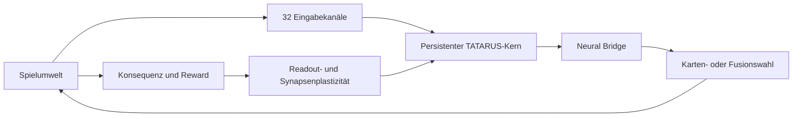
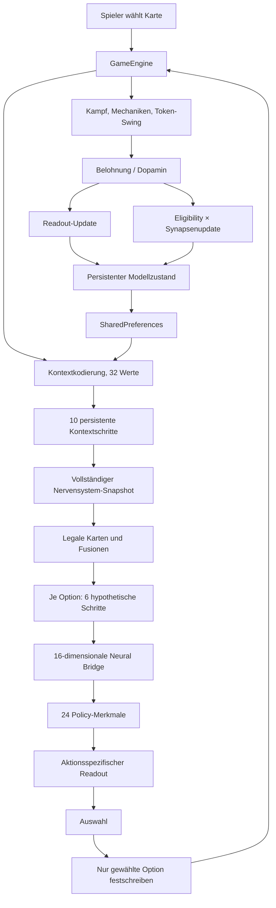
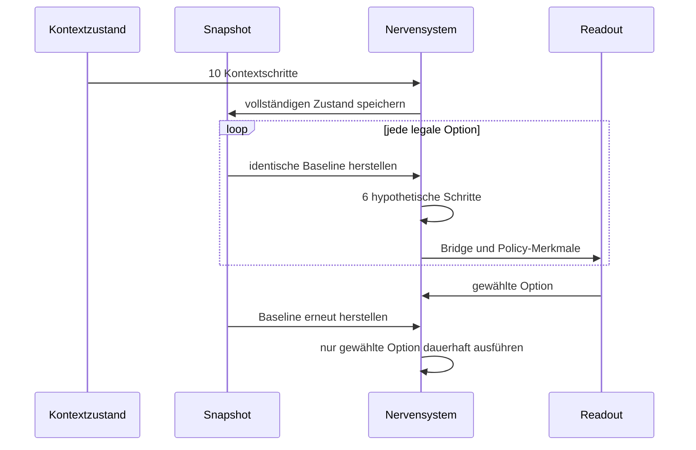
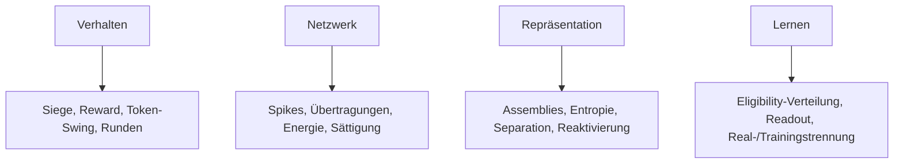

# TATARUS × Runenkrieg

## Ein Android-Spiel als geschlossenes Labor für ein persistentes synthetisches Nervensystem

### Motivation, Architektur, Lernmechanismen, experimentelle Methodik und wissenschaftliche Bedeutung

**System:** TATARUS – A Persistent Synthetic Nervous System
**Anwendung und Laborumwelt:** Runenkrieg: TATARUS für Android
**Entwickler:** Ralf Krümmel
**Whitepaper-Version:** 1.0
**Bezugsstand der Android-Implementierung:** 1.4.0
**Dokumentationsstand:** 30. Juli 2026
**Implementierung:** Kotlin/JVM, native Android-Anwendung, vollständig offline
**Projektlizenz:** Apache License 2.0

---

## Publikations- und Anspruchsrahmen

Dieses Whitepaper beschreibt den tatsächlich implementierten mobilen
TATARUS-Kern und seine Einbettung in das Android-Kartenspiel Runenkrieg.
Es verfolgt drei Ziele:

1. die wissenschaftliche Motivation hinter TATARUS zu erklären,
2. die technische und methodische Bedeutung der Spielintegration
   herzuleiten,
3. den aktuellen Evidenzstand von weiterführenden Hypothesen klar zu
   trennen.

Das Dokument ist weder ein Peer-Review-Artikel noch der Nachweis einer
allgemeinen künstlichen Intelligenz. Insbesondere werden keine noch nicht
durch unabhängige Mehrseed-Experimente bestätigten Leistungsbehauptungen
aufgestellt.

Zur Vermeidung einer Vermischung verschiedener Evidenzarten verwendet das
Whitepaper folgende Begriffe:

| Evidenzklasse | Bedeutung |
|---|---|
| **implementiert** | Der Mechanismus ist im referenzierten Quellcode vorhanden. |
| **technisch verifiziert** | Automatisierte Tests prüfen definierte Invarianten oder Abläufe. |
| **beobachtbar** | Die Anwendung erhebt und zeigt die Messgröße im laufenden Betrieb. |
| **experimentell prüfbar** | Kontrollen und Messpfade sind vorhanden, aber noch nicht statistisch ausgewertet. |
| **bestätigt** | Eine vorab definierte Hypothese wurde mit angemessenen Kontrollen und unabhängigen Läufen gestützt. |
| **offen** | Die Aussage ist ein Forschungsziel und darf noch nicht als Ergebnis behandelt werden. |

Nach diesem Maßstab ist bestätigt, dass die Android-Anwendung ein
deterministisch testbares, persistentes und plastisches Spiking-System in
einen vollständigen Spielkreislauf integriert. Noch nicht bestätigt ist,
dass TATARUS strategisch besser, lernfähiger oder energieeffizienter als
alle einfacheren Kontrollen ist.

---

## Abstract

Viele KI-Systeme werden als statische Funktionen behandelt: Eine Eingabe
wird in eine Ausgabe umgerechnet, während der innere Zustand entweder
vollständig zurückgesetzt oder außerhalb des Modells in Datenbanken,
Kontextfenstern und Protokollen gehalten wird. TATARUS verfolgt einen
anderen Ansatz. Das System wird als dauerhaft fortlaufendes synthetisches
Nervensystem entworfen, dessen gegenwärtige Reaktion von seiner
Aktivitätsgeschichte, lokalen synaptischen Spuren, Energie, Assemblies,
Belohnung und konsolidierten Zuständen abhängt.

Die Android-Integration in Runenkrieg untersucht, ob ein solcher Kern nicht
nur in isolierten Zeitreihenaufgaben, sondern innerhalb eines
handlungsrelevanten, geschlossenen Agent–Umwelt-Kreislaufs betrieben werden
kann. Runenkrieg ist dafür zugleich Spiel und Labor. Jede Runde erzeugt
einen strukturierten Reiz, mehrere legale Handlungsalternativen, eine
verzögerte Konsequenz und ein begrenztes Belohnungssignal. TATARUS
verarbeitet den Kontext mit einem rekurrenten, Dale-konformen
E/I-Spiking-Netzwerk, bewertet mögliche Karten und Fusionen durch
rücksetzbare neuronale Rollouts und schreibt nur die tatsächlich gewählte
Handlung in seinen persistenten Zustand fort.

Der mobile Kern umfasst 72 Neuronen, 432 gerichtete Synapsen, passive
dendritische Zustände, Axonverzögerungen, adaptive Schwellen,
Homeostase, modellierte Energiekosten, ereigniskausale
Generated-Operator-Modulation, kurzzeitige synaptische Dynamik,
vorzeichenbehaftete Eligibility-Spuren, belohnungsmodulierte Plastizität,
langsame Konsolidierungsvariablen, konkurrierende Assemblies und einen
begrenzten linearen Aktionsreadout. Alle 32 Eingabekanäle sind
neuronalseitig verdrahtet.

Die Anwendung besitzt acht auswählbare Gegner- und Ablationsmodi.
Sieben davon können auf identischen, lernfreien vollständigen Testpartien
verglichen werden. Gemessen werden Spielleistung, Token-Swing, Spikes,
synaptische Übertragungen, modellierte Energiekosten, Assemblystruktur,
Gewichtssättigung und die Verteilung lokaler Eligibility-Spuren.

Die wissenschaftliche Besonderheit liegt nicht darin, dass ein Spiel mit
einem neuronalen Gegner ausgestattet wurde. Sie liegt in der Verbindung
von drei Rollen in derselben mobilen Anwendung:

\[
\boxed{
\text{interaktive Umwelt}
+
\text{persistenter lernender Agent}
+
\text{kausales Experimentallabor}
}
\]

Damit wird TATARUS im Alltag eines realen Android-Geräts ausführbar,
beobachtbar, ablatierbar und reproduzierbar. Die Integration belegt noch
keine Überlegenheit oder allgemeine Intelligenz. Sie schafft jedoch einen
entscheidenden methodischen Übergang: von einem isolierten
Neuronenexperiment zu einem verkörperten, fortlaufenden System, dessen
interne Mechanismen konkrete Handlungen und Konsequenzen beeinflussen.

**Schlüsselwörter:** Spiking Neural Network, synthetisches Nervensystem,
Eligibility Trace, Generated Operator, neuronale Assemblies,
Reinforcement Learning, persistente KI, Mobile AI, Android,
Computational Neuroscience, Game AI, Ablationsstudie

---

## 1. Warum TATARUS entwickelt wurde

### 1.1 Das Zustandsproblem heutiger KI

Ein großer Teil moderner KI-Anwendungen trennt die eigentliche
Modellrechnung von Erinnerung und Lebenslauf. Ein Sprachmodell besitzt
beispielsweise während eines Aufrufs einen Kontext, aber der dauerhafte
Benutzer- oder Umweltzustand liegt gewöhnlich außerhalb des Modells. Auch
viele Klassifikatoren und Spielagenten werden nach einer Trainingsphase
eingefroren und anschließend als unveränderliche Funktion eingesetzt:

\[
\mathbf{y}=f_\theta(\mathbf{x})
\]

Der Parametervektor \(\theta\) enthält gelerntes Wissen, aber die
fortlaufende individuelle Erfahrung ist im Einsatz oft kein Teil eines
aktiven neuronalen Innenzustands.

Ein Nervensystem funktioniert konzeptionell anders. Seine Reaktion hängt
nicht nur von der momentanen Eingabe ab, sondern auch von:

- kurz zuvor eingetroffenen Ereignissen,
- aktuellen Membran- und dendritischen Zuständen,
- synaptischen Ressourcen,
- lokalen Aktivitätsspuren,
- längerfristiger Plastizität,
- regulatorischen Größen,
- verfügbarer Energie,
- und bereits gebildeten Repräsentationen.

TATARUS wurde entwickelt, um genau diese Lücke als technisches
Forschungsproblem zu behandeln. Das Ziel ist nicht die möglichst genaue
Simulation einer bestimmten biologischen Spezies. Ziel ist ein
funktionsfähiges künstliches Nervensystem, das ausgewählte biologische
Prinzipien in eine kontrollierbare Rechnerarchitektur überträgt.

### 1.2 Vom neuronalen Modell zum Nervensystem

Ein neuronales Modell wird in diesem Projekt erst dann als synthetisches
Nervensystem behandelt, wenn mehrere Eigenschaften gleichzeitig erfüllt
sind:

1. **Kontinuität:** Der Zustand überlebt einzelne Aufgaben und
   Programmabschnitte.
2. **Ereigniskausalität:** Spikes und lokale Zustände beeinflussen spätere
   Übertragungen.
3. **Lokalität:** Synapsen führen eigene Spuren und Zustände.
4. **Plastizität:** Konsequenzen können künftiges Verhalten verändern.
5. **Regulation:** Aktivität und Energie werden begrenzt.
6. **Repräsentation:** Wiederkehrende Zustände können in Assemblies
   zusammengefasst werden.
7. **Handlungsbezug:** Der neuronale Zustand wirkt auf reale
   Aktionsentscheidungen.
8. **Persistenz:** Der Lebenslauf kann gespeichert und später fortgesetzt
   werden.
9. **Prüfbarkeit:** Mechanismen lassen sich abstellen und gegen Kontrollen
   vergleichen.

Diese Kriterien verschieben den Schwerpunkt von der Frage „Wie gut
klassifiziert das Modell einen Datensatz?“ zu der Frage:

> Kann ein fortlaufendes dynamisches System wahrnehmen, mögliche
> Handlungen bewerten, Konsequenzen aufnehmen und seine zukünftige
> Kommunikation verändern?

### 1.3 Biologische Inspiration ohne Identitätsbehauptung

TATARUS ist biologisch inspiriert, aber nicht biologisch identisch.
Biophysikalisch vollständige Modelle wie Hodgkin–Huxley beschreiben
Ionenströme und Membranleitfähigkeiten wesentlich detaillierter
([Hodgkin und Huxley, 1952](https://doi.org/10.1113/jphysiol.1952.sp004764)).
Der mobile TATARUS-Kern verwendet stattdessen eine kompakte
Integrate-and-Fire-Dynamik mit dendritischem Zustand.

Diese Abstraktion ist beabsichtigt. Für die vorliegende Forschung müssen
Mechanismen:

- auf einem Smartphone schnell ausführbar,
- deterministisch reproduzierbar,
- separat ablatierbar,
- numerisch stabil,
- und über viele vollständige Spiele messbar sein.

Biologische Inspiration dient hier als Quelle funktionaler
Architekturprinzipien, nicht als Begründung für eine Gleichsetzung mit
einem Gehirn.

---

## 2. Warum ein Spiel für die Forschung wichtig ist

### 2.1 Spiele als kontrollierte Umwelten

Spiele besitzen in der KI-Forschung eine lange methodische Tradition. Sie
bieten klar definierte Zustände, legale Aktionen, wiederholbare Regeln und
objektive Konsequenzen. Die Arcade Learning Environment wurde gerade als
Plattform entwickelt, auf der allgemeine Agenten in vielen kontrollierten
Spielumwelten verglichen werden können
([Bellemare et al., 2013](https://doi.org/10.1613/jair.3912)).
Auch Deep-Reinforcement-Learning-Systeme wurden wesentlich durch
geschlossene Spielkreisläufe vorangetrieben
([Mnih et al., 2015](https://doi.org/10.1038/nature14236)).

Ein Spiel ist deshalb nicht bloß Unterhaltung. Es kann eine experimentelle
Umwelt sein, wenn:

- Zustände und Aktionen exakt definiert sind,
- Zufallsquellen kontrolliert werden,
- Gegner und Startbedingungen reproduzierbar sind,
- Lernen während Tests eingefroren werden kann,
- und relevante interne sowie externe Messgrößen protokolliert werden.

Runenkrieg erfüllt diese Voraussetzungen in einer kompakten mobilen Form.

### 2.2 Warum ein Kartenspiel statt einer statischen Aufgabe

Eine Klassifikationsaufgabe liefert typischerweise ein einzelnes Paar aus
Eingabe und Ziel. Ein Kartenspiel erzwingt dagegen eine Kette:

\[
s_t
\rightarrow
\mathcal{A}(s_t)
\rightarrow
a_t
\rightarrow
s_{t+1}
\rightarrow
r_{t+1}
\]

Dabei bezeichnet:

- \(s_t\) den Spiel- und Nervenzustand,
- \(\mathcal{A}(s_t)\) die Menge legaler Handlungen,
- \(a_t\) die gewählte Karte oder Fusion,
- \(r_{t+1}\) die erst nach der Rundenauflösung bekannte Konsequenz.

Diese Struktur ist für TATARUS wesentlich. Sie prüft nicht nur
Mustererkennung, sondern die Verbindung zwischen Wahrnehmung,
Handlungsauswahl, verzögerter Belohnung und späterer Zustandsänderung.

### 2.3 Warum gerade Runenkrieg

Runenkrieg kombiniert mehrere Arten von Abhängigkeiten:

- zehn Elemente mit gerichteten Vor- und Nachteilen,
- vierzehn Fähigkeitsstufen,
- fünf Kartentypen,
- drei Wetterzustände,
- zwei Helden,
- Token als endliche Spielressource,
- sieben Kartenmechaniken,
- historische Effekte über mehrere Runden,
- und Fusionen aus mehreren Ausgangskarten.

Eine Handlung ist dadurch selten nur aufgrund eines Merkmals gut. Ihre
Wirkung hängt von Kombinationen ab:

\[
Q(a_t)
=
f(
\text{Element},
\text{Stärke},
\text{Wetter},
\text{Held},
\text{Tokens},
\text{Mechaniken},
\text{Verlauf}
)
\]

Das erzeugt einen hinreichend reichen, aber vollständig kontrollierbaren
Zustandsraum. Zugleich bleibt jede Entscheidung nachvollziehbar, weil die
Spielregeln deterministisch ausgewertet werden können.

### 2.4 Ein Spiel erzwingt Verhalten

Ein isolierter neuronaler Versuch kann Aktivität erzeugen, ohne dass diese
Aktivität eine funktionale Bedeutung besitzt. In Runenkrieg muss der
neuronale Zustand eine konkrete Auswahl beeinflussen. Die gewählte Karte:

- verbraucht eine Ressource aus der Hand,
- verändert den Rundenverlauf,
- kann Tokens gewinnen oder verlieren,
- beeinflusst historische Mechaniken,
- und verändert das nächste Eingangsmuster.

Damit entsteht ein geschlossener Regelkreis:



Dieser Regelkreis ist die wichtigste wissenschaftliche Funktion der
Integration: Innere Zustände werden in Verhalten übersetzt, Verhalten
erzeugt Konsequenzen, und Konsequenzen verändern das System.

---

## 3. Forschungsfragen und Hypothesen

Die Android-Integration ist auf folgende übergeordnete Forschungsfragen
ausgerichtet.

### F1 – Funktionale Integration

Kann ein rekurrentes Spiking-System auf einem handelsüblichen Android-Gerät
den vollständigen Entscheidungszyklus eines Spiels übernehmen?

**Aktueller Status:** technisch verifiziert. Vollständige Spiele werden in
allen vorgesehenen Modi auf einem realen Gerät ausgeführt.

### F2 – Persistenter Lebenslauf

Kann der neuronale, synaptische und lernende Zustand App-Neustarts
überleben, ohne auf eine Cloud oder ein externes Modell angewiesen zu sein?

**Aktueller Status:** implementiert und durch Snapshot-/Persistenzpfade
abgesichert.

### F3 – Mechanistische Relevanz

Tragen Eligibility, Generated Operator und Assemblies kausal zur
Spielstärke, Lernrate oder Effizienz bei?

**Aktueller Status:** experimentell prüfbar. Die notwendigen
Ablationsmodi sind integriert; eine belastbare Antwort erfordert
unabhängig trainierte Seeds und statistische Auswertung.

### F4 – Interne Repräsentationsbildung

Bilden unterschiedliche Spielsituationen getrennte, wiederkehrende
Assemblies, die später funktional reaktiviert werden?

**Aktueller Status:** die Bildung mehrerer getrennter Assemblies wird in
synthetischen Unit-Tests technisch geprüft. Ihre semantische und
strategische Bedeutung im realen Spiel ist offen.

### F5 – Lernen aus Konsequenzen

Kann das System aus realen Runden und Selbsttraining ein besseres
Aktionsreadout sowie funktionale synaptische Veränderungen bilden?

**Aktueller Status:** Lernpfade sind implementiert. Noch offen ist der
kontrollierte Nachweis einer höheren Holdout-Leistung gegenüber
einfacheren Baselines.

### F6 – Energie–Leistungs-Verhältnis

Erreicht ein Mechanismus bei gleicher Spielleistung weniger Spikes,
Übertragungen oder modellierte Energiekosten?

**Aktueller Status:** messbar, aber noch nicht als Überlegenheit bestätigt.

### F7 – Generalisierung

Überträgt sich Gelerntes auf unbekannte Spielerstrategien,
Startverteilungen oder andere Spiele?

**Aktueller Status:** offen.

---

## 4. Das Android-Spiel als duales System

### 4.1 Rolle A: vollständiges Spiel

Runenkrieg ist eine eigenständig spielbare Android-Anwendung mit:

- einem vollständigen Deck aus \(10\times14=140\)
  Element–Fähigkeits-Kombinationen,
- Wetter-, Helden-, Moral- und Synergieeffekten,
- Ketteneffekt, Resonanz, Überladung, Fusion, Wetterbindung,
  Verbündetem und Segen/Fluch,
- Tokenökonomie,
- Kartenersatz und mehrstufigen Partien,
- einem lokalen Handbuch,
- und einem vollständig offline laufenden Gegner.

Der Benutzer muss für das Experiment keine separate Desktopumgebung,
Kommandozeile oder Cloudverbindung bedienen.

### 4.2 Rolle B: interaktives Trainingssystem

Jede reale Partie liefert Erfahrungen aus menschlichem Verhalten. Zusätzlich
kann das Labor simulierte Trainingsrunden ausführen. Beide Quellen werden
getrennt gezählt:

\[
\mathcal{D}
=
\mathcal{D}_{\mathrm{real}}
\cup
\mathcal{D}_{\mathrm{self}}
\]

Die Trennung ist entscheidend. Eine hohe Gesamtbelohnung darf nicht als
Erfolg gegen Menschen interpretiert werden, wenn der Großteil der
Beobachtungen aus vereinfachtem Selbsttraining stammt.

### 4.3 Rolle C: Messinstrument

Das TATARUS-Labor zeigt nicht nur Siege und Niederlagen, sondern interne
Systemgrößen:

- neuronale Schritte,
- Spikes und geschätzte Populationsfeuerrate,
- synaptische Übertragungen,
- vorhandene und kürzlich aktive Synapsen,
- Gewichtssättigung,
- Assemblyzahl, -entropie, -trennung und -reaktivierung,
- mittlere, minimale und untere Energiequantile,
- modellierte Kosten pro Beobachtung,
- Vorzeichenmittel, Betrag, Streuung und Maximum der Eligibility,
- aktive, positive, negative und gesättigte Eligibility-Anteile.

Das Spiel wird dadurch zu einem Instrument zur Zustandsbeobachtung.

### 4.4 Rolle D: Ablationslabor

Mechanismen können einzeln deaktiviert werden. Eine solche Ablation ist
wissenschaftlich wertvoller als das bloße Vergleichen zweier Endstände,
weil sie eine kausale Frage stellt:

> Was ändert sich, wenn alle übrigen Bedingungen gleich bleiben und nur
> ein Mechanismus entfernt wird?

### 4.5 Rolle E: Replikationsgerät

Die integrierte Evaluation spielt dieselben vollständigen Partien unter
mehreren Modi. Der vollständige Ausgangszustand wird vor jedem Modus
wiederhergestellt. Damit ist die App gleichzeitig:

\[
\boxed{
\text{Spiel}
\land
\text{Agentenhost}
\land
\text{Datenerzeuger}
\land
\text{Messgerät}
\land
\text{Kontrolllabor}
}
\]

---

## 5. Gesamtarchitektur



Die Zuständigkeiten sind strikt getrennt:

| Komponente | Funktion |
|---|---|
| `GameEngine` | Regeln, Runden, Karten, Wetter, Gewinner und Tokens |
| `GameOpponent` | stabile Schnittstelle zwischen Spiel und Gegner |
| `TatarusAi` | Kodierung, Aktionsvergleich, Readout, Lernen und Persistenz |
| `TatarusNervousSystem` | Spannungen, Spikes, Synapsen, Assemblies und Energie |
| `GameViewModel` | Android-Lebenszyklus, Hintergrundarbeit und UI-Zustand |
| `GameScreen` | Spieloberfläche und TATARUS-Labor |

Die Spielengine erhält keinen direkten Zugriff auf einzelne Synapsen oder
Membranspannungen. Das verhindert eine unkontrollierte Vermischung von
Spielregeln und neuronaler Dynamik.

---

## 6. Formale Beschreibung der Entscheidung

### 6.1 Zustandsauffassung

Der sichtbare Spielzustand \(o_t\) enthält unter anderem:

\[
o_t
=
(
\text{Spielerkarte},
\text{Wetter},
\text{Tokens},
\text{Helden},
\text{Historie},
\text{eigene Hand}
)
\]

Der vollständige TATARUS-Zustand \(h_t\) ist wesentlich größer:

\[
h_t
=
(
\mathbf{V},
\mathbf{D},
\mathbf{A},
\mathbf{H},
\mathbf{E},
\mathbf{r},
\mathbf{e},
\mathbf{R},
\mathbf{F},
\mathbf{w},
\mathcal{P}
)
\]

Dabei stehen die Symbole für Membranspannungen, dendritische Zustände,
Adaptation, Homeostase, Energie, Aktivitätsraten, Eligibility,
synaptische Ressourcen, Facilitation, Gewichte und Assemblyprototypen.

Die Reaktion ist deshalb keine reine Funktion der aktuellen Karte:

\[
a_t
\sim
\pi(a\mid o_t,h_t)
\]

### 6.2 Eingabekodierung

Der Spielkontext und jede Kandidatenhandlung werden jeweils in einen
32-dimensionalen Vektor überführt:

\[
\mathbf{x}\in\mathbb{R}^{32}
\]

Die Kontextkanäle kodieren:

- zehn Elementkanäle,
- Kartenstärke und Kartentyp,
- drei Wetterkanäle,
- beide Tokenstände und ihre Balance,
- beide Helden,
- Rundenfortschritt,
- letztes Ergebnis,
- und historische Elementhäufigkeiten.

Die Kandidatenkanäle kodieren:

- Element, Stärke und Typ der möglichen Antwort,
- Fusion und Mechanikanteil,
- Element- und Wetterbezug,
- Tokens und Heldenpassung,
- einzelne Mechaniken,
- Kartenverbrauch,
- Wiederholung im Verlauf,
- und einen Biaskanal.

Alle 32 Werte sind an neuronale Populationen angeschlossen. Ein
Einzelkanaltest verlangt für jeden Kanal bei identischem Seed einen vom
Nullreiz verschiedenen vollständigen Zustandshash.

### 6.3 Aktionsraum

Die Menge legaler Aktionen umfasst Einzelkarten sowie alle legalen
Fusionspaare. Bei \(n\) Fusionskarten entstehen zusätzlich:

\[
N_{\mathrm{Fusion}}
=
\binom{n}{2}
=
\frac{n(n-1)}{2}
\]

Der Aktionsraum ist daher zustandsabhängig:

\[
\mathcal{A}_t
=
\mathcal{A}_{\mathrm{Karten}}
\cup
\mathcal{A}_{\mathrm{Fusionen}}
\]

---

## 7. Mobiler TATARUS-Kern

### 7.1 Neuronale Population

Der Android-Kern besitzt 72 Neuronen:

| Population | Indizes | Anzahl | Rolle |
|---|---:|---:|---|
| sensorisch | 0–23 | 24 | unmittelbare Spieleingänge |
| E-Eingang/rekurrent | 24–27 | 4 | erweiterte Kanäle und rekurrente Verteilung |
| rekurrent exzitatorisch | 28–51 | 24 | interne Dynamik |
| rekurrent inhibitorisch | 52–63 | 12 | Hemmung |
| Kontext | 64–67 | 4 | letzte erweiterte Kanäle |
| Motor/Readout | 68–71 | 4 | Ausgangsdynamik |

Von 72 Quellen wirken 60 exzitatorisch und 12 inhibitorisch. Das entspricht
ungefähr:

\[
83{,}3\% \text{ E}
\qquad
16{,}7\% \text{ I}
\]

### 7.2 Topologie und Dale-Konformität

Jedes Neuron besitzt sechs verschiedene ausgehende Verbindungen:

\[
N_{\mathrm{Synapsen}}
=
72\cdot6
=
432
\]

Die Ziele und Axonverzögerungen werden deterministisch aus dem Seed
erzeugt. Die Verzögerung beträgt ein bis fünf Simulationsschritte.

Das Vorzeichen jedes Gewichts hängt ausschließlich von der
präsynaptischen Quelle ab:

\[
w_{ji}>0
\quad\text{für exzitatorisches }j
\]

\[
w_{ji}<0
\quad\text{für inhibitorisches }j
\]

Plastizität darf dieses Vorzeichen nicht umkehren. Diese Form der
Dale-Konformität ist eine strukturelle Nebenbedingung des Modells, keine
Behauptung vollständiger biologischer Realitätsnähe.

### 7.3 Dendritische Integration

Der passive dendritische Zustand folgt:

\[
D_i(t+1)
=
D_i(t)
+
\frac{
V_{\mathrm{rest}}-D_i(t)
+I_i^{\mathrm{rek}}(t)
+I_i^{\mathrm{extern}}(t)
}{
\tau_D
}
\]

mit:

\[
V_{\mathrm{rest}}=-65\ \mathrm{mV},
\qquad
\tau_D=35\ \mathrm{ms}
\]

Das Modell besitzt damit einen separaten Integrationszustand zwischen
ankommender Übertragung und Soma. Es simuliert jedoch keinen vollständigen
dendritischen Baum.

### 7.4 Somadynamik und Spike

\[
V_i(t+1)
=
V_i(t)
+
\frac{
V_{\mathrm{rest}}-V_i(t)
+c_D(D_i(t)-V_i(t))
+I_{\mathrm{basis}}
}{
\tau_V
}
\]

mit:

\[
c_D=0{,}22,
\qquad
I_{\mathrm{basis}}=12{,}5,
\qquad
\tau_V=20\ \mathrm{ms}
\]

Die effektive Schwelle lautet:

\[
\theta_i(t)
=
-50\ \mathrm{mV}
+A_i(t)
+H_i(t)
\]

Ein Spike entsteht bei:

\[
s_i(t)
=
\begin{cases}
1,& V_i(t)\ge\theta_i(t)\land E_i(t)\ge0{,}025\\
0,& \text{sonst}
\end{cases}
\]

Nach einem Spike wird die Spannung auf \(-70\ \mathrm{mV}\) zurückgesetzt,
die Adaptation um \(1{,}2\ \mathrm{mV}\) erhöht und Energie abgezogen.

### 7.5 Homeostase

Die schnelle Aktivität wird gegen eine Zielrate von 8 Hz reguliert:

\[
H_i(t+1)
=
\operatorname{clip}
\left(
H_i(t)
+3\cdot10^{-5}
\left[
1000r_i^{\mathrm{fast}}(t)-8
\right],
-8,8
\right)
\]

Das Prinzip orientiert sich funktional an der Idee
aktivitätsabhängiger Stabilisierung. Biologische synaptische Skalierung
wurde experimentell unter anderem von
[Turrigiano et al. (1998)](https://doi.org/10.1038/36103)
beschrieben. TATARUS implementiert daraus keinen biochemischen Mechanismus,
sondern einen kompakten Schwellenregler.

### 7.6 Energie

Jedes Neuron führt einen Energiezustand:

\[
E_i\in[0,1]
\]

Modellierte Kosten:

\[
C_{\mathrm{Spike}}=0{,}025
\]

\[
C_{\mathrm{Transmission}}=0{,}0004
\]

Erholung:

\[
E_i(t+1)
=
\min(1,E_i(t)+0{,}0015)
\]

Diese Größe ist kein Joule-Messwert der Android-Hardware. Sie ist ein
internes Kostenmodell, das verschiedene TATARUS-Mechanismen unter gleicher
Definition vergleichbar macht.

---

## 8. Ereigniskausale synaptische Kommunikation

### 8.1 Motivation

Im ursprünglichen Entwicklungszweig wurde ein generierter Operator aus
einem nach dem Spike bereits zurückgesetzten Zustand ausgewertet. Dadurch
entstand praktisch ein konstanter Dämpfungsfaktor. Die mobile
Implementierung verwendet stattdessen einen ereigniskausalen Eingang, der
im Übertragungsmoment vom Netzwerkzustand abhängt.

### 8.2 E/I-Balance

\[
b(t)
=
\frac{
I_{\mathrm{exc}}(t)-I_{\mathrm{inh}}(t)
}{
I_{\mathrm{exc}}(t)+I_{\mathrm{inh}}(t)+\varepsilon
}
\]

mit:

\[
b(t)\in[-1,1]
\]

### 8.3 Operatorzustand

Für eine feuernde Quelle \(j\) und ein Ziel \(i\):

\[
\phi_{ji}(t)
=
\operatorname{clip}
\left(
b(t)
+0{,}2[
\mathrm{trace}_j(t)-\mathrm{trace}_i(t)
],
-1,1
\right)
\]

Das Gate ist damit an den Emissionszeitpunkt und die lokale
Spikegeschichte gebunden.

### 8.4 Generated-Operator-Gate

\[
g_{ji}(t)
=
\operatorname{clip}
\left(
\frac{1+\tanh(K(\phi_{ji}(t)))}{2},
0{,}05,
0{,}95
\right)
\]

Der exakte Ausdruck von \(K\) wird im Quellcode numerisch geschützt
ausgeführt. Seine wissenschaftliche Relevanz darf nicht allein aus seiner
Komplexität abgeleitet werden. Sie muss gegen die Kontrolle:

\[
g_{ji}(t)=0{,}5
\]

gemessen werden.

### 8.5 Kurzzeitige synaptische Zustände

Jede Synapse besitzt eine Ressource \(R_{ji}\) und Facilitation \(F_{ji}\).
Die Freisetzungswahrscheinlichkeit lautet:

\[
p_{ji}
=
\operatorname{clip}
(0{,}18+F_{ji},0{,}02,0{,}95)
\]

Nach einer Emission:

\[
R_{ji}
\leftarrow
R_{ji}(1-0{,}35p_{ji})
\]

\[
F_{ji}
\leftarrow
\operatorname{clip}
\left(
F_{ji}+0{,}12(1-F_{ji}),
0,0{,}8
\right)
\]

Ohne Emission erholt sich die Ressource:

\[
R_{ji}(t+1)
=
R_{ji}(t)
+
\frac{1-R_{ji}(t)}{180}
\]

Diese Dynamik ist funktional mit Modellen kurzzeitiger
synaptischer Plastizität verwandt
([Tsodyks und Markram, 1997](https://doi.org/10.1073/pnas.94.2.719)),
stellt aber eine projektspezifische diskrete Implementierung dar.

---

## 9. Lokale Eligibility als zeitliche Brücke

### 9.1 Das Problem verzögerter Konsequenzen

Die Karte wird gewählt, bevor der vollständige Rundenreward feststeht.
Wenn die Konsequenz später eintrifft, muss das System noch unterscheiden
können, welche lokalen Ereignisse dafür in Frage kommen.

Eligibility-Spuren bilden eine zeitliche Brücke:

\[
\text{lokale Aktivität}
\rightarrow
e_{ji}
\rightarrow
\text{späterer Reward}
\rightarrow
\Delta w_{ji}
\]

Solche Verknüpfungen von zeitabhängiger Plastizität und späterer
Neuromodulation sind ein etablierter Forschungsansatz
([Izhikevich, 2007](https://doi.org/10.1093/cercor/bhl152)).

### 9.2 Signierte lokale Spur

Jede Synapse \(j\rightarrow i\) besitzt:

\[
e_{ji}(t+1)
=
e_{ji}(t)
\exp\left(-\frac{1}{400}\right)
\]

Bei aktiver Plastizität:

\[
c_{ji}(t)
=
s_i(t)\,\mathrm{trace}_j(t)
-
s_j(t)\,\mathrm{trace}_i(t)
\]

\[
e_{ji}
\leftarrow
\operatorname{clip}
\left(
e_{ji}+0{,}35c_{ji},
-4,4
\right)
\]

Das Vorzeichen kodiert unterschiedliche Prä-/Post-Reihenfolgen. Die
Bedeutung präziser Spikezeiten für synaptische Änderungen wurde
experimentell unter anderem von
[Bi und Poo (1998)](https://doi.org/10.1523/JNEUROSCI.18-24-10464.1998)
gezeigt.

### 9.3 Doppelfunktion

Die Spur beeinflusst bereits die spätere Übertragung:

\[
m_{ji}
=
\operatorname{clip}
\left(
1+0{,}5\tanh(e_{ji}),
0{,}25,2
\right)
\]

Die vollständige Übertragungsamplitude ist:

\[
A_{ji}
=
w_{ji}
\cdot p_{ji}
\cdot R_{ji}
\cdot g_{ji}
\cdot m_{ji}
\]

Später markiert dieselbe Spur die rewardrelevante Synapse:

\[
\Delta w_{ji}
=
0{,}006\,d\,e_{ji}
\]

TATARUS nutzt Eligibility daher sowohl als kurzfristigen
Kommunikationszustand als auch als Kreditzuweisungsspur.

### 9.4 Verhältnis zu e-prop

E-prop zeigt, dass lokale Eligibility-Spuren mit globaleren Lernsignalen
verbunden werden können, um rekurrente Spiking-Netze ohne vollständige
Backpropagation Through Time zu trainieren
([Bellec et al., 2020](https://doi.org/10.1038/s41467-020-17236-y)).
TATARUS implementiert nicht den vollständigen e-prop-Algorithmus. Die
gemeinsame Idee liegt in der Trennung:

\[
\text{lokaler zeitlicher Faktor}
\times
\text{späteres modulierendes Signal}
\]

---

## 10. Assemblies als beobachtbare Repräsentationen

### 10.1 Warum Assemblies

Ein Nervensystem benötigt eine Möglichkeit, wiederkehrende
Aktivitätskonfigurationen zu unterscheiden. Der mobile Kern bildet bis zu
16 Prototypen aus einer Kombination von Eingang und neuronaler Antwort.

Für Kanal \(k\):

\[
n_k
=
\tanh
\left(
r_k^{\mathrm{fast}}
-r_k^{\mathrm{slow}}
+
\frac{D_k-V_{\mathrm{rest}}}{20}
\right)
\]

\[
z_k
=
0{,}55(x_k-\bar{x})
+0{,}45n_k
\]

Das Muster wird anschließend zentriert und auf Einheitslänge normalisiert.

### 10.2 Wettbewerb und Aufnahme

Ein neuer Prototyp entsteht, wenn:

\[
\max_j\cos(\mathbf{z},\mathbf{P}_j)<0{,}78
\]

oder:

\[
\min_j\|\mathbf{z}-\mathbf{P}_j\|_2>0{,}70
\]

sofern weniger als 16 Assemblies vorhanden sind.

Ein passender Prototyp wird aktualisiert:

\[
\mathbf{P}_j
\leftarrow
\mathbf{P}_j
+0{,}12(\mathbf{z}-\mathbf{P}_j)
\]

### 10.3 Warum Anzahl allein nicht genügt

„16 Assemblies vorhanden“ bedeutet noch nicht, dass 16 nützliche
Repräsentationen entstanden sind. Deshalb erhebt das Labor:

1. **Belegungsentropie**

\[
H_{\mathrm{norm}}
=
-
\frac{
\sum_{j=1}^{M}p_j\ln p_j
}{
\ln M
}
\]

2. **mittlere Trennung**

\[
S_{\mathrm{assembly}}
=
\frac{2}{M(M-1)}
\sum_{j<k}
\|\mathbf{P}_j-\mathbf{P}_k\|_2
\]

3. **Reaktivierungen**, also erneute Zuordnungen zu bereits bestehenden
   Prototypen.

Erst die gemeinsame Betrachtung von Zahl, Entropie, Separation,
Reaktivierung und Aufgabenleistung erlaubt eine funktionale Interpretation.

### 10.4 Offene semantische Frage

Die aktuelle Implementierung kann zeigen, dass verschiedene Reize
verschiedene Prototypen erzeugen. Noch offen ist:

- ob bestimmte Assemblies stabil Kartenklassen repräsentieren,
- ob ähnliche Spielsituationen dieselbe Assembly reaktivieren,
- ob Assemblytrennung die Aktionsqualität verbessert,
- und ob Assemblies nach längerer Erfahrung stabil bleiben.

---

## 11. Neural Bridge und Aktionsreadout

### 11.1 Beschränkte innere Schnittstelle

Das Nervensystem gibt keinen Kartennamen aus. Es stellt einen kompakten
Zustand bereit:

\[
\mathbf{z}_{\mathrm{bridge}}\in\mathbb{R}^{16}
\]

Enthalten sind:

- vier Motoraktivitäten,
- sensorische, exzitatorische, inhibitorische und Kontextaktivität,
- Energie,
- mittlere Eligibility,
- synaptische Ressource,
- Assembly-ID und Neuheit,
- Aktivitätsabweichung,
- Dopaminzustand,
- Bias.

Diese Bridge ist eine Informationsgrenze. Das Aktionssystem erhält keinen
ungefilterten Zugriff auf alle 432 Synapsen.

### 11.2 Policy-Merkmale

Die 16 Bridgewerte werden mit acht strukturierten
Kandidatenmerkmalen kombiniert:

\[
\mathbf{f}_a\in\mathbb{R}^{24}
\]

Für jede semantische Aktionsklasse existiert ein eigener Gewichtsvektor:

\[
\mathbf{w}_a\in\mathbb{R}^{24}
\]

Der neuronale Score lautet:

\[
S_{\mathrm{neural}}(a)
=
\tanh(\mathbf{w}_a^\top\mathbf{f}_a)
\]

### 11.3 Bedeutung des Modus „Reines TATARUS“

Im Standardmodus:

\[
\boxed{
S(a)=S_{\mathrm{neural}}(a)
}
\]

Der fertig berechnete Regelwert wird nicht in den Endscore gemischt.
Abgeleitete Regelkanäle für Elementvorteil, Wettermodifier und Regelprior
werden deaktiviert. Das System erhält dennoch strukturierte Rohmerkmale
wie Element, Kartenstärke, Mechanik und Tokenzustand.

„Reines TATARUS“ bedeutet daher:

- keine heuristische Scorebeimischung,
- kein empirischer 10-%-Aktionsmittelwert,
- Entscheidung durch dynamischen Nervenzustand und gelerntes Readout.

Es bedeutet nicht:

- Lernen aus unstrukturierten Bildpixeln,
- vollständige Abwesenheit aller Entwicklerprioren,
- oder biologische Autonomie.

Diese Abgrenzung ist für eine wissenschaftlich korrekte Darstellung
unverzichtbar.

### 11.4 Hybridkontrolle

Nur im expliziten Hybridmodus:

\[
S_{\mathrm{hybrid}}(a)
=
0{,}55S_{\mathrm{neural}}(a)
+0{,}35S_{\mathrm{regel}}(a)
+0{,}10S_{\mathrm{empirisch}}(a)
\]

Der Hybridmodus misst, ob die Kombination aus Entwicklerwissen und
TATARUS-Zustand praktisch nützlich ist. Er darf nicht als Beleg einer
rein neuronalen Leistung verwendet werden.

---

## 12. Gegenfaktische neuronale Aktionssuche

### 12.1 Das Reihenfolgeproblem

Wenn Kandidat A das Nervensystem verändert, bevor Kandidat B geprüft wird,
würde die Bewertungsreihenfolge das Ergebnis verfälschen. TATARUS löst
dieses Problem mit vollständigen Snapshots.

### 12.2 Bewertungsprotokoll



Der Snapshot umfasst unter anderem:

- Spannungen und Dendriten,
- Adaptation und Homeostase,
- Energie und Raten,
- Spike-Traces und Delay-Puffer,
- sämtliche synaptischen Zustände,
- Assemblyprototypen,
- Dopamin,
- und Ereigniszähler.

Während hypothetischer Rollouts werden Eligibility-Schreiben und
Assemblylernen deaktiviert. Dynamik und Spikes laufen dennoch. Danach wird
die Baseline wiederhergestellt.

### 12.3 Wissenschaftliche Bedeutung

Dieser Mechanismus trennt:

\[
\text{gedachte Alternative}
\neq
\text{erlebte Handlung}
\]

Nur die tatsächlich ausgewählte Handlung darf einen dauerhaften
plastischen Abdruck erzeugen. Dadurch wird die Aktionssuche kontrolliert,
ohne den fortlaufenden Nervenzustand durch die Reihenfolge der Kandidaten zu
verunreinigen.

---

## 13. Belohnung und Lernen

### 13.1 Rundenreward

Nach vollständiger Regelauflösung erhält TATARUS eine Basisbelohnung:

| Ergebnis | Basiswert |
|---|---:|
| TATARUS-Sieg | 0,9 |
| Unentschieden | 0,5 |
| Spieler-Sieg | 0,1 |

Der Token-Swing lautet:

\[
\mathrm{Swing}
=
(T_{\mathrm{AI,neu}}-T_{\mathrm{AI,alt}})
-
(T_{\mathrm{Spieler,neu}}-T_{\mathrm{Spieler,alt}})
\]

\[
R
=
\operatorname{clip}
\left(
R_{\mathrm{Basis}}
+0{,}05\operatorname{clip}(\mathrm{Swing},-2,2),
0,1
\right)
\]

Für Plastizität wird zentriert:

\[
R_c=2R-1
\]

### 13.2 Readoutlernen

\[
\hat{R}
=
\tanh(\mathbf{w}_a^\top\mathbf{f}_a)
\]

\[
\delta
=
R_c-\hat{R}
\]

\[
w_{a,k}
\leftarrow
\operatorname{clip}
\left(
w_{a,k}+0{,}035\,\delta f_{a,k},
-3,3
\right)
\]

### 13.3 Neuromodulierter Synapsenpfad

\[
d(t+1)
=
\operatorname{clip}
\left(
0{,}88d(t)+0{,}12R_c,
-1,1
\right)
\]

\[
\Delta w_{ji}
=
0{,}006\,d\,e_{ji}
\]

Das Gewicht wird anschließend unter Erhalt seines Dale-Vorzeichens
begrenzt.

### 13.4 Langsame Konsolidierungsvariable

\[
w_{ji}^{\mathrm{cons}}
\leftarrow
w_{ji}^{\mathrm{cons}}
+
0{,}002
|d\,e_{ji}|
(w_{ji}-w_{ji}^{\mathrm{cons}})
\]

Diese Variable wird persistiert, dient im Android-Adapter aber noch nicht
als eigenständiger Schlaf-, Replay- oder Wiederherstellungsmechanismus.
Sie ist deshalb als vorhandener Zustand, nicht als bereits bewiesenes
Langzeitgedächtnis zu interpretieren.

### 13.5 Exploration

\[
\epsilon(N)
=
\max
\left(
\frac{0{,}16}{\sqrt{1+N/2000}},
0{,}035
\right)
\]

Exploration wählt bevorzugt unter den aktuell am wenigsten besuchten
Aktionsklassen. In Evaluationen ist Exploration vollständig deaktiviert.

---

## 14. Persistenz: Vom Gegner zum fortlaufenden Individuum

### 14.1 Was gespeichert wird

Nach realen Runden wird der Modellzustand in Android
`SharedPreferences` gespeichert. Persistiert werden:

- neuronale und dendritische Zustände,
- Aktivitätsraten und Energie,
- Delay-Puffer,
- alle Synapsengewichte,
- konsolidierte Gewichte,
- Eligibility, Ressourcen, Facilitation und Nutzung,
- Assemblies und ihre Zähler,
- Dopaminzustand,
- Readoutgewichte,
- Aktionsstatistiken,
- stabile Kontext-Hashes,
- Real- und Trainingsstatistiken,
- und der aktive Modus.

### 14.2 Warum Persistenz wissenschaftlich relevant ist

Ohne Persistenz wäre jede App-Sitzung ein neues Modell. Mit Persistenz gilt:

\[
h_{t+1}^{\mathrm{Start}}
=
h_t^{\mathrm{Ende}}
\]

Die nächste Sitzung beginnt mit den Konsequenzen früherer Sitzungen.
Damit entsteht ein technischer Lebenslauf statt einer Folge voneinander
unabhängiger Demonstrationen.

### 14.3 Persistenz ist nicht automatisch Gedächtnis

Das bloße Speichern vieler Variablen beweist nicht, dass das System
funktionale Erinnerungen verwendet. Funktionales Gedächtnis muss zeigen,
dass:

1. ein früheres Ereignis den Zustand verändert,
2. die Information ohne direkte Eingabekopie erhalten bleibt,
3. ein späterer neutraler oder neuer Reiz sie auslesen kann,
4. und die Leistung bei einer passenden Gedächtnisablation sinkt.

Die Android-Persistenz schafft die notwendige technische Voraussetzung,
ersetzt aber keinen solchen Gedächtnisversuch.

---

## 15. Kontrollmodi und Kausalanalyse

### 15.1 Verfügbare Modi

| Modus | Zweck |
|---|---|
| **Reines TATARUS** | neuronaler Zustand und gelerntes Readout |
| **Hybrid 55/35/10** | TATARUS plus Regelprior und Aktionsmittelwert |
| **Nur Regeln** | deterministische, nicht lernende Heuristik |
| **Zufall** | zufällige legale Handlung |
| **TATARUS eingefroren** | neuronale Entscheidung ohne Lernupdates |
| **Ohne Eligibility** | keine Spur, Modulation oder eligibilitybasierte Gewichtsänderung |
| **Ohne Generated Operator** | konstantes Gate \(g=0{,}5\) |
| **Ohne Assemblies** | kein Assemblylernen und keine Assemblymerkmale |

### 15.2 Warum diese Kontrollen notwendig sind

Eine beobachtete Verbesserung des vollständigen Systems könnte mehrere
Ursachen besitzen:

\[
\Delta P
=
\Delta P_{\mathrm{Readout}}
+
\Delta P_{\mathrm{Regeln}}
+
\Delta P_{\mathrm{Operator}}
+
\Delta P_{\mathrm{Eligibility}}
+
\Delta P_{\mathrm{Assembly}}
+
\Delta P_{\mathrm{Zufall}}
\]

Ohne Ablationen wäre nicht bestimmbar, welcher Term tatsächlich beiträgt.

### 15.3 Operator-Kontrolle

Die Kontrolle „Ohne Generated Operator“ ist besonders wichtig. Sie prüft,
ob die spezifische Geometrie von \(K(\phi)\) einen Zusatznutzen liefert
oder ob ein konstanter mittlerer Faktor genügt.

### 15.4 Eligibility-Kontrolle

Diese Ablation entfernt gleichzeitig:

- das Schreiben der lokalen Spur,
- ihre Übertragungsmodulation,
- und das eligibilitybasierte synaptische Rewardupdate.

Ein Leistungsunterschied zeigt deshalb zunächst den Gesamtnutzen dieses
Mechanismenpakets. Zur feineren Zerlegung wären zusätzliche Kontrollen
nötig, die nur jeweils eine der drei Funktionen deaktivieren.

### 15.5 Assembly-Kontrolle

„Ohne Assemblies“ prüft, ob Prototypbildung und Assemblymerkmale im Readout
einen messbaren Beitrag leisten. Die Kontrolle entfernt jedoch nicht die
übrige rekurrente Dynamik.

### 15.6 Frozen-Kontrolle

Der Frozen-Modus ist für Vorher–Nachher-Vergleiche nützlich. Während der
integrierten Holdout-Evaluation ist Lernen ohnehin global deaktiviert;
deshalb ist Frozen nicht einer der sieben standardmäßig gegeneinander
ausgeführten Evaluationsarme.

---

## 16. Integrierte Holdout-Evaluation

### 16.1 Protokoll

Für jeden Evaluationsmodus:

1. vollständigen Modellcheckpoint erzeugen,
2. identische Ausgangslage wiederherstellen,
3. Modus aktivieren,
4. Lernen und Exploration deaktivieren,
5. vollständige Spiele mit deterministischen Seeds ausführen,
6. Ergebnis und Aktivitätskosten erfassen,
7. vor dem nächsten Modus denselben Checkpoint wiederherstellen,
8. nach der gesamten Evaluation das ursprüngliche Modell exakt
   zurückgeben.

Der simulierte Spieler wählt mit dem jeweiligen Seed zufällig aus seinen
legalen Karten und Fusionen. Das ist eine reproduzierbare Basisverteilung,
aber kein Ersatz für verschiedene strategische Gegnermodelle.

### 16.2 Ausgaben

Pro Modus werden gemessen:

\[
\mathrm{WinRate}
=
\frac{N_{\mathrm{Siege}}}{N_{\mathrm{Spiele}}}
\]

\[
\overline{\mathrm{TokenSwing}}
=
\frac{1}{G}
\sum_{g=1}^{G}
(T_{\mathrm{AI}}^{(g)}-T_{\mathrm{Spieler}}^{(g)})
\]

sowie:

- Unentschieden und Niederlagen,
- mittlere Rundenzahl,
- Spikes pro Spiel,
- Übertragungen pro Spiel,
- modellierte Energiekosten pro Spiel.

### 16.3 Effizienzvergleich

Ein Mechanismus ist nicht bereits deshalb effizienter, weil er weniger
Spikes erzeugt. Weniger Aktivität kann auch aus schlechterem Verhalten
resultieren. Sinnvoll ist ein gemeinsamer Vergleich:

\[
\eta_{\mathrm{win}}
=
\frac{N_{\mathrm{Siege}}}
{C_{\mathrm{Spike}}N_{\mathrm{Spike}}
+C_{\mathrm{Transmission}}N_{\mathrm{Transmission}}}
\]

oder eine Pareto-Analyse aus:

\[
(\mathrm{WinRate},-\mathrm{EnergyCost})
\]

Eine Effizienzüberlegenheit erfordert mindestens gleiche Spielstärke bei
geringeren Kosten oder höhere Spielstärke bei nicht unverhältnismäßig
höheren Kosten.

### 16.4 Was für eine Publikationsbehauptung noch fehlt

Die eingebaute Evaluation ist ein korrektes lokales Vergleichswerkzeug.
Für eine belastbare Überlegenheitsbehauptung sind zusätzlich nötig:

- mehrere vollständig unabhängig initialisierte Trainingsseeds,
- unberührte Evaluationsseeds,
- vorab definierte primäre Endpunkte,
- ausreichend viele vollständige Spiele,
- Konfidenzintervalle,
- Effektstärken,
- geeignete gepaarte Signifikanztests,
- Korrektur multipler Vergleiche,
- und idealerweise externe Replikation.

---

## 17. Messkonzept des mobilen Labors

### 17.1 Drei Messebenen



Nur das gemeinsame Bild ist interpretierbar. Eine hohe Belohnung ohne
Kontrollgruppe ist ebenso unzureichend wie eine interessante
Eligibility-Verteilung ohne Verhaltensbezug.

### 17.2 Spikerate

Die populationsnormierte Rate wird aus kumulierten Spikes,
Simulationsschritten und Neuronenzahl gebildet:

\[
r_{\mathrm{pop}}
=
\frac{
1000N_{\mathrm{Spike}}
}{
N_{\mathrm{Schritte}}N_{\mathrm{Neuronen}}
}
\]

Sie beschreibt die interne Modellzeit, nicht die reale Wandzeit des
Smartphones.

### 17.3 Eligibility-Verteilung

Ein Vorzeichenmittel nahe null ist nicht gleichbedeutend mit inaktiven
Spuren. Positive und negative Werte können sich aufheben. Deshalb werden
zusätzlich erhoben:

\[
\overline{|e|}
\]

\[
\sigma_e
=
\sqrt{
\frac{1}{N}
\sum_j(e_j-\bar e)^2
}
\]

\[
\max_j|e_j|
\]

sowie aktive, positive, negative und gesättigte Anteile.

### 17.4 Synapsenaktivität

„Synapsen gesamt“ bezeichnet die 432 strukturell vorhandenen
Verbindungen. „Kürzlich aktiv“ bezeichnet dagegen Synapsen, deren
abklingender Nutzungswert einen definierten Schwellenwert überschreitet.
Die Begriffe dürfen nicht vertauscht werden.

### 17.5 Energiequantile

Der Mittelwert kann einzelne erschöpfte Neuronen verbergen. Deshalb zeigt
das Labor:

- Mittelwert,
- 10-%-Quantil,
- Minimum.

Eine hohe mittlere Energie bei sehr niedrigem Minimum kann auf lokal
überbeanspruchte Teilpopulationen hinweisen.

### 17.6 Trennung realer und synthetischer Erfahrung

Getrennte Zähler erfassen:

\[
N_{\mathrm{real}},
\quad
\bar R_{\mathrm{real}},
\quad
N_{\mathrm{self}},
\quad
\bar R_{\mathrm{self}}
\]

Zusätzlich werden reale Siege, Unentschieden und Niederlagen getrennt
angezeigt. Dadurch kann Selbsttraining die menschliche Spielstatistik
nicht mehr verdecken.

---

## 18. Was die aktuelle Implementierung bereits aufzeigt

### 18.1 Ein synthetisches Nervensystem kann einen vollständigen mobilen Aktionskreislauf tragen

Die Integration ist nicht auf das Anzeigen neuronaler Aktivität begrenzt.
Der TATARUS-Zustand wird zur Bewertung legaler Aktionen verwendet, die
gewählte Handlung beeinflusst das Spiel, und das Ergebnis fließt in
Readout und Synapsen zurück.

### 18.2 Lokale Mechanismen sind im Verhalten ablatierbar

Eligibility, Generated Operator und Assemblies sind nicht nur intern
vorhanden. Sie besitzen explizite Kontrollmodi. Damit wird eine spätere
kausale Aussage prinzipiell möglich.

### 18.3 Persistenz funktioniert auf Anwendungsebene

Das Modell kann über App-Sitzungen hinweg fortgesetzt werden. Ein
Android-Spiel wird dadurch zum Host eines dauerhaften lernenden Zustands,
nicht bloß zum Frontend eines statischen Gegners.

### 18.4 Hypothetische Entscheidungen können kontrolliert verglichen werden

Der vollständige Snapshot-Restore verhindert, dass die Reihenfolge der
Kandidatenprüfung den persistenten Zustand verfälscht. Ein
Geräteinstrumentierungstest prüft, dass selbst eine komplette
Mehrmodus-Evaluation den Ausgangszustand anschließend exakt zurückgibt.

### 18.5 Repräsentationskollaps ist messbar und technisch behandelbar

Eine frühere Laufzeitbeobachtung zeigte nur eine aktive Assembly. Das war
kein Beleg für erfolgreiche Repräsentationsbildung, sondern ein
Warnsignal. Die Assemblybildung wurde daraufhin zentriert, normalisiert und
um kombinierte Ähnlichkeits- und Distanzkriterien ergänzt. Unit-Tests
prüfen nun, dass deutlich verschiedene Reize mehrere getrennte Assemblies
mit positiver Entropie erzeugen.

Dies zeigt den Wert des Spiels als Labor besonders deutlich:

\[
\text{Beobachtung}
\rightarrow
\text{Hypothese}
\rightarrow
\text{Mechanismenänderung}
\rightarrow
\text{Test}
\]

### 18.6 Forschung wird auf ein reales Endgerät verlagert

Der Kern wurde nicht nur in einer Desktop-Testumgebung kompiliert. Die
vollständigen Modi wurden auf einem realen Android-Gerät ausgeführt. Damit
werden Lebenszyklus, Persistenz, Kotlin-Laufzeit und mobile
Ressourcenbedingungen Teil der technischen Validierung.

---

## 19. Was die Implementierung noch nicht aufzeigt

Die folgenden Aussagen sind durch den aktuellen Stand nicht belegt:

- TATARUS ist strategisch besser als die Regelbaseline.
- Der Generated Operator ist besser als das konstante Gate.
- Eligibility erhöht die Holdout-Spielstärke.
- Assemblies bilden semantisch interpretierbare Kartenkonzepte.
- Das System generalisiert auf unbekannte menschliche Strategien.
- Die modellierten Energiekosten entsprechen realem Akkuverbrauch.
- 72 Neuronen bilden ein reales Nervensystem ab.
- Persistenz beweist episodisches oder autobiografisches Gedächtnis.
- Das System besitzt Bewusstsein, Empfindung oder allgemeine Intelligenz.
- Ergebnisse aus Runenkrieg übertragen sich automatisch auf Sprache,
  Audio, Bilddaten oder Robotik.

Diese Einschränkungen mindern nicht den technischen Wert der Integration.
Sie definieren den korrekten Ausgangspunkt für nachfolgende Experimente.

---

## 20. Warum das Android-Spiel besonders ist

### 20.1 Labor und Untersuchungsgegenstand sind gekoppelt

In klassischen Versuchsaufbauten liegen Simulator, Agent, Auswertung und
Visualisierung häufig in getrennten Programmen. Runenkrieg vereint sie in
einer Anwendung. Das reduziert Medienbrüche und macht denselben
persistenten Zustand unmittelbar spielbar und analysierbar.

### 20.2 Forschung wird interaktiv

Ein menschlicher Spieler kann:

- neue Zustandsverteilungen erzeugen,
- wiederkehrende Strategien anwenden,
- TATARUS gezielt provozieren,
- nach Training erneut testen,
- und interne Metriken direkt beobachten.

Damit entsteht ein „Human-in-the-loop“-Versuchsraum. Menschliches Spielen
ersetzt keine kontrollierte Evaluation, kann aber neue Fehlerbilder und
Hypothesen sichtbar machen.

### 20.3 Das System arbeitet vollständig offline

Die Anwendung benötigt:

- keine Internetberechtigung,
- kein Benutzerkonto,
- keinen API-Schlüssel,
- keinen Cloudserver.

Der neuronale Zustand bleibt auf dem Gerät. Diese Eigenschaft unterstützt
Datenschutz, Reproduzierbarkeit und die Untersuchung einer tatsächlich
lokalen persistenten KI.

### 20.4 Mobile Ressourcen erzwingen Disziplin

Ein Android-Gerät begrenzt:

- Rechenzeit pro Interaktion,
- Speicherverbrauch,
- Energie,
- Hintergrundausführung,
- und UI-Reaktionszeit.

Diese Grenzen verhindern, dass jede Forschungsfrage durch bloße
Vergrößerung des Modells beantwortet wird. Sie fördern kompakte Mechanismen
und explizite Effizienzmetriken.

### 20.5 Das Labor ist mit dem Produkt identisch

Der Gegner im Spiel und der Gegner im Labor verwenden denselben
TATARUS-Kern. Es existiert kein separates „wissenschaftliches“ Modell, das
nur im Bericht läuft. Dadurch bleiben gemessene Mechanismen unmittelbar an
die reale Anwendung gekoppelt.

### 20.6 Ablationen sind für Nicht-Spezialisten zugänglich

Weil die Kontrollmodi in der Oberfläche auswählbar sind, kann die
Grundidee kausaler Forschung sichtbar gemacht werden:

- vollständiges System,
- Mechanismus entfernen,
- gleiche Testspiele ausführen,
- Verhalten und Kosten vergleichen.

Das Android-Spiel ist damit zugleich ein Forschungs- und
Wissenschaftskommunikationsinstrument.

### 20.7 Persistenz besitzt einen erfahrbaren Effekt

Ein Spieler begegnet nicht bei jedem Start einem vollständig neuen
Gegner. Training, echte Runden und neuronale Zustände werden fortgeführt.
Der abstrakte Begriff „persistenter Innenzustand“ wird dadurch praktisch
erfahrbar.

---

## 21. Technische Verifikation

### 21.1 Unit-Tests des Nervensystems

Die Testreihe prüft:

1. Wirksamkeit jedes der 32 Eingabekanäle,
2. Determinismus bei gleichem Seed,
3. exakte Snapshot-Wiederherstellung,
4. numerische Stabilität und Dale-Invarianten,
5. Bildung mehrerer getrennter Assemblies,
6. Konsistenz der Energie-, Synapsen- und Eligibility-Metriken,
7. Wirksamkeit der Assembly-Ablation.

### 21.2 Regeltests

Geprüft werden unter anderem:

- Vollständigkeit und Eindeutigkeit des Decks,
- Elementsymmetrien,
- Fusion,
- Wetter,
- und Gewinnerbestimmung.

### 21.3 Instrumentierter Android-Test

Der Gerätetest führt vollständige Spiele für die sieben
Standard-Evaluationsmodi aus und prüft die exakte Wiederherstellung des
Modellzustands.

### 21.4 Build- und Qualitätsprüfungen

Für Version 1.4.0 wurden ausgeführt:

```powershell
.\gradlew.bat testDebugUnitTest
.\gradlew.bat lintDebug
.\gradlew.bat assembleDebug
.\gradlew.bat assembleRelease
.\gradlew.bat connectedDebugAndroidTest
```

Diese Prüfungen belegen technische Funktionsfähigkeit, nicht
wissenschaftliche Leistungsüberlegenheit.

---

## 22. Empfohlenes publizierbares Versuchsprotokoll

### 22.1 Präregistrierte Hypothesen

Beispiel:

> H1: Nach gleicher Trainingsmenge erreicht Reines TATARUS auf
> unberührten Seeds eine höhere Siegquote als Zufall.

> H2: Der Generated Operator erreicht bei statistisch äquivalenter
> Siegquote geringere modellierte Energiekosten als das konstante Gate.

> H3: Das vollständige Eligibility-System verbessert die Siegquote
> gegenüber „Ohne Eligibility“.

> H4: Assemblyaktivierung verbessert Holdout-Leistung gegenüber
> „Ohne Assemblies“.

### 22.2 Trennung der Seeds

\[
\mathcal{S}_{\mathrm{train}}
\cap
\mathcal{S}_{\mathrm{dev}}
=
\varnothing
\]

\[
\mathcal{S}_{\mathrm{dev}}
\cap
\mathcal{S}_{\mathrm{test}}
=
\varnothing
\]

Parameterentscheidungen dürfen ausschließlich auf Training und
Development beruhen. Der Testsatz bleibt bis zum finalen Lauf unberührt.

### 22.3 Unabhängige Modelle

Jeder Trainingsseed muss ein frisches Modell erzeugen. Mehr Spiele aus
demselben trainierten Modell sind keine unabhängigen Trainingsreplikate.

### 22.4 Gepaarte Evaluation

Alle Modi sollen auf denselben Testspielseeds laufen. Dadurch entsteht pro
Seed ein gepaarter Vergleich:

\[
\Delta_i
=
P_i^{\mathrm{TATARUS}}
-
P_i^{\mathrm{Kontrolle}}
\]

### 22.5 Primäre Endpunkte

Empfohlen:

1. primär: Siegquote oder mittlerer Token-Swing,
2. sekundär: modellierte Energiekosten,
3. explorativ: Assembly- und Eligibility-Metriken.

### 22.6 Statistik

Je nach Verteilung und Stichprobengröße:

- Wilson- oder Bootstrap-Konfidenzintervalle für Siegquoten,
- gepaarter Permutationstest oder Wilcoxon-Test für Seed-Differenzen,
- Effektstärke mit Konfidenzintervall,
- Holm-Korrektur bei mehreren Mechanismenvergleichen,
- vollständige Angabe aller Seeds und Ausschlusskriterien.

### 22.7 Abbruch- und Fehlerregeln

Vor dem Lauf festlegen:

- maximale Rundenzahl,
- Behandlung von Unentschieden,
- Umgang mit numerischen Fehlern,
- Verhalten bei App-Abbruch,
- Kriterien für beschädigte Snapshots,
- und ob fehlgeschlagene Läufe wiederholt werden dürfen.

---

## 23. Bedrohungen der internen Validität

### 23.1 Strukturierte Eingaben

TATARUS erhält bereits semantisch kodierte Spielmerkmale. Ein Erfolg kann
daher nicht als selbstständiges Entdecken von Karten, Elementen oder
Wetter aus Pixeln interpretiert werden.

### 23.2 Readout als zusätzlicher Lernpfad

Die Spielentscheidung entsteht nicht allein aus synaptischer
Selbstorganisation. Ein linearer, aktionsspezifischer Readout wird direkt
mit Rewardfehler trainiert. Mechanismenstudien müssen deshalb zwischen
Readoutlernen und internem Synapsenlernen unterscheiden.

### 23.3 Vereinfachtes Selbsttraining

Selbsttraining simuliert zufällige Einzelrunden und nicht den vollständigen
Lebenslauf einer Partie. Es kann Grundreaktionen trainieren, aber keine
langfristige Strategie belegen.

### 23.4 Vollinformation

TATARUS sieht die bereits gewählte Spielerkarte. Die Aufgabe ist eine
Antwortauswahl unter weitgehender Information, keine Vorhersage einer
verdeckten Aktion.

### 23.5 Zufällige Evaluationsstrategie des Spielers

Die integrierte Basisevaluation verwendet einen reproduzierbaren
Zufallsspieler. Eine KI kann gegen diese Verteilung gut abschneiden und
dennoch gegen rationale oder adaptive Menschen schwach sein.

### 23.6 Gemeinsame Hyperparameter

Ein Modus kann durch Parameter benachteiligt werden, die für einen anderen
Mechanismus gewählt wurden. Faire Vergleiche müssen unterscheiden
zwischen:

- gleicher Architektur und identischen Parametern zur kausalen Ablation,
- sowie separat optimierten Systemen zur Bestleistungsfrage.

### 23.7 Adaptive Datenerzeugung

Reale menschliche Spiele sind nicht unabhängig identisch verteilt.
Spieler ändern ihr Verhalten als Reaktion auf TATARUS. Diese Kopplung ist
für Lebenslaufforschung interessant, erschwert aber klassische Statistik.

---

## 24. Bedrohungen der externen Validität

### 24.1 Einzelne Spielwelt

Runenkrieg ist nur eine Umwelt. Eine starke Leistung würde zunächst
Domänenkompetenz, nicht Allgemeinheit belegen.

### 24.2 Kleine Population

72 Neuronen und 432 Synapsen sind ein Mikro-Netz. Skalierung kann neue
Stabilitäts-, Speicher- und Laufzeitprobleme erzeugen.

### 24.3 Einzelne Plattform

Ein erfolgreicher Test auf einem Android-Gerät ist wichtig, aber noch
keine unabhängige Replikation auf anderer Hardware, Android-Version oder
Runtime.

### 24.4 Modellierte statt gemessene Energie

Die interne Energiefunktion vergleicht neuronale Ereignisse. Für Aussagen
zum Akkuverbrauch wären Hardwaremessungen mit festen
Gerätebedingungen nötig.

---

## 25. Ethische und begriffliche Grenzen

TATARUS besteht aus Softwarezuständen. Die Begriffe „Neuron“,
„Synapse“, „Dopamin“, „Energie“ und „Nervensystem“ bezeichnen
mathematische Modellkomponenten.

Aus:

- Persistenz,
- Lernen,
- internen Zuständen,
- oder biologischer Inspiration

folgt kein Nachweis von:

- Bewusstsein,
- Empfindungsfähigkeit,
- subjektivem Erleben,
- moralischem Patientenstatus,
- oder menschlicher Kognition.

Forschung, in der lebende Neuronenkulturen in Spielwelten eingebettet
werden, stellt andere biologische und ethische Fragen
([Kagan et al., 2022](https://doi.org/10.1016/j.neuron.2022.09.001)).
TATARUS verwendet keine biologischen Zellen und darf mit solchen Systemen
nicht gleichgesetzt werden.

---

## 26. Reproduzierbarkeit und Open Science

### 26.1 Relevante Artefakte

Die Implementierung wird durch folgende Dateien definiert:

| Artefakt | Funktion |
|---|---|
| `TatarusNervousSystem.kt` | neuronale und synaptische Dynamik |
| `TatarusAi.kt` | Kodierung, Readout, Lernen, Evaluation, Persistenz |
| `GameOpponent.kt` | Gegnervertrag |
| `GameEngine.kt` | geschlossener Spielzyklus |
| `Models.kt` | Zustände, Modi und Forschungsmetriken |
| `TatarusNervousSystemTest.kt` | Kerninvarianten |
| `TatarusEvaluationInstrumentedTest.kt` | vollständiger Gerätetest |
| `Tatarus_Runenkrieg_Dokumentation.md` | technische Detailreferenz |

### 26.2 Mindestangaben eines Ergebnisberichts

Ein veröffentlichter Lauf sollte enthalten:

- Commit-Hash,
- App- und Schema-Version,
- Gerät, Android-Version und ABI,
- Trainings-, Development- und Testseeds,
- Zahl unabhängiger Modelle,
- Trainingsumfang pro Modell,
- aktiven Modus,
- alle Hyperparameter,
- alle primären und sekundären Metriken,
- Konfidenzintervalle und Effektstärken,
- fehlgeschlagene oder ausgeschlossene Läufe,
- und Rohdaten in maschinenlesbarer Form.

### 26.3 Externe Replikation

Der stärkste nächste Vertrauensschritt ist ein Clean-Build auf einem zweiten
Rechner und die Ausführung auf einem anderen Android-Gerät mit unabhängig
erzeugten Seeds.

---

## 27. Weiterführendes Forschungsprogramm

### 27.1 Strategische Gegnermodelle

Die Zufallsbaseline sollte durch mehrere feste Spielerstile ergänzt werden:

- höchste Kartenstärke,
- Elementkonter,
- Tokenkonservierung,
- fusionsorientiert,
- mechanikorientiert,
- adversarial gegen bekannte TATARUS-Schwächen.

### 27.2 Feature-Ablationen

Obwohl alle 32 Kanäle wirksam verdrahtet sind, ist ihre funktionale
Bedeutung nicht geklärt. Gruppenweise Ablationen sollten messen:

- Wetter,
- Tokenbalance,
- Verlauf,
- Helden,
- Mechaniken,
- direkte Kandidatenmerkmale.

### 27.3 Mehrskaliges Gedächtnis

Nächste Aufgaben:

- neutraler Recall nach reizfreier Verzögerung,
- episodische Einmalerinnerung,
- kontrolliertes Vergessen,
- Schutz vor Interferenz,
- Wiederherstellung konsolidierter Zustände.

### 27.4 Assemblysemantik

Für jede Assembly kann eine Konfusionsmatrix mit bekannten
Spielsituationsklassen erstellt werden. Stabilität sollte über:

- Zeit,
- Snapshots,
- Training,
- Schaden,
- und Gerätewechsel

gemessen werden.

### 27.5 Feiner zerlegte Eligibility-Ablationen

Getrennt deaktivieren:

1. Spurentstehung,
2. Übertragungsmodulation,
3. synaptisches Rewardupdate,
4. Vorzeichen,
5. synaptische Zuordnung,
6. Timing.

### 27.6 Operatorökologie

Statt eines gemeinsamen Operators können getrennte Gates untersucht
werden:

\[
K_{\mathrm{EE}},
\quad
K_{\mathrm{EI}},
\quad
K_{\mathrm{IE}},
\quad
K_{\mathrm{II}}
\]

Damit ließe sich prüfen, ob unterschiedliche Verbindungsklassen
verschiedene algorithmische Kommunikationsrollen entwickeln.

### 27.7 Reale Hardwareenergie

Android-Benchmark:

- feste Displayhelligkeit,
- Flugmodus,
- konstante Temperatur,
- identisches Gerät,
- gleiche Spielseeds,
- Energie- oder Strommessung über geeignete Hardware,
- Trennung von UI-, CPU- und Nervensystemkosten.

### 27.8 Transfer

Ein belastbarer Transfernachweis könnte in Stufen erfolgen:

1. neue Kartensets mit gleicher Regelstruktur,
2. neue Mechaniken bei gleicher Sensorstruktur,
3. anderes rundenbasiertes Spiel,
4. Ereignisstrom ohne vorgegebene Kartenklassen.

---

## 28. Einordnung gegenüber anderen Ansätzen

### 28.1 Gegenüber regelbasierter Spiel-KI

Eine Regel-KI kodiert Entwicklerwissen direkt:

\[
a^*
=
\arg\max_a S_{\mathrm{regel}}(a)
\]

Sie ist interpretierbar und oft stark, besitzt aber ohne zusätzliche
Mechanismen keinen fortlaufenden neuronalen Innenzustand.

### 28.2 Gegenüber Contextual Bandits

Ein Contextual Bandit lernt direkte Aktionswerte aus Kontexten. TATARUS
ergänzt:

- rekurrente Zeitdynamik,
- lokale synaptische Zustände,
- Spikes,
- Energie,
- Assemblies,
- und persistente interne Aktivität.

Ob diese Mehrkomplexität einen Leistungsnutzen liefert, ist eine
experimentelle Frage – gerade deshalb bleiben Regel- und
einfachere Lernbaselines erforderlich.

### 28.3 Gegenüber Deep Reinforcement Learning

Deep-RL-Systeme können sehr hohe Spielleistung erreichen, arbeiten aber
häufig mit Backpropagation, Replay Buffers und großen dichten Netzen.
TATARUS untersucht stattdessen einen kleinen, lokalen,
ereignisgetriebenen Mechanismenraum.

Das Projekt behauptet nicht, Deep RL allgemein zu ersetzen. Es untersucht
eine andere Forschungsfrage:

> Wie weit kann ein kompakter persistenter Agent mit lokalen
> synaptischen Zuständen und begrenzter globaler Belohnung gelangen?

### 28.4 Gegenüber Liquid-State-Systemen

Rekurrente Spiking-Netze können zeitliche Eingaben in einen dynamischen
Zustandsraum überführen, aus dem ein Readout Informationen extrahiert
([Maass, Natschläger und Markram, 2002](https://doi.org/10.1162/089976602760407955)).
TATARUS besitzt eine verwandte Reservoirstruktur, ergänzt aber fortlaufende
synaptische Plastizität, Assemblybildung, Energie, Persistenz und
handlungsspezifische Rollouts.

---

## 29. Kernaussage

Die Bedeutung der Runenkrieg-Integration liegt nicht darin, dass eine KI
ein Kartenspiel spielt. Sie liegt darin, dass ein synthetisches
Nervensystem in einer echten, interaktiven und reproduzierbaren Umwelt:

- kontinuierlich Zustand führt,
- konkrete Alternativen neuronalseitig bewertet,
- nur erlebte Handlungen fortschreibt,
- verzögerte Konsequenzen lokal zuordnet,
- Repräsentationen bildet,
- Ressourcen und Aktivität reguliert,
- über App-Starts hinweg bestehen bleibt,
- und seine eigenen Mechanismen im selben System vergleichen lässt.

Die Android-Anwendung realisiert damit:

\[
\boxed{
\text{TATARUS × Runenkrieg}
=
\text{Spielbare KI}
+
\text{fortlaufender Lebenslauf}
+
\text{mobiles Kausallabor}
}
\]

Der wissenschaftliche Fortschritt besteht vor allem in der
Operationalisierung. Begriffe wie Persistenz, Assembly, Eligibility,
Energie und Generated Operator werden nicht nur beschrieben, sondern an
Verhalten, Kontrollen und Messgrößen gebunden.

---

## 30. Schlussfolgerung

TATARUS wurde entwickelt, um künstliche Intelligenz nicht ausschließlich
als statische Abbildung von Eingaben auf Ausgaben zu behandeln, sondern als
fortlaufendes dynamisches System mit lokalem Gedächtnis, Regulation,
Plastizität und einem eigenen persistenten Zustand.

Runenkrieg ist für diesen Schritt wichtig, weil das Spiel eine kontrollierte
Umwelt mit echten Entscheidungen und Konsequenzen bereitstellt. Es zwingt
das System, neuronale Dynamik in beobachtbares Verhalten zu übersetzen.
Gleichzeitig bleiben Zustände, Aktionen, Regeln, Seeds und Resultate
reproduzierbar.

Die Android-Implementierung ist besonders, weil sie Produkt und
Forschungsinstrument vereint. Der Benutzer spielt gegen denselben Kern, den
das Labor misst und ablatiert. Das System läuft lokal, speichert seinen
Lebenslauf auf dem Gerät und kann vollständige Kontrollpartien ausführen,
ohne seinen Ausgangszustand zu verändern.

Der aktuelle Stand belegt:

- die technische Tragfähigkeit eines persistenten mobilen
  Spiking-Gegners,
- die vollständige Einbindung aller 32 Eingabekanäle,
- deterministische neuronale Rollouts und Snapshots,
- funktionierende lokale Lern- und Persistenzpfade,
- beobachtbare Repräsentations-, Energie- und Eligibility-Zustände,
- sowie integrierte Mechanismenkontrollen.

Er belegt noch keine allgemeine oder statistisch signifikante
Überlegenheit. Diese Zurückhaltung ist kein Defizit, sondern Voraussetzung
guter Forschung. Das System besitzt nun die Architektur, um die entscheidende
Frage sauber zu untersuchen:

> Welche internen neuronalen Mechanismen verbessern unter identischen
> Bedingungen tatsächlich Lernen, Gedächtnis, Spielleistung und
> Effizienz?

Damit ist Runenkrieg mehr als ein Spiel mit KI-Gegner. Es ist eine
tragbare experimentelle Lebenswelt für TATARUS.

---

## Literatur

1. Bellec, G., Scherr, F., Subramoney, A. et al. (2020).
   *A solution to the learning dilemma for recurrent networks of spiking
   neurons*. Nature Communications, 11, 3625.
   [https://doi.org/10.1038/s41467-020-17236-y](https://doi.org/10.1038/s41467-020-17236-y)

2. Bellemare, M. G., Naddaf, Y., Veness, J. & Bowling, M. (2013).
   *The Arcade Learning Environment: An Evaluation Platform for General
   Agents*. Journal of Artificial Intelligence Research, 47, 253–279.
   [https://doi.org/10.1613/jair.3912](https://doi.org/10.1613/jair.3912)

3. Bi, G.-Q. & Poo, M.-M. (1998).
   *Synaptic Modifications in Cultured Hippocampal Neurons: Dependence on
   Spike Timing, Synaptic Strength, and Postsynaptic Cell Type*.
   Journal of Neuroscience, 18(24), 10464–10472.
   [https://doi.org/10.1523/JNEUROSCI.18-24-10464.1998](https://doi.org/10.1523/JNEUROSCI.18-24-10464.1998)

4. Diehl, P. U. & Cook, M. (2015).
   *Unsupervised learning of digit recognition using spike-timing-dependent
   plasticity*. Frontiers in Computational Neuroscience, 9, 99.
   [https://doi.org/10.3389/fncom.2015.00099](https://doi.org/10.3389/fncom.2015.00099)

5. Hodgkin, A. L. & Huxley, A. F. (1952).
   *A quantitative description of membrane current and its application to
   conduction and excitation in nerve*. The Journal of Physiology,
   117(4), 500–544.
   [https://doi.org/10.1113/jphysiol.1952.sp004764](https://doi.org/10.1113/jphysiol.1952.sp004764)

6. Izhikevich, E. M. (2007).
   *Solving the Distal Reward Problem through Linkage of STDP and Dopamine
   Signaling*. Cerebral Cortex, 17(10), 2443–2452.
   [https://doi.org/10.1093/cercor/bhl152](https://doi.org/10.1093/cercor/bhl152)

7. Kagan, B. J., Kitchen, A. C., Tran, N. T. et al. (2022).
   *In vitro neurons learn and exhibit sentience when embodied in a
   simulated game-world*. Neuron, 110(23), 3952–3969.e8.
   [https://doi.org/10.1016/j.neuron.2022.09.001](https://doi.org/10.1016/j.neuron.2022.09.001)

8. Kirkpatrick, J., Pascanu, R., Rabinowitz, N. et al. (2017).
   *Overcoming catastrophic forgetting in neural networks*.
   Proceedings of the National Academy of Sciences, 114(13), 3521–3526.
   [https://doi.org/10.1073/pnas.1611835114](https://doi.org/10.1073/pnas.1611835114)

9. Maass, W., Natschläger, T. & Markram, H. (2002).
   *Real-time computing without stable states: A new framework for neural
   computation based on perturbations*. Neural Computation, 14(11),
   2531–2560.
   [https://doi.org/10.1162/089976602760407955](https://doi.org/10.1162/089976602760407955)

10. Mnih, V., Kavukcuoglu, K., Silver, D. et al. (2015).
    *Human-level control through deep reinforcement learning*.
    Nature, 518, 529–533.
    [https://doi.org/10.1038/nature14236](https://doi.org/10.1038/nature14236)

11. Sutton, R. S. & Barto, A. G. (2018).
    *Reinforcement Learning: An Introduction* (2nd ed.).
    MIT Press.
    [https://mitpress.mit.edu/9780262039246/reinforcement-learning/](https://mitpress.mit.edu/9780262039246/reinforcement-learning/)

12. Tsodyks, M. V. & Markram, H. (1997).
    *The neural code between neocortical pyramidal neurons depends on
    neurotransmitter release probability*. Proceedings of the National
    Academy of Sciences, 94(2), 719–723.
    [https://doi.org/10.1073/pnas.94.2.719](https://doi.org/10.1073/pnas.94.2.719)

13. Turrigiano, G. G., Leslie, K. R., Desai, N. S., Rutherford, L. C. &
    Nelson, S. B. (1998).
    *Activity-dependent scaling of quantal amplitude in neocortical
    neurons*. Nature, 391, 892–896.
    [https://doi.org/10.1038/36103](https://doi.org/10.1038/36103)

---

## Projektinterne Primärartefakte

- `Tatarus_Runenkrieg_Dokumentation.md`
- `app/src/main/java/de/runenkrieg/game/ai/TatarusNervousSystem.kt`
- `app/src/main/java/de/runenkrieg/game/ai/TatarusAi.kt`
- `app/src/main/java/de/runenkrieg/game/engine/GameEngine.kt`
- `app/src/main/java/de/runenkrieg/game/model/Models.kt`
- `app/src/test/java/de/runenkrieg/game/ai/TatarusNervousSystemTest.kt`
- `app/src/androidTest/java/de/runenkrieg/game/ai/TatarusEvaluationInstrumentedTest.kt`

---

## Lizenz- und Autorenhinweis

TATARUS – A Persistent Synthetic Nervous System und die
Runenkrieg-Android-Integration werden unter der Apache License 2.0
veröffentlicht.

**Entwickler:** Ralf Krümmel

Bei wissenschaftlicher Verwendung sollten konkrete Softwareversion,
Commit-Hash, Versuchsseeds und dieses Whitepaper gemeinsam angegeben
werden.
