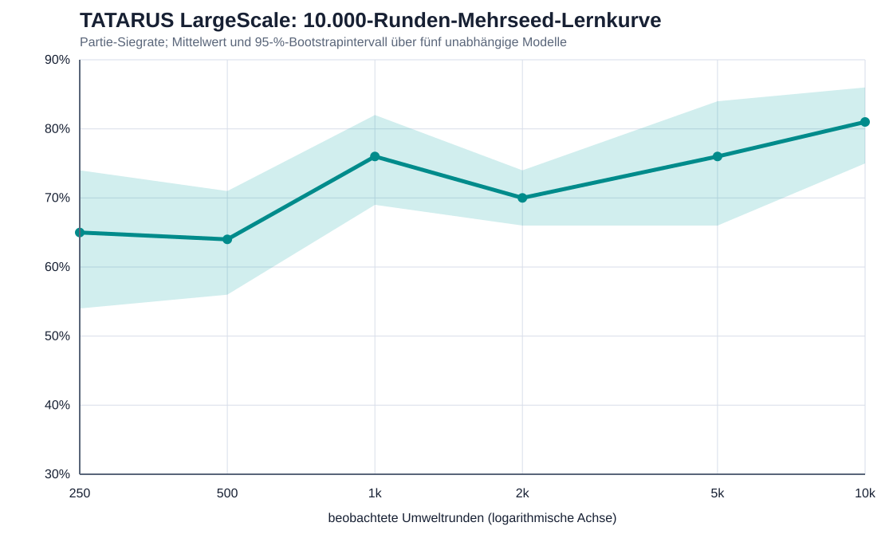

# TATARUS-Mehrseed-Bericht

Protokoll: `RUNENKRIEG-TATARUS-MULTISEED-1`

| Runden | Partiensiegrate [95-%-KI] | Rundensiegrate | Token-Differenz | Entscheidung ms |
|---:|---:|---:|---:|---:|
| 250 | 65.0% [54.0%; 74.0%] | 56.6% | 5.07 | 112.196 |
| 500 | 64.0% [56.0%; 71.0%] | 56.0% | 3.73 | 122.405 |
| 1000 | 76.0% [69.0%; 82.0%] | 59.3% | 6.01 | 131.437 |
| 2000 | 70.0% [66.0%; 74.0%] | 59.5% | 5.56 | 148.112 |
| 5000 | 76.0% [66.0%; 84.0%] | 58.1% | 6.69 | 147.235 |
| 10000 | 81.0% [75.0%; 86.0%] | 59.1% | 6.45 | 148.179 |

Vorregistriert ausgewählt: Seed **20260732** am 10.000er-Checkpoint.

Unabhängige Replikation auf Seeds 60000–60049: **70.0%** Partiensiegrate, Token-Differenz **6.50**, Modellzustand unverändert.
