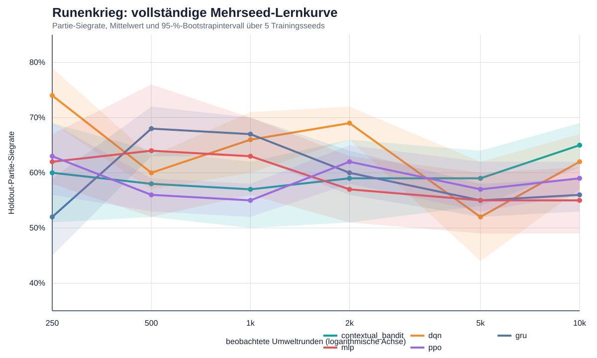

# Statistischer Mehrseed-Bericht

Protokoll: `RUNENKRIEG-TF-MULTISEED-1`

## Endcheckpoint bei 10.000 Umweltrunden

| Agent | Partie-Siegrate, Mittel [95-%-KI] | Token-Differenz | Entscheidung ms |
|---|---:|---:|---:|
| contextual_bandit | 65.0% [61.0%; 69.0%] | 2.41 | 0.012 |
| dqn | 62.0% [57.0%; 67.0%] | 3.58 | 2.029 |
| ppo | 59.0% [56.0%; 62.0%] | 1.17 | 2.337 |
| gru | 56.0% [53.0%; 59.0%] | 0.53 | 25.378 |
| mlp | 55.0% [49.0%; 61.0%] | 1.13 | 2.244 |

Ausgewählt wurde **contextual_bandit**, Seed **20260731**, strikt nach der vorregistrierten Gewinnerregel.

## Gepaarte explorative Signifikanztests

| Vergleich (Gewinner − Kontrolle) | Differenz | 95-%-KI | exaktes p | Holm-p |
|---|---:|---:|---:|---:|
| contextual_bandit − dqn | 0.030 | [-0.050; 0.110] | 0.6875 | 0.7500 |
| contextual_bandit − gru | 0.090 | [0.040; 0.150] | 0.1250 | 0.5000 |
| contextual_bandit − mlp | 0.100 | [0.020; 0.160] | 0.1250 | 0.5000 |
| contextual_bandit − ppo | 0.060 | [-0.010; 0.130] | 0.3750 | 0.7500 |

Bei nur fünf Trainingsseeds haben exakte Tests eine grobe Auflösung. Sie sind explorativ und begründen allein keine allgemeine Überlegenheitsbehauptung.

## Unabhängige Replikation des eingefrorenen Gewinners

- Partie-Siegrate: 60.0%
- Rundensiegrate: 53.3%
- mittlere Token-Differenz: 2.52
- mittlere Entscheidungszeit: 0.010 ms

Die Replikationsseeds 60000–60049 wurden erst nach der Auswahl des Checkpoints ausgewertet.
