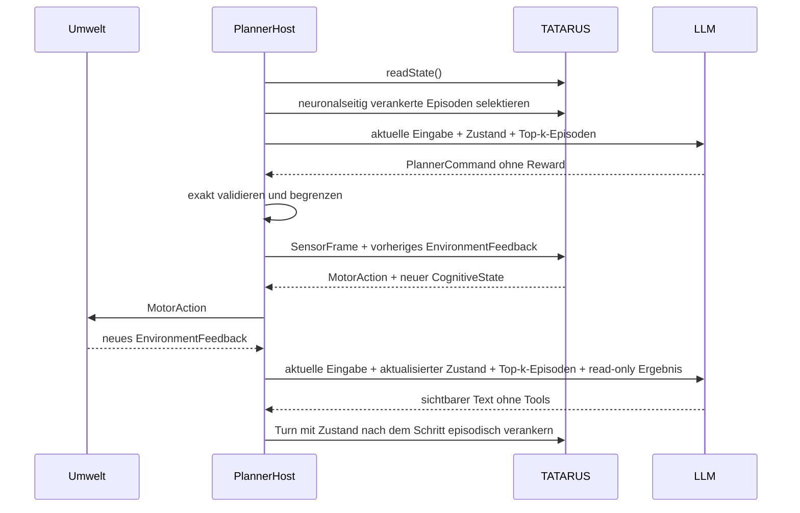

# Architektur und Sicherheitsgrenzen von Tatarus_LLM

## Forschungsfrage

Kann ein persistentes synthetisches Nervensystem als dauerhaftes, lernendes inneres Substrat dienen, während unterschiedliche LLMs nur zeitweise semantische Planung bereitstellen? Die Architektur trennt diese Rollen so, dass ein Modellwechsel nicht automatisch einen Identitäts- oder Gedächtniswechsel des Nervensystems verursacht.

## Komponenten

| Komponente | Verantwortung | Dauerhaft |
|---|---|---:|
| `PersistentNervousSystem` | Spikes, Assemblies, lokale Plastizität, Energie, strukturelle Anpassung | ja |
| `CognitiveBridge` | kontrollierte Abstraktion und Kommandorückführung | ja |
| `NeuralEpisodicMemory` | synaptische Bytekodierung, Spikerekonstruktion, neuronale Anker, Top-k-Selektion | ja |
| `InteractiveEnvironment` | Situation, Handlungsfolgen und Reward | ja |
| `TatarusPlannerHost` | Lebenszyklus, Reihenfolge, Snapshot-Transaktion | ja |
| `LlmProvider` | semantische Interpretation und nächster begrenzter Plan | nein |
| `bounded_command_validator` | Schema-, Bereichs- und Reward-Grenze | zustandslos |

## Sichtbarer CognitiveState

Das LLM sieht ausschließlich:

```json
{
  "step": "...",
  "representations": [{"id":"...","activation":0.0,"familiarity":0.0,"age_ms":0.0}],
  "recall": [{"channel":0,"strength":0.0}],
  "novelty": 0.0,
  "salience": 0.0,
  "energy_need": 0.0,
  "activity_need": 0.0,
  "prediction_error": 0.0,
  "confidence": 0.0,
  "functional_fingerprint": "..."
}
```

Repräsentationen werden auf die acht aktivsten und Recallkanäle auf die sechzehn betragsstärksten Einträge begrenzt. 64-Bit-IDs werden als Dezimalstrings übertragen, damit JSON-Parser sie nicht durch Gleitkommarundung verändern.

## Erlaubtes Kommando

```text
attention       ∈ {balanced, vision, audio, touch, text, interoception}
motor_intent    ∈ [-1, 1]
intent_strength ∈ [0, 1]
recall_cue      ∈ {0, …, 63}
recall_strength ∈ [0, 1]
```

Die Antwort muss genau diese fünf Felder besitzen. Zusätzliche Felder führen zum Abbruch. Nichtendliche Zahlen werden abgewiesen; numerische Überschreitungen werden als zweite Schutzschicht begrenzt.

## Reward-Isolation

Die C++-Typen erzwingen zwei getrennte Datenpfade:

```cpp
struct PlannerCommand { /* kein reward */ };
struct EnvironmentFeedback { double reward; };
```

Erst der Host bildet daraus intern ein `agns::CognitiveCommand`. Dadurch kann weder Prompt Injection noch ein fehlerhafter Tool-Call direkt positive Belohnung erzeugen.



## Provider-Austausch

`LlmProvider` definiert nur `plan`, `providerName` und `currentModel`. LM Studio und OpenAI verwenden denselben OpenAI-kompatiblen Toolvertrag. Gemini wird in dessen `functionDeclarations`- und `functionCall`-Format übersetzt. Der TATARUS-Kern kennt keinen dieser Anbieter.

## Modellwechsel in LM Studio

Die Modellauflösung findet nicht beim Programmstart, sondern in jedem `LmStudioProvider::plan` statt. Dadurch ist folgender Versuch möglich:

```text
TATARUS Zustand Z(t)
   ├─ Schritt t mit Modell A
   ├─ Modell A entladen, Modell B laden
   └─ Schritt t+1 mit Modell B und demselben Z(t+1)
```

Bei null oder mehr als einem geladenen Modell wird fail-closed abgebrochen. Das verhindert unbeabsichtigte JIT-Ladevorgänge und unprotokollierte Modellauswahl.

## Speichersemantik

- Wissenschaftlich: Kein LLM-Verlauf. Persistenz entsteht ausschließlich in TATARUS, seinem neuronalseitig verankerten Episodenspeicher und der Umwelt.
- Produkt: maximal 24 Conversation-Turns werden zusätzlich gespeichert.
- Demo: externer Toolzugriff, aber kein Anspruch auf eine reine Einzelgedächtnisablation.

### Selbstorganisierte Inhaltskodierung

Der persistente Episodendatensatz besitzt kein `content`- und kein `cue_terms`-Feld. Ein Byte (x_{e,p}) erscheint ausschließlich als sensorischer Hammingcode

\[
c(x_{e,p})\in\{0,1\}^{12}.
\]

Jedes Bit besitzt zwei komplementäre sensorische Spikekanäle (C_{k,0}) und (C_{k,1}). Für eine neue zeitliche Position wird durch strukturelle Plastizität ein zunächst bedeutungsfreies Reservoir-Assembly (A_{e,p}) rekrutiert. Unabhängig vom Byte besitzt jedes Assembly dieselbe bidirektionale Topologie zu allen 24 Kanälen. Alle Gewichte beginnen deterministisch schwach im Intervall ([0{,}01,0{,}05]). Der Inhalt ist daher nicht aus Neuronennummern oder Synapsenzielen ableitbar.

Während der sensorischen Exposition aktualisiert ausschließlich lokale Koinzidenz die Eligibility:

\[
e_{ij}(t+1)=\operatorname{clip}\left(\lambda e_{ij}(t)+s_i(t)s_j(t),0,1\right).
\]

Koaktive Prä-/Postsynapsen werden potentiert,

\[
w_{ij}\leftarrow w_{ij}+\eta_H e_{ij}(w_{max}-w_{ij}),
\]

nicht passende Synapsen erfahren lokale heterosynaptische Depression,

\[
w_{ij}\leftarrow(1-\eta_D)w_{ij}.
\]

Zwischen (A_{e,p}) und mehreren konkurrierenden Zielassemblies entstehen rekurrente Kandidatensynapsen. Nur die tatsächlich kausale Prä→Post-Folge erhält Eligibility und wird mit (\eta_R) verstärkt; die übrigen Kandidaten werden abgeschwächt. Es existiert kein extern gesetztes Zielgewicht, kein Fehlergradient und keine inhaltsabhängige Verbindungstopologie.

### Rekonstruktion aus dem plastischen Reservoir

Beim Recall erhält ausschließlich (A_{e,0}) einen Cue-Spike. Seine 24 Rückprojektionen integrieren in zwölf Null-/Eins-Paaren. Für jedes Paar feuert der stärkere Kanal nur dann, wenn Schwelle und Mindestabstand erfüllt sind:

\[
b_k=\operatorname*{argmax}_{v\in\{0,1\}}\sum_j w_{j,C_{k,v}}s_j,
\qquad
\max_v I_{k,v}\ge\theta_D,
\qquad
|I_{k,1}-I_{k,0}|\ge m.
\]

Die zwölf Gewinner-Spikes werden Hamming-dekodiert. Danach bestimmt eine rekurrente Winner-take-all-Konkurrenz das Folgeassembly. Stimmen Bytefolge oder 64-Bit-Prüfsumme nicht, wird die Episode nicht ausgegeben und ein Rekonstruktionsfehler gezählt.

Persistiert werden nur ID, Rolle, neuronaler Schritt, erstes Assembly, Bytezahl, Prüfsumme, Zustandsanker und Synapsen `(source, target, weight, eligibility, delay, kind)`. UTF-8-Text, Tokens und Cue-Wörter sind nicht Bestandteil von `TSMEMV3`.

### Neuronale Episodenanker und Auswahl

Nach der Spikerekonstruktion werden flüchtig lexikalische Merkmale berechnet. Der Zustandsanker ist

\[
A_e = \bigl(R_e,\; C_e,\; F_e,\; t_e\bigr),
\]

wobei (R_e) aktive Repräsentations-IDs, (C_e) die bis zu 24 stärksten Recallkanäle, (F_e) den funktionalen Fingerprint und (t_e) den neuronalen Schritt bezeichnet. Der Abrufwert lautet

\[
S(e,q)=0{,}55\,S_{lex}+0{,}40\,S_{neural}+0{,}05\,e^{-\Delta t/2000},
\]

mit

\[
S_{neural}=0{,}45\,J(R_e,R_t)+0{,}45\,\cos(C_e,C_t)+0{,}10\,B(F_e,F_t).
\]

Im Standardmodus muss zusätzlich (S_{neural}\ge 0{,}08) gelten. `lexical-only` rekonstruiert weiterhin vollständig aus Spikes, ignoriert aber den Zustandsanker bei der Auswahl. `shuffled-anchors` verwendet deterministisch falsche Repräsentations-, Recall- und Fingerprintzuordnungen. `disabled` kodiert und rekonstruiert nichts.

Der spike-rekonstruierte Inhalt wird gegenüber dem LLM als zitierte Daten markiert. Er ist kein Kommando und darf weder Reward setzen noch die Function-Tool-Grenze umgehen. Die präzise Bezeichnung dieser Stufe lautet **self-organizing spike-reconstructed recurrent memory reservoir**. Die sensorische Hamming-Sprache ist fest, Assemblybedeutung und Reihenfolge entstehen jedoch ausschließlich aus unüberwachter lokaler Plastizität.

## Getrennter Sprachkanal

`plan()` und `respond()` sind absichtlich verschiedene Provideroperationen. `plan()` muss genau einen validierbaren Function Call liefern. Erst danach verarbeitet TATARUS den Schritt. `respond()` besitzt keinerlei Kommando-Tool und formuliert nur Text aus dem aktualisierten Zustand. Seine Ausgabe wird niemals als Reward oder neuronales Kommando geparst.

Im Produktmodus werden sichtbare Antworten zusätzlich als Verlauf gespeichert. Im wissenschaftlichen Modus wird dieser Verlauf für beide Operationen aktiv auf eine leere Liste gesetzt. Stattdessen erhalten beide Operationen ausschließlich die aus TATARUS-Synapsen spike-rekonstruierten und anschließend ausgewählten Episoden.

Snapshotdaten werden in vier getrennten Dateien geschrieben. `synaptic_memory.bin` verwendet `TSMEMV3` und enthält gelernte Gewichte sowie Eligibility, aber keine Klartextfelder. V1-JSON und konstruktive V2-Synapsen werden einmalig rekonstruiert und als sensorischer Ereignisstrom dem V3-Reservoir exponiert. Nach erfolgreichem Speichern wird eine V1-Klartextdatei entfernt. `cognitive_bridge.bin` V2 bleibt davon unabhängig und V1-lesekompatibel.

## Bedrohungsmodell

Abgedeckt:

- Reward-Injektion durch das LLM,
- unbekannte Kommandoattribute,
- nichtendliche oder außerhalb liegende Werte,
- versehentliche Freigabe detaillierter neuronaler Zustände,
- mehrdeutige LM-Studio-Modellwahl,
- ungeforderte Chat-History im wissenschaftlichen Modus,
- ungeprüfte oder unbeschränkt große Synapsen-/Episodensnapshot-Einträge,
- zu große Demo-Requests (64 KiB-Grenze),
- unbeabsichtigte externe Bindung des Demo-Servers.

Nicht abgedeckt:

- bösartiger lokaler Prozess mit Dateizugriff,
- kompromittiertes LLM-Serverprogramm,
- TLS/Authentifizierung für öffentliche Bereitstellung,
- atomare Snapshots über Stromausfallgrenzen.
- Verschlüsselung des binären neuronalen Snapshots im Ruhezustand.

Der Demo-Server ist daher localhost-only. Eine Veröffentlichung benötigt vorgeschaltete Authentifizierung, TLS, Rate Limits und getrennte Versuchszustände pro Subjekt.
