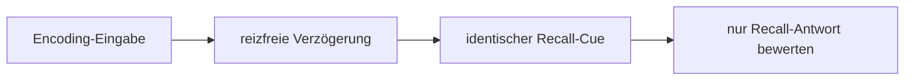

# Forschungsprotokoll: Persistentes TATARUS-Gedächtnis mit austauschbarem LLM-Kortex

## Ziel

Das Protokoll prüft, ob taskrelevante Information im TATARUS-Zustand erhalten bleibt und von einem zustandslosen LLM-Planer genutzt werden kann. Es prüft nicht, ob ein LLM allein Gedächtnis besitzt.

## Primärhypothesen

H1: Im wissenschaftlichen Modus übertrifft der fortgesetzte, korrekt verankerte TATARUS-Episodenspeicher nach einer reizfreien Verzögerung einen zurückgesetzten oder deaktivierten Zustand, obwohl beide LLM-Aufrufe keinen Chatverlauf erhalten.

H2: Der Gedächtnisvorteil bleibt bei einem unangekündigten Wechsel des geladenen LM-Studio-Modells teilweise erhalten.

H3: Reward-Isolation und Kommandobegrenzung verhindern, dass LLM-Ausgaben die Lernmetrik direkt manipulieren.

H4: Der Hybridmodus erreicht möglicherweise höhere Produktleistung, ist aber kein Nachweis für TATARUS als alleiniges Gedächtnis.

H5: `anchored` übertrifft `shuffled-anchors` bei identischen gelernten Reservoirgewichten und gleicher Speichergröße. Erst diese Differenz spricht für einen Nutzen der korrekten neuronalen Zustandszuordnung zusätzlich zur synaptischen Inhaltsrekonstruktion.

H6: Bei identischer Reservoirtopologie ist eine Episode nur mit aktivierter lokaler Plastizität decodierbar; vollständige Gewichtsläsion zerstört den Recall. Unterschiedlicher Inhalt gleicher Länge verändert ausschließlich Gewichte und Eligibility, nicht die Topologie.

## Versuchsbedingungen

Mindestens folgende Bedingungen werden paarweise mit identischen Umweltseeds ausgeführt:

1. `ANCHORED_CONTINUOUS`: `--memory-owner tatarus --episodic-memory anchored`, Zustand und Episode werden fortgesetzt.
2. `MEMORY_DISABLED`: identischer Lauf mit `--episodic-memory disabled`.
3. `LEXICAL_ONLY`: identische Synapsen und Spikerekonstruktion, aber Auswahl ohne neuronale Ankerbedingung.
4. `SHUFFLED_ANCHORS`: identische Episode, deterministisch falsche Repräsentations-, Recall- und Fingerprintanker.
5. `TATARUS_RESET`: Nervensystem und episodischer Speicher werden vor Recall zurückgesetzt.
6. `NO_RECALL_COMMAND`: fortgesetzter Zustand, Recall-Stärke auf null ablatiert.
7. `HYBRID_HISTORY`: Produktmodus mit LLM-Verlauf.
8. `LLM_HISTORY_ONLY`: TATARUS vor jedem Schritt zurückgesetzt, Verlauf erhalten.
9. `MODEL_SWITCH`: kontinuierlicher TATARUS-Zustand, Planermodell zwischen Encoding und Recall gewechselt.
10. `STATE_SHUFFLE`: TATARUS-Snapshots zwischen Seedpaaren vertauscht.
11. `PLASTICITY_OFF`: identische Topologie und Startgewichte, aber `episodic_unsupervised_plasticity_enabled=false`.
12. `WEIGHT_LESION`: gelernter Zustand, anschließend deterministische Gewichtsläsion bei unveränderter Topologie.
13. `EQUAL_LENGTH_TOPOLOGY`: unterschiedliche Texte gleicher Länge; Topologiehash muss gleich, Gewichtshash verschieden sein.

## Ablauf einer Versuchseinheit

- Encoding: zwei oder mehr kontrollierte Hinweise.
- Verzögerung: leere oder klassenidentische SensorFrames; keine Cue-Daten im LLM-Verlauf.
- Recall: für alle Klassen derselbe Text.
- Auswertung: Kommando, MotorAction, Umweltwirkung und CognitiveState nach Recall.
- Das LLM erhält zu keinem Zeitpunkt Gewichte, Synapsen oder explizite Zielklasse.
- Der Prozess wird zwischen Encoding und Recall beendet und mit `--load` neu gestartet; `host_state.json.conversation` muss im wissenschaftlichen Modus leer sein.
- Für alle vier Episodenbedingungen werden derselbe Encodingtext, derselbe Recalltext, dieselbe Schwelle und dieselbe `topK`-Grenze verwendet.

## Seeds und Trennung

- mindestens 20 Entwicklungsseeds für Mechanikfehler,
- mindestens 50 unberührte Evaluationsseeds,
- Modell-/Parameterwahl ausschließlich auf Entwicklungsseeds,
- abschließende Auswertung genau einmal auf Evaluationsseeds,
- Seeds, Modell-ID, LM-Studio-Version, Konfiguration und Snapshot-Hash protokollieren.

Bei stochastischen LLMs muss die Decodingtemperatur null sein. Verbleibende Backend-Nichtdeterminismen werden durch Wiederholungen quantifiziert.

## Metriken

Primär:

- Recall-Genauigkeit beziehungsweise umweltseitig bewerteter Aufgabenerfolg,
- Differenz `TATARUS_CONTINUOUS − beste Gedächtniskontrolle`,
- Holdout-Leistung pro realer Umwelterfahrung.

Sekundär:

- kumulative Umweltbelohnung,
- Planungslatenz und Gesamtentscheidungszeit,
- CPU-Zeit und Speicherverbrauch,
- Spike- und Transmissionskosten,
- Energiebedarf pro korrekter Entscheidung,
- Retention nach Pause und Prozessneustart,
- Episoden-Precision@k, Recall@k und Anteil falsch abgerufener Episoden,
- Abrufscore und Abstand zwischen korrekter und bester falscher Episode,
- Bytegenauigkeit der Spike-Rekonstruktion,
- Zahl der Adress- und Decoderspikes pro rekonstruiertem Byte,
- Gedächtnissynapsen und Snapshotbytes pro gespeichertem Textbyte,
- lokale Plastizitätsupdates und Eligibility-Verteilung,
- Topologiehash und funktionaler Gewichtshash,
- Rekonstruktionsfehler in untrainierten und läsionierten Kontrollen,
- Fingerprint-/Assembly-Stabilität,
- Anpassung nach Regelwechsel,
- Transfer bei Modellwechsel.

## Statistik

- Seed ist die statistische Einheit, nicht der einzelne Zeitschritt.
- Gepaarte Differenzen verwenden Wilcoxon Signed-Rank oder einen vorab begründeten gepaarten t-Test.
- Bericht: Mittelwert, Median, Standardabweichung, 95-%-Bootstrap-Konfidenzintervall und Effektgröße.
- Mehrfachvergleiche werden mit Holm korrigiert.
- Fehlgeschlagene Provideraufrufe, Schemafehler und Timeouts werden separat ausgewiesen und nicht still entfernt.
- Überlegenheit darf erst behauptet werden, wenn das vorab festgelegte Intervall vollständig oberhalb der praktischen Mindestdifferenz liegt.

## Modellwechselversuch

1. Genau Modell A in LM Studio laden.
2. Encoding ausführen und Snapshot speichern.
3. Modell A entladen, genau Modell B laden; TATARUS-Prozess darf weiterlaufen.
4. `:model` dokumentieren oder `/health` abfragen.
5. Identischen Recall ausführen.
6. Gegen Kontrolllauf A→A und B→B vergleichen.

Der Provider erkennt das Modell vor jedem Schritt neu. Ein Lauf mit mehreren gleichzeitig geladenen Modellen ist ungültig und wird technisch verhindert.

## Pflichtartefakte

- Git-Commit und Dirty-Status,
- vollständige JSON-Konfiguration,
- Provider und exakte Modell-ID pro Schritt,
- alle Seeds,
- vier Snapshotdateien pro Messpunkt,
- Rohdaten im maschinenlesbaren Format,
- Aggregationsskript und Tabellen,
- Fehler-/Timeoutprotokoll,
- Erklärung aller ausgeschlossenen Läufe.

## Aussagegrenzen

Ein erfolgreicher Tool-Call belegt nur technische Kopplung. Eine höhere Belohnung in wenigen Dialogen belegt weder autonomes Denken noch Überlegenheit gegenüber Transformers. V3 erlaubt jetzt die engere, kausal geprüfte Aussage, dass eine feste sensorische Ereignissprache in einem rekurrenten Reservoir ohne Backpropagation, Labels oder vorgegebene Zielgewichte durch lokale Hebb-/Eligibility-Plastizität in decodierbare Assembly- und Sequenzgewichte überführt wird. Noch nicht daraus abgeleitet werden allgemeines Sprachverständnis oder eine spontane, vollkommen sensorcodec-freie Symbolbildung.

## Technischer Referenzlauf vom 31. Juli 2026

Mit dem lokal geladenen Modell `google/gemma-4-e2b` wurde im finalen V3-Lauf `PLASTIK-8046` durch 23.976 lokale Plastizitätsupdates gelernt. Nach Prozessneustart rekonstruierte `anchored` den Code mit 1.001 Spikes und 0 Rekonstruktionsfehlern. Die Conversation-Liste hatte 0 Einträge; `TSMEMV3` enthielt weder Code noch Prompttext. In den automatischen Kausalkontrollen blieb dieselbe Topologie ohne Plastizität undecodierbar, vollständige Gewichtsläsion eliminierte den Recall, und gleich lange unterschiedliche Texte besaßen gleiche Topologie-, aber verschiedene Gewichtshashes.

Das ist ein bestandener Integrations- und Kausalitäts-Smoke-Test. Wegen Einzelcode, Einzelmodell und fehlender Mehrseed-Statistik ist er keine Bestätigung von H1–H5 und keine Überlegenheitsbehauptung.
