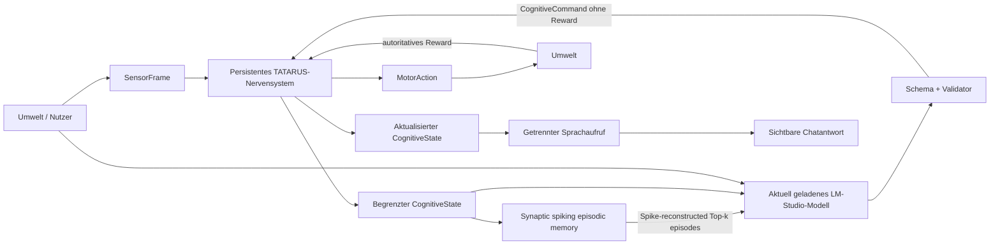

# TATARUS_LLM

## TATARUS – A Persistent Synthetic Nervous System with a Replaceable LLM Cortex

`Tatarus_LLM` koppelt den persistenten TATARUS-Nervensystemkern an ein austauschbares Sprachmodell. Die Kopplung ist bewusst asymmetrisch:

- TATARUS besitzt Lebenszustand, neuronales Gedächtnis, lokale Plastizität, Belohnung und kontinuierliche Identität.
- Das Sprachmodell interpretiert den aktuellen Nutzereingang und einen kleinen, populationsbasierten `CognitiveState` und schlägt genau ein begrenztes Kommando vor.
- Das Sprachmodell erhält weder Membranpotentiale noch Neuronen-, Synapsen-, Gewichts-, Eligibility- oder Topologiedaten.
- Das Sprachmodell darf keine Belohnung setzen. Reward entsteht ausschließlich in der Umwelt.

Damit ist das LLM ein austauschbarer Planungskortex und nicht der Besitzer des synthetischen Nervensystems.

## Implementierter Regelkreis



Der Closed Loop pro Schritt ist:

1. Die Umwelt kodiert Eingabe und Situation als `SensorFrame`.
2. Der Host liest ausschließlich den gepoolten `CognitiveState` und ruft damit passende, neuronalseitig verankerte Episoden ab.
3. Der Provider erhält höchstens die ausgewählten Top-k-Episoden und fordert genau den Tool-Call `submit_cognitive_command` an.
4. Der Validator verwirft unbekannte Felder, insbesondere `reward`, und begrenzt alle Zahlen.
5. TATARUS verarbeitet Beobachtung, vorherige Umweltbelohnung und Kommando.
6. Die Umwelt bewertet die resultierende `MotorAction`.
7. Ein zweiter, werkzeugloser LLM-Aufruf formuliert aus Nutzereingabe, ausgeführtem Ergebnis und aktualisiertem CognitiveState die sichtbare Chatantwort.
8. Diese Antwort ist reiner Text und kann weder Reward setzen noch ein weiteres Kommando ausführen.
9. Nutzerturn und erfolgreiche Antwort werden als sensorische Hamming-Spikefolge exponiert; lokale Hebb-/STDP-Plastizität bildet daraus selbstständig Assemblygewichte und rekurrente Übergänge.
10. Nervensystem, Cognitive Bridge, episodischer Speicher, Umwelt und gegebenenfalls Produktverlauf werden gemeinsam gespeichert.

## LM Studio: immer das aktuell geladene Modell

Für LM Studio existiert absichtlich kein fest konfigurierter Modellname. Vor **jedem** Planungsschritt liest der Provider `/api/v1/models` und wählt das eine Modell mit einer nichtleeren `loaded_instances`-Liste. Bei älteren LM-Studio-Versionen dient `/api/v0/models` mit `state = loaded` als Fallback.

- Kein geladenes Modell: Der Schritt bricht mit einer verständlichen Fehlermeldung ab.
- Genau ein geladenes Modell: Dieses Modell wird verwendet.
- Mehrere geladene Modelle: Der Schritt bricht ab, weil die Auswahl für einen Forschungsversuch sonst mehrdeutig wäre.
- Modellwechsel während der Laufzeit: Der nächste Schritt verwendet automatisch das neue Modell; der persistente TATARUS-Zustand bleibt erhalten.

`/v1/models` wird nicht zur Auswahl verwendet, weil LM Studio dort bei Just-in-Time-Loading auch nur heruntergeladene Modelle aufführen kann.

## Voraussetzungen und Build

- Windows 10/11 x64
- Visual Studio 2022 Build Tools mit C++-Werkzeugen
- LM Studio mit aktiviertem Local Server
- genau ein in LM Studio geladenes LLM mit Tool-Calling-Unterstützung

LM Studio starten:

```powershell
lms server start
lms ps --json
```

Projekt bauen und alle Tests ausführen:

```powershell
cd D:\Projekt_Forschungen\Projekt_1\Tatarus_LLM
.\build.bat
```

Der Build verwendet den vorhandenen TATARUS-Kern und den generierten Operator aus `../exports/generated`; es wird keine zweite, vereinfachte Nervensystemkopie erzeugt.

## Verwendung

Wissenschaftlicher Modus mit LM Studio:

```powershell
.\build\tatarus_llm.exe `
  --provider lmstudio `
  --memory-owner tatarus `
  --config .\config\tatarus_llm.example.json
```

Einen einzelnen reproduzierbaren Schritt ausführen:

```powershell
.\build\tatarus_llm.exe --provider lmstudio --memory-owner tatarus `
  --no-autosave --once "Beobachte und plane eine vorsichtige Handlung."
```

Gespeicherten Lebenszustand fortsetzen:

```powershell
.\build\tatarus_llm.exe --provider lmstudio --memory-owner tatarus `
  --snapshot-dir .\state\subject_01 --load
```

Interaktive Befehle:

- `:state` zeigt nur den freigegebenen CognitiveState.
- `:memory` zeigt nur Episoden-, Synapsen- und Rekonstruktionsspikezahlen, niemals Inhalt oder Gewichte.
- `:model` fragt das derzeit tatsächlich geladene Modell ab.
- `:save` speichert den zusammengesetzten Lebenszustand.
- `:load` lädt ihn.
- `:quit` beendet das Programm.

### Direkt mit TATARUS chatten

Nach dem Start kann normal in die Eingabezeile geschrieben werden. Jeder Turn besteht aus zwei getrennten Modellphasen:

```text
Planung mit strengem Function Tool
→ neuronaler TATARUS-Schritt
→ sichtbare, werkzeuglose Sprachformulierung
```

Nur die zweite Phase wird als `TATARUS: ...` angezeigt. Forschungsdiagnostik bleibt standardmäßig sichtbar. Für eine reine Chatansicht:

```powershell
.\build\tatarus_llm.exe --provider lmstudio --memory-owner tatarus --chat-only
```

Im wissenschaftlichen Modus erhält auch die Sprachphase keinen früheren Dialog. Sie erhält nur die aktuelle Eingabe, den gepoolten TATARUS-Zustand und die vom TATARUS-Speicher für diesen Turn ausgewählten Episoden. Im Hybridmodus werden zusätzlich die sichtbaren Nutzer- und TATARUS-Antworten als begrenzter Verlauf gespeichert; interne Steuerkommandos werden nicht als Chatgedächtnis missbraucht.

## Gedächtnismodi

| CLI-Wert | Bedeutung | Persistenter Sprachverlauf | Forschungsinterpretation |
|---|---|---:|---|
| `tatarus` | wissenschaftlicher Modus | nein | TATARUS ist das einzige dauerhafte Gedächtnis |
| `hybrid` | Produktmodus | ja, maximal 24 Turns | TATARUS und LLM-Kontext bilden ein Doppelgedächtnis |
| `demo` | Tool-/Gateway-Demo | nein | technische Demonstration, nicht der sauberste Gedächtnisnachweis |

Im wissenschaftlichen Modus wird eine eventuell vorhandene Conversation-Liste beim Requestbau aktiv ignoriert. Jeder Request enthält nur Systeminstruktion, aktuelle Nutzereingabe, aktuellen CognitiveState und maximal drei explizit von TATARUS abgerufene Episoden.

### Episodischer TATARUS-Speicher

Der Standardmodus `anchored` speichert **keinen Text, keine Tokens und keine Cue-Wörter**. Jedes UTF-8-Byte wird dem großen rekurrenten TATARUS-Gedächtnisreservoir nur als Hamming(12,8)-Sensorereignis angeboten:

- 24 komplementäre sensorische Codekanäle – je ein Null- und Einskanal für jedes Hammingbit,
- strukturell rekrutierte, zunächst inhaltsfreie Reservoir-Assemblies,
- identische bidirektionale Vollprojektion jedes Assemblys auf alle 24 Kanäle,
- schwache deterministische Startgewichte zwischen `0,01` und `0,05`,
- lokale Hebb-Potenzierung für prä-/postsynaptische Koinzidenz,
- heterosynaptische Depression für nicht passende Kanäle,
- Eligibility-STDP zwischen zeitlich aufeinanderfolgenden Assemblies,
- konkurrierende rekurrente Fan-out-Kandidaten statt einer vorgegebenen Folgekante.

Die Topologie hängt nur von Episodenlänge und Reservoirgröße ab, nicht vom Inhalt. Erst die lokal entstandenen Gewichte unterscheiden Texte. Beim Abruf wird nur das erste Assembly extern aktiviert. Für jedes Bit gewinnt der stärkere Null-/Einskanal; die rekurrente Konkurrenz aktiviert das am stärksten gelernte Folgeassembly. Erst die vollständige Spikefolge erzeugt vorübergehend den Text für die LLM-Anfrage. Zusätzlich wird jede Episode an den Zustand ihres Entstehungszeitpunkts gebunden:

- aktive TATARUS-Repräsentations-IDs,
- bis zu 24 betragsstärkste Recallkanäle,
- funktionaler 64-Bit-Fingerprint,
- neuronaler Schritt und lexikalische Abrufmerkmale.

Persistiert werden ausschließlich Synapsen, neuronale Adressen, Rolle, Länge, Prüfsumme und Zustandsanker. Die Prüfsumme validiert den rekonstruierten Text, enthält ihn aber nicht. Lexikalische Cue-Merkmale werden erst nach der Spike-Rekonstruktion im Arbeitsspeicher berechnet und nicht gespeichert. Nur Episoden oberhalb der Abrufschwelle werden dem austauschbaren LLM gezeigt. Die Modi erlauben direkte Ablationen:

| Option | Wirkung | Kontrollfrage |
|---|---|---|
| `--episodic-memory anchored` | lexikalischer Abruf mit korrekten neuronalen Ankern | vollständiges TATARUS-Gedächtnis |
| `--episodic-memory disabled` | weder Speicherung noch Abruf | ist episodisches Gedächtnis überhaupt nötig? |
| `--episodic-memory lexical-only` | synaptische Rekonstruktion, Auswahl ohne Zustandsanker | genügt inhaltliche Ähnlichkeit ohne korrekte neuronale Zuordnung? |
| `--episodic-memory shuffled-anchors` | deterministisch falsche Repräsentations-, Recall- und Fingerprintzuordnung | ist die korrekte neuronale Bindung nötig? |

Die Plastizitätskausalität lässt sich direkt mit `--episodic-plasticity disabled` ablatieren. Dabei bleiben Ausgangstopologie und Startgewichte identisch, lokale Lernupdates entfallen jedoch vollständig; der Test erwartet keinen decodierbaren Recall.

`--memory-top-k N` begrenzt die Zahl sichtbarer Episoden; `--memory-threshold X` setzt die Abrufschwelle in `[0,1]`. Beispiel:

```powershell
.\build\tatarus_llm.exe --provider lmstudio --memory-owner tatarus `
  --episodic-memory anchored --memory-top-k 3 --memory-threshold 0.20 `
  --snapshot-dir .\state\subject_01
```

Für reproduzierbare Versuche stehen dieselben Werte in `config/tatarus_llm.example.json`: Kapazitätsgrenzen, Abrufgewichtung, maximales Synapsengewicht, Spike-Schwelle, Plastizitätsschalter, Lern- und Depressionsraten, Eligibility-Zerfall, Trainingswiederholungen, Decodierabstand und rekurrenter Fan-out. Explizite CLI-Werte für Modus, Top-k und Schwelle überschreiben die JSON-Werte.

Wissenschaftliche Einordnung: Dies ist jetzt ein **self-organizing spike-reconstructed recurrent memory reservoir**. Der persistierte Snapshot enthält keinen Episodentext. Inhalt und Reihenfolge liegen ausschließlich in Gewichten, die aus lokaler unüberwachter Koinzidenz, Eligibility und Konkurrenz entstanden sind. Es gibt weder Backpropagation noch Byte-Labels, Zielgewichte oder inhaltsabhängige Topologie. Die Hamming-Abbildung definiert lediglich die sensorische Ereignissprache – analog zu einer festen Sinnesrezeptorkodierung.

## Provider

### LM Studio

```powershell
.\build\tatarus_llm.exe --provider lmstudio --base-url http://127.0.0.1:1234
```

`--model` wird in diesem Modus ignoriert. Maßgeblich ist das aktuell geladene Modell.

### OpenAI Responses API

```powershell
$env:OPENAI_API_KEY = "..."
.\build\tatarus_llm.exe --provider openai --model MODELNAME
```

### Gemini

```powershell
$env:GEMINI_API_KEY = "..."
.\build\tatarus_llm.exe --provider gemini --model MODELNAME
```

API-Schlüssel werden nur aus Umgebungsvariablen gelesen und nicht im Snapshot gespeichert.

## Lokale Web UI: Neural Chat

Die native Anwendung liefert jetzt eine vollständige responsive Chatoberfläche direkt aus dem C++-Gateway aus. Es ist kein Node.js-, Python- oder Cloud-Webserver erforderlich. TATARUS, der Browser und LM Studio bleiben auf demselben Rechner:

```text
Browser  ⇄  C++ localhost gateway  ⇄  TATARUS  ⇄  LM Studio
```

Start im wissenschaftlichen Modus:

```powershell
.\run_web_ui.bat
```

Das Skript baut bei Bedarf, lädt einen vorhandenen Web-Snapshot automatisch und öffnet `http://127.0.0.1:12401/`. Der entsprechende vollständige Einzelaufruf lautet:

```powershell
cd D:\Projekt_Forschungen\Projekt_1\Tatarus_LLM
.\build\tatarus_llm.exe `
  --provider lmstudio `
  --memory-owner tatarus `
  --config .\config\tatarus_llm.example.json `
  --snapshot-dir .\state\web_subject_01 `
  --load `
  --demo-port 12401
```

Beim ersten Lauf ohne vorhandenen Snapshot wird `--load` weggelassen. Anschließend wird im Browser geöffnet:

```text
http://127.0.0.1:12401/
```

Die Oberfläche zeigt:

- normale Nutzer-/TATARUS-Chatnachrichten,
- den aktuell verwendeten Provider und das tatsächlich geladene LM-Studio-Modell,
- neuronalen Schritt und funktionalen Fingerprint,
- Konfidenz, Salienz und Neuheit,
- aktive Repräsentationen,
- Recall-Episoden und Rekonstruktionsspikes,
- Gedächtnissynapsen und lokale Plastizitätsupdates,
- den begrenzten Planner-Command und den ausschließlich von der Umwelt erzeugten Reward,
- getrennte Planungs- und Sprachlatenz,
- manuelles Speichern und Laden des zusammengesetzten Snapshots.

Die sichtbaren Chatblasen sind keine zusätzliche Forschungs-Memory. JavaScript sendet bei jedem Turn ausschließlich `{"user_input":"..."}`. Im Modus `tatarus` erhält das LLM keinen Browserverlauf; dauerhafte Erinnerung muss aus TATARUS beziehungsweise den spike-rekonstruierten Episoden kommen. Alle LLM-Texte werden mit `textContent` eingesetzt und nicht als HTML interpretiert.

Web-Assets liegen editierbar unter `web/` und werden beim CMake-Konfigurieren nach `build/web/` kopiert. Ein alternatives Verzeichnis kann mit `--web-root DIR` angegeben werden. Der Server bindet weiterhin ausschließlich an `127.0.0.1` und setzt eine restriktive Content-Security-Policy.

Zusätzliche lokale Endpunkte der Web UI:

- `GET /v1/memory` – aggregierte Speicherstatistik ohne Gewichte oder Topologie,
- `POST /v1/save` – zusammengesetzten Snapshot speichern,
- `POST /v1/load` – den konfigurierten Snapshot laden.

### Bedienung

- Nachricht verfassen und mit dem Pfeil oder `Strg+Enter` senden.
- „Snapshot speichern“ hält Nervensystem, Bridge, Umwelt und synaptischen Speicher gemeinsam fest.
- „Snapshot laden“ ersetzt den aktuellen Zustand durch den gespeicherten Zustand.
- Das × in der Diagnostik leert nur die sichtbaren Chatblasen; TATARUS wird dabei nicht zurückgesetzt.
- Rekonstruierte Episoden können pro Antwort aufgeklappt werden.

Der Gateway verarbeitet Requests sequenziell. Während der zwei lokalen LLM-Aufrufe bleibt der jeweilige Turn bewusst gesperrt, damit zwei Browsernachrichten nicht gleichzeitig denselben Nervenzustand verändern.

## Demo-Gateway

```powershell
.\build\tatarus_llm.exe --provider lmstudio --memory-owner demo --demo-port 12401
```

Lokale Endpunkte:

- `GET /health`
- `GET /v1/state`
- `POST /v1/step` mit `{"user_input":"..."}`

Das Schema liegt unter [`openapi/tatarus_demo_openapi.yaml`](openapi/tatarus_demo_openapi.yaml). Der Server bindet aus Sicherheitsgründen nur `127.0.0.1`. Ein cloudbasierter Custom GPT kann localhost nicht direkt erreichen; dafür wäre ein authentifizierter HTTPS-Reverse-Proxy erforderlich. Das ist eine Deployment-Schicht und darf nicht mit dem wissenschaftlichen Gedächtnisversuch verwechselt werden.

## Snapshot

Ein Snapshot-Verzeichnis enthält:

- `nervous_system.agns`: vollständiger neuronaler Zustand,
- `cognitive_bridge.bin`: versionierter Bridge-/Recall-Zustand einschließlich gepooltem CognitiveState,
- `synaptic_memory.bin`: Reservoir-Assemblies, bidirektionale Codeprojektionen, rekurrente Kandidatensynapsen, gelernte Gewichte, Eligibility, Zustandsanker, Länge und Prüfsummen; kein Episodentext,
- `host_state.json`: Umwelt, Modus, letzte Provider-Metadaten und nur im Hybridmodus der begrenzte Gesprächsverlauf.

Der Snapshot ist nicht an ein LLM gebunden. Deshalb kann derselbe TATARUS-Lebenslauf nacheinander mit unterschiedlichen Planungsmodellen fortgesetzt werden.

Beim Laden eines alten V1- oder V2-Snapshots wird der rekonstruierte Ereignisstrom einmalig dem V3-Reservoir exponiert und ausschließlich über lokale Plastizität neu gelernt. V2→V3 wurde real mit vier Episoden, 8.928 Synapsen und 53.568 Plastizitätsupdates getestet. Nach erfolgreichem Schreiben entfernt der Host eine eventuelle V1-Klartextdatei. Im Produktmodus kann `host_state.json` weiterhin den ausdrücklich gewählten LLM-Gesprächsverlauf enthalten; die Kein-Klartext-Garantie gilt für `--memory-owner tatarus`.

## Teststatus

Automatisiert geprüft werden exakte UTF-8-Spikerekonstruktion, lokale Plastizitätsupdates, gleiche Topologie bei unterschiedlichem Inhalt, unterschiedliche Gewichtshashes, untrainierte Kontrolle, vollständige Gewichtsläsion, Prüfsummenfehler, fehlender Klartext, `disabled`-/`shuffled-anchors`-Ablation, V1-/V2-Migration und Snapshot-Roundtrip. Ohne Plastizität bleibt die Reservoirstruktur identisch, aber keine Episode ist decodierbar. Auch die ursprünglichen persistenten Nervensystemtests bestehen.

Im finalen V3-Live-Neustarttest mit `google/gemma-4-e2b` wurde `PLASTIK-8046` über **23.976 lokale Plastizitätsupdates** gelernt. Prozess 2 rekonstruierte nach `--load` exakt `PLASTIK-8046` mit **1.001 Spikes**, **0 Rekonstruktionsfehlern** und leerer LLM-History. `TSMEMV3` enthielt weder Code noch Prompttext. Dies bestätigt die selbstorganisierte Gewichtsbildung und Rekonstruktion in diesem Reservoir, noch keine allgemeine kognitive Überlegenheit des Gesamtsystems.

Für wissenschaftliche Aussagen sind die im [`EXPERIMENT_PROTOCOL.md`](EXPERIMENT_PROTOCOL.md) definierten Mehrseed- und Ablationsläufe maßgeblich; ein erfolgreicher Smoke-Test allein belegt keine kognitive Überlegenheit.

## Lizenz und Urheberschaft

Teil des Projekts **TATARUS – A Persistent Synthetic Nervous System**. Lizenz: Apache License 2.0. Entwickler: Ralf Krümmel.
