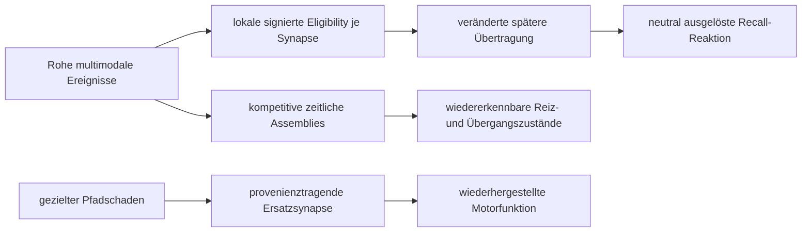
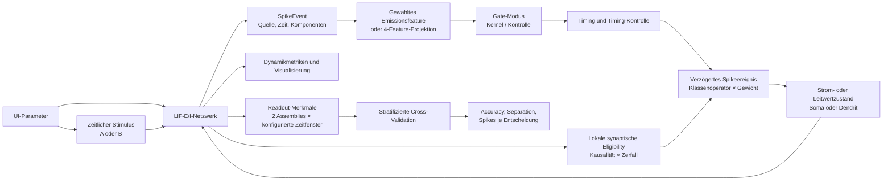

# UI-Dokumentation

## TATARUS – A Persistent Synthetic Nervous System

### Persistentes Nervensystem-Labor (Forschungsstufe 18)

Die neue Oberfläche
`build_stage23\TATARUS.exe` ist kein Einzelexperiment, sondern hält
ein Nervensystem über beliebig viele Fortsetzungen im Arbeitsspeicher.
Gestartet wird sie mit:

```powershell
research\ag_signal_morpher_1ee27305a6aa\06_temporal_classification\ui_cpp\run_nervous_system_ui.bat
```

### Einstellfelder und Zusammenhang

| UI-Feld | Wirkung und Grund |
|---|---|
| Populationen `S;E;I;Kontext;Motor;Mod` | Legt die funktionalen Zellgruppen fest. Inhibition bleibt Dale-konform negativ. |
| Seed | Bestimmt Topologie, Heterogenität, Verzögerungen und Strukturwachstum reproduzierbar. |
| `dt` | Numerischer Zeitschritt aller Membran-, Rezeptor- und Lernprozesse. |
| Verbindungswahrscheinlichkeit | Ausgangsdichte der spärlichen rekurrenten Topologie. |
| Ruhe; Reset; Schwelle | Grundelektrophysiologie des Soma-LIF-Modells. |
| Tau Soma; Dendrit und Kopplung | Bestimmen schnelle Ausgabe und langsamere lokale Integration. |
| Basisstrom | Tonic drive für spontane, homeostatisch regulierbare Aktivität. |
| Tau AMPA; NMDA; GABA-A; GABA-B | Getrennte schnelle/langsame exzitatorische und inhibitorische Zeitskalen. |
| Rezeptor-Umkehrpotentiale | Machen die Übertragung leitwert- und spannungsabhängig. |
| Refraktärzeit | Verhindert physikalisch unmögliche unmittelbare Wiederholungsspikes. |
| Adaptationshub; Tau | Erhöht nach einem Spike vorübergehend die Schwelle. |
| Zielrate; Homeostase-Tau; Gain | Regelt die Erregbarkeit langsam gegen Verstummen oder Sättigung. |
| Eligibility-Tau; Transfer-Gain; Inkrement; Lernrate; Konsolidierung | Verbindet lokale Prä-/Post-Reihenfolge mit späterer Übertragung, Reward und Langzeitgewicht. `Inkrement` skaliert, wie stark ein lokales Ereignis die Spur schreibt; `Transfer-Gain` bestimmt getrennt, wie stark die gespeicherte Spur spätere Übertragung moduliert. |
| Ressourcen-Tau; Facilitation-Tau; Release | Steuert kurzfristige Depression, Erholung und Freisetzung. |
| Energieparameter | Koppelt Spikes und Übertragungen an Verbrauch und Erholung. |
| Strukturintervall; Prune-Werte | Legt fest, wann alte ungenutzte Verbindungen entfernt werden. |
| Neue Synapsen; Assemblies; Ähnlichkeit | Begrenzt koaktivitätsabhängiges Wachstum und interne Musterklassen. |
| Dopamin-Tau; Acetylcholin-Tau | Bestimmt, wie lange Reward- beziehungsweise Neuheitssignale lokale Eligibility und Plastizität modulieren. |
| Motorische Ratenskalierung | Normiert die schnelle Feuerratendifferenz der linken und rechten Motorpopulation vor der kontinuierlichen Aktionsausgabe. |
| Schritte je Fortsetzung | Rechnet genau diese Zahl weiter; es findet kein Reset statt. |
| Roher UTF-8-Textstrom | Wird byte- und bitweise als Ereignisstrom eingespeist, ohne Tokenizer. |

Die sieben Kontrollkästchen schalten Generated Operator,
Eligibility-Memory, Kurz-/Langzeitplastizität, Homeostase,
Strukturplastizität und Energiehaushalt
einzeln ab. So können Mechanismen in derselben Architektur ablatiert werden.

### Schaltflächen

- **Neues System** übernimmt alle Felder und ist der einzige reguläre Reset.
- **Fortsetzen** führt den geschlossenen Wahrnehmung-Handlung-Kreis weiter.
- **Schaden 10/15 %** deaktiviert 10 % interne Neuronen und 15 % Synapsen.
- **Snapshot speichern/laden** persistiert beziehungsweise restauriert den
  vollständigen Zustand einschließlich RNG, Axonqueue, Plastizität und
  Assemblies.
- **State JSON** exportiert lesbare Kennzahlen und den Zustands-Hash.
- **Evolutionslabor** startet die geseedete Mehrkandidaten-Entwicklung und
  erzeugt Endbericht, CSV, Mechanismenbibliothek sowie Vor-/Nachschadenstände.
- **Endziel bestätigen** startet den eingefrorenen Stufe-18-Lauf über
  Repräsentation, rohe Sequenzen, reizfreies Recall-Gedächtnis und kausale
  Funktionsreparatur. Er schreibt Markdown, JSON, Seed-CSV und V9-Snapshots
  nach `stage18_ui_confirmation`.
- **KI-Kopplung testen** startet den Stufe-19-Lebenslauf mit acht
  Holdout-Seeds. Verglichen werden derselbe höhere Planungskern mit
  Nervensystem, ohne lokale Eligibility und ganz ohne Nervensystem. Der
  Bericht landet unter `stage19_ui_trial`.
- **Stufen 20-23** startet die gemeinsame Pipeline für prozedurale offene
  Lebenswelt und G5, mehrskaliges Gedächtnis, Skalierungsbenchmarks und das
  portable Replikationspaket. Der UI-Lauf verwendet aus Kostengründen Größen
  bis 16.384 Neuronen; 65.536 werden explizit über `--full-scale` aktiviert.

### Bestätigter Zusammenhang der Endzielmechanismen



Der unabhängige Lauf bestätigte Assemblies, Sequenzen und Reparatur auf
jeweils 8/8 Seeds. Trace-essential Recall erreichte auf zwölf Holdout-Netzen
1,0 Accuracy gegenüber 0,486111 ohne lokale Spur. Diese Aussagen gelten für
die dokumentierten synthetischen Aufgaben, nicht als biologische
Gleichwertigkeits- oder allgemeine Intelligenzbehauptung.

### Cognitive Bridge

Die höhere KI verwendet `CognitiveBridge` anstelle von `inspect()`. Ihre
Ausgabe besteht aus Assembly-Aktivierungen, gepoolten neuronalen
Recall-Kanälen, recall-gebundenen gepoolten Synapsenwirksamkeiten, Neuheit,
Salienz, Bedürfnissen und Vorhersagefehler. Einzelne Zellen, Synapsen,
Gewichte und Eligibility-Werte sind außerhalb der Forschungsinstrumentierung
nicht sichtbar.

Top-down werden nur Aufmerksamkeitsziel, motorischer Intent, Recall-Cue und
Reward akzeptiert. Der Intent erreicht die Kontextpopulation über
`contextEvents`; er kann keine konkrete Zelle oder Verbindung adressieren.

Der bestätigte Stufe-19-Lauf erreicht auf 8/8 neuen Seeds 100 % gegenüber
51,5625 % ohne lokale Spur und 50 % ohne Nervensystem. Zwischen Lernen und
Test wird eine unbekannte rohe Bytegrammatik verarbeitet. Ein kompositer
Snapshot aus Nervensystem, Bridge und Planungskern setzt Zustand und Handlung
exakt fort.

### Stufen 20–23

Die gemeinsame Pipeline erzeugt `STAGE20_TO_23_REPORT.md`,
`stage20_23_results.json`, `stage20_21_seeds.csv`, `scaling.csv`, binäre
Skalierungssnapshots und `replication_kit`.

Stufe 20 wurde auf 6/8 prozeduralen Holdout-Welten bestätigt. Stufe 21
bestand auf 8/8 Seeds; Eligibility schreibt nur noch bei einem äußeren
Ereignis und kann dadurch in echter Leerzeit kontrolliert zerfallen. Stufe 22
verwendet für große Populationen einen Sparse-Topologiesampler. Stufe 23
bleibt bis zur Ausführung auf einem zweiten Rechner korrekt als
`package_ready`, nicht als unabhängig bestätigt, gekennzeichnet.

Die Ergebnisfläche zeigt Rate, Energie, Modulatoren, Eligibility,
Synapsenressource, Assemblies, Strukturänderung, Umweltleistung,
Dale-Konformität und State-Hash gemeinsam. Parameter wirken daher nicht
isoliert: beispielsweise verändert die Zielrate die Homeostase, diese die
Spikeaktivität, diese Ressourcen/Eligibility/Energie und dadurch wiederum
Lernen, Assemblies und Handlungen.

## TATARUS – A Persistent Synthetic Nervous System

Stand: 28. Juli 2026  
Gültig für: `TATARUS_ResearchUI.exe` aus
`research/ag_signal_morpher_1ee27305a6aa/06_temporal_classification/ui_cpp/build`

## 1. Zweck und wissenschaftliche Grenze

Die Oberfläche steuert ein deterministisches, konfigurierbares
neurodynamisches Netzwerk mit:

- exzitatorischen und inhibitorischen Neuronen,
- Dale-konformen rekurrenten Verbindungen,
- adaptiver Schwelle und Refraktärzeit,
- optionaler lokaler STDP,
- einer optionalen zeitlich abklingenden Eligibility-Memory je Synapse,
- wahlweise strom- oder AMPA-/GABA-leitwertbasierten Synapsen,
- individuellen verbindungsspezifischen Axonverzögerungen,
- einem optionalen passiven Dendritenkompartiment je Neuron,
- getrennten Operatorrollen für `E→E`, `E→I`, `I→E` und `I→I`,
- ereigniskausalen Spike-Gates,
- einer zeitlichen Reihenfolgeklassifikation mit linearem Readout,
- Mehrseed-Auswertung, gepaarten Permutationstests und
  Holdout-Optimierung der Projektionsgewichte.

Die UI dient dazu, Hypothesen über algorithmisch erzeugte
Synapsenoperatoren reproduzierbar zu prüfen. Sie ist kein klinisches Werkzeug
und kein validiertes Modell eines realen Nervensystems.

## 2. Start

Direkter Start:

```powershell
research\ag_signal_morpher_1ee27305a6aa\06_temporal_classification\ui_cpp\build\TATARUS_ResearchUI.exe
```

Start über das Hilfsskript:

```powershell
research\ag_signal_morpher_1ee27305a6aa\06_temporal_classification\ui_cpp\run_ui.bat
```

Falls die ausführbare Datei fehlt, erzeugt `run_ui.bat` zunächst einen neuen
MSVC-Build.

## 3. Gesamtzusammenhang



Die rekurrente Übertragung ist ereigniskausal und kann verzögert,
klassenspezifisch, leitwertbasiert und dendritisch sein. Für eine Verbindung
`j → i` gilt zunächst:

```text
t_Ankunft = t_Emission + Axonverzögerung(i,j)
q(i,j) = Gewicht(i,j) × Spikeamplitude × Gate_Emission
         × EligibilityFaktor(i,j)
```

`Gate_Emission` stammt entweder aus dem globalen Gate-Modus oder, bei
aktivierter Operatorökologie, aus `EE`, `EI`, `IE` oder `II`. `q` erhöht
anschließend entweder den stromartigen Synapsenzustand oder einen
AMPA-/GABA-Leitwertzustand. Bei aktiviertem Dendritenmodell erreicht dieser
rekurrente Beitrag zuerst das Dendritenkompartiment und wirkt über die
Soma-Dendrit-Kopplung auf die Spikeentstehung.

Das Gate verändert die Stärke der Übertragung, nicht das durch den
präsynaptischen Zelltyp festgelegte Vorzeichen. Die Verbindungen bleiben
dadurch Dale-konform.

`EligibilityFaktor(i,j)` ist exakt `1`, wenn die lokale
Synapsen-Eligibility deaktiviert ist. Bei aktivierter Funktion hängt er nur
von der eigenen Spur der Verbindung `j → i` ab.

## 4. Aufbau des Fensters

Das Fenster besitzt drei Funktionsbereiche:

1. **Linke Parameterspalte:** Netzwerk, Stimulus, Gate, Projektion und STDP.
2. **Obere rechte Visualisierung:** Spike-Raster und Spannung oder
   Accuracy-Balken.
3. **Untere rechte Textausgabe:** vollständige Parameter- und Metrikausgabe.

## 5. Eingabefelder

### 5.1 Neuronen

| Eigenschaft | Wert |
|---|---|
| UI-Standard | `16` |
| Gültiger Bereich | `2` bis `256` |
| Datentyp | ganze Zahl |

Bestimmt die Größe des rekurrenten Netzwerks. Die Population wird anhand des
im Multifeld **E-Anteil;wE;wI;wMax** eingestellten exzitatorischen Anteils in
exzitatorische und inhibitorische Neuronen aufgeteilt. Der UI-Standard ist
`0,8`, der Wert ist nicht fest im Modell verdrahtet.

Für die Klassifikationsaufgabe wird die Population zusätzlich räumlich in
zwei Eingabeassemblies geteilt:

```text
Assembly 0 = Neuronen [0, floor(N/2)-1]
Assembly 1 = verbleibende Neuronen
```

Bei ungerader Neuronenzahl ist Assembly 1 um ein Neuron größer.

**Warum relevant:** Mehr Neuronen erhöhen den Zustandsraum, die Zahl möglicher
rekurrenter Verbindungen und die Rechenzeit. Sie verändern außerdem die
Populationsstatistik der beiden Assemblies.

### 5.2 Schritte

| Eigenschaft | Wert |
|---|---|
| UI-Standard | `120` |
| Gültiger Bereich | `4` bis `10000` |
| Einheit | Simulationsschritte zu je konfiguriertem `dt` |

Bestimmt die Dauer eines Samples. Die vier internen Zeitfenster teilen diese
Dauer möglichst gleichmäßig auf.

Bei `dt=1 ms` und `120` Schritten dauert ein Sample `120 ms`, bei vier
Zeitfenstern jeweils ungefähr `30 ms`. Allgemein gilt
`Dauer = Schritte × dt`.

**Warum relevant:** Mehr Schritte geben dem rekurrenten Zustand mehr Zeit,
erhöhen aber auch Rechenzeit und Gesamtzahl möglicher Spikeereignisse.
Feuerraten werden auf die tatsächliche Simulationsdauer normiert.

### 5.3 Seed

| Eigenschaft | Wert |
|---|---|
| UI-Standard | `38` |
| Empfehlung | nichtnegative ganze Zahl |

Der Seed bestimmt gemeinsam:

- die rekurrente Topologie,
- die anfänglichen Gewichtsmagnituden,
- das Stimulusrauschen,
- Zufallsgates,
- die reproduzierbare Wiederholung eines Versuchs.

In der UI wird derselbe Seed für Netzwerk und Aufgabe verwendet. Das
Stimulusrauschen erhält zusätzlich deterministisch Klasse und Sampleindex.

**Warum relevant:** Gleiche Parameter und gleicher Seed erzeugen exakt
denselben Lauf. Für belastbare Aussagen müssen mehrere Seeds getrennt geprüft
werden.

### 5.4 Rauschen σ

| Eigenschaft | Wert |
|---|---|
| UI-Standard | `5.0` |
| Gültiger Bereich | `≥ 0` |
| Verteilung | Gaußrauschen mit Mittelwert `0` |

Jeder externe Stromwert erhält unabhängiges deterministisches Rauschen:

```text
I_ext = Basisstrom + aktiver_Puls + Normalverteilung(0, σ)
```

Der Basisstrom ist im Multifeld **Basisstrom;Zeitfenster** editierbar. Der
aktuelle erweiterte UI-Standard ist `15.0`; `12.5` bleibt der historische
Referenzwert.

**Warum relevant:** Höheres Rauschen erschwert die Reihenfolgeerkennung und
prüft Robustheit. `0` erzeugt einen rauschfreien Stimulus.

### 5.5 Pulshöhe

| Eigenschaft | Wert |
|---|---|
| UI-Standard | `2.0` |
| Datentyp | endliche Fließkommazahl |

Die Pulshöhe wird während eines Zeitfensters nur zur gerade aktiven Assembly
addiert:

```text
aktive Assembly:   Basisstrom + Pulshöhe + Rauschen
inaktive Assembly: Basisstrom             + Rauschen
```

**Warum relevant:** Das Verhältnis `Pulshöhe / Rauschen σ` bestimmt die
Schwierigkeit. Ein höherer Puls macht die Klassen leichter trennbar. Ein
negativer Puls unterdrückt die ausgewählte Assembly und kehrt damit die
übliche Stimulusbedeutung um.

### 5.6 Verbindungsdichte

| Eigenschaft | Wert |
|---|---|
| UI-Standard | `0.18` |
| Gültiger Bereich | `0.0` bis `1.0` |

Wahrscheinlichkeit, mit der zwischen zwei unterschiedlichen Neuronen eine
gerichtete rekurrente Verbindung angelegt wird. Selbstverbindungen werden
nicht erzeugt.

**Warum relevant:**

- `0.0`: keine Rekurrenz; E/I-Balance bleibt für rein rekurrente Ströme
  praktisch null.
- kleine Werte: spärliches Reservoir und geringe Rechenlast,
- große Werte: starke Kopplung, mehr Rückwirkung, potenziell mehr Bursts und
  höhere Rechenlast.

Die Dichte verändert unmittelbar E/I-Balance und damit das dynamische Gate.

### 5.7 Konstantes Gate

| Eigenschaft | Wert |
|---|---|
| UI-Standard | `0.12831112128784755` |
| Gültiger Bereich | `0.0` bis `1.0` |

Wird bei einer **Einzelsimulation** mit Gate-Modus `Konstant` als
multiplikativer Übertragungsfaktor verwendet.

```text
0 = rekurrente Spikeübertragung vollständig unterdrückt
1 = rekurrente Spikeübertragung unverändert
```

Der Standardwert ist das exakt wirksame Gate der historischen
`RESET_LOCKED`-Referenz.

**Wichtige Ausnahme:** Bei **Alle Gates vergleichen** wird dieses Feld für die
Konstantkontrolle nicht verwendet. Dort wird die Konstante automatisch auf
den Mittelwert der tatsächlich wirksamen Kernel-Gates des aktuellen
Versuchsaufbaus kalibriert.

### 5.8 Samples/Klasse

| Eigenschaft | Wert |
|---|---|
| UI-Standard | `24` |
| Gültiger Bereich | `2` bis `500` |

Anzahl der erzeugten Samples je Klasse. Insgesamt werden
`2 × Samples/Klasse` Samples simuliert.

Dieses Feld beeinflusst nur **Alle Gates vergleichen**. Die
**Einzelsimulation** verwendet genau ein Sample mit Sampleindex `0`.

**Warum relevant:** Mehr Samples reduzieren Zufallsschwankungen der
Cross-Validation, erhöhen aber die Laufzeit aller sechs Gatevarianten und des
zusätzlichen Kalibrationslaufs.

### 5.9 CV-Folds

| Eigenschaft | Wert |
|---|---|
| UI-Standard | `4` |
| Gültiger Bereich | `2` bis `Samples/Klasse` |

Bestimmt die Anzahl stratifizierter Cross-Validation-Folds. Ein Sample gehört
anhand von:

```text
Sampleindex modulo Foldzahl
```

zum Testfold. Beide Klassen verwenden dieselben Sampleindizes und bleiben
dadurch pro Fold möglichst ausgeglichen.

Standardisierung und Readout-Training verwenden ausschließlich die
Trainingsfolds. Die Testfolds bleiben außerhalb des Trainings.

**Warum relevant:** Mehr Folds nutzen mehr Daten je Trainingslauf, erzeugen
aber kleinere Testmengen und mehr einzelne Trainingsläufe.

## 6. Gate-Modus

### Wichtige Bedienregel

Das Auswahlfeld **Gate-Modus** steuert die **Einzelsimulation**.

Die Schaltfläche **Alle Gates vergleichen** ignoriert die einzelne Auswahl
und führt immer diese sechs Varianten aus:

1. Originalkernel,
2. Konstant,
3. Deaktiviert,
4. Vorzeichen,
5. Tanh,
6. Zufall.

### 6.1 Originalkernel

Berechnet aus dem skalaren Gateeingang `φ`:

```text
g = clip((1 + tanh(K(φ))) / 2, 0.05, 0.95)
```

`K` ist der unveränderte exportierte Algorithmic-Genesis-Operator. Der
Operator wirkt überwiegend als scharfer Polaritätsseparator.

**Warum verwenden:** Testet die eigentliche generierte Formel.

### 6.2 Konstant

```text
g = konstantes Gate
```

In der Einzelsimulation stammt `g` direkt aus dem Feld
**Konstantes Gate**. Im Gesamtvergleich wird `g` automatisch auf das
ereigniskonditionierte Kernelmittel kalibriert.

**Warum verwenden:** Prüft, ob lediglich die mittlere Dämpfung den
Netzwerkphänotyp erklärt.

### 6.3 Deaktiviert

```text
g = 1
```

Neutraler Rückfallpfad ohne Modulation.

**Warum verwenden:** Prüft, ob ein Gate grundsätzlich hilfreich ist.

### 6.4 Vorzeichen

```text
φ >= 0: g = 0.9
φ <  0: g = 0.1
```

Der Wert `0` zählt zur positiven Seite.

**Warum verwenden:** Prüft, ob nur die Polarität benötigt wird und die
komplexe Kernelgeometrie keinen Zusatznutzen besitzt.

### 6.5 Tanh

```text
g = clip((1 + tanh(4φ)) / 2, 0.05, 0.95)
```

**Warum verwenden:** Standardnichtlinearität als einfache dynamische
Vergleichsfunktion.

### 6.6 Zufall

In der Einzelsimulation:

```text
g = clip(konstantes Gate + Uniform(-0.35, +0.35), 0.05, 0.95)
```

Im Gesamtvergleich wird nicht diese Gleichverteilung verwendet. Stattdessen
werden Gatewerte aus der empirischen Verteilung aller wirksamen Kernel-Events
gezogen.

**Warum verwenden:** Prüft, ob Verteilung und Varianz der Gatewerte genügen,
ohne dass Gatewert und konkreter Ereigniszustand kausal zusammengehören.

## 7. Gate-Timing

### 7.1 RESET_LOCKED

Übertragungslogik:

```text
Spike in Schritt t
→ Membranreset
→ Gate in Schritt t+1 aus aktuellem Membranzustand
→ Übertragung des Spikes
```

Im Referenzmodell befindet sich die Quelle während der Übertragung typischerweise
bei `-70 mV`. Der Originalkernel ergibt dann exakt ungefähr:

```text
g = 0.12831112128784755
```

**Wichtige Wechselwirkung:** Das ausgewählte **Emissionsfeature** und die
Projektionsparameter werden zwar am Spike erfasst, steuern in
`RESET_LOCKED` aber nicht das tatsächlich übertragene Gate. Für dynamische
Event-Synapsen muss `EMISSION_STATE` gewählt werden.

**Warum verwenden:** Eingefrorene historische Referenz und Kontrolle für
resetgebundene Dämpfung.

### 7.2 EMISSION_STATE

Übertragungslogik:

```text
Schwellenübertritt in Schritt t
→ Eventfeature vor Reset berechnen
→ Gate im SpikeEvent speichern
→ Membranreset
→ gespeichertes Gate überträgt den Spike in Schritt t+1
```

Das Spikeereignis speichert:

- Quellneuron,
- Emissionsschritt,
- Amplitude,
- erzeugtes Gate,
- verwendeten skalaren Featurewert,
- E/I-Balance,
- Membransteigung,
- Schwellenüberschuss,
- ISI-Zustand.

**Warum verwenden:** Kausale Bindung zwischen Spikeursache und späterer
synaptischer Wirksamkeit.

## 8. Timing-Kontrolle

### 8.1 Keine

Verwendet das Gate ohne zusätzliche Perturbation.

### 8.2 Zeitverschoben

Verwendet einen um einen weiteren Simulationsschritt älteren Gatevektor. Der
Spike selbst bleibt im normalen Übertragungsschritt; nur seine Gatezuordnung
wird zeitlich entkoppelt.

**Warum verwenden:** Prüft, ob das genaue Gate-Timing für den beobachteten
Effekt notwendig ist.

### 8.3 State-shuffled

Der Gatevektor wird zyklisch um ein Neuron verschoben:

```text
Gate für Neuron i = Gate von Neuron (i+1) modulo N
```

**Warum verwenden:** Prüft, ob der Gatewert zum richtigen Quellneuron gehören
muss oder ob nur die Populationsverteilung relevant ist.

## 9. Emissionsfeature

Das Emissionsfeature ist der skalare Wert `φ`, der beim Spike an den
ausgewählten Gate-Modus übergeben wird. Es wirkt nur mit
`EMISSION_STATE` kausal auf die Übertragung.

### 9.1 Pre-reset Spannung

```text
φ = (V - V_rest) / (V_threshold_basis - V_rest)
```

Mit den Festwerten `V_rest=-65 mV` und `V_threshold_basis=-50 mV`.

Die adaptive Zusatzschwelle wird im Nenner nicht verwendet. Da der Wert erst
bei einem Schwellenübertritt erfasst wird, liegt er meistens auf der positiven
Kernelplatte und variiert nur schwach.

**Warum verwenden:** Historische erste Korrektur des Reset-Timingfehlers.

### 9.2 E/I-Balance

```text
φ = (I_exc - I_inh) / (|I_exc| + |I_inh| + 1e-9)
```

Bereich näherungsweise `[-1, 1]`:

- positiv: exzitatorische Dominanz,
- negativ: inhibitorische Dominanz,
- nahe null: ausgeglichener oder fehlender rekurrenter Strom.

Es werden die getrennt geführten rekurrenten synaptischen Zustände verwendet.
Der externe Stimulusstrom geht nicht direkt in diese Bilanz ein.

**Warum verwenden:** Vorzeichenwechselnder, biologisch interpretierbarer
Ereigniszustand für den Polaritätsseparator.

### 9.3 4-Feature-Projektion

Berechnet vier Komponenten und projiziert sie auf einen skalaren Wert:

```text
φ = aEI × b + aV × v + aO × o + aISI × r
```

Die Komponenten sind:

#### E/I-Balance `b`

```text
b = (I_exc - I_inh) / (|I_exc| + |I_inh| + 1e-9)
```

#### Normalisierte Membransteigung `v`

```text
v = tanh(((V(t)-V(t-1))/dt) / sV)
```

Bereich `[-1,1]`. Bei einem gewöhnlichen Schwellenanstieg ist der Wert
positiv. Eine kleinere Skala `sV` sättigt die Komponente schneller.

#### Normalisierter Schwellenüberschuss `o`

```text
o = tanh((V(t)-θ(t)) / sO)
```

`θ(t)` enthält die adaptive Zusatzschwelle. Da nur Spikeereignisse erfasst
werden, liegt `o` im Bereich `[0,1]`. Eine kleinere Skala `sO` verstärkt kleine
Überschüsse.

#### ISI-Zustand `r`

```text
r = 2 × exp(-ISI/tISI) - 1
```

Für den ersten Spike eines Neurons wird `r=-1` gesetzt.

- kurze Intervalle: Wert nahe `+1`,
- `ISI = tISI × ln(2)`: Wert `0`,
- lange Intervalle: Wert nähert sich `-1`.

**Warum verwenden:** Verbindet unmittelbaren synaptischen Kontext,
Membrandynamik, Spikeintensität und Spikehistorie in einem kontrollierbaren
Ereigniszustand.

## 10. Projektionsparameter

UI-Beschriftung:

```text
aEI;aV;aO;aISI;sV;sO;tISI
```

Standard:

```text
0.40;0.25;0.15;0.20;1.0;1.0;50.0
```

### Reihenfolge

| Position | Parameter | Bedeutung | Standard |
|---:|---|---|---:|
| 1 | `aEI` | Gewicht der E/I-Balance | `0.40` |
| 2 | `aV` | Gewicht der Membransteigung | `0.25` |
| 3 | `aO` | Gewicht des Schwellenüberschusses | `0.15` |
| 4 | `aISI` | Gewicht des ISI-Zustands | `0.20` |
| 5 | `sV` | Steigungsskala in `mV/ms` | `1.0` |
| 6 | `sO` | Überschussskala in `mV` | `1.0` |
| 7 | `tISI` | ISI-Zeitkonstante in `ms` | `50.0` |

### Eingaberegeln

- Es müssen exakt sieben Werte vorhanden sein.
- Die Werte müssen durch Semikolon getrennt werden.
- Punkt und Dezimalkomma werden akzeptiert.
- Alle vier Gewichte müssen endlich sein.
- `sV`, `sO` und `tISI` müssen endlich und strikt positiv sein.
- Die Gewichte werden nicht automatisch normiert.
- Der projizierte Wert `φ` wird nicht vor dem Gate begrenzt; erst der
  resultierende Gatewert wird je nach Modus begrenzt.

Das Feld wird bei jedem Start einer Simulation geparst, auch wenn ein anderes
Emissionsfeature gewählt ist. Es muss deshalb immer syntaktisch gültig
bleiben.

### Komponentenablationen

| Ziel | Eingabe |
|---|---|
| nur E/I | `1;0;0;0;1;1;50` |
| nur Membransteigung | `0;1;0;0;1;1;50` |
| nur Schwellenüberschuss | `0;0;1;0;1;1;50` |
| nur ISI | `0;0;0;1;1;1;50` |
| Standardprojektion | `0.40;0.25;0.15;0.20;1;1;50` |

**Wissenschaftlicher Hinweis:** Ein besseres Resultat einer Einzelkomponente
ist erst aussagekräftig, wenn sie gegen ihre eigene event-gematchte Konstante
und Gateverteilung geprüft wurde. Der aktuelle ISI-Phänotyp wird beispielsweise
vollständig durch seine praktisch konstante Dämpfung erklärt.

## 10.1 Biophysik und Forschungsautomation

Die zweite Parameterspalte macht die zuvor festen Modellannahmen editierbar.
Mehrteilige Felder verwenden Semikolons und müssen immer vollständig
ausgefüllt sein.

### Bedien- und Prüfhilfen für Mehrfachfelder

Die zweite Parameterspalte ist breit genug, um die vollständigen Werte
direkt zu bearbeiten. Für jedes semikolongetrennte Mehrfachfeld gilt:

- `✓` rechts vom Feld: Anzahl, Syntax und lokale Wertebereiche sind gültig,
- rotes `!`: das Feld ist unvollständig oder enthält einen unzulässigen Wert,
- Mauszeiger über dem Feld: Tooltip mit dem vollständigen aktuellen Wert und
  der Bedeutung aller Positionen.

Die Marker reagieren während der Eingabe. Beim Start wird zusätzlich die
gesamte kombinierte Konfiguration validiert; dadurch werden auch Beziehungen
zwischen Feldern geprüft, beispielsweise `Axonminimum ≥ dt`.

Vor jeder Simulation, Cross-Validation, Mehrseed-Auswertung und
Projektionsoptimierung erscheint ein 64-Bit-Konfigurationshash. Der
Ergebnistext beginnt außerdem mit der vollständig geparsten
Konfigurationszusammenfassung. Der Hash umfasst Netzwerk, Biophysik,
Operatoren, Aufgabe und Readout einschließlich Seed. Er ist ein
Reproduzierbarkeitsfingerabdruck, keine kryptografische Signatur. Die separate
Mehrseed-Liste steht zusätzlich ausgeschrieben im Mehrseed-Bericht.

### `dt;tM;tS;Vrest;Vreset;Vth;refr`

UI-Standard:

```text
1;20;5;-65;-70;-50;2
```

| Position | Bedeutung | Einheit |
|---:|---|---|
| `dt` | numerischer Zeitschritt | ms |
| `tM` | Membranzeitkonstante des Somas | ms |
| `tS` | Zerfallszeitkonstante des synaptischen Zustands | ms |
| `Vrest` | Ruhepotential | mV |
| `Vreset` | Potential nach einem Spike | mV |
| `Vth` | Basisschwelle | mV |
| `refr` | absolute Refraktärzeit | ms |

Es gilt `Vth > Vrest`, `Vreset ≤ Vrest`; alle Zeitkonstanten müssen positiv
und die Refraktärzeit nichtnegativ sein.

Eine Verringerung von `dt` erhöht die zeitliche Auflösung, aber auch
Rechenzeit und benötigte Zahl von Schritten. Axonverzögerungen werden auf
ganze Zeitschritte gerundet.

### `E-Anteil;wE;wI;wMax`

Standard:

```text
0.8;13;17;30
```

- `E-Anteil`: Anteil exzitatorischer Neuronen im Bereich `(0,1]`,
- `wE`: Grundbetrag exzitatorischer Verbindungen,
- `wI`: Grundbetrag inhibitorischer Verbindungen,
- `wMax`: maximale Gewichtsstärke unter STDP.

Die tatsächlich erzeugten Anfangsgewichte liegen deterministisch zwischen
`75 %` und `125 %` des jeweiligen Grundbetrags. Das Vorzeichen wird vom Typ
des präsynaptischen Neurons bestimmt.

### `Adapt Δθ;tau`

Standard:

```text
1.5;80
```

Nach jedem Spike steigt die adaptive Zusatzschwelle um `Δθ` mV. Sie fällt
exponentiell mit Zeitkonstante `tau` zurück.

Größeres `Δθ` oder längeres `tau` unterdrückt schnelle wiederholte Spikes.

### `Basisstrom;Zeitfenster`

Neuer UI-Standard für das erweiterte Modell:

```text
15.0;4
```

Der Basisstrom wirkt auf alle Neuronen; die Pulshöhe wird nur zur aktiven
Assembly addiert. Die Zahl der Zeitfenster bestimmt sowohl die
Musterumschaltungen als auch die Anzahl der Readoutmerkmale:

```text
Merkmalszahl = 2 Assemblies × Zeitfenster
```

Der frühere Referenzwert des Basisstroms war `12.5` und kann weiterhin
eingetragen werden. Der erweiterte AMPA-/GABA- und Dendritenstandard verwendet
`15.0`, damit die Standardaufgabe nicht in einen nahezu stillen Zustand
fällt.

### `Readout lr;Epochen;L2`

Standard:

```text
0.18;350;0.002
```

- Lernrate der logistischen Regression,
- Anzahl Gradientenepochen,
- L2-Regularisierung.

Diese Parameter beeinflussen nur das überwachte Readout, nicht die
Netzwerkdynamik.

### `STDP lr;tau;A+;A-`

Standard:

```text
0.01;20;1.0;1.05
```

- lokale STDP-Lernrate,
- Zeitkonstante der Prä-/Postspuren in ms,
- Potenzierungsfaktor,
- Depressionsfaktor.

Das Kontrollkästchen **Lokale STDP-Plastizität** entscheidet, ob diese Werte
Gewichte verändern. Die Spuren werden auch bei ausgeschalteter
Gewichtsänderung intern aktualisiert.

### `Synapsen-Eligibility tau;Gain;Maximum;Shift`

UI-Standard:

```text
100;0.35;4;40
```

- `tau`: Zerfallszeitkonstante jeder lokalen Synapsenspur in ms,
- `Gain`: maximale relative Modulation der späteren Übertragung in `[0,1]`,
- `Maximum`: symmetrische Betragsgrenze der gespeicherten Spur,
- `Shift`: Zeitversatz der Timingkontrolle in ms; gültig von `dt` bis
  `1000 ms`.

Das separate Kontrollkästchen **Lokale Synapsen-Eligibility aktiv** schaltet
diesen Mechanismus. Es ist nicht mit der weiter unten beschriebenen
cue-gebundenen Delayed-XOR-Readout-Memory identisch.

Für die Verbindung vom präsynaptischen Neuron `j` zum postsynaptischen
Neuron `i` wird nach jedem Netzwerkschritt berechnet:

```text
e(i,j) ← clip(
    e(i,j) × exp(-dt/tau)
    + spike_i × preTrace_j
    - spike_j × postTrace_i,
    -Maximum,
    +Maximum)

m(i,j) = clip(1 + Gain × tanh(e(i,j)), 1-Gain, 1+Gain)
```

`prä vor post` erzeugt dadurch eine positive, `post vor prä` eine negative
Spur. Der Faktor `m(i,j)` wirkt erst auf spätere an dieser Synapse
eintreffende Spikes. Nicht vorhandene Verbindungen erhalten niemals einen
Eligibility-Zustand.

Bei `Gain=0` wird die Spur weiterhin berechnet, die Netzwerkdynamik bleibt
aber exakt unverändert. Dies ist eine wichtige Nullkontrolle.

### `Gate Skala;Zufallsamplitude`

Standard:

```text
1.0;0.35
```

- Gate-Skala multipliziert den Kernel-Eingang vor `K(φ)`.
- Zufallsamplitude bestimmt ausschließlich das ungekalibrierte Zufallsgate
  der Einzelsimulation.

### `Axon delay min;max ms`

UI-Standard:

```text
1;5
```

Jede tatsächlich existierende Verbindung erhält beim Netzwerkaufbau eine
eigene ganzzahlige Verzögerung zwischen Minimum und Maximum. Bei gleichem Seed
bleiben diese Verzögerungen reproduzierbar.

Die Übertragung verwendet dadurch:

```text
I_post(t) += w_post,pre × spike_pre(t-delay_post,pre)
             × gate_pre(t-delay_post,pre)
```

Minimum muss mindestens `dt` betragen, Maximum mindestens dem Minimum
entsprechen und darf derzeit höchstens `1000 ms` betragen.

**Warum wichtig:** Unterschiedliche Leitungsgeschwindigkeiten erzeugen
zeitliche Dispersion, verzögerte Rückkopplung und potenziell reichhaltigere
Sequenzzustände.

### Synapsenmodell

#### Strombasiert

Entspricht der bisherigen Referenz:

```text
I_syn = Zustand_E - Zustand_I
```

Die Wirkung eines Gewichts hängt nicht direkt vom Membranpotential ab.

#### AMPA/GABA

Verwendet leitwertähnliche Zustände und Umkehrpotentiale:

```text
I_syn =
    g_AMPA × (E_AMPA - V_target)
  + g_GABA × (E_GABA - V_target)
```

Dadurch nimmt die treibende Kraft ab, wenn sich das Membranpotential dem
jeweiligen Umkehrpotential nähert.

### `E_AMPA;E_GABA;sE;sI`

Standard:

```text
0;-75;0.02;0.02
```

- AMPA-Umkehrpotential in mV,
- GABA-Umkehrpotential in mV,
- Skalierung exzitatorischer Gewichte in Leitwerte,
- Skalierung inhibitorischer Gewichte in Leitwerte.

Die Leitwertskalierungen müssen nichtnegativ sein. Sie sind
Modellskalierungen und noch keine kalibrierten Nanosiemenswerte.

### Passives Dendritenkompartiment

Ist das Kontrollkästchen aktiv, besitzt jedes Neuron:

- ein passives Dendritenpotential,
- ein spikendes Soma,
- bidirektionale lineare Soma-Dendrit-Kopplung.

Rekurrente Synapsen wirken auf das Dendritenkompartiment. Das Soma erzeugt
weiterhin die Spikes.

### `Dendrit tau;Kopplung;Inputanteil`

Standard:

```text
30;0.20;0.0
```

- dendritische Zeitkonstante in ms,
- lineare Kopplungsstärke zwischen Soma und Dendrit,
- Anteil des externen Stimulus, der direkt zum Dendriten geleitet wird.

Der Inputanteil muss zwischen `0` und `1` liegen. Bei `0` erreicht der externe
Stimulus vollständig das Soma, während rekurrente Synapsen weiterhin
dendritisch integriert werden.

Dieses Modell ist ein passives Zwei-Kompartiment-Modell. Es enthält noch keine
aktiven dendritischen Natrium-, Kalzium- oder NMDA-Spikes.

### Operatoren nach `EE/EI/IE/II`

Aktiviert vier getrennte Operatorrollen:

```text
EE = exzitatorisch → exzitatorisch
EI = exzitatorisch → inhibitorisch
IE = inhibitorisch → exzitatorisch
II = inhibitorisch → inhibitorisch
```

Eingabeformat:

```text
kernel;kernel;kernel;kernel
```

Erlaubte Tokens:

```text
kernel | constant | disabled | sign | tanh | random
```

Bei der **Einzelsimulation** wird für jede konkrete Verbindung der Operator
ihrer Klasse verwendet. Damit können beispielsweise:

```text
kernel;sign;tanh;constant
```

für `EE`, `EI`, `IE`, `II` getrennt untersucht werden.

Bei **Alle Gates vergleichen** werden die vier Klassen absichtlich gemeinsam
auf den jeweils angezeigten Vergleichsmodus gesetzt. So bleiben die sechs
homogenen Kontrollmodelle interpretierbar. Der **Mehrseed-Lauf** berichtet
zusätzlich die separat konfigurierte Operatorökologie.

### Forschungs-Seeds

Standard:

```text
11;23;38;53;71
```

Es sind `2` bis `32` nichtnegative ganzzahlige Seeds zulässig. Sie werden von:

- **Mehrseed + Signifikanz**,
- **Gewichte optimieren**

verwendet. Die normale Einzel- und Cross-Validation verwendet weiterhin das
separate Feld **Seed**.

## 11. Einzelmuster

Dieses Feld wirkt nur auf **Einzelsimulation**.

### Muster A: `0-1-0-1`

```text
Zeitfenster 1: Assembly 0
Zeitfenster 2: Assembly 1
Zeitfenster 3: Assembly 0
Zeitfenster 4: Assembly 1
```

### Muster B: `1-0-1-0`

```text
Zeitfenster 1: Assembly 1
Zeitfenster 2: Assembly 0
Zeitfenster 3: Assembly 1
Zeitfenster 4: Assembly 0
```

Beide Muster enthalten dieselben Assemblies gleich häufig. Nur die zeitliche
Reihenfolge unterscheidet sich.

Bei **Alle Gates vergleichen** wird diese Auswahl ignoriert, weil automatisch
beide Klassen mit allen Sampleindizes erzeugt werden.

## 12. Lokale STDP-Plastizität

UI-Standard: aktiviert.

Die lokale paarbasierte STDP verändert rekurrente Gewichtsmagnituden anhand
abklingender Prä- und Postspuren. UI-Standardwerte:

```text
Lernrate               = 0.01
Spurzeitkonstante      = 20 ms
Potenzierungsfaktor    = 1.0
Depressionsfaktor      = 1.05
maximale Gewichtsstärke = 30
```

Das ursprüngliche präsynaptische Vorzeichen wird nach jeder Änderung
beibehalten.

**Wichtig:**

- STDP ist nicht das überwachte Klassifikations-Readout.
- Für jedes Sample wird ein neues Netzwerk mit derselben Seed-Topologie
  erzeugt.
- Innerhalb eines Samples kann STDP Gewichte verändern.
- Zwischen Samples werden keine STDP-Gewichte weitergegeben.

**Warum ausschalten:** Isoliert die Gate- und Reservoirwirkung ohne lokale
Gewichtsänderung.

**Warum einschalten:** Prüft das Zusammenspiel von Ereignisgate und lokaler
Plastizität.

### 12.1 Abgrenzung zur lokalen Synapsen-Eligibility

STDP verändert den gespeicherten Gewichtsbetrag. Die neue Eligibility-Memory
verändert das Gewicht nicht, sondern moduliert die Übertragung vorübergehend:

```text
STDP:        w(i,j) dauerhaft innerhalb des Samples ändern
Eligibility: e(i,j) zeitlich speichern und Übertragungsfaktor m(i,j) bilden
```

Beide Mechanismen verwenden ausschließlich lokale Prä-/Postinformation und
können gemeinsam oder getrennt untersucht werden. Wie die STDP wird auch die
Eligibility zu Beginn jedes Samples auf null zurückgesetzt; zwischen
Samples findet derzeit keine Zustandsübernahme statt.

## 13. Schaltflächen

### 13.1 Einzelsimulation

Verwendet:

- den ausgewählten Gate-Modus,
- das ausgewählte Einzelmuster,
- alle Netzwerk-, Timing-, Feature- und STDP-Parameter,
- genau ein Sample mit Sampleindex `0`.

Erzeugt:

- Spike-Raster aller Neuronen,
- Membranspannungsverlauf von Neuron `0`,
- vollständige Dynamik- und Eventmetriken im Textfeld.

### 13.2 Alle Gates vergleichen

Führt eine stratifizierte Cross-Validation für alle sechs Gate-Modi aus.

Vor dem Vergleich wird der Originalkernel auf allen Samples ausgeführt, um
die tatsächlich wirksamen Event-Gates zu sammeln:

```text
automatische Konstante = Mittelwert aller wirksamen Kernel-Gates
Zufallskontrolle       = Stichproben aus deren empirischer Verteilung
```

Dadurch sind Konstant- und Zufallskontrolle an das aktuelle Timing,
Emissionsfeature, Projektionsparameter, Netzwerk und die aktuelle Aufgabe
angepasst.

Die Laufzeit steigt ungefähr mit:

```text
Neuronenzahl² × Schritte × Samples/Klasse × Gatevarianten
```

### 13.3 Bericht speichern

Speichert die aktuell sichtbare Textausgabe als UTF-8-Textdatei mit BOM.
Standardname:

```text
ag_bio_network_report.txt
```

Der Bericht enthält Parameter und numerische Ergebnisse, aber keine
Bildschirmgrafik.

### 13.4 Mehrseed + Signifikanz

Führt den vollständigen homogenen Gatevergleich für jeden Wert aus
**Forschungs-Seeds** aus.

Ausgegeben werden je Gate:

- mittlere Accuracy über Seeds,
- Populationsstandardabweichung über Seeds,
- mittlere Spikes je korrekter Entscheidung,
- mittlere gepaarte Accuracy-Differenz zum Kernel,
- zweiseitiger gepaarter Sign-Flip-Permutations-p-Wert.

Bei bis zu `20` Seeds werden alle `2^N` Vorzeichenpermutationen exakt geprüft.
Bei mehr Seeds werden deterministisch `65536` Permutationen gezogen.

Wenn Klassenoperatoren aktiviert sind, wird zusätzlich die Accuracy der
konkret eingestellten `EE/EI/IE/II`-Ökologie berichtet.

**Grenze:** Bei fünf Seeds kann der p-Wert nur grob aufgelöst werden. Er ist
explorativ und kein Ersatz für unabhängige Replikation oder eine
vorregistrierte Statistik.

### 13.5 Gewichte optimieren

Optimiert die vier Projektionsgewichte nur bei:

```text
Gate-Timing      = EMISSION_STATE
Emissionsfeature = 4-Feature-Projektion
```

Ablauf:

1. Der letzte Forschungs-Seed wird vollständig als Holdout zurückgehalten.
2. Alle vorherigen Seeds dienen zur Kandidatenauswahl.
3. Geprüft werden die aktuelle Projektion, vier Einzelkomponenten, eine
   Gleichgewichtung und zehn deterministische gemischte Projektionen.
4. Primäres Kriterium ist die mittlere Trainings-Accuracy.
5. Bei Gleichstand gewinnt die geringere Spikezahl je korrekter Entscheidung.
6. Erst nach der Auswahl werden Kernel und Kontrollen auf dem Holdout-Seed
   ausgewertet.
7. Die gewählten Gewichte werden in das Projektionsfeld der UI übernommen.

Dadurch werden die Holdout-Ergebnisse nicht zur Gewichtsauswahl verwendet.
Der Holdout umfasst derzeit einen Netzwerk-Seed; für starke Aussagen sind
weitere externe Seeds und Aufgaben nötig.

## 14. Klassifikationsablauf

### 14.1 Readout-Merkmale

Aus jedem Sample werden

```text
2 × konfigurierte_Zeitfenster
```

Werte berechnet. Beim UI-Standard von vier Zeitfenstern sind das acht:

```text
4 Zeitfenster × 2 Assemblies
```

Jeder Wert ist die auf Assemblygröße und Fensterdauer normierte Feuerrate der
jeweiligen Assembly.

Die Gatewerte selbst werden derzeit nicht direkt an das Readout übergeben.
Sie wirken indirekt, indem sie die Netzwerkspikes und damit die
`2 × Zeitfenster` Reservoirmerkmale verändern.

### 14.2 Standardisierung

Für jeden Fold werden Mittelwert und Standardabweichung ausschließlich aus
den Trainingssamples berechnet. Dieselbe Transformation wird danach auf die
Testsamples angewandt.

### 14.3 Readout

Modellstruktur und UI-Standard:

```text
Modell            = logistische Regression
Lernrate          = 0.18
Trainingsepochen  = 350
L2-Regularisierung = 0.002
Entscheidung       = Score >= 0 → Klasse 1, sonst Klasse 0
```

Lernrate, Epochen und L2 sind in der zweiten UI-Spalte editierbar. Das
Modell selbst und die Entscheidungsschwelle sind strukturell fest. Der
Readout ist der einzige überwacht trainierte Teil des Systems.

## 15. Visualisierungen

### 15.1 Spike-Raster

- horizontale Achse: Simulationszeit,
- vertikale Achse: Neuronennummer,
- blauer Punkt: Spike des Neurons im betreffenden Schritt.

Das Raster zeigt zeitliche Assemblies, Burstbildung und stillere Phasen.

### 15.2 Membranspannung Neuron 0

Zeigt nur Neuron `0`. Die Darstellung wird für den sichtbaren Bereich fest auf
ungefähr `-75 mV` bis `-45 mV` abgebildet und an den Rändern begrenzt.

Sie ist eine Diagnoseansicht, keine vollständige Darstellung aller
Membranzustände.

### 15.3 Accuracy-Balken

Zeigt die mittlere Cross-Validation-Accuracy der sechs Gatevarianten. Die
Zahlen über den Balken sind auf drei Dezimalstellen gerundet.

Die Grafik zeigt keine Unsicherheit und keine statistische Signifikanz. Dafür
müssen Foldstreuung, mehrere Seeds und die Textausgabe verwendet werden.

## 16. Ausgaben der Einzelsimulation

### Gesamtspikes

Summe aller Spikeereignisse über alle Neuronen und Schritte.

### Mittlere Feuerrate

```text
Gesamtspikes / Neuronenzahl / Simulationsdauer in Sekunden
```

### Spannungsenergie

Mittlerer quadratischer normierter Abstand:

```text
mean(((V - V_rest) / (V_threshold_basis - V_rest))²)
```

Hohe Werte bedeuten mehr Membranaktivität, nicht automatisch mehr Spikes.

### Dendritische Spannungsenergie

Dieselbe normierte Energiekennzahl für das passive Dendritenpotential. Bei
deaktiviertem Dendritenmodell folgt der gespeicherte Dendritenwert dem Soma
und dient nur der Kompatibilität.

### Mittlere Axonverzögerung

Arithmetisches Mittel der tatsächlich angelegten verbindungsspezifischen
Verzögerungen in Millisekunden.

### Synaptische Übertragungen

Anzahl tatsächlich ausgeführter Spike-über-Verbindung-Ereignisse. Ein
einzelner Spike kann mehrere Übertragungen auslösen, wenn sein Quellneuron
mehrere ausgehende Verbindungen besitzt.

### Population-Spike-Count-Fano

```text
Varianz der Spikezahl je Simulationsschritt
/
Mittelwert der Spikezahl je Schritt
```

Hohe Werte weisen auf zeitliche Bündelung beziehungsweise Burstigkeit hin.
Dies ist kein allgemeiner Synchroniebeweis.

### Mittlere paarweise Spike-Korrelation

Pearson-Korrelation binärer Spikefolgen im konfigurierten `dt`-Raster,
gemittelt über alle
Neuronpaare mit nichtverschwindender Varianz.

### Binned coincidence rate

Anteil aller Spikes, die in einem Simulationsschritt mit mindestens einem weiteren
Spike auftreten.

### Gate-Mittel und Gate-Varianz

Statistik der tatsächlich im jeweiligen Schritt anliegenden Gatevektoren über
alle Neuron-Zeit-Kombinationen. Diese Statistik enthält viele Gatewerte, die
in diesem Schritt nicht mit einem Spike multipliziert werden.

### Wirksames Gate

Statistik ausschließlich der Gatewerte, die bei einer tatsächlichen
verzögerten Spike-über-Verbindung-Übertragung verwendet wurden. Bei
Klassenoperatoren kann derselbe Quellspike für unterschiedliche Zielklassen
verschiedene Gatewerte erzeugen.

Für die kausale Interpretation ist diese Statistik wichtiger als das globale
Gate-Mittel.

### Wirksame Gate-Entropie

Histogrammentropie der wirksamen Gatewerte in Bit. Die Zahl der Histogrammbins
liegt abhängig von der Eventzahl zwischen `2` und `16`.

Bei Varianz `≤ 1e-15` oder Wertebereich `≤ 1e-12` wird die Entropie auf `0`
gesetzt.

Entropie misst Vielfalt der Gatewerte, nicht deren Nützlichkeit.

### Wirksamer Gate-Bereich

Minimum und Maximum der tatsächlich übertragenen Gatewerte.

### Spike-Ereignisse

Anzahl erzeugter `SpikeEvent`-Datensätze. Sie entspricht der Gesamtzahl der
Spikes.

Die Anzahl wirksamer Gates zählt synaptische Übertragungen und kann daher
größer als die Spikezahl sein. Spikes nahe dem Simulationsende können wegen
ihrer Axonverzögerung außerhalb des Beobachtungsfensters liegen und erzeugen
dann keine gezählte Übertragung.

### Eventfeature Mittel, Varianz und Bereich

Statistik des skalaren Werts, der beim Spike an den Gate-Modus übergeben
wurde.

### Komponenten Mittel und Varianz

Separate Statistik von:

- E/I-Balance,
- Membransteigung,
- Schwellenüberschuss,
- ISI-Zustand.

Diese Werte werden auch bei einem anderen ausgewählten Emissionsfeature
erfasst. Dadurch kann geprüft werden, ob eine Komponente überhaupt variiert,
bevor sie als Gateeingang verwendet wird.

### Aktive Neuronen

Anteil der Neuronen, die während des Samples mindestens einmal gespikt haben.

### Alle Zustände endlich

`ja`, wenn alle gespeicherten Spannungs- und Gatewerte endlich sind. `NEIN`
weist auf numerische Instabilität oder ungültige Parameter hin.

## 17. Ausgaben des Gatevergleichs

### Accuracy

Anteil aller korrekt klassifizierten Testsamples, über die Folds gemittelt.

### Fold-Streuung

Populationsstandardabweichung der Accuracy über die Folds. Sie ist keine
Konfidenzintervallschätzung über unabhängige Netzwerk-Seeds.

### Balanced Accuracy

Mittel der Trefferquoten beider Klassen. Bei der ausgeglichenen
Standardaufgabe ähnelt sie der normalen Accuracy.

### Rate

Mittlere Netzwerkfeuerrate über alle Samples der betreffenden Gatevariante.

### Gate global, Gate effektiv, Varianz und Entropie

Über alle Samples gemittelte Gatekennzahlen. Das wirksame Gate ist die
entscheidende ereigniskonditionierte Größe.

### Assembly-Separation

Euklidischer Abstand der beiden Klassenmittelpunkte im standardisierten
Readout-Merkmalsraum mit `2 × Zeitfenster` Dimensionen, je Fold berechnet und
gemittelt. Beim UI-Standard ist dieser Raum acht-dimensional.

Ein größerer Wert bedeutet stärkere Trennung der Klassenrepräsentationen,
garantiert aber nicht automatisch bessere Accuracy.

### Spikes/Sample

Mittlere Zahl der Netzwerkspikes je Sample.

### Spikes/korrekte Entscheidung

```text
Gesamtspikes über alle Samples
/
Anzahl korrekter Out-of-fold-Entscheidungen
```

Kleinere Werte sind in diesem Modell energieeffizienter. Die Metrik ist ein
Spikekosten-Proxy, keine gemessene elektrische Energie.

### Konfusionsmatrix

```text
[[wahr 0 → 0, wahr 0 → 1],
 [wahr 1 → 0, wahr 1 → 1]]
```

Die Matrix summiert die Out-of-fold-Vorhersagen aller Folds.

## 18. Wichtige Parameterwechselwirkungen

### Gate-Timing × Emissionsfeature

| Timing | Featurewahl beeinflusst Übertragung? | Interpretation |
|---|---|---|
| `RESET_LOCKED` | nein | resetgebundene Referenz |
| `EMISSION_STATE` | ja | kausales Event-Gate |

### Emissionsfeature × Verbindungsdichte

Bei geringer Dichte entstehen weniger rekurrente E/I-Beiträge. Die
E/I-Komponente kann dann gegen null gehen; Steigung, Überschuss und ISI können
trotzdem variieren.

### Puls × Rauschen

Das Verhältnis bestimmt die Schwierigkeit. Änderungen beider Werte zugleich
sind ohne zusätzlichen Kontrolllauf schwer interpretierbar.

### Seed × Zufallsgate

Der Seed verändert sowohl Netzwerk und Rauschen als auch die Reihenfolge
gezogener Zufallsgates. Für einen reinen Gatevergleich müssen alle übrigen
Parameter einschließlich Seed identisch bleiben.

### STDP × Gate

Das Gate verändert Spikes; Spikes verändern über STDP die Gewichte; die
Gewichte verändern wiederum spätere E/I-Ströme und Eventfeatures. Mit
aktivierter STDP entsteht daher eine Rückkopplung.

### Samples/Folds × automatische Gatekontrollen

Im Gesamtvergleich werden Konstant- und Zufallskontrolle aus allen
Kernel-Samples kalibriert. Eine Änderung von Samples, Folds, Seed, Stimulus,
Feature oder Netzwerk kann daher auch die automatisch erzeugte
Kontrollverteilung verändern.

### Projektionsgewichte × Skalen

Gewicht und Skala sind nicht unabhängig:

- größeres Gewicht verstärkt den Beitrag linear,
- kleinere Skala sättigt die zugehörige `tanh`-Komponente schneller,
- große Gesamtprojektionen treiben Kernel, Tanh- oder Vorzeichengate auf ihre
  Plateaus.

## 19. Empfohlene Arbeitsabläufe

### 19.1 Historische Referenz reproduzieren

```text
Gate-Modus        = Originalkernel
Gate-Timing       = RESET_LOCKED
Timing-Kontrolle  = Keine
Konstantes Gate   = 0.12831112128784755
```

Danach **Alle Gates vergleichen** verwenden. Kernel und automatisch
event-gematchte Konstante sollten für diese Referenz äquivalent sein.

### 19.2 Dynamische Standardprojektion prüfen

```text
Gate-Timing       = EMISSION_STATE
Emissionsfeature  = 4-Feature-Projektion
Projektion        = 0.40;0.25;0.15;0.20;1;1;50
Timing-Kontrolle  = Keine
```

Zuerst eine Einzelsimulation ausführen und prüfen:

- wirksame Gatevarianz deutlich größer als null,
- Eventfeature besitzt positiven und negativen Bereich,
- alle Zustände endlich.

Anschließend **Alle Gates vergleichen**.

### 19.3 Kausalität prüfen

Bei unveränderten übrigen Parametern nacheinander:

1. `Keine`,
2. `Zeitverschoben`,
3. `State-shuffled`.

Verschlechtert sich die Aufgabe nur bei den Perturbationen, spricht dies für
eine relevante zeitliche beziehungsweise neuronale Gatezuordnung.

### 19.4 Komponenten prüfen

Jeweils nur die Projektionszeile ändern:

```text
E/I:        1;0;0;0;1;1;50
Steigung:   0;1;0;0;1;1;50
Überschuss: 0;0;1;0;1;1;50
ISI:        0;0;0;1;1;1;50
```

Jede Variante mit **Alle Gates vergleichen** gegen ihre automatisch neu
kalibrierte Konstante und Zufallsverteilung testen.

### 19.5 Mehrere Seeds

Empfohlene Standardliste:

```text
11, 23, 38, 53, 71
```

Die Werte semikolongetrennt unter **Forschungs-Seeds** eingeben und
**Mehrseed + Signifikanz** starten. Die UI berechnet Mittelwert, Streuung,
gepaarte Differenzen und Permutationstests automatisch.

Der reproduzierbare Python-Referenzlauf der vorherigen Projektionsstufe
befindet sich weiterhin in:

```text
research/ag_signal_morpher_1ee27305a6aa/09_feature_projection/
run_feature_projection.py
```

### 19.6 Automatisierte Forschungsabnahme

Der ausführbare Test `AGBioNetworkAcceptance.exe` prüft fünf voneinander
getrennte Referenzzustände:

1. historische `RESET_LOCKED`-Regression einschließlich exakter Gleichheit
   mit der event-gematchten Konstante,
2. erweitertes biophysikalisches Nullmodell mit AMPA/GABA, individuellen
   Verzögerungen und passivem Dendrit, aber deaktivierten Klassenoperatoren,
3. homogene Operatorökologie für Kernel, Konstante, deaktiviert, Vorzeichen,
   Tanh und Zufall,
4. vier Einzelrollen, bei denen jeweils nur `EE`, `EI`, `IE` oder `II` den
   Originalkernel verwendet,
5. erweiterter Lauf über die Seeds `11;23;38;53;71` mit exaktem
   zweiseitigem Sign-Flip-Test.

Nach einem Build:

```powershell
research\ag_signal_morpher_1ee27305a6aa\06_temporal_classification\ui_cpp\build\AGBioNetworkAcceptance.exe
```

Oder über CTest:

```powershell
ctest --test-dir research\ag_signal_morpher_1ee27305a6aa\06_temporal_classification\ui_cpp\build --output-on-failure
```

Bei exakt fünf gepaarten Seeds ist der kleinste mögliche zweiseitige
Sign-Flip-p-Wert `0,0625`. Der aktuelle kompakte Abnahmelauf ergibt für
Kernel gegen deaktiviert `p = 1,0`; er bestätigt damit die technische
Reproduzierbarkeit, aber keinen statistisch signifikanten Kernelvorteil.
Messwerte und Prüfgrenzen stehen unter:

```text
research/ag_signal_morpher_1ee27305a6aa/10_acceptance/
```

### 19.7 Vorab festgelegter 24-Seed-Überlegenheitstest

Der Bestätigungslauf `GO-SNN-MS24-C4-v1` verwendet 24 neue Seeds, die nicht
aus dem vorherigen Fünf-Seed-Piloten stammen. Jeder Seed wird in vier
Bedingungen geprüft:

- erweiterter Standard,
- hohes Rauschen,
- schwaches Eingangssignal,
- dünner verbundenes Netzwerk mit 24 Neuronen.

Pro Bedingung werden Originalkernel, event-gematchte Konstante, deaktiviert,
Vorzeichen, Tanh und verteilungsgematchtes Zufallsgate ausgewertet. Die
statistische Einheit ist der Mittelwert der vier Bedingungen je Seed.
Verwendet werden eine Million deterministische Sign-Flip-Permutationen je
Vergleich, Holm-Korrektur und 200.000 gepaarte Bootstrapstichproben.

Experiment-Hash:

```text
3974457A05BA475D
```

Die vorab festgelegte Accuracy-Überlegenheit wurde nicht bestätigt. Die
mittlere Accuracy beträgt:

```text
Kernel      0.904297
Konstante   0.904297
Deaktiviert 0.905924
Zufall      0.900391
```

Bestätigt wurde eine eng begrenzte Effizienzüberlegenheit bei
nichtunterlegener Accuracy:

| Kontrolle | weniger Spikes/korrekte Entscheidung | Holm-korrigiertes p |
|---|---:|---:|
| event-gematchte Konstante | `0.057016` | `0.003033` |
| deaktiviert | `0.530076` | `0.000005` |
| verteilungsgematchtes Zufallsgate | `0.074048` | `0.005814` |

Zulässige Behauptung:

> In dieser synthetischen Aufgabenfamilie benötigt der Originalkernel bei
> nichtunterlegener Accuracy weniger Spikes je korrekter Entscheidung als
> die event-gematchte Konstante, das deaktivierte Gate und das
> verteilungsgematchte Zufallsgate.

Nicht zulässig ist die Behauptung einer allgemeinen Überlegenheit: Das
Vorzeichengate benötigt im Mittel etwas weniger Spikes als der
Originalkernel, und eine Accuracy-Überlegenheit wurde nicht nachgewiesen.

Plan, 576 Rohdatensätze, Maschinenbericht und Ergebnisbericht:

```text
research/ag_signal_morpher_1ee27305a6aa/11_superiority_multiseed/
```

### 19.8 Unabhängige Replikation auf Delayed XOR

Die anschließende Replikation verwendet 24 weitere, zuvor unbenutzte Seeds
und zwei zeitliche Abstände zwischen zwei binären Hinweisen. Die Zielklasse
ist `bit₁ XOR bit₂`. Das Readout erhält 32 ausschließlich aus dem Reservoir
abgeleitete Spike- und Spannungsmerkmale.

Experiment-Hash:

```text
C18E63A3EA120D7C
```

Ergebnis:

| Modus | Accuracy | Spikes/korrekte Entscheidung |
|---|---:|---:|
| Kernel | `0.512153` | `10.176464` |
| Konstante | `0.513021` | `10.154038` |
| Deaktiviert | `0.515625` | `10.787853` |
| Vorzeichen | `0.513455` | `10.119236` |
| Tanh | `0.511719` | `10.228720` |
| Zufall | `0.514757` | `10.155229` |

Alle Varianten liegen nahe der Zufallsaccuracy von `0.5`. Das derzeitige
Reservoir löst Delayed XOR mit diesem festgeschriebenen Readout daher nicht.
Die scoped Effizienzreplikation ist **nicht bestätigt**:

- gegenüber Konstante ist der Kernel um `0.022427` Spikes/korrekte
  Entscheidung teurer,
- gegenüber Zufall ist er um `0.021235` teurer,
- gegenüber dem Vorzeichengate ist er um `0.057228` teurer,
- nur gegenüber deaktiviert ist er sparsamer; Holm-korrigiertes
  `p = 0.040360`.

Da die Aufgabe nicht über Zufallsniveau gelöst wird, ist selbst der einzelne
Kostenvorteil gegenüber deaktiviert keine praktisch ausreichende
Replikation. Es wurden keine Seeds oder Aufgabenparameter nachträglich
ausgetauscht.

Plan, 288 Rohdatensätze und Ergebnisbericht:

```text
research/ag_signal_morpher_1ee27305a6aa/12_delayed_xor_replication/
```

### 19.9 Entwickelter Gedächtnisreadout für Delayed XOR

Die negative Stufe 12 wurde anschließend ausschließlich auf ihren bereits
verbrauchten Seeds zur Entwicklung verwendet. Die neuen Zustandsmerkmale
enthalten:

- exponentielle Spike-Traces mit `20`, `50`, `100`, `200 ms`,
- Spikehistorien der letzten `10` und `30 ms`,
- Soma- und Dendritspannungen,
- eine cue-gebundene Eligibility-Memory mit `50`, `100`, `200 ms`,
- begrenzte zeitliche Interaktionen zwischen erstem und zweitem Hinweis.

Die Rohbins vor dem zweiten Hinweis werden nicht direkt an das Readout
gegeben. Die Eligibility-Memory speichert einen aus Spike-, Soma- und
Dendritzustand gebildeten Zustand des ersten Hinweises und lässt ihn bis zum
zweiten Hinweis abklingen.

Entwicklung auf den 24 verbrauchten Seeds:

```text
Modellhash             EECE7A502A958561
Gesamtaccuracy         0.906250
mittlere Verzögerung   0.881944
lange Verzögerung      0.930556
```

Erst danach wurde das Modell eingefroren und auf 16 vorher unangetasteten
Seeds bestätigt:

```text
Bestätigungshash       992F651C727D3C20
Holdout-Accuracy       0.892578
untere 95-%-Grenze     0.876953
mittlere Verzögerung   0.871094
lange Verzögerung      0.914062
```

Damit gilt Delayed XOR unter den vorab definierten Grenzen als zuverlässig
gelernt.

Die Operatorüberlegenheit repliziert sich dennoch nicht. Der Kernel ist nur
gegenüber dem deaktivierten Gate signifikant sparsamer
(`p_Holm = 0.000085`). Gegen Konstante, Tanh und Zufall sind die
Kostenvorteile nicht signifikant; das Vorzeichengate ist weiterhin leicht
sparsamer.

Ausführung:

```powershell
AGBioNetworkDelayedXor.exe <Ausgabeordner> --memory-develop
AGBioNetworkDelayedXor.exe <Ausgabeordner> --memory-confirm
```

Plan, Entwicklungsprotokoll, 192 Holdout-Rohdatensätze und Bericht:

```text
research/ag_signal_morpher_1ee27305a6aa/13_memory_readout_development/
```

#### Bedienung in der UI

Im unteren Teil der zweiten Parameterspalte stehen:

- **Eligibility tau ms:** drei positive, semikolongetrennte
  Zeitkonstanten; Standard `50;100;200`,
- **Eligibility-Memory aktiv:** schaltet den cue-gebundenen Speicher im
  konfigurierten Vollmodell,
- **Interaktionsprodukte aktiv:** schaltet die zeitlichen Produktmerkmale,
- **Synapsen-Eligibility:** `tau;Gain;Maximum;Shift` der tatsächlich lokalen
  Verbindungsspur; Standard `100;0.35;4;40`,
- **Lokale Synapsen-Eligibility aktiv:** schaltet die interne
  Synapsenmodulation ein,
- **Delayed-XOR Einzelablationen:** berechnet auf identischen Seeds:
  Vollmodell, Dendrit aus, Readout-Eligibility aus, Produkte aus, lokale
  Synapsenspur umgeschaltet und Vorzeichengate.

Die Ablationen ändern pro Zeile genau einen Mechanismus. Der Bericht und die
Rohdaten werden neben der UI unter `xor_ui_ablation` gespeichert und außerdem
im Ausgabefeld angezeigt.

Referenzlauf mit `50;100;200 ms`:

| Variante | Accuracy | Spikes/korrekt |
|---|---:|---:|
| Vollmodell | `0.892578` | `5.709169` |
| ohne Dendrit | `0.785807` | `76.905428` |
| ohne Eligibility | `0.548828` | `9.380449` |
| ohne Produkte | `0.475911` | `10.995619` |
| Vorzeichengate | `0.891927` | `5.704541` |

Damit sind Eligibility-Memory und Interaktionsprodukte für die aktuelle
Delayed-XOR-Leistung notwendig. Das Dendritenkompartiment verbessert sowohl
Accuracy als auch Spikekosten stark. Der Originalkernel ist weiterhin nicht
sparsamer als das Vorzeichengate.

### 19.10 Lokale Eligibility-Memory pro Synapse

Die nächste Stufe verschiebt Eligibility zusätzlich in das rekurrente
Netzwerk. Jede vorhandene Verbindung besitzt nun eine eigene signierte,
abklingende Spur. Sie wird aus der zeitlichen Prä-/Post-Kausalität gebildet
und moduliert nur spätere Übertragungen derselben Verbindung.

Der gepaarte 16-Seed-Ablationslauf auf den bereits in Stufe 13 verwendeten
Holdout-Seeds verwendete:

```text
tau = 100 ms
Gain = 0.35
Maximum = 4
```

| Variante | Accuracy | Spikes/korrekt |
|---|---:|---:|
| Vollmodell mit lokaler Spur | `0.891927` | `5.714066` |
| ohne lokale Synapsenspur | `0.892578` | `5.709169` |
| Vorzeichengate mit lokaler Spur | `0.889974` | `5.715085` |

Die Implementierung funktioniert und ist messbar, liefert mit diesen
vorab gewählten Parametern aber **keinen Leistungsvorteil**. Gegenüber der
Nullvariante sinkt die Accuracy um `0.000651`, und die Kosten steigen um
`0.004897` Spikes je korrekter Entscheidung; der Kostenunterschied ist nicht
signifikant (`p_Holm = 1.0`).

Damit ist die lokale Spur eine neue experimentelle Netzwerkvariable, aber
noch kein bestätigter Gedächtnisvorteil. Die bisher notwendige
cue-gebundene Readout-Eligibility darf deshalb noch nicht entfernt werden.
Da diese Seeds aus Stufe 13 bereits bekannt waren, ist das Ergebnis eine
Entwicklungsablation und keine neue unabhängige Bestätigung.

### 19.11 Forschungsstufe 15: Trace-essential Memory

Die Schaltfläche **Stufe 15: Trace-essential Memory** startet eine
eigenständige Forschungsautomation:

1. 125 Kombinationen aus `tau`, Gain und Maximum auf vier
   Entwicklungsseeds,
2. Pareto-Auswahl,
3. elf Pflichtkontrollen,
4. Schreiben von `FROZEN_CANDIDATE.txt`,
5. erst danach Auswertung von zwölf getrennten Holdout-Seeds.

Das Protokoll besitzt zwei frühe energiegleiche Cues, `400 ms` exakt
reizfreie Verzögerung, einen für alle Klassen identischen Recall-Cue und
`60 ms` reizfreies Readoutfenster. Das Readout sieht ausschließlich:

- post-Recall-Spikecounts,
- post-Recall-Somamembranspannungen,
- innerhalb des Readoutfensters bei null gestartete Spiketraces,
- drei post-Recall-Populationssubfenster.

Cue-gebundene Readout-Eligibility, Cue-Bins und Interaktionsprodukte sind
nicht enthalten. Vor jedem Lauf prüft das Programm identische Eingabeenergie,
Nullinput während der Verzögerung und einen klassenidentischen Recall.

Der eingefrorene Holdout mit `tau=400 ms`, `Gain=0,50`, `Maximum=1` ergab:

| Variante | Accuracy | Spikes/korrekt |
|---|---:|---:|
| signierte Spur | `0.635417` | `91.534899` |
| ohne Spur | `0.500000` | `122.312500` |
| Gain=0 | `0.500000` | `122.312500` |
| event-gematchte Konstante | `0.500000` | `114.666667` |
| 40-ms-verschobene Spur | `0.807292` | `77.072563` |
| synapsenvertauschte Spur | `0.585938` | `108.192828` |

Die strikte vorab definierte Behauptung ist **nicht bestätigt**, weil die
signierte Spur die Grenze `0,65` knapp verfehlt und nicht die stärkste
Timingvariante ist. Explorativ zeigt die lokale 40-ms-Spur jedoch einen
gepaarten Accuracy-Vorteil von `0.307292` gegenüber keiner Spur
(`p=0.000488`, unkorrigiert). Dieser Befund benötigt neue
Bestätigungsseeds.

Die UI speichert Entwicklung und Holdout unter `trace_essential_ui`. Die
Kommandozeilenvarianten lauten:

```powershell
AGBioNetworkTraceEssential.exe <Ordner> --develop
AGBioNetworkTraceEssential.exe <Ordner> --confirm "400;0.5;1"
AGBioNetworkTraceEssential.exe <Ordner> --full
```

### 19.12 Forschungsstufe 18: bestätigtes internes Gedächtnis

Die negativen Ergebnisse aus 19.10 und 19.11 bleiben als historische
Entwicklungsbefunde erhalten, sind aber nicht mehr der aktuelle Endstand.
Der persistente Nervensystemkern schreibt die lokale Spur mit einem separat
einstellbaren Ereignisinkrement und verwendet eine stärkere, begrenzte
exponentielle Modulation ausschließlich an derselben Synapse.

Die Parameter `Tau=800 ms`, `Transfer-Gain=10` und `Inkrement=20` wurden
ausschließlich auf fünf Entwicklungsnetzen ausgewählt. Zwölf andere
Holdout-Netze entschieden anschließend den strikten Versuch:

| Variante | Accuracy |
|---|---:|
| lokales signiertes Eligibility-Gedächtnis | `1,000000` |
| identisches Netz ohne lokale Spur | `0,486111` |
| Vorteil | `0,513889` |

Der Recall ist für alle Klassen identisch und folgt auf 400 reizfreie
Schritte. Das lineare Readout erhält nur das letzte 80-ms-Recallfenster aus
Spikeänderungen und finalen Somazuständen; keine Cue-Bins,
Eligibility-Werte oder Interaktionsprodukte. Damit ist für diese Aufgabe die
lokale synaptische Spur als internes Gedächtnissubstrat bestätigt.

## 20. Verbleibende strukturelle Modellgrenzen

Alle zuvor in diesem Abschnitt aufgeführten numerischen Festwerte sind jetzt
über die UI einstellbar. Ebenfalls implementiert sind individuelle
Axonverzögerungen, AMPA-/GABA-Leitwerte, ein passives Dendritenkompartiment,
Klassenoperatoren, lokale Eligibility-Spuren je Synapse,
Projektionsoptimierung, Mehrseed-Lauf und gepaarte Permutationstests.

Im persistenten Nervensystem sind mittlerweile getrennte
AMPA-/NMDA-/GABA-A-/GABA-B-Zeiten, Ressourcenplastizität, Neuromodulatoren
und metabolische Zustände vorhanden. Noch nicht modelliert beziehungsweise
noch strukturell fest sind:

- mehrere aktive Dendritenäste pro Neuron,
- aktive dendritische Natrium-, Kalzium- und NMDA-Ereignisse,
- räumliche 3D-Morphologie und aus Axonlängen berechnete Verzögerungen,
- Gliazellen und explizite vaskuläre Versorgung,
- sensorische Transduktion und motorische Aktoren,
- strukturelle Plastizität mit Wachstum und Entfernen von Verbindungen,
- populationsspezifische Neuronenmodelle wie AdEx oder Hodgkin-Huxley,
- mehrere unabhängige Aufgaben im UI-Readout,
- Korrektur für multiples statistisches Testen,
- Speicherung und erneutes Laden vollständiger Parametersätze,
- GPU-/OpenCL-Ausführung des erweiterten Netzwerks.

Das aktuelle System ist damit ein konfigurierbares, ereignisgetriebenes
Computermodell mit mehreren nervensystemtypischen Mechanismen. Es ist weder
ein digitales Abbild eines konkreten Organismus noch bereits biologisch
kalibriert.

## 21. Fehlermeldungen und typische Ursachen

| Meldung oder Verhalten | Typische Ursache |
|---|---|
| ungültige Ganzzahl | Buchstaben oder Dezimalwert in Neuronen, Schritten, Seed, Samples oder Folds |
| ungültiger Fließkommawert | zusätzliche Zeichen in einem Zahlenfeld |
| Projektion benötigt 7 Werte | fehlendes oder zusätzliches Semikolon |
| Projektionsgewichte müssen endlich sein | `NaN` oder unendlicher Wert |
| Feature-Skalen müssen positiv sein | `sV`, `sO` oder `tISI` ist `0` oder negativ |
| Membranparameter benötigen 7 Werte | unvollständige Semikolonliste |
| Axonverzögerung ungültig | Minimum kleiner als `dt`, Maximum kleiner als Minimum oder größer als `1000 ms` |
| AMPA/GABA benötigt 4 Werte | Umkehrpotentiale oder Leitwertskalierungen fehlen |
| Dendrit benötigt 3 Werte | Zeitkonstante, Kopplung oder Inputanteil fehlt |
| Klassenoperatoren benötigen EE;EI;IE;II | nicht genau vier gültige Operatortokens |
| Forschungs-Seeds ungültig | weniger als 2, mehr als 32 oder nichtganzzahlig |
| Optimierung benötigt EMISSION_STATE | falsches Timing oder falsches Emissionsfeature |
| Lokale Eligibility ungültig | `tau ≤ 0`, Gain außerhalb `[0,1]`, Maximum `≤ 0` oder Shift außerhalb `[dt,1000] ms` |
| Neuronen außerhalb des Bereichs | Wert kleiner `2` oder größer `256` |
| Folds ungültig | kleiner `2` oder größer als Samples/Klasse |
| Simulation enthält nichtendliche Werte | extreme oder nichtendliche Stimulusparameter |
| lange Wartezeit | viele Neuronen, Schritte und Samples im vollständigen Vergleich |

## 22. Interpretationsregeln

1. Zuerst wirksame Gatewerte prüfen, nicht nur das globale Gate-Mittel.
2. Gatevarianz oder Entropie allein beweisen keinen Aufgabennutzen.
3. Eine hohe Accuracy beweist keinen einzigartigen Kernelvorteil.
4. Der Kernel muss gegen seine event-gematchte Konstante antreten.
5. Eine dynamische Variante muss zusätzlich gegen ihre gematchte
   Gateverteilung antreten.
6. Vorzeichen-, Timing- und Zuordnungskontrollen dürfen nicht ausgelassen
   werden.
7. Ergebnisse eines einzelnen Seeds sind explorativ.
8. STDP- und Gateeffekte zunächst getrennt, danach gemeinsam untersuchen.
9. Niedrige Spikekosten sind nur zusammen mit ausreichender Accuracy sinnvoll.
10. Alle Aussagen gelten zunächst nur für die synthetische
    Reihenfolgeaufgabe.
