# TATARUS

## A Persistent Synthetic Nervous System for Artificial Intelligence

### A mathematically defined, biologically inspired substrate for continuous perception, local memory, adaptive action, and structural self-repair

**Whitepaper · English Edition · Version 1.1**<br>
**Software release:** TATARUS 1.4.0 · Runenkrieg 10k comparative study<br>
**Developer and author:** Ralf Krümmel<br>
**Date:** July 31, 2026<br>
**License:** Apache License 2.0<br>
**Repository:** <https://github.com/kruemmel-python/TATARUS>

> **TATARUS does not attempt to reproduce the material implementation of a
> biological nervous system. It transfers selected functional principles of
> biological nervous systems into an artificial mathematical substrate so
> that an AI does not merely execute a model, but possesses a continuous,
> learning, and behaviorally effective internal state of its own.**

This whitepaper describes the architecture, mathematics, implementation,
experimental evidence, and limitations of the published system. All
performance statements are limited to the documented synthetic domains.

<div align="right"><sub>Page 1 of 30</sub></div>
<div style="page-break-after: always;"></div>

<!-- PAGE 02/30 -->

## Publication and Claim Boundary

TATARUS is **not a one-to-one biological simulation** of a human or animal
nervous system. It does not reproduce complete anatomy, molecular biology,
gene expression, or neurochemistry. The project makes no claim of
consciousness, sentience, biological identity, or general intelligence.

TATARUS is also **more than a biological metaphor**. Neurons, synapses,
receptors, dendrites, eligibility traces, energy, homeostasis, assemblies,
and topology are numerical states with explicit transition rules. They
causally alter subsequent system dynamics and persist through snapshots.

> **Definition.** A synthetic nervous system is a continuously executed
> mathematical-algorithmic system whose internal neuronal, synaptic,
> regulatory, and structural states are modified by experience and thereby
> influence future perception, memory, planning, and action.

The software is openly published under Apache 2.0. This whitepaper separates
claims into three evidence classes:

| Label | Meaning |
|---|---|
| **implemented** | executable in the published source code |
| **confirmed** | a frozen criterion passed on separate synthetic seeds |
| **open** | hypothesis, transfer question, or external replication pending |

“Confirmed” never means biologically validated. A formal novelty, patent, or
complete literature review is also outside the scope of this whitepaper.

### Contents

1. Positioning and research objective — pages 3–6<br>
2. Architecture and mathematics — pages 7–17<br>
3. Experimental design and evidence — pages 18–25<br>
4. Runenkrieg real-world laboratory and research redirections — pages 26–27<br>
5. Complete model comparison and replication — pages 28–29<br>
6. Limitations, open science, and references — page 30

<div align="right"><sub>Page 2 of 30</sub></div>
<div style="page-break-after: always;"></div>

<!-- PAGE 03/30 -->

## Abstract

TATARUS is a persistent synthetic nervous system designed as an internal,
experience-dependent computational state for artificial intelligence.
Rather than attempting anatomical reconstruction, the architecture
translates selected organizational principles of biological nervous systems
into mathematically defined and executable algorithms.

The system combines excitatory and inhibitory populations, somatic and
dendritic states, AMPA, NMDA, GABA-A, and GABA-B conductances, individual
axonal delays, local synaptic traces, short-term resources,
neuromodulation, activity and energy homeostasis, assembly formation,
consolidation, controlled decay, and structural repair. A bounded
**Cognitive Bridge** connects this state to a higher planning core without
exposing individual neurons, synapses, weights, or eligibility values.

Frozen synthetic holdout tasks confirmed stimulus-specific
representations, raw temporal transition structure, trace-essential recall,
experience-dependent action, multiscale memory, and provenance-guided
functional repair. A full scaling run executed 65,536 neurons and 2,097,328
active synapses with exact snapshot restoration.

TATARUS was then integrated into the Android card game Runenkrieg as an
application-level laboratory and scaled from 72 neurons, 432 synapses, and
32 input channels to 1,024 neurons, 32,768 synapses, and 128 channels. A
symmetric learning-curve study compared TATARUS with MLP, GRU, DQN, PPO,
and a contextual bandit at 250 through 10,000 environmental rounds. On 50
untouched replication seeds, the frozen TATARUS winner achieved a 70% game
win rate; the conventional winner frozen by the same selection principle
achieved 60%. The ten-point difference is numerical and reproduced, but it
is not statistically significant ((p=0.4019)).

The results support TATARUS as a functional synthetic nervous-system
architecture within the documented domains. They do not establish
biological equivalence, consciousness, universal world generalization,
general intelligence, or universal superiority of the generated operator.
A strictly paired run with bit-identical episode sequences and independent
execution on a second hardware platform remain pending.

**Keywords:** synthetic nervous system, spiking neural network, eligibility
memory, structural plasticity, Cognitive Bridge, continuous internal state.

<div align="right"><sub>Page 3 of 30</sub></div>
<div style="page-break-after: always;"></div>

<!-- PAGE 04/30 -->

## Executive Summary I — Problem and Approach

Many AI applications are organized as mappings from an input object to an
output. Context windows, recurrent states, and external memory can extend
such mappings, but they do not automatically constitute a continuous,
locally plastic nervous system. TATARUS investigates a different
architectural question:

> Can an AI possess a continuously maintained internal state of its own that
> changes locally through perception, action, and consequence?

A conventional shorthand is:

```text
Input → representation/model → output
```

TATARUS closes the causal loop:

```text
raw event → nervous state → Cognitive Bridge → planning → action
     ↑                                                  ↓
     └──────────── environment and consequence ─────────┘
```

The state is not reset between experiences. Every step continues membrane
potentials, receptor conductances, axonal queues, synaptic resources,
eligibility, weights, energy, assemblies, and topology. Under normal
operation:

$$
\mathcal S_{t+1}\neq \mathcal S_0.
$$

The central design hypothesis is:

$$
P(a\mid x_t,\mathcal S_t^{\mathrm{experienced}})
\neq
P(a\mid x_t,\mathcal S_t^{\mathrm{naive}}),
$$

even when the currently observable stimulus \(x_t\) is identical. Past
experience should not merely be retrieved; it should change the
computational conditions of the present.

<div align="right"><sub>Page 4 of 30</sub></div>
<div style="page-break-after: always;"></div>

<!-- PAGE 05/30 -->

## Executive Summary II — Evidence Reached

The release integrates research stages 1 through 23. These stages form an
evidence chain rather than the product definition.

| Capability | Result | Scope |
|---|---:|---|
| persistent C++ core | executable and snapshot-capable | synthetic simulator |
| competitive representations | 8/8 seeds | frozen stimulus family |
| raw transitions and boundaries | 8/8 seeds; 77.3438% | six transition classes |
| trace-essential recall | 100% vs. 48.6111% | 12 holdout networks |
| functional repair | 8/8 seeds | defined sensor-motor path |
| AI–nervous-system coupling | 100% vs. 51.5625% / 50% | 8 lifecycle seeds |
| procedural lifeworld | 6/8 individual criteria | world family and G5 |
| multiscale memory | 8/8 seeds | synthetic memory assays |
| scaling | 65,536 neurons | integrity, not real time |
| Runenkrieg learning curve | 81% at 10,000 rounds | 5 seeds, 30/30 runs |
| frozen TATARUS replication | 70% (35/50) | learning disabled, state unchanged |
| best conventional winner | 60% (30/50) | contextual bandit, frozen |
| external replication | prepared | second hardware pending |

The strongest supported overall statement is:

> TATARUS integrates persistent neurodynamic state, local memory traces,
> self-regulation, behaviorally effective coupling, and structural change in
> an executable and causally testable synthetic nervous system.

The results do **not** show that the specific Algorithmic Genesis operator is
universally superior to simpler gates. In several tasks the sign gate was
equivalent or more efficient, and the Delayed-XOR efficiency replication was
negative. These negative findings remain part of the published evidence.

The ten-point Runenkrieg replication advantage is a promising system-level
observation, not a confirmed superiority claim: the 95% difference interval
includes zero, and timings were recorded in different runtime environments.

<div align="right"><sub>Page 5 of 30</sub></div>
<div style="page-break-after: always;"></div>

<!-- PAGE 06/30 -->

## Research Objective and System Criteria

The objective is not to “copy a brain,” but to provide an AI with a
functional nervous system. Nine system criteria define that objective:

1. **Continuity:** no implicit reset between experiences.
2. **Causality:** state is read at the correct event position.
3. **Locality:** synaptic memories belong to a specific edge.
4. **Multiple scales:** fast dynamics, traces, consolidation, and structure.
5. **Regulation:** activity and energy remain bounded.
6. **Embodied coupling:** perception affects action and its consequence
   returns as stimulus or reward.
7. **Bounded access:** the planner sees only functional pooled states.
8. **Reproducibility:** seeds, state hashes, and snapshots are verifiable.
9. **Falsifiability:** mechanisms compete against appropriate controls.

These criteria distinguish TATARUS from both a stateless input-output model
and a passive file store. External memory contains retrievable data. A
nervous-system state changes the response function itself:

$$
\pi_{t+1}(a\mid x)
=
\Pi\!\left(x,\mathcal S_{t+1}\right),
\qquad
\mathcal S_{t+1}=F(\mathcal S_t,x_t,a_t,r_t).
$$

State is therefore not only content. It becomes part of the next
computational path.

<div align="right"><sub>Page 6 of 30</sub></div>
<div style="page-break-after: always;"></div>

<!-- PAGE 07/30 -->

## System Architecture

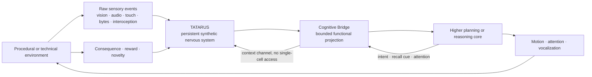

The simulator contains sensory, excitatory, inhibitory, contextual, motor,
and modulatory populations. Raw channels project into overlapping
excitatory microassemblies. Recurrent dynamics transform these events, while
motor populations produce continuous action values.

The Cognitive Bridge is an architectural boundary. It exposes active
representations, pooled recall channels, novelty, salience, energy and
activity needs, prediction error, and confidence. The planner may return an
attention target, motor intent, recall cue, and reward.

The layers are functionally coupled but remain separately testable.
Controls can remove the nervous system, eligibility, or higher planner
without changing the rest of the experimental arrangement.

<div align="right"><sub>Page 7 of 30</sub></div>
<div style="page-break-after: always;"></div>

<!-- PAGE 08/30 -->

## Biological Inspiration and Deliberate Abstraction

| Biological organizational principle | TATARUS abstraction |
|---|---|
| excitatory and inhibitory cells | Dale-compliant populations and weight signs |
| membrane and dendritic dynamics | soma plus passive dendritic compartment |
| fast and slow receptors | AMPA, NMDA, GABA-A, GABA-B |
| axonal propagation time | individual integer event delay |
| short-term release dynamics | resource, facilitation, release probability |
| local temporal plasticity | signed eligibility per active synapse |
| neuromodulation | dopamine-/acetylcholine-like regulatory states |
| activity stability | target-rate homeostasis and threshold drift |
| memory consolidation | reward-bound weight and consolidation states |
| cell assemblies | competitive temporal assembly prototypes |
| remodeling and repair | pruning, growth, and parent provenance |

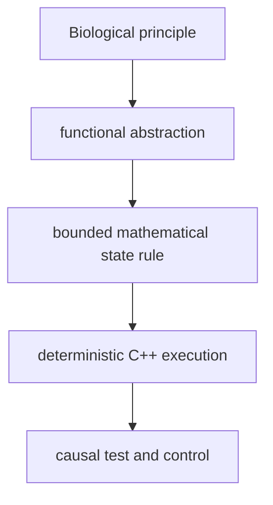

TATARUS deliberately omits complete molecular biology, gene expression,
biologically detailed glia, three-dimensional brain anatomy, real
development, consciousness, and biological identity.

It therefore does not reproduce the material implementation of a nervous
system. It abstracts selected functional principles until they become
executable, disableable, measurable, and testable against controls.

<div align="right"><sub>Page 8 of 30</sub></div>
<div style="page-break-after: always;"></div>

<!-- PAGE 09/30 -->

## Formal System Model

The full state evolves discretely with \(\Delta t=1\,\mathrm{ms}\):

$$
\boxed{
\mathcal S_{t+1}
=
F(\mathcal S_t,X_t,C_t,R_t;\Theta,K,\xi)
}
$$

where \(X_t\) denotes raw sensory events, \(C_t\) Cognitive Bridge commands,
\(R_t\) consequence signals, \(\Theta\) model parameters, \(K\) the
generated operator, and \(\xi\) the seeded random state. The state can be
decomposed as:

$$
\mathcal S_t=
\left(
V_t,D_t,G_t,W_t,E_t,U_t,H_t,A_t,Q_t,P_t,\Xi_t
\right).
$$

| Symbol | Content |
|---|---|
| \(V_t\) | soma potentials, adaptation, refractory state |
| \(D_t\) | dendritic potentials |
| \(G_t\) | receptor conductances |
| \(W_t\) | active/consolidated weights and topology |
| \(E_t\) | local eligibility traces |
| \(U_t\) | resources, facilitation, and usage |
| \(H_t\) | activity homeostasis and neuromodulation |
| \(A_t\) | assemblies and stimulus-phase accumulators |
| \(Q_t\) | neuronal energy |
| \(P_t\) | axonal queues and delays |
| \(\Xi_t\) | RNG, bridge, and optional planner state |

A V9 snapshot serializes the components required for exact continuation.
Reproduction requires identical state hashes and subsequent actions, not
merely similar summary metrics.

<div align="right"><sub>Page 9 of 30</sub></div>
<div style="page-break-after: always;"></div>

<!-- PAGE 10/30 -->

## Neuron, Dendrite, and Receptor Currents

TATARUS uses a controllable integrate-and-fire core. In simplified form:

$$
\tau_D\frac{dD_i}{dt}
=
(V_\mathrm{rest}-D_i)+I_i^\mathrm{syn},
$$

$$
\tau_V\frac{dV_i}{dt}
=
(V_\mathrm{rest}-V_i)
\kappa(D_i-V_i)
I_i^\mathrm{base}
I_i^\mathrm{ext}.
$$

Synaptic action is conductance-based:

$$
I_i^\mathrm{syn}
=
\sum_{r\in\{\mathrm{AMPA,NMDA,GABA_A,GABA_B}\}}
g_{i,r}(E_r-D_i).
$$

Default persistent-core constants include
\(\tau_V=20\,\mathrm{ms}\), \(\tau_D=35\,\mathrm{ms}\),
\(\tau_\mathrm{AMPA}=5\,\mathrm{ms}\),
\(\tau_\mathrm{NMDA}=80\,\mathrm{ms}\),
\(\tau_{\mathrm{GABA_A}}=10\,\mathrm{ms}\), and
\(\tau_{\mathrm{GABA_B}}=120\,\mathrm{ms}\).

A spike occurs when

$$
V_i\ge \theta_i+\theta_i^\mathrm{adapt}+\theta_i^\mathrm{homeo}.
$$

It is followed by reset, refractory time, and adaptive threshold increase.
Energy further limits excitability and transmission. The model is not
intended to imitate one biological cell type; it provides a transparent
carrier dynamic for local mechanisms.

<div align="right"><sub>Page 10 of 30</sub></div>
<div style="page-break-after: always;"></div>

<!-- PAGE 11/30 -->

## Event-Causal Synaptic Transmission

A spike is an event with source, emission time, amplitude, and event-bound
gate. After the individual delay \(d_{ij}\), it acts on the target edge:

$$
\Delta g_{ij,r}(t+d_{ij})
=
w_{ij}\,A_j\,
u_{ij}(t)\,R_{ij}(t)\,
g_K(\phi_j)\,
m_E(e_{ij}).
$$

Here \(uR\) is short-term release, \(g_K\) is the generated operator factor,
and \(m_E\) is eligibility modulation. Every factor is bounded; non-finite
state causes a test failure.

The generated operator is inserted as:

$$
g_K(\phi)=
\operatorname{clip}
\left(
\frac{1+\tanh(K(\phi))}{2},
0.05,0.95
\right).
$$

In the historical `RESET_LOCKED` wrapper, its effective value was the
constant \(0.1283111213\). Genuine event variance appeared only after
emission-state and E/I projection variants were introduced.

A dynamic formula is not automatically a useful dynamic mechanism.
Timing, feature projection, and placement determine the effective
phenotype. TATARUS therefore compares the original kernel with an
event-matched constant, sign gate, Tanh, distribution-matched random gate,
time shift, and state shuffle.

<div align="right"><sub>Page 11 of 30</sub></div>
<div style="page-break-after: always;"></div>

<!-- PAGE 12/30 -->

## Signed Local Eligibility-Transfer Memory

Every active synapse \(j\rightarrow i\) owns a local trace:

$$
e_{ij}(t+\Delta t)=
\operatorname{clip}
\left[
e_{ij}(t)e^{-\Delta t/\tau_e}
\chi_t
\left(
s_i(t)\,\bar s_j(t)-s_j(t)\,\bar s_i(t)
\right),
-e_{\max},e_{\max}
\right].
$$

\(\bar s\) denotes local spike traces. \(\chi_t\) gates writing to external
stimulus, recall, novelty, or reward; during genuine idle time the trace only
decays. Later transmission is locally modulated:

$$
m_E(e_{ij})=
\operatorname{clip}
\left(1+\gamma_e\tanh(e_{ij}),m_{\min},m_{\max}\right).
$$

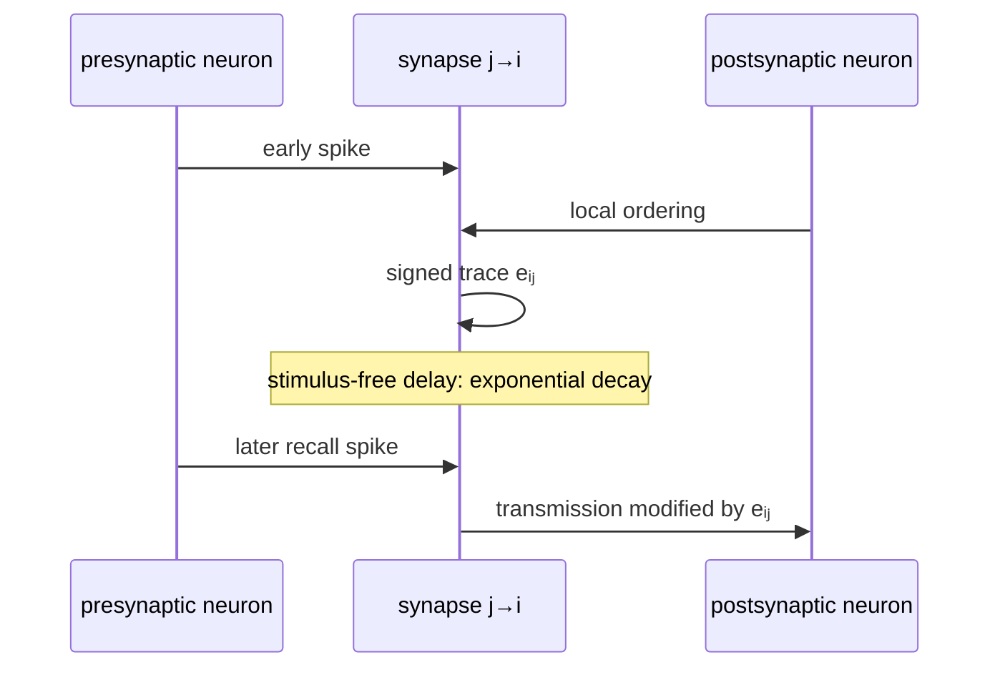

Locality is an invariant: absent edges have no trace, and a synapse shuffle
breaks the assignment control. `Gain=0` must reproduce the historical
dynamics exactly.

<div align="right"><sub>Page 12 of 30</sub></div>
<div style="page-break-after: always;"></div>

<!-- PAGE 13/30 -->

## Short-Term Plasticity, Consolidation, and Forgetting

The synaptic resource continuously recovers:

$$
R_{ij}\leftarrow
R_{ij}+(1-R_{ij})\frac{\Delta t}{\tau_\mathrm{rec}},
\qquad
\mathrm{release}_{ij}=u_{ij}R_{ij}.
$$

Transmission consumes resource and changes facilitation. This fast layer
acts over milliseconds to seconds. Local eligibility forms an intermediate
timescale. Reward-bound consolidation transfers transient changes into more
stable weights:

$$
\Delta w_{ij}
=
\eta\,M_t\,e_{ij},
\qquad
\Delta \bar w_{ij}
=
\eta_c |M_t e_{ij}|(w_{ij}-\bar w_{ij}),
$$

where \(M_t\) denotes a bounded neuromodulatory state. Dale signs and weight
bounds remain invariant.

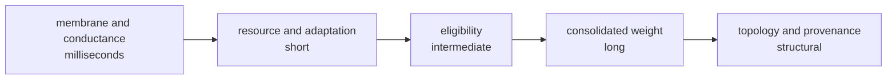

Controlled forgetting is bounded decay without renewed writing, not
commanded deletion. Interference protection is measured by whether a partial
old cue still reactivates an appropriate state after a new experience.

<div align="right"><sub>Page 13 of 30</sub></div>
<div style="page-break-after: always;"></div>

<!-- PAGE 14/30 -->

## Homeostasis, Energy, and Stability

A continuous system must neither become permanently silent nor diverge
without bound. TATARUS combines three levels of constraint.

Filtered rate \(r_i\) shifts the effective threshold:

$$
\theta_i^\mathrm{homeo}(t+\Delta t)
=
\operatorname{clip}
\left[
\theta_i^\mathrm{homeo}(t)
+\eta_h(r_i-r_i^\star)\Delta t,
-12,12
\right].
$$

Energy recovers and pays spike and transmission costs:

$$
q_i(t+\Delta t)=
\operatorname{clip}
\left[
q_i(t)+\rho_q\Delta t
-c_s s_i(t)
-c_\mathrm{tx}n_i^\mathrm{tx}(t),
0,1
\right].
$$

Weight bounds, Dale compliance, and finite values form hard invariants.
This regulation is not claimed to be biological metabolism; it is a
functional resource constraint.

Metrics include mean rate, target-rate deviation, energy, spike count,
transmissions, structural growth, pruning, and finiteness. The stage-16 end
run recorded 7,500 continuous steps, 7,439 spikes, 49,514 transmissions,
7.997799 Hz mean rate against an 8.121509 Hz target, and 0.991972 mean
energy.

<div align="right"><sub>Page 14 of 30</sub></div>
<div style="page-break-after: always;"></div>

<!-- PAGE 15/30 -->

## Raw Channels and Competitive Assembly Formation

TATARUS has no mandatory tokenizer, vocabulary, or embedding table. Visual
events, audio samples, touch, UTF-8 bytes, temperature, and interoception are
projected topographically into overlapping microassemblies.

A stimulus pattern is captured as an evoked state relative to a slow
baseline:

$$
\mathbf r^\mathrm{evoked}
=
\mathbf r^\mathrm{fast}
-\mathbf r^\mathrm{slow},
$$

augmented with signed dendritic deviation. For prototype \(\mathbf p_k\):

$$
k^\star=\arg\max_k
\frac{\mathbf p_k^\top\mathbf r}
{\|\mathbf p_k\|\,\|\mathbf r\|+\varepsilon}.
$$

If the best similarity is below threshold, a new assembly is created;
otherwise only the winner is updated incrementally. Representations
therefore compete instead of collapsing into one global average.

“Tokenizer-free” means only that the input needs no predefined token IDs. It
does not mean that TATARUS understands language. An internal unit is a
distributed temporal nervous state whose meaning can emerge only through
repeated transitions, consequences, and readout.

<div align="right"><sub>Page 15 of 30</sub></div>
<div style="page-break-after: always;"></div>

<!-- PAGE 16/30 -->

## The Bounded Cognitive Bridge

The higher core does not operate directly on the complete nervous state. A
bounded projection produces:

$$
\mathbf c_t=B(\mathcal S_t)
=
\left[
\text{assemblies},
\text{recall pools},
\text{novelty},
\text{salience},
\text{needs},
\text{error},
\text{confidence}
\right].
$$

The bridge pools 64 neuronal and 64 recall-bound synaptic groups. Individual
membranes, edges, weights, and eligibility values are not exposed. Formally,
the projection is lossy:

$$
B^{-1}(\mathbf c_t)\neq \mathcal S_t.
$$

The planner may return only a bounded command:

$$
\mathbf u_t=
(\text{attention},\text{motor intent},\text{recall cue},\text{reward}).
$$

This command maps onto contextual and regulatory channels and never
addresses an individual synapse.

TATARUS is therefore neither an unrestricted plugin inside the planner nor a
passive data store. The bridge creates a testable responsibility boundary:
the nervous system carries local dynamics, while the higher core processes
pooled functions. Either side can be replaced or removed in ablations.

<div align="right"><sub>Page 16 of 30</sub></div>
<div style="page-break-after: always;"></div>

<!-- PAGE 17/30 -->

## Continuous Lifecycle and Causal Snapshots

All experiences for one lifecycle seed execute in the same system state.
This prevents episode resets from silently implementing the memory that is
under test.

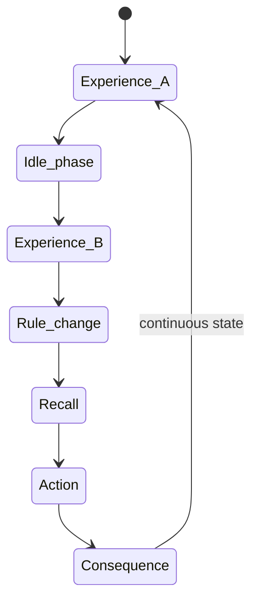

A composite snapshot contains:

- the complete V9 nervous-system state,
- RNG and axonal event queues,
- assemblies and stimulus-phase accumulators,
- bridge state and reward prediction,
- higher-planner parameters.

Exact continuation is tested more strongly than by similar averages:

$$
\operatorname{Hash}(\mathcal S_{t+n}^{\mathrm{direct}})
=
\operatorname{Hash}(\mathcal S_{t+n}^{\mathrm{restored}})
$$

and action, recall, and state sequences must match. A snapshot is therefore
a causal continuation point, not merely an export of an approximate model
configuration.

<div align="right"><sub>Page 17 of 30</sub></div>
<div style="page-break-after: always;"></div>

<!-- PAGE 18/30 -->

## Experimental Design and Required Controls

TATARUS separates development, freezing, and confirmation. Mechanisms and
parameters are selected on development seeds; decision criteria are fixed
before the holdout run. New seeds cannot subsequently be reused for
mechanism selection.

Transmission operators are evaluated against at least these controls:

| Control | Explanation isolated |
|---|---|
| disabled | is a gate required at all? |
| event-matched constant | is the effective mean sufficient? |
| sign | is polarity sufficient? |
| Tanh | is a standard nonlinearity sufficient? |
| distribution-matched random | is the distribution sufficient? |
| time-shifted | is timing causally relevant? |
| state/synapse-shuffled | is the assignment relevant? |
| Gain \(=0\) | is the neutral fallback exact? |

Memory and repair assays add no-trace, no-nervous-system, static-reflex,
damage, and provenance controls. Results are reported per seed; a positive
mean alone does not replace individual pass criteria.

Negative findings are retained. These include the bit-exact equivalence of
the historical reset kernel to the correct constant control, the negative
Delayed-XOR efficiency replication, and the pending external hardware
replication.

### Mechanism and Source-Code Matrix

| Mechanism | Purpose, state, and execution position | Invariant/control | Evidence and limit | Source |
|---|---|---|---|---|
| Generated Polarity and Release Operator | modulates presynaptic release from event feature \(\phi\) | clipping; constant, sign, Tanh, random | dynamic implementation; not universally superior | `bio_core.cpp`, `nervous_system.cpp` |
| Signed Local Eligibility-Transfer Memory | stores pre/post order per active edge; acts on later transfer | locality; Gain 0, shuffle, shift | trace-essential task advantage; domain-specific | `nervous_system.cpp` |
| Evoked-State Baseline Separation | separates evoked response from slow baseline | signed state; no-baseline comparison | stable synthetic representations | `nervous_system.cpp` |
| Competitive Stimulus-Phase Assembly Formation | updates winner or creates prototype after stimulus phase | count and similarity bounds | 8/8 holdout seeds | `nervous_system.cpp` |
| Tokenizer-Free Topographic Raw Projection | maps raw channel to overlapping microassembly | fixed seeded topography | raw transitions, not language understanding | `nervous_system.cpp` |
| Reward-Bound Local Consolidation | transfers modulated eligibility into weight and consolidation state | bounds and Dale sign | stage-21 memory | `nervous_system.cpp` |
| Controlled Trace Decay and Interference Protection | decays in genuine idle time and protects old cue | writing only on salient event | 8/8 memory seeds | `nervous_system.cpp` |
| Provenance-Guided Axonal Path Reconstruction | replaces used destroyed path with parent ID | active endpoints; frozen retest | 8/8 defined repairs | `nervous_system.cpp`, `representation_research.cpp` |
| Bounded Cognitive-State Bridge | pools function and restricts top-down access | no single-cell or weight access | 8/8 lifecycle seeds | `cognitive_bridge.cpp`, `persistent_ai_trial.cpp` |
| Composite Causal Snapshot Continuation | serializes nervous system, bridge, RNG, and planner | hash and replay identity | locally exact; platform replication open | `nervous_system.cpp`, `cognitive_bridge.cpp` |

<div align="right"><sub>Page 18 of 30</sub></div>
<div style="page-break-after: always;"></div>

<!-- PAGE 19/30 -->

## Evidence I — Representations and Raw Sequence Structure

The stage-18 confirmation used frozen criteria and new seeds. Stable
competitive representations passed in 8/8 networks. A mean of 6.125
assemblies formed. Similar stimuli reactivated their state with cosine
similarity 0.907323; after 10% neuronal and 15% synaptic damage, similarity
remained 0.852185.

For raw sequences, UTF-8 bytes were injected as bit events without a token,
word, or embedding table. A linear readout fitted only on training epochs
distinguished six transition classes in untouched epochs with 77.3438% mean
accuracy. Boundary response was 2.884757 times stronger than ordinary
transition response.

These findings support two bounded statements:

1. Assembly dynamics form distinguishable, reactivatable states within the
   synthetic stimulus family.
2. Raw bytes can be transformed into informative temporal transition
   structure without predefined token IDs.

They do not establish natural-language understanding or universal
self-discovered symbols. Semantic binding, cross-modal transfer, and
long-term stability in open streams remain research questions.

<div align="right"><sub>Page 19 of 30</sub></div>
<div style="page-break-after: always;"></div>

<!-- PAGE 20/30 -->

## Evidence II — Trace-Essential Internal Memory

Two early energy-matched cues carry XOR information. They are followed by
400 fully stimulus-free steps and the same neutral recall cue for both
classes. The linear readout sees only spike changes and final membrane states
from the last recall window; cue features, eligibility values, and product
features are hidden.

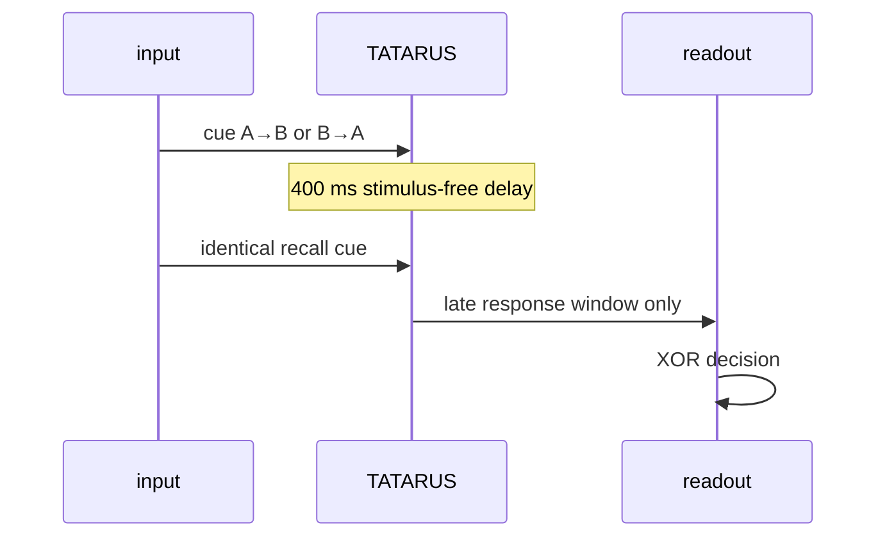

With frozen parameters \(\tau_e=800\,\mathrm{ms}\), Gain \(=10\), and
increment \(=20\), twelve holdout networks reached 1.000000 accuracy.
Without eligibility, accuracy was 0.486111.

The test is causally narrower than a readout with an explicit cue buffer:
relevant information must survive inside the nervous-system state during the
idle phase and alter the later recall response. This mechanism is confirmed
for the defined XOR task, not for arbitrarily long episodic memory.

<div align="right"><sub>Page 20 of 30</sub></div>
<div style="page-break-after: always;"></div>

<!-- PAGE 21/30 -->

## Evidence III — Coupled AI Under an Identical Present

Stage 19 tests the central design hypothesis in one continuous 64-experience
lifecycle. History contains \(A\rightarrow B\) or \(B\rightarrow A\); after
an idle phase the current recall stimulus is identical for both classes. An
unknown raw-byte grammar is inserted between learning and testing.

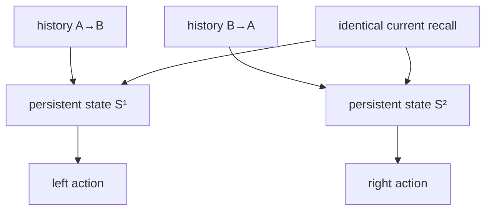

| Variant | mean accuracy |
|---|---:|
| planner + TATARUS + local eligibility | 1.000000 |
| identical coupling without eligibility | 0.515625 |
| higher core without nervous system | 0.500000 |

All 8/8 new seeds passed the predefined criteria. Action diversity was 1.0,
and composite snapshot replays were exact.

The experiment confirms behaviorally effective coupling in this partially
observable task. It does not establish a universal advantage over all memory
architectures or general grammar competence.

<div align="right"><sub>Page 21 of 30</sub></div>
<div style="page-break-after: always;"></div>

<!-- PAGE 22/30 -->

## Evidence IV — Procedural Lifeworld and G5

The stage-20 world contains freely sampled object locations, energy need,
hazards, multiple competing goals, delayed consequences, and unannounced
rule changes. Decisions occur before reward; the higher core sees only the
Cognitive Bridge.

Across eight new seeds:

| Variant | mean reward |
|---|---:|
| coupled TATARUS system | 310.157089 |
| same architecture without eligibility | 294.101531 |
| static reflex | 119.488903 |
| frozen G5 structure | 363.183060 |

Six of eight seeds passed every stage-20 individual criterion. The aggregate
status is `confirmed_on_procedural_holdouts`.

“Open lifeworld” here means a procedurally generated, partially observable
synthetic world family. Situations arise freely within defined generator
rules; the world is neither physical nor unboundedly open. G5 tests transfer
to a frozen new event structure within the same world family. It does not
demonstrate universal grammar generalization or robust real-world robotics.

<div align="right"><sub>Page 22 of 30</sub></div>
<div style="page-break-after: always;"></div>

<!-- PAGE 23/30 -->

## Evidence V — Multiscale Memory

Stage 21 separates four memory functions instead of combining them into a
single accuracy score:

| Function | aggregate value | Control/criterion |
|---|---:|---|
| episodic one-shot trace | 0.281266 | no trace: 0 |
| consolidation change | 87.922375 | reward-bound weight change |
| controlled forgetting | 99.9955% | stimulus-free decay phase |
| retention after interference | 0.999981 | partial old cue |

All 8/8 new seeds passed the frozen criteria. Eligibility is written only
during external stimulus, recall, novelty, or reward. Spontaneous recurrent
activity cannot disguise a genuine idle phase as a new experience.

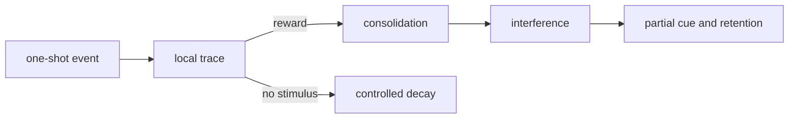

The results establish separate time and state mechanisms in the synthetic
assays. They do not yet establish autobiographical memory, unlimited
consolidation, or lifelong learning.

<div align="right"><sub>Page 23 of 30</sub></div>
<div style="page-break-after: always;"></div>

<!-- PAGE 24/30 -->

## Damage and Provenance-Guided Repair

The repair assay begins with a measurable sensor-motor function. Exactly six
used direct pathways and 10% of internal neurons are then disabled. The
function falls to zero in all eight holdout networks.

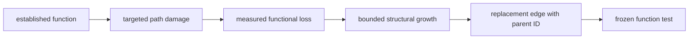

New edges may arise only from previously used, consolidated, and now
inactive paths:

$$
w_{\mathrm{new}}=\bar w_{\mathrm{parent}},
\qquad
d_{\mathrm{new}}=\max(1,d_{\mathrm{parent}}-1).
$$

In 8/8 networks, six replacement synapses carried parent provenance. After
freezing growth and homeostatic drift, the system recovered a mean 111.3726%
of the original functional magnitude with the same sign.

This confirms a defined form of causal path reconstruction. It does not
establish general self-healing, arbitrary functional repair, or biological
regeneration.

<div align="right"><sub>Page 24 of 30</sub></div>
<div style="page-break-after: always;"></div>

<!-- PAGE 25/30 -->

## Scaling and Technical Feasibility

For \(N>2048\), a direct sparse sampler replaces the quadratic scan of all
cell pairs. A seeded expected out-degree is generated with unique targets.
Initialization therefore approaches \(O(Nk)\) rather than \(O(N^2)\).

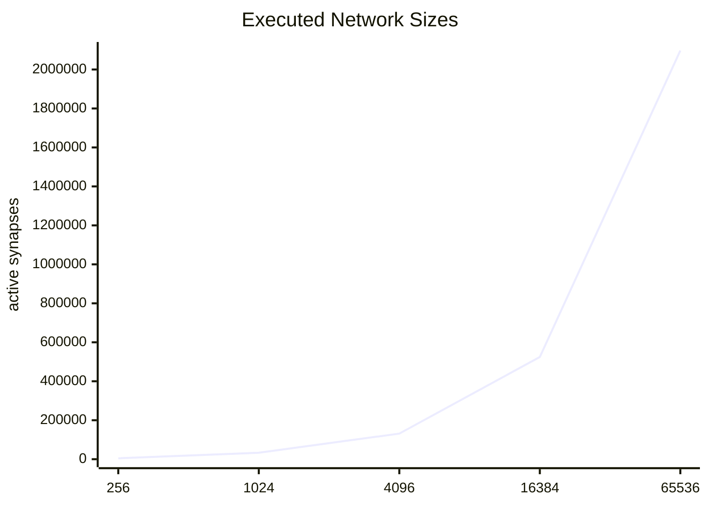

The full release run used 65,536 neurons, 2,097,328 active synapses, and 40
steps. On the local 12-thread CPU, simulation required 2,329.1649 ms. The
snapshot occupied 212,426,348 bytes and restored to the exact hash.
Finiteness, energy bounds, and Dale compliance remained intact.

This result confirms executability and structural integrity. The real-time
factor at this scale was 0.017174; real-time operation is explicitly not
confirmed. Only one tested integration step has CPU/OpenCL differential
clearance. Complex plasticity and repair paths remain CPU-authoritative.

<div align="right"><sub>Page 25 of 30</sub></div>
<div style="page-break-after: always;"></div>

<!-- PAGE 26/30 -->

## Runenkrieg as Android Game and Scientific Laboratory

Synthetic stages 1–23 test isolated mechanisms. Runenkrieg adds a different
class of evidence: a continuous, partially observable action loop with a
card hand, weather, resources, changing opponent actions, delayed
consequences, and locally continued state. The game is therefore both an
application and a laboratory.

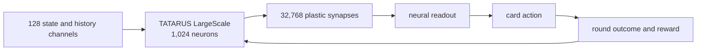

The first mobile integration contained 72 neurons, 432 synapses, and 32
wired channels. In 37 genuinely played rounds it achieved a 48% round win
rate. This demonstrated functional coupling and a balanced game, but neither
reliable learning nor superiority. That state was retained as a research
reference.

The separate LargeScale branch increased population, connectivity, and
sensory bandwidth to 1,024, 32,768, and 128. Channels encode only information
available to the comparison systems: current game state, legal action
candidates, and defined history signals. In neural mode, actions are selected
from nervous state and learned readout without rule-table or experience-table
mixing. Weights, traces, activity, and readout persist locally on the device.

Runenkrieg does not test whether TATARUS thinks like a human. It tests whether
a synthetic nervous system can learn, retain, and reproduce an interactive
policy under mobile resource constraints.

<div align="right"><sub>Page 26 of 30</sub></div>
<div style="page-break-after: always;"></div>

<!-- PAGE 27/30 -->

## Failures, Falsifications, and Research Redirections

Development was not a sequence of positive results. Several findings
narrowed the supported hypothesis and directly determined the next design:

1. **RESET_LOCKED was constant.** The operator initially interpreted as
   dynamic produced exactly (g=0.1283111212878475) after spike reset. An
   event-matched constant reproduced the phenotype, so operator geometry was
   not causally established. The state was retained as
   `RESET_LOCKED_REFERENCE`; research moved to an Event-Causal Gate computed
   at spike emission.
2. **Delayed XOR did not yet prove internal memory.** Early variants either
   failed across training seeds or could solve the task through explicit
   readout memory and cue features. Longer filtered state and interaction
   products improved performance without establishing a synapse-local
   substrate. Stage 15 therefore removed cue features from the readout,
   imposed a silent delay, and used a class-identical recall cue.
3. **Eligibility effect was not eligibility necessity.** Modulating transfer
   and permitting neutral deactivation was insufficient. The trace-essential
   assay added gain-zero, constant, absolute-value, time-shift, synapse-swap,
   sign-inversion, matched-random, E→E-only, and I→E-only controls to isolate
   correct synapse, timing, and direction.
4. **No universal kernel superiority.** The Delayed-XOR efficiency
   replication was negative and the sign gate was sometimes sparser. The
   program shifted from a privileged-formula claim to a testable ecology of
   timing, projection, insertion site, and local mechanisms.
5. **The open lifeworld was only partially successful.** Stage 20 passed six
   of eight individual criteria. Multiscale memory later passed 8/8, but an
   open world with freely emerging goals remains unconfirmed.
6. **The first AI comparison was asymmetric.** Conventional models received
   full 10,000-round selection while the mobile TATARUS app initially used an
   online state not selected by the same procedure. That result was rejected
   as a fair comparison. TATARUS then underwent the same multiseed checkpoint,
   selection, and freezing process.

Infrastructure failures were also preserved. A run paused safely at 16/30
when an RMX3472 replaced the registered RMX3853, preventing mixed-device
latency data. Android Asset Packaging renamed the first `.json.gz` winner
asset and caused a reproducible import failure. A neutral `.snapshot` asset,
clean build, hash check, topology check, and import test corrected it.

<div align="right"><sub>Page 27 of 30</sub></div>
<div style="page-break-after: always;"></div>

<!-- PAGE 28/30 -->

## Complete Comparative Trial Through 10,000 Rounds

Every model family received the same 128-dimensional information space,
action space, reward, and checkpoints. Learning curves were evaluated after
250, 500, 1,000, 2,000, 5,000, and 10,000 environmental rounds. Five
development seeds were run per checkpoint; winner selection and final
replication used separate seeds. Holdout game win rate was the primary
metric. Token balance, round win rate, decision time, and state integrity
were secondary metrics.

| Model | 250 | 500 | 1,000 | 2,000 | 5,000 | 10,000 |
|---|---:|---:|---:|---:|---:|---:|
| TATARUS LargeScale | 65% | 64% | 76% | 70% | 76% | **81%** |
| Contextual Bandit | 60% | 58% | 57% | 59% | 59% | **65%** |
| DQN | 74% | 60% | 66% | 69% | 52% | **62%** |
| PPO | 63% | 56% | 55% | 62% | 57% | **59%** |
| GRU | 52% | 68% | 67% | 60% | 55% | **56%** |
| MLP | 62% | 64% | 63% | 57% | 55% | **55%** |

The table reports means from the complete five-seed learning curves, not the
subsequently selected individual winner. TATARUS completed all 30 planned
runs. At 10,000 rounds its 95% Wilson interval was 75–86%, mean token balance
was (+6.45), and recorded mean decision time was 148.18 ms.

Selection was frozen within each architecture group:

$$
m^*=\arg\max_m\;\mathrm{SelectionHoldout}(m).
$$

Learning was then disabled and only the exported artifact ran on untouched
seeds. TATARUS seed 20260732 at the 10,000-round checkpoint won its selection;
the contextual bandit with seed 20260731 won the conventional group. DQN was
strong early but degraded later; GRU and MLP were also non-monotonic. The
protocol therefore did not silently replace the final checkpoint with the
best intermediate value.

Numeric seed labels define the same experimental ranges in Kotlin and Python,
but different random-number generators do not produce bit-identical episodes.
The comparison is distribution-symmetric, not strictly paired.

<div align="right"><sub>Page 28 of 30</sub></div>
<div style="page-break-after: always;"></div>

<!-- PAGE 29/30 -->

## Frozen Winners and Independent-Seed Run

The TATARUS candidate won selection on 20 separate holdout seeds with 18/20
games (90%), a (+7.75) token balance, and a 63.073% round win rate. Its
export has SHA-256
`98c5671ebfcf64734d4d791e324543a727549b6c2a6aad53db78f445e4f71668`.
A separate Android app loads this state from scratch at every process start,
locks training, reset, and mode changes, and verifies hash and topology.

On previously untouched seeds 60000–60049:

| Frozen winner | Wins | Losses | Rate | Token balance | Round win rate |
|---|---:|---:|---:|---:|---:|
| TATARUS LargeScale | 35 | 15 | **70%** | +6.50 | 60.633% |
| Contextual Bandit | 30 | 20 | **60%** | +2.52 | 53.262% |

TATARUS state remained unchanged during replication and learning was
disabled. This is a genuine frozen-winner test, not continued online
training. The observed difference is

$$
\Delta\hat p=0.70-0.60=0.10.
$$

Statistical interpretation prevents overclaiming:

- TATARUS Wilson 95% CI: 56.25–80.90%,
- contextual-bandit Wilson 95% CI: 46.18–72.39%,
- Newcombe 95% CI for the difference: −8.51 to +27.60 percentage points,
- two-sided Fisher exact test: (p=0.4019).

The result is therefore a **numerical advantage reproduced on untouched
seeds**, not statistically confirmed superiority. More replication seeds and
preferably bit-identical paired episodes are needed for a narrower difference
interval.

Efficiency comparisons remain separate. TATARUS was measured in an
Android/Kotlin path at approximately 144 ms per decision and the bandit in a
Python path at approximately 0.01 ms. These are real implementation times,
but differing hardware, runtime, instrumentation, and state richness prevent
an isolated architecture-speed claim. Export sizes of 1,564,970 bytes versus
1,504 bytes are likewise not semantically equivalent.

<div align="right"><sub>Page 29 of 30</sub></div>
<div style="page-break-after: always;"></div>

<!-- PAGE 30/30 -->

## Conclusion, Limitations, Open Science, and References

TATARUS demonstrates that an artificial agent can use a persistent,
multiscale, behaviorally effective nervous state as its own computational
substrate and learn a policy in a mobile interactive environment. The
published state connects neurodynamic variables, local synaptic memory,
regulation, assembly formation, bounded planning coupling, closed-loop
interaction, and structural repair. In the symmetric Runenkrieg benchmark,
the frozen winner reached 70% on untouched seeds versus 60% for the best
conventional winner.

The correct claim boundary nevertheless remains:

> TATARUS is an experimental persistent synthetic nervous system for AI. It
> showed learning- and action-relevant state in the documented synthetic
> tasks and the Runenkrieg laboratory, plus a numerical comparative advantage
> that is not yet statistically significant.

Consciousness, biological equivalence, general intelligence, universal
kernel or system superiority, real-time operation of the 65,536-neuron
configuration, and second-hardware replication are not established. The
next decisive trial requires preregistered bit-identical paired episodes,
more replication seeds, common hardware/runtime instrumentation, and tests
after rule changes and retention intervals.

Source code, raw metrics, learning curves, selection reports, negative
results, frozen exports, and Android integrations are published under Apache
2.0. Large reproducible binary snapshots remain outside Git due to size.
Replication deviations should be retained as results rather than hidden by
post hoc parameter selection.

### Primary TATARUS Artifacts

- [Project overview](README.md)
- [UI documentation](UI_DOKUMENTATION.md)
- [Persistent core](research/ag_signal_morpher_1ee27305a6aa/16_persistent_nervous_system/README.md)
- [Stages 17/18](research/ag_signal_morpher_1ee27305a6aa/17_autonomous_representation/README.md)
- [Cognitive Bridge](research/ag_signal_morpher_1ee27305a6aa/19_persistent_ai_bridge/README.md)
- [Stages 20–23](research/ag_signal_morpher_1ee27305a6aa/20_23_validation/README.md)
- [Runenkrieg comparative report](RUNENKRIEG_VERGLEICHSBERICHT.md)
- [TATARUS 10k statistics](Runenkrieg_Tatarus_10k_Benchmark/results_full/STATISTICAL_REPORT.md)
- [Conventional 10k statistics](Runenkrieg_TensorFlow_Benchmark/results_full/STATISTICAL_REPORT.md)

### Scientific Context

1. Gerstner, Kistler, Naud, Paninski:
   [*Neuronal Dynamics*](https://neuronaldynamics.epfl.ch/online/).
   Cambridge University Press, 2014.
2. Dayan, Abbott:
   [*Theoretical Neuroscience*](https://mitpress.mit.edu/9780262041997/theoretical-neuroscience/).
   MIT Press, 2001.
3. Maass, Natschläger, Markram:
   [“Real-Time Computing Without Stable States: A New Framework for Neural
   Computation Based on Perturbations”](https://doi.org/10.1162/089976602760407955).
   *Neural Computation* 14(11), 2002.
4. Bi, Poo:
   [“Synaptic Modifications in Cultured Hippocampal Neurons: Dependence on
   Spike Timing, Synaptic Strength, and Postsynaptic Cell
   Type”](https://pubmed.ncbi.nlm.nih.gov/9852584/).
   *J. Neurosci.* 18(24), 1998.
5. Frémaux, Gerstner:
   [“Neuromodulated Spike-Timing-Dependent Plasticity, and Theory of
   Three-Factor Learning Rules”](https://doi.org/10.3389/fncir.2015.00085).
   *Front. Neural Circuits* 9, 2016.

<div align="right"><sub>Page 30 of 30</sub></div>
