# TATARUS

## A Persistent Synthetic Nervous System for Artificial Intelligence

### Ein mathematisch definiertes, biologisch inspiriertes Substrat für kontinuierliche Wahrnehmung, lokales Gedächtnis, adaptive Handlung und strukturelle Selbstreparatur

**Whitepaper · Deutsche Ausgabe · Version 1.2**<br>
**Softwarestand:** TATARUS 1.4.0 · Runenkrieg-Vergleichsstudie 10k<br>
**Entwickler und Autor:** Ralf Krümmel<br>
**Datum:** 31. Juli 2026<br>
**Lizenz:** Apache License 2.0<br>
**Repository:** <https://github.com/kruemmel-python/TATARUS>

> **TATARUS versucht nicht, ein biologisches Nervensystem materiell zu
> kopieren. Es überträgt ausgewählte funktionale Prinzipien biologischer
> Nervensysteme in ein künstliches mathematisches Substrat, damit eine KI
> nicht nur ein Modell ausführt, sondern einen eigenen fortlaufenden,
> lernenden und handlungswirksamen Innenzustand besitzt.**

Dieses Whitepaper beschreibt Architektur, Mathematik, Implementierung,
experimentelle Evidenz und Grenzen des veröffentlichten Systems. Sämtliche
Leistungsangaben beziehen sich auf die dokumentierten synthetischen
Versuchsdomänen.

<div align="right"><sub>Seite 1 von 30</sub></div>
<div style="page-break-after: always;"></div>

<!-- PAGE 02/30 -->

## Publikations- und Anspruchsrahmen

TATARUS ist **keine biologische 1:1-Simulation** eines menschlichen oder
tierischen Nervensystems. Es bildet keine vollständige Anatomie,
Molekularbiologie, Genexpression oder Neurochemie nach. Das Projekt erhebt
keinen Anspruch auf Bewusstsein, Empfindungsfähigkeit, biologische Identität
oder allgemeine Intelligenz.

TATARUS ist zugleich **mehr als eine biologische Metapher**. Neuronen,
Synapsen, Rezeptoren, Dendriten, Eligibility-Spuren, Energie, Homeostase,
Assemblies und Topologie sind numerische Zustände mit expliziten
Übergangsregeln. Sie verändern die weitere Systemdynamik kausal und werden in
Snapshots fortgesetzt.

> **Definition.** Ein synthetisches Nervensystem ist ein dauerhaft
> fortgesetztes mathematisch-algorithmisches System, dessen interne
> neuronale, synaptische, regulatorische und strukturelle Zustände durch
> Erfahrung verändert werden und dadurch zukünftige Wahrnehmung, Erinnerung,
> Planung und Handlung beeinflussen.

Die Software ist unter Apache 2.0 offen veröffentlicht. Die Whitepaper-Aussagen
werden in drei Evidenzklassen getrennt:

| Kennzeichnung | Bedeutung |
|---|---|
| **implementiert** | im veröffentlichten Quellcode ausführbar |
| **bestätigt** | eingefrorenes Kriterium auf getrennten synthetischen Seeds erfüllt |
| **offen** | Hypothese, Transferfrage oder externe Replikation ausstehend |

„Bestätigt“ bedeutet in diesem Dokument niemals biologische Validierung. Eine
formale Neuheits-, Patent- oder vollständige Literaturprüfung ist ebenfalls
nicht Gegenstand dieses Whitepapers.

### Inhalt

1. Positionierung und Forschungsziel — Seiten 3–6<br>
2. Architektur und Mathematik — Seiten 7–17<br>
3. Versuchsdesign und Evidenz — Seiten 18–25<br>
4. Runenkrieg-Reallabor und Entwicklungsneuausrichtung — Seiten 26–27<br>
5. Vollständiger Modellvergleich und Replikation — Seiten 28–29<br>
6. Grenzen, Open Science und Referenzen — Seite 30

<div align="right"><sub>Seite 2 von 30</sub></div>
<div style="page-break-after: always;"></div>

<!-- PAGE 03/30 -->

## Abstract

TATARUS ist ein persistentes synthetisches Nervensystem, das als interner,
erfahrungsabhängiger Rechenzustand für künstliche Intelligenz entwickelt
wurde. Anstelle einer anatomischen Rekonstruktion überträgt die Architektur
ausgewählte Organisationsprinzipien biologischer Nervensysteme in
mathematisch definierte, ausführbare Algorithmen.

Das System kombiniert erregende und hemmende Populationen, Soma- und
Dendritenzustände, AMPA-, NMDA-, GABA-A- und GABA-B-Leitwerte, individuelle
Axonverzögerungen, lokale synaptische Spuren, Kurzzeitressourcen,
Neuromodulation, Aktivitäts- und Energiehomeostase, Assemblybildung,
Konsolidierung, kontrollierten Zerfall und strukturelle Reparatur. Eine
beschränkte **Cognitive Bridge** koppelt diesen Zustand an einen höheren
Planungskern, ohne einzelne Neuronen, Synapsen, Gewichte oder
Eligibility-Werte offenzulegen.

Auf eingefrorenen synthetischen Holdout-Aufgaben wurden reizspezifische
Repräsentationen, rohe zeitliche Übergangsstruktur, trace-essential Recall,
erfahrungsabhängige Handlung, mehrskaliges Gedächtnis und
provenienzgestützte Funktionsreparatur bestätigt. Eine vollständige
Skalierungsausführung umfasste 65.536 Neuronen und 2.097.328 aktive Synapsen
mit exakter Snapshot-Restaurierung.

Als anwendungsnahes Reallabor wurde TATARUS anschließend in das Android-
Kartenspiel Runenkrieg integriert und von 72 Neuronen, 432 Synapsen und 32
Eingabekanälen auf 1.024 Neuronen, 32.768 Synapsen und 128 Kanäle skaliert.
Ein symmetrischer Lernkurvenversuch verglich TATARUS mit MLP, GRU, DQN, PPO
und Contextual Bandit bei 250 bis 10.000 Umweltrunden. Der eingefrorene
TATARUS-Gewinner erreichte auf 50 unberührten Replikationsseeds 70 %
Spielsiege; der nach identischem Auswahlprinzip eingefrorene konventionelle
Gewinner erreichte 60 %. Die Differenz von zehn Prozentpunkten ist
numerisch und reproduziert, aber mit $p=0{,}4019$ nicht statistisch
signifikant.

Die Ergebnisse stützen TATARUS als funktionale synthetische
Nervensystemarchitektur innerhalb der dokumentierten Domänen. Sie belegen
weder biologische Gleichwertigkeit noch Bewusstsein, universelle
Weltgeneralisation, allgemeine Intelligenz oder eine allgemeine Überlegenheit
des generierten Operators. Eine strikt gepaarte Ausführung mit identischen
Episodefolgen sowie die unabhängige Replikation auf zweiter Hardware stehen
aus.

**Schlüsselwörter:** synthetisches Nervensystem, Spiking Neural Network,
Eligibility Memory, strukturelle Plastizität, Cognitive Bridge,
kontinuierlicher Innenzustand.

<div align="right"><sub>Seite 3 von 30</sub></div>
<div style="page-break-after: always;"></div>

<!-- PAGE 04/30 -->

## Executive Summary I – Problem und Ansatz

Viele KI-Anwendungen werden als Abbildung eines Eingabeobjekts auf eine
Ausgabe organisiert. Kontextfenster, rekurrente Zustände und externe Speicher
können diese Abbildung erweitern, sind aber nicht automatisch ein
fortlaufendes, lokal plastisches Nervensystem. TATARUS untersucht eine andere
Architekturfrage:

> Kann eine KI einen eigenen, dauerhaft fortgesetzten Innenzustand besitzen,
> der sich durch Wahrnehmung, Handlung und Konsequenz lokal verändert?

Die konventionelle Kurzform lautet:

```text
Eingabe → Repräsentation/Modell → Ausgabe
```

TATARUS schließt dagegen den kausalen Kreis:

```text
Rohereignis → Nervenzustand → Cognitive Bridge → Planung → Handlung
      ↑                                                    ↓
      └──────────── Umwelt und Konsequenz/Reward ───────────┘
```

Der Zustand wird zwischen Erfahrungen nicht zurückgesetzt. Ein neuer
Zeitschritt setzt Membranen, Rezeptorleitwerte, Axonqueues, synaptische
Ressourcen, Eligibility, Gewichte, Energie, Assemblies und Topologie fort.
Damit gilt im Normalbetrieb:

$$
\mathcal S_{t+1}\neq \mathcal S_0.
$$

Die zentrale Designhypothese ist:

$$
P(a\mid x_t,\mathcal S_t^{\text{erfahren}})
\neq
P(a\mid x_t,\mathcal S_t^{\text{unerfahren}}),
$$

obwohl der aktuell beobachtbare Reiz \(x_t\) identisch ist. Frühere Erfahrung
soll nicht nur nachgeschlagen werden; sie soll die Rechenbedingungen der
Gegenwart verändern.

<div align="right"><sub>Seite 4 von 30</sub></div>
<div style="page-break-after: always;"></div>

<!-- PAGE 05/30 -->

## Executive Summary II – Erreichte Evidenz

Die Veröffentlichung integriert die Forschungsstufen 1 bis 23. Die
Entwicklungsstufen dienen als Evidenzkette, nicht als Produktdefinition.

| Fähigkeit | Ergebnis | Geltungsbereich |
|---|---:|---|
| persistenter C++-Kern | ausführbar und snapshotfähig | synthetischer Simulator |
| konkurrierende Repräsentationen | 8/8 Seeds | eingefrorene Reizfamilie |
| rohe Übergänge und Grenzen | 8/8 Seeds; 77,3438 % | sechs Übergangsklassen |
| trace-essential Recall | 100 % vs. 48,6111 % | 12 Holdout-Netze |
| Funktionsreparatur | 8/8 Seeds | definierter Sensor-Motor-Pfad |
| KI-Nervensystem-Kopplung | 100 % vs. 51,5625 % / 50 % | 8 Lebenslauf-Seeds |
| prozedurale Lebenswelt | 6/8 Einzelkriterien | Weltfamilie und G5 |
| mehrskaliges Gedächtnis | 8/8 Seeds | synthetische Gedächtnistests |
| Skalierung | 65.536 Neuronen | Integrität, nicht Echtzeit |
| Runenkrieg-Lernkurve | 81 % bei 10.000 Runden | 5 Seeds, 30/30 Läufe |
| eingefrorene TATARUS-Replikation | 70 % (35/50) | Lernen deaktiviert, Zustand unverändert |
| bester konventioneller Gewinner | 60 % (30/50) | Contextual Bandit, eingefroren |
| externe Replikation | vorbereitet | zweite Hardware ausstehend |

Die stärkste zulässige Gesamtaussage lautet:

> TATARUS vereinigt persistente neurodynamische Zustände, lokale
> Gedächtnisspuren, Selbstregulation, handlungswirksame Kopplung und
> strukturelle Veränderung in einem ausführbaren, kausal testbaren
> synthetischen Nervensystem.

Die Ergebnisse tragen **keine** Aussage, dass der spezielle
Algorithmic-Genesis-Operator allgemein besser als einfache Gates ist. In
mehreren Aufgaben war das Vorzeichengate gleichwertig oder sparsamer; die
Delayed-XOR-Effizienzreplikation war negativ. Diese negativen Befunde bleiben
Teil der veröffentlichten Evidenz.

Die zehn Prozentpunkte Vorsprung im Runenkrieg-Replikationslauf sind eine
vielversprechende Beobachtung auf Systemebene, keine bestätigte
Überlegenheitsbehauptung:
Das 95-%-Differenzintervall umfasst null, und die beiden Laufzeiten wurden in
unterschiedlichen Laufzeitumgebungen gemessen.

<div align="right"><sub>Seite 5 von 30</sub></div>
<div style="page-break-after: always;"></div>

<!-- PAGE 06/30 -->

## Forschungsziel und Systemkriterien

Das Ziel ist nicht, „ein Gehirn zu kopieren“, sondern einer KI ein
funktionales Nervensystem zu geben. Dafür wurden neun Systemkriterien
festgelegt:

1. **Kontinuität:** kein impliziter Reset zwischen Erfahrungen.
2. **Kausalität:** Zustände werden an der korrekten Ereignisposition gelesen.
3. **Lokalität:** synaptische Erinnerungen gehören zu einer konkreten Kante.
4. **Mehrskaligkeit:** schnelle Dynamik, Spuren, Konsolidierung und Struktur.
5. **Regulation:** Aktivität und Energie bleiben begrenzt.
6. **Verkörperte Kopplung:** Wahrnehmung beeinflusst Handlung und deren Folge
   kehrt als Reiz oder Reward zurück.
7. **Beschränkter Zugriff:** der Planer sieht nur funktionale Poolzustände.
8. **Reproduzierbarkeit:** Seeds, Zustands-Hashes und Snapshots sind prüfbar.
9. **Falsifizierbarkeit:** Mechanismen treten gegen geeignete Kontrollen an.

Diese Kriterien unterscheiden TATARUS sowohl von einem stateless
Eingabe-Ausgabe-Modell als auch von einem bloßen Dateispeicher. Ein externer
Speicher enthält abrufbare Daten. Ein Nervensystemzustand verändert dagegen
die Antwortfunktion selbst:

$$
\pi_{t+1}(a\mid x)
=
\Pi\!\left(x,\mathcal S_{t+1}\right),
\qquad
\mathcal S_{t+1}=F(\mathcal S_t,x_t,a_t,r_t).
$$

Der Zustand ist damit nicht nur Inhalt, sondern Teil des jeweils nächsten
Rechenwegs.

<div align="right"><sub>Seite 6 von 30</sub></div>
<div style="page-break-after: always;"></div>

<!-- PAGE 07/30 -->

## Gesamtarchitektur

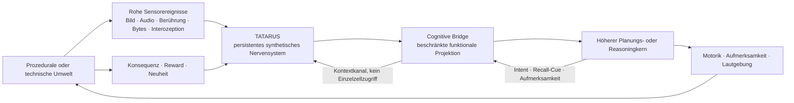

Der Simulator besitzt sensorische, exzitatorische, inhibitorische,
Kontext-, motorische und modulatorische Populationen. Rohkanäle werden in
überlappende exzitatorische Mikroassemblies projiziert. Rekurrente Dynamik
transformiert diese Ereignisse; Motorpopulationen erzeugen kontinuierliche
Aktionswerte.

Die Cognitive Bridge ist eine Architekturschranke. Sie liefert aktive
Repräsentationen, gepoolte Recall-Kanäle, Neuheit, Salienz, Energie- und
Aktivitätsbedarf, Vorhersagefehler und Konfidenz. Der Planer darf
Aufmerksamkeitsziel, motorische Absicht, Recall-Cue und Reward zurückgeben.

Die Schichten sind funktional gekoppelt, bleiben aber getrennt testbar. So
können Kontrollen das Nervensystem, Eligibility oder den höheren Planer
gezielt entfernen, ohne die übrige Versuchsanordnung zu verändern.

<div align="right"><sub>Seite 7 von 30</sub></div>
<div style="page-break-after: always;"></div>

<!-- PAGE 08/30 -->

## Biologische Inspiration und bewusste Abstraktion

| Biologisches Organisationsprinzip | TATARUS-Abstraktion |
|---|---|
| erregende und hemmende Zellen | Dale-konforme Populationen und Gewichtsvorzeichen |
| Membran- und Dendritendynamik | Soma plus passives Dendritenkompartiment |
| schnelle/langsame Rezeptoren | AMPA, NMDA, GABA-A, GABA-B |
| axonale Laufzeit | individuelle ganzzahlige Ereignisverzögerung |
| kurzzeitige Freisetzungsdynamik | Ressource, Facilitation, Freisetzungswahrscheinlichkeit |
| lokale zeitliche Plastizität | signierte Eligibility pro aktiver Synapse |
| Neuromodulation | Dopamin-/Acetylcholin-ähnliche Regulationszustände |
| Aktivitätsstabilität | Zielratenhomeostase und Schwellendrift |
| Gedächtniskonsolidierung | reward-gebundene Gewichts- und Konsolidierungszustände |
| Zellverbände | kompetitive zeitliche Assembly-Prototypen |
| Umbau und Reparatur | Pruning, Wachstum und Eltern-Provenienz |

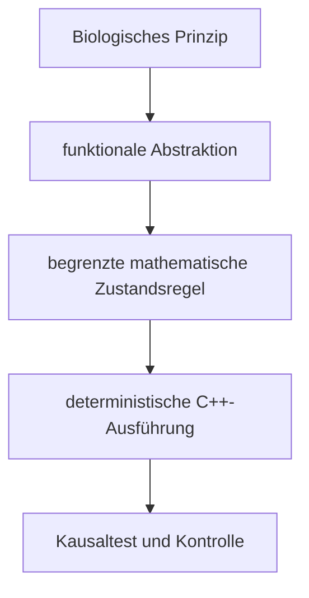

Bewusst nicht modelliert werden vollständige Molekularbiologie,
Genexpression, Gliazellen in biologischer Detailtiefe, dreidimensionale
Gehirnanatomie, reale Entwicklung, Bewusstsein und biologische Identität.

TATARUS übernimmt somit nicht die materielle Ausführung eines Nervensystems.
Es abstrahiert ausgewählte Funktionsprinzipien so weit, dass sie ausführbar,
abschaltbar, messbar und gegen Kontrollen prüfbar werden.

<div align="right"><sub>Seite 8 von 30</sub></div>
<div style="page-break-after: always;"></div>

<!-- PAGE 09/30 -->

## Formales Gesamtmodell

Der vollständige Zustand entwickelt sich diskret mit \(\Delta t=1\,\mathrm{ms}\):

$$
\boxed{
\mathcal S_{t+1}
=
F(\mathcal S_t,X_t,C_t,R_t;\Theta,K,\xi)
}
$$

mit Sensorereignissen \(X_t\), Cognitive-Bridge-Befehlen \(C_t\),
Konsequenzsignalen \(R_t\), Parametern \(\Theta\), generiertem Operator \(K\)
und geseedetem Zufallszustand \(\xi\). Der Zustand kann zerlegt werden als:

$$
\mathcal S_t=
\left(
V_t,D_t,G_t,W_t,E_t,U_t,H_t,A_t,Q_t,P_t,\Xi_t
\right).
$$

| Symbol | Inhalt |
|---|---|
| \(V_t\) | Somapotentiale, Adaptation und Refraktärzustände |
| \(D_t\) | dendritische Potentiale |
| \(G_t\) | Rezeptorleitwerte |
| \(W_t\) | aktive und konsolidierte Gewichte sowie Topologie |
| \(E_t\) | lokale Eligibility-Spuren |
| \(U_t\) | Ressourcen, Facilitation und Nutzungszustände |
| \(H_t\) | Aktivitätshomeostase und Neuromodulation |
| \(A_t\) | Assemblies und Reizphasenakkumulatoren |
| \(Q_t\) | neuronale Energie |
| \(P_t\) | Axonqueues und Verzögerungen |
| \(\Xi_t\) | RNG-, Bridge- und optionale Planerzustände |

Ein V9-Snapshot serialisiert die für exakte Fortsetzung benötigten
Bestandteile. Die Reproduktion verlangt nicht nur gleiche Endmetriken,
sondern identische Zustands-Hashes und anschließende Handlungen.

<div align="right"><sub>Seite 9 von 30</sub></div>
<div style="page-break-after: always;"></div>

<!-- PAGE 10/30 -->

## Neuron, Dendrit und Rezeptorströme

TATARUS verwendet einen kontrollierbaren Integrate-and-Fire-Kern. In
vereinfachter Schreibweise:

$$
\tau_D\frac{dD_i}{dt}
=
(V_\mathrm{rest}-D_i)+I_i^\mathrm{syn},
$$

$$
\tau_V\frac{dV_i}{dt}
=
(V_\mathrm{rest}-V_i)
\kappa(D_i-V_i)
I_i^\mathrm{base}
I_i^\mathrm{ext}.
$$

Die synaptische Wirkung ist leitwertbasiert:

$$
I_i^\mathrm{syn}
=
\sum_{r\in\{\mathrm{AMPA,NMDA,GABA_A,GABA_B}\}}
g_{i,r}(E_r-D_i).
$$

Standardwerte des persistenten Kerns sind unter anderem
\(\tau_V=20\,\mathrm{ms}\), \(\tau_D=35\,\mathrm{ms}\),
\(\tau_\mathrm{AMPA}=5\,\mathrm{ms}\),
\(\tau_\mathrm{NMDA}=80\,\mathrm{ms}\),
\(\tau_{\mathrm{GABA_A}}=10\,\mathrm{ms}\) und
\(\tau_{\mathrm{GABA_B}}=120\,\mathrm{ms}\).

Ein Spike entsteht bei

$$
V_i\ge \theta_i+\theta_i^\mathrm{adapt}+\theta_i^\mathrm{homeo}.
$$

Danach folgen Reset, Refraktärzeit und adaptive Schwellenerhöhung. Energie
begrenzt Erregbarkeit und Übertragung zusätzlich. Das Modell soll keine
einzelne biologische Zellklasse imitieren; es stellt eine transparente
Trägerdynamik für lokale Mechanismen bereit.

<div align="right"><sub>Seite 10 von 30</sub></div>
<div style="page-break-after: always;"></div>

<!-- PAGE 11/30 -->

## Ereigniskausale synaptische Übertragung

Ein Spike ist ein Ereignis mit Quelle, Emissionszeit, Amplitude und
ereignisgebundenem Gate. Nach der individuellen Verzögerung \(d_{ij}\) wirkt
er auf genau die Zielkante:

$$
\Delta g_{ij,r}(t+d_{ij})
=
w_{ij}\,A_j\,
u_{ij}(t)\,R_{ij}(t)\,
g_K(\phi_j)\,
m_E(e_{ij}).
$$

Dabei sind \(uR\) kurzzeitige Freisetzung, \(g_K\) der generierte
Operatoranteil und \(m_E\) die Eligibility-Modulation. Alle Faktoren werden
begrenzt; nichtendliche Zustände führen zum Testfehler.

Der generierte Operator wird als

$$
g_K(\phi)=
\operatorname{clip}
\left(
\frac{1+\tanh(K(\phi))}{2},
0{,}05,0{,}95
\right)
$$

eingesetzt. Im historischen `RESET_LOCKED`-Wrapper war der wirksame Wert
konstant \(0{,}1283111213\). Erst die Emissionszustands- und
E/I-Projektionsvarianten erzeugten echte Ereignisvarianz.

Wissenschaftlich entscheidend: Eine dynamische Formel ist nicht automatisch
ein nützlicher dynamischer Mechanismus. Timing, Featureprojektion und
Einsetzposition bestimmen den tatsächlich wirksamen Phänotyp. Deshalb
vergleicht TATARUS Originalkernel, event-gematchte Konstante,
Vorzeichengate, Tanh, verteilungsgematchten Zufall, Zeitverschiebung und
Zustands-Shuffle.

<div align="right"><sub>Seite 11 von 30</sub></div>
<div style="page-break-after: always;"></div>

<!-- PAGE 12/30 -->

## Signierte lokale Eligibility-Transfer-Memory

Jede aktive Synapse \(j\rightarrow i\) besitzt eine eigene Spur:

$$
e_{ij}(t+\Delta t)=
\operatorname{clip}
\left[
e_{ij}(t)e^{-\Delta t/\tau_e}
\chi_t
\left(
s_i(t)\,\bar s_j(t)-s_j(t)\,\bar s_i(t)
\right),
-e_{\max},e_{\max}
\right].
$$

\(\bar s\) bezeichnet lokale Spike-Traces. \(\chi_t\) erlaubt das Schreiben
nur bei externem Reiz, Recall, Neuheit oder Reward; während echter Leerzeit
zerfällt die Spur. Die spätere Übertragung wird lokal moduliert:

$$
m_E(e_{ij})=
\operatorname{clip}
\left(1+\gamma_e\tanh(e_{ij}),m_{\min},m_{\max}\right).
$$

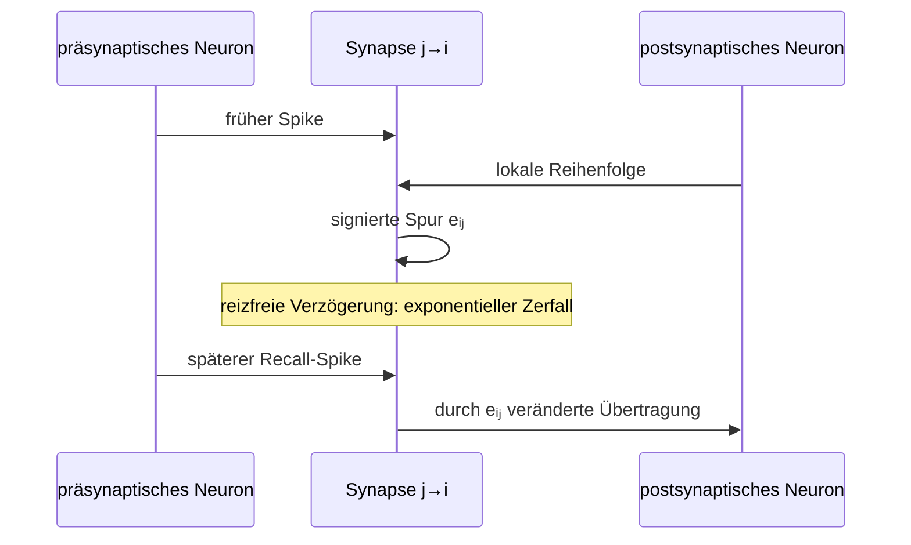

Die Lokalität ist eine Invariante: Nicht vorhandene Verbindungen tragen
keine Spur; ein Synapsen-Shuffle zerstört die Zuordnungskontrolle. `Gain=0`
muss die historische Dynamik exakt wiederherstellen.

<div align="right"><sub>Seite 12 von 30</sub></div>
<div style="page-break-after: always;"></div>

<!-- PAGE 13/30 -->

## Kurzzeitplastizität, Konsolidierung und Vergessen

Die synaptische Ressource erholt sich kontinuierlich:

$$
R_{ij}\leftarrow
R_{ij}+(1-R_{ij})\frac{\Delta t}{\tau_\mathrm{rec}},
\qquad
\mathrm{release}_{ij}=u_{ij}R_{ij}.
$$

Bei Übertragung wird Ressource verbraucht und Facilitation verändert. Diese
schnelle Ebene wirkt über Millisekunden bis Sekunden. Die lokale
Eligibility-Spur bildet eine mittlere Zeitskala. Reward-gebundene
Konsolidierung überführt flüchtige Änderungen in stabilere Gewichte:

$$
\Delta w_{ij}
=
\eta\,M_t\,e_{ij},
\qquad
\Delta \bar w_{ij}
=
\eta_c |M_t e_{ij}|(w_{ij}-\bar w_{ij}),
$$

wobei \(M_t\) einen begrenzten neuromodulatorischen Zustand bezeichnet.
Dale-Vorzeichen und Gewichtsgrenzen bleiben erhalten.

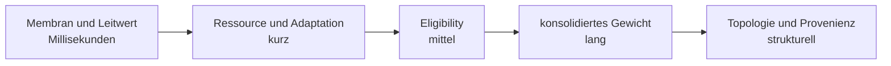

Kontrolliertes Vergessen ist kein Löschen auf Befehl, sondern begrenzter
Zerfall ohne erneutes Schreiben. Interferenzschutz wird daran gemessen, ob ein
alter partieller Cue nach einer neuen Erfahrung weiterhin einen passenden
Zustand reaktiviert.

<div align="right"><sub>Seite 13 von 30</sub></div>
<div style="page-break-after: always;"></div>

<!-- PAGE 14/30 -->

## Homeostase, Energie und Stabilität

Ein fortlaufendes System darf weder dauerhaft verstummen noch unbeschränkt
eskalieren. TATARUS kombiniert drei Begrenzungsebenen.

Die gefilterte Rate \(r_i\) verschiebt die effektive Schwelle:

$$
\theta_i^\mathrm{homeo}(t+\Delta t)
=
\operatorname{clip}
\left[
\theta_i^\mathrm{homeo}(t)
+\eta_h(r_i-r_i^\star)\Delta t,
-12,12
\right].
$$

Der Energiezustand erholt sich und bezahlt Spike- sowie Übertragungskosten:

$$
q_i(t+\Delta t)=
\operatorname{clip}
\left[
q_i(t)+\rho_q\Delta t
-c_s s_i(t)
-c_\mathrm{tx}n_i^\mathrm{tx}(t),
0,1
\right].
$$

Gewichtsgrenzen, Dale-Konformität und endliche Werte bilden harte
Invarianten. Die Regulation ist nicht mit biologischem Stoffwechsel
gleichzusetzen; sie ist eine funktionale Ressourcenschranke.

Messgrößen sind mittlere Rate, Zielratenabweichung, Energie, Spikezahl,
Übertragungen, Strukturwachstum, Pruning und Endlichkeit. Im
Stufe-16-Endlauf lagen 7.500 fortgesetzte Schritte, 7.439 Spikes,
49.514 Übertragungen, 7,997799 Hz mittlere Rate bei 8,121509 Hz Zielrate und
0,991972 mittlere Energie vor.

<div align="right"><sub>Seite 14 von 30</sub></div>
<div style="page-break-after: always;"></div>

<!-- PAGE 15/30 -->

## Rohe Kanäle und kompetitive Assemblybildung

TATARUS enthält keinen zwingenden Tokenizer, kein Vokabular und keine
Embeddingtabelle. Bildereignisse, Audiosamples, Berührung, UTF-8-Bytes,
Temperatur und Interozeption werden topografisch auf überlappende
Mikroassemblies projiziert.

Ein Reizmuster wird als hervorgerufener Zustand relativ zur langsamen
Basislinie erfasst:

$$
\mathbf r^\mathrm{evoked}
=
\mathbf r^\mathrm{fast}
-\mathbf r^\mathrm{slow},
$$

ergänzt um signierte dendritische Abweichungen. Für Prototyp
\(\mathbf p_k\) gilt:

$$
k^\star=\arg\max_k
\frac{\mathbf p_k^\top\mathbf r}
{\|\mathbf p_k\|\,\|\mathbf r\|+\varepsilon}.
$$

Liegt die beste Ähnlichkeit unter der Schwelle, entsteht eine neue Assembly;
sonst wird nur der Gewinner inkrementell angepasst. So konkurrieren
Repräsentationen, anstatt in einem globalen Mittel zu kollabieren.

„Tokenizerfrei“ bedeutet hier ausschließlich: Die Eingabe benötigt keine
vorgegebenen Token-IDs. Es bedeutet nicht, dass TATARUS Sprache semantisch
versteht. Eine interne Einheit ist ein verteilter zeitlicher Nervenzustand,
dessen Bedeutung erst durch wiederholte Übergänge, Konsequenzen und
Auslesung entsteht.

<div align="right"><sub>Seite 15 von 30</sub></div>
<div style="page-break-after: always;"></div>

<!-- PAGE 16/30 -->

## Die beschränkte Cognitive Bridge

Der höhere Kern arbeitet nicht direkt auf dem vollständigen Nervenzustand.
Eine beschränkte Projektion erzeugt:

$$
\mathbf c_t=B(\mathcal S_t)
=
\left[
\text{Assemblies},
\text{Recall-Pools},
\text{Neuheit},
\text{Salienz},
\text{Bedarf},
\text{Fehler},
\text{Konfidenz}
\right].
$$

Die Bridge poolt 64 neuronale und 64 recall-gebundene Synapsengruppen.
Einzelne Membranen, Kanten, Gewichte und Eligibility-Werte werden nicht
offengelegt. Formal ist die Projektion verlustbehaftet:

$$
B^{-1}(\mathbf c_t)\neq \mathcal S_t.
$$

Der Planer darf nur einen begrenzten Befehl

$$
\mathbf u_t=
(\text{attention},\text{motor intent},\text{recall cue},\text{reward})
$$

zurückgeben. Dieser wird auf Kontext- und Regulationskanäle abgebildet und
adressiert keine einzelne Synapse.

Damit ist TATARUS weder ein unkontrolliertes Plugin im Planer noch ein
passiver Datenspeicher. Die Bridge schafft eine überprüfbare
Verantwortungsgrenze: Das Nervensystem trägt die lokale Dynamik; der höhere
Kern verarbeitet gepoolte Funktionen. In Ablationen kann jede Seite
unabhängig ersetzt oder entfernt werden.

<div align="right"><sub>Seite 16 von 30</sub></div>
<div style="page-break-after: always;"></div>

<!-- PAGE 17/30 -->

## Kontinuierlicher Lebenslauf und kausale Snapshots

Alle Erfahrungen eines Lebenslauf-Seeds werden in demselben Systemzustand
ausgeführt. Das verhindert, dass eine episodische Resetlogik unbeabsichtigt
die eigentliche Gedächtnisleistung übernimmt.

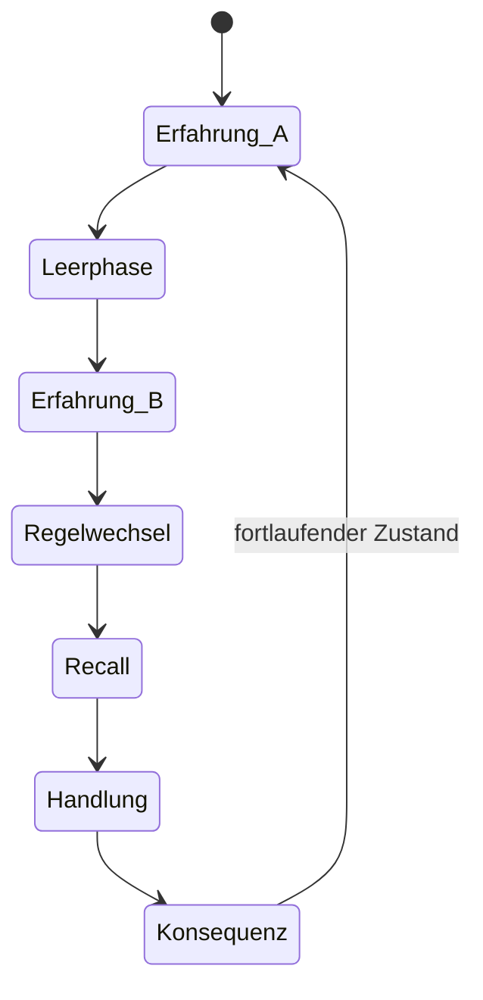

Ein kompositer Snapshot umfasst:

- den vollständigen V9-Nervensystemzustand,
- RNG und Axonereignisqueues,
- Assemblies und Reizphasenakkumulatoren,
- Bridge-Zustand und Reward-Prädiktion,
- Parameter des höheren Planungskerns.

Exakte Fortsetzung wird stärker geprüft als durch ähnliche Mittelwerte:

$$
\operatorname{Hash}(\mathcal S_{t+n}^{\mathrm{direkt}})
=
\operatorname{Hash}(\mathcal S_{t+n}^{\mathrm{geladen}})
$$

und Aktions-, Recall- sowie Zustandsfolgen müssen übereinstimmen. Dadurch
wird ein Snapshot zum kausalen Fortsetzungspunkt und nicht nur zum Export
einer ungefähren Modellkonfiguration.

<div align="right"><sub>Seite 17 von 30</sub></div>
<div style="page-break-after: always;"></div>

<!-- PAGE 18/30 -->

## Experimentelles Design und Pflichtkontrollen

TATARUS trennt Entwicklung, Einfrieren und Bestätigung. Mechanismen und
Parameter werden auf Entwicklungsseeds gewählt; Entscheidungskriterien
werden vor dem Holdout-Lauf festgelegt. Neue Seeds dürfen anschließend nicht
zur Mechanismuswahl zurückfließen.

Für Übertragungsoperatoren werden mindestens folgende Kontrollen verwendet:

| Kontrolle | isolierte Erklärung |
|---|---|
| deaktiviert | Gate überhaupt erforderlich? |
| event-gematchte Konstante | genügt der wirksame Mittelwert? |
| Vorzeichen | genügt Polarität? |
| Tanh | genügt eine Standardnichtlinearität? |
| verteilungsgematchter Zufall | genügt die Verteilung? |
| zeitverschoben | ist das Timing kausal relevant? |
| state-/synapse-shuffled | ist die korrekte Zuordnung relevant? |
| Gain \(=0\) | neutraler Rückfall exakt? |

Für Gedächtnis und Reparatur kommen Ohne-Trace-, Ohne-Nervensystem-,
statischer-Reflex-, Schadens- und Provenienzkontrollen hinzu. Ergebnisse
werden seedweise berichtet; positive Mittelwerte allein ersetzen keine
Einzelkriterien.

Negative Befunde bleiben erhalten. Besonders wichtig sind die bitgenaue
Äquivalenz des historischen Reset-Kernels zur richtigen Konstantkontrolle,
die negative Delayed-XOR-Effizienzreplikation und das Ausstehen externer
Hardware-Replikation.

### Mechanismen- und Quellcodematrix

| Mechanismus | Zweck, Zustand und Ausführungsposition | Invariante/Kontrolle | Evidenz und Grenze | Quelle |
|---|---|---|---|---|
| Generated Polarity and Release Operator | moduliert die präsynaptische Freisetzung aus Eventfeature \(\phi\) | Clip; Konstante, Sign, Tanh, Zufall | dynamisch implementiert; nicht universell überlegen | `bio_core.cpp`, `nervous_system.cpp` |
| Signed Local Eligibility-Transfer Memory | speichert Prä-/Post-Reihenfolge pro aktiver Kante; wirkt bei späterer Übertragung | Lokalität; Gain 0, Shuffle, Shift | trace-essential Aufgabenvorteil; domänenspezifisch | `nervous_system.cpp` |
| Evoked-State Baseline Separation | trennt Reizantwort von langsamer Basislinie | signed state; Ohne-Baseline-Vergleich | stabile synthetische Repräsentationen | `nervous_system.cpp` |
| Competitive Stimulus-Phase Assembly Formation | gewinnt oder erzeugt Prototyp nach Reizphase | Maximalzahl, Ähnlichkeitsschwelle | 8/8 Holdout-Seeds | `nervous_system.cpp` |
| Tokenizer-Free Topographic Raw Projection | projiziert Rohkanal auf überlappende Mikroassembly | feste geseedete Topografie | rohe Übergänge, kein Sprachverständnis | `nervous_system.cpp` |
| Reward-Bound Local Consolidation | überführt modulierte Eligibility in Gewicht und Konsolidierungszustand | Grenzen und Dale-Vorzeichen | Stufe-21-Gedächtnis | `nervous_system.cpp` |
| Controlled Trace Decay and Interference Protection | zerfällt in echter Leerzeit, schützt alten Cue | Schreiben nur bei Salienzereignis | 8/8 Gedächtnis-Seeds | `nervous_system.cpp` |
| Provenance-Guided Axonal Path Reconstruction | ersetzt benutzten zerstörten Pfad mit Eltern-ID | Endpunkte aktiv; eingefrorene Nachprüfung | 8/8 definierte Reparaturen | `nervous_system.cpp`, `representation_research.cpp` |
| Bounded Cognitive-State Bridge | poolt Funktion und beschränkt Top-down-Zugriff | kein Einzelzell-/Gewichtszugriff | 8/8 Lebenslauf-Seeds | `cognitive_bridge.cpp`, `persistent_ai_trial.cpp` |
| Composite Causal Snapshot Continuation | serialisiert Nervensystem, Bridge, RNG und Planer | Hash- und Replay-Identität | lokal exakt; Plattformreplikation offen | `nervous_system.cpp`, `cognitive_bridge.cpp` |

<div align="right"><sub>Seite 18 von 30</sub></div>
<div style="page-break-after: always;"></div>

<!-- PAGE 19/30 -->

## Evidenz I – Repräsentationen und rohe Sequenzstruktur

Die Stufe-18-Bestätigung verwendete eingefrorene Kriterien und neue Seeds.
Stabile konkurrierende Repräsentationen bestanden 8/8 Netze. Im Mittel
entstanden 6,125 Assemblies. Ähnliche Reize reaktivierten ihren Zustand mit
einer Kosinusähnlichkeit von 0,907323; nach 10 % Neuronen- und 15 %
Synapsenschaden blieb 0,852185 erhalten.

Für rohe Sequenzen wurden UTF-8-Bytes als Bitereignisse ohne Token-,
Wort- oder Embeddingtabelle eingespeist. Ein nur auf Trainingsepochen
angepasster linearer Readout unterschied sechs Übergangsklassen in
unberührten Epochen mit 77,3438 % mittlerer Accuracy. Die Aktivitätsantwort
an Grenzen war um Faktor 2,884757 stärker als an normalen Übergängen.

Diese Befunde tragen zwei begrenzte Aussagen:

1. Die Assemblydynamik bildet innerhalb der synthetischen Reizfamilie
   unterscheidbare, wiederaktivierbare Zustände.
2. Rohbytes können ohne vorgegebene Token-IDs in eine informative zeitliche
   Übergangsstruktur überführt werden.

Sie tragen nicht die Aussage, dass das System natürliche Sprache versteht
oder selbstständig universelle Symbole entdeckt. Semantische Bindung,
Modalitätstransfer und Langzeitstabilität in offenen Datenströmen bleiben
Forschungsfragen.

<div align="right"><sub>Seite 19 von 30</sub></div>
<div style="page-break-after: always;"></div>

<!-- PAGE 20/30 -->

## Evidenz II – Trace-essential internes Gedächtnis

Zwei frühe, energiegleiche Cues tragen XOR-Information. Danach folgen
400 vollständig reizfreie Schritte und für beide Klassen derselbe neutrale
Recall-Cue. Das lineare Readout sieht ausschließlich Spikeänderungen und
Endmembranzustände aus dem letzten Recallfenster; Cue-Features,
Eligibility-Werte und Produktmerkmale sind verborgen.

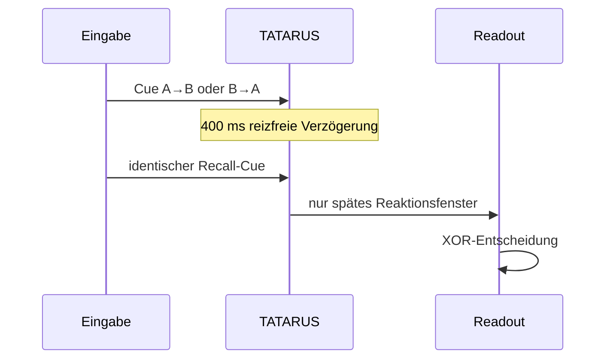

Mit eingefrorenen Parametern \(\tau_e=800\,\mathrm{ms}\),
Gain \(=10\), Inkrement \(=20\) erreichten zwölf Holdout-Netze 1,000000
Accuracy. Ohne Eligibility waren es 0,486111.

Der Nachweis ist kausal enger als ein Readout mit explizitem Cue-Puffer:
Während der Leerphase muss relevante Information im Nervensystemzustand
überleben und die spätere Recall-Reaktion verändern. Bestätigt ist dieser
Mechanismus in der definierten XOR-Aufgabe, nicht beliebig langes
episodisches Gedächtnis.

<div align="right"><sub>Seite 20 von 30</sub></div>
<div style="page-break-after: always;"></div>

<!-- PAGE 21/30 -->

## Evidenz III – Gekoppelte KI bei identischer Gegenwart

Stufe 19 prüft die zentrale Designhypothese in einem durchgängigen
64-Erfahrungen-Lebenslauf. Die Vorgeschichte enthält \(A\rightarrow B\) oder
\(B\rightarrow A\); nach einer reizfreien Phase ist der aktuelle Recall-Reiz
für beide Klassen gleich. Zwischen Lernen und Test wird eine unbekannte rohe
Bytegrammatik eingespielt.

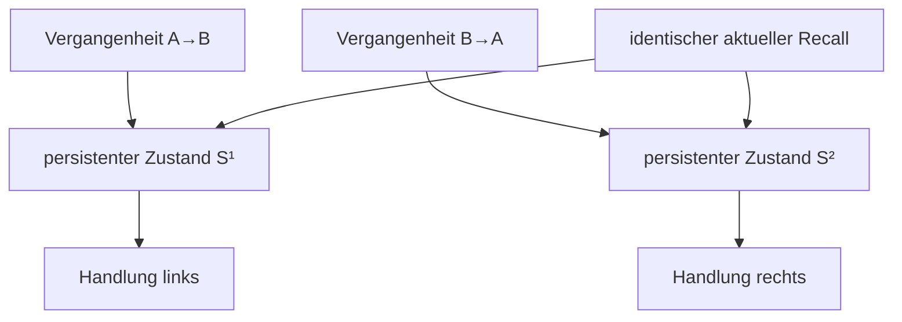

| Variante | mittlere Accuracy |
|---|---:|
| Planer + TATARUS + lokale Eligibility | 1,000000 |
| identische Kopplung ohne Eligibility | 0,515625 |
| höherer Kern ohne Nervensystem | 0,500000 |

Alle 8/8 neuen Seeds bestanden die vorab definierten Kriterien. Die
Aktionsdiversität betrug 1,0 und komposite Snapshot-Replays waren exakt.

Das Experiment bestätigt eine handlungswirksame Kopplung in dieser teilweise
beobachtbaren Aufgabe. Es bestätigt keinen universellen Vorteil gegenüber
allen Gedächtnisarchitekturen und keine allgemeine Grammatikkompetenz.

<div align="right"><sub>Seite 21 von 30</sub></div>
<div style="page-break-after: always;"></div>

<!-- PAGE 22/30 -->

## Evidenz IV – Prozedurale Lebenswelt und G5

Die Stufe-20-Welt enthält frei gezogene Objektlagen, Energiebedarf, Gefahr,
mehrere konkurrierende Ziele, verzögerte Konsequenzen und unangekündigte
Regelwechsel. Entscheidungen fallen vor dem Reward; der höhere Kern sieht
nur die Cognitive Bridge.

Über acht neue Seeds wurden gemessen:

| Variante | mittlerer Reward |
|---|---:|
| gekoppeltes TATARUS-System | 310,157089 |
| gleiche Architektur ohne Eligibility | 294,101531 |
| statischer Reflex | 119,488903 |
| eingefrorene G5-Struktur | 363,183060 |

Sechs von acht Seeds erfüllten sämtliche Stufe-20-Einzelkriterien. Der
aggregierte Status lautet `confirmed_on_procedural_holdouts`.

Der Begriff „offene Lebenswelt“ bezeichnet hier eine prozedural generierte,
teilweise beobachtbare synthetische Weltfamilie. Situationen entstehen frei
innerhalb definierter Generatorregeln; die Welt ist nicht physisch real und
nicht unbegrenzt offen. G5 prüft Transfer auf eine eingefrorene neue
Ereignisstruktur derselben Weltfamilie. Daraus folgt weder universelle
Grammatikgeneralisation noch robuste reale Robotik.

<div align="right"><sub>Seite 22 von 30</sub></div>
<div style="page-break-after: always;"></div>

<!-- PAGE 23/30 -->

## Evidenz V – Mehrskaliges Gedächtnis

Stufe 21 trennt vier Gedächtnisfunktionen, anstatt sie in einer einzigen
Accuracy zusammenzufassen:

| Funktion | aggregierter Wert | Kontrolle/Kriterium |
|---|---:|---|
| episodische Einmalspur | 0,281266 | ohne Trace: 0 |
| Konsolidierungsänderung | 87,922375 | reward-gebundene Gewichtsänderung |
| kontrolliertes Vergessen | 99,9955 % | reizfreie Zerfallsphase |
| Retention nach Interferenz | 0,999981 | partieller alter Cue |

Alle 8/8 neuen Seeds bestanden die eingefrorenen Kriterien. Eligibility wird
nur bei externem Reiz, Recall, Neuheit oder Reward geschrieben. Spontane
rekurrente Aktivität darf eine echte Leerphase nicht als neue Erfahrung
maskieren.

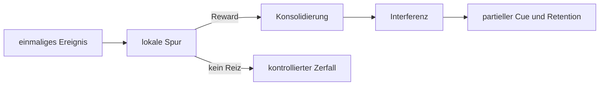

Die Resultate belegen getrennte Zeit- und Zustandsmechanismen in den
synthetischen Tests. Sie sind noch kein Nachweis autobiografischen
Gedächtnisses, unbegrenzter Konsolidierung oder lebenslangen Lernens.

<div align="right"><sub>Seite 23 von 30</sub></div>
<div style="page-break-after: always;"></div>

<!-- PAGE 24/30 -->

## Schaden und provenienzgestützte Reparatur

Die Reparaturprüfung beginnt mit einer messbaren Sensor-Motor-Funktion.
Danach werden genau sechs tatsächlich benutzte Direktleitungen sowie 10 %
interne Neuronen deaktiviert. Die Funktion fällt in allen acht
Holdout-Netzen auf null.

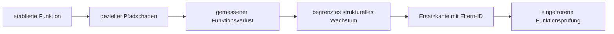

Neue Kanten dürfen nur aus zuvor benutzten, konsolidierten und nun inaktiven
Pfaden hervorgehen:

$$
w_{\mathrm{neu}}=\bar w_{\mathrm{parent}},
\qquad
d_{\mathrm{neu}}=\max(1,d_{\mathrm{parent}}-1).
$$

In 8/8 Netzen entstanden sechs Ersatzsynapsen mit Eltern-Provenienz. Nach
Einfrieren von Wachstum und Homeostasedrift wurden im Mittel 111,3726 % des
ursprünglichen Funktionsbetrags mit gleichem Vorzeichen wiedergewonnen.

Bestätigt ist damit eine definierte Form kausaler Pfadrekonstruktion. Nicht
bestätigt sind allgemeine Selbstheilung, Reparatur beliebiger Funktionen
oder biologische Regeneration.

<div align="right"><sub>Seite 24 von 30</sub></div>
<div style="page-break-after: always;"></div>

<!-- PAGE 25/30 -->

## Skalierung und technische Tragfähigkeit

Für \(N>2048\) ersetzt ein direkter Sparse-Sampler die quadratische Prüfung
aller Zellpaare. Der erwartete Ausgangsgrad wird geseedet mit eindeutigen
Zielen erzeugt. So bleibt die Initialisierung näher an \(O(Nk)\) als an
\(O(N^2)\).

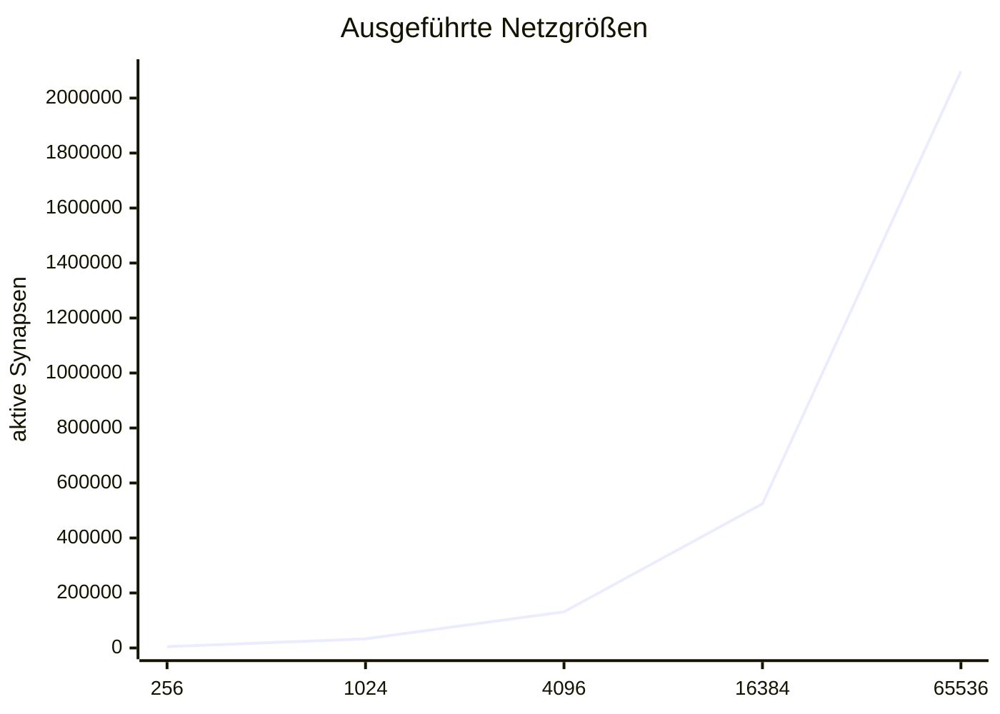

Der vollständige Release-Lauf umfasste 65.536 Neuronen, 2.097.328 aktive
Synapsen und 40 Schritte. Auf der lokalen 12-Thread-CPU benötigte die
Simulation 2.329,1649 ms. Der Snapshot war 212.426.348 Byte groß und wurde
hashidentisch restauriert. Endlichkeit, Energiegrenzen und Dale-Prinzip
blieben erhalten.

Diese Messung bestätigt Ausführbarkeit und strukturelle Integrität. Der
Echtzeitfaktor betrug bei dieser Größe 0,017174; Echtzeitfähigkeit ist daher
ausdrücklich nicht bestätigt. Nur ein geprüfter Integrationsschritt ist
CPU/OpenCL-differenziell freigegeben; komplexe Plastizitäts- und
Reparaturpfade bleiben CPU-autoritativ.

<div align="right"><sub>Seite 25 von 30</sub></div>
<div style="page-break-after: always;"></div>

<!-- PAGE 26/30 -->

## Runenkrieg als Android-Spiel und wissenschaftliches Reallabor

Die synthetischen Stufen 1–23 prüfen isolierte Mechanismen. Runenkrieg ergänzt
eine andere Evidenzklasse: einen fortlaufenden, teilweise beobachtbaren
Handlungskreislauf mit Kartenhand, Wetter, Ressourcen, wechselnden
Gegneraktionen, verzögerten Konsequenzen und lokal fortgeschriebenem Zustand.
Das Spiel ist deshalb zugleich Anwendung und Labor.

<p align="center">
  <a href="docs/whitepaper/images/android/runenkrieg_tatarus_reference_lab.png">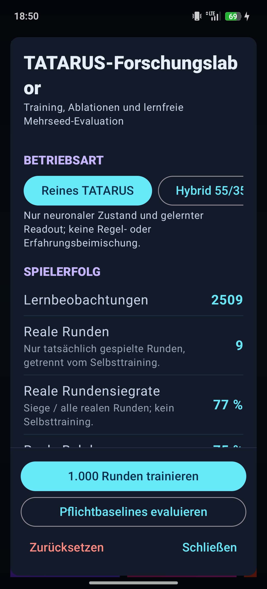</a>
  &nbsp;&nbsp;
  <a href="docs/whitepaper/images/android/runenkrieg_tatarus_largescale_lab.png">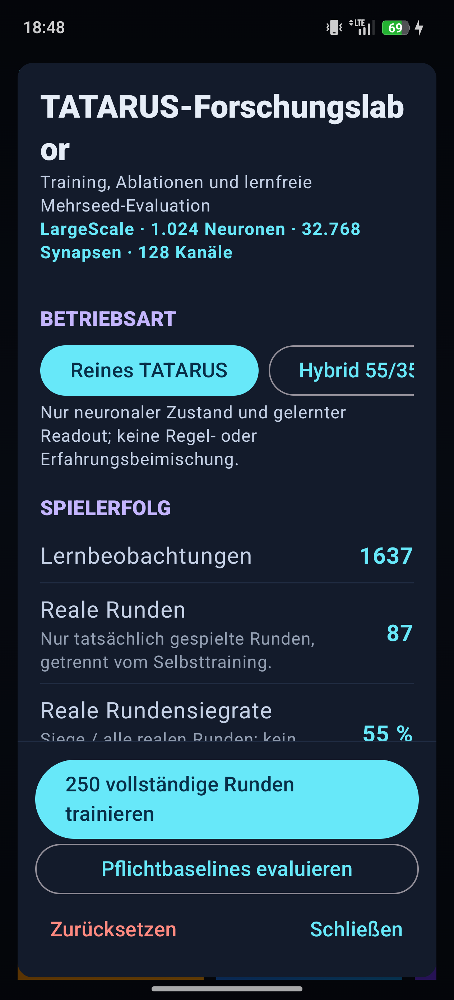</a>
</p>

<p align="center"><sub><strong>Abbildung 1.</strong> Direkt vom Testgerät
erfasste Laboransichten der fortlaufend lernenden Referenz-App (links) und
des LargeScale-Zweigs (rechts). Die zweite Ansicht weist die tatsächlich
aktive Topologie mit 1.024 Neuronen, 32.768 Synapsen und 128 Kanälen aus.
Anklicken öffnet die unverkleinerte PNG-Datei.</sub></p>

Der erste mobile Integrationsstand besaß 72 Neuronen, 432 Synapsen und 32
verdrahtete Kanäle. In 37 tatsächlich gespielten Runden erreichte er 48 %
Rundensiege. Das zeigte funktionsfähige Kopplung und ein ausgeglichenes Spiel,
war aber weder ein belastbarer Lernnachweis noch ein Überlegenheitsbeleg. Der
Stand wurde als Forschungsreferenz erhalten.

Für den LargeScale-Zweig wurden Population, Konnektivität und sensorische
Bandbreite getrennt auf 1.024, 32.768 und 128 erhöht. Die Kanäle kodieren nur
Information, die auch den Vergleichsmodellen bereitsteht: aktuellen
Spielzustand, legale Aktionskandidaten und definierte Verlaufssignale. Die
Aktionswahl erfolgt aus Nervenzustand und gelerntem Readout; Regel- oder
Erfahrungstabellen werden im neuronalen Modus nicht beigemischt. Gewichte,
Spuren, Aktivität und Readout werden lokal auf dem Gerät persistiert.

Damit prüft Runenkrieg nicht, ob TATARUS menschlich denkt. Es prüft, ob ein
synthetisches Nervensystem unter Ressourcenbeschränkung eine reale
interaktive Policy lernen, behalten und nach dem Einfrieren reproduzieren
kann.

<div align="right"><sub>Seite 26 von 30</sub></div>
<div style="page-break-after: always;"></div>

<!-- PAGE 27/30 -->

## Fehlschläge, Falsifikationen und Neuausrichtungen

Die Entwicklung verlief nicht als Folge ausschließlich positiver Resultate.
Mehrere Befunde verengten die zulässige Hypothese und bestimmten die nächste
Architektur:

1. **RESET_LOCKED war konstant.** Der zunächst dynamisch interpretierte
   Operator erzeugte nach dem Spike-Reset exakt
   $g=0{,}1283111212878475$. Eine ereignisgematchte Konstante reproduzierte
   den Phänotyp. Die Operatorgeometrie war damit nicht kausal belegt. Der
   Stand blieb als `RESET_LOCKED_REFERENCE`; die Neuausrichtung war ein am
   Emissionszeitpunkt berechnetes Event-Causal Gate.
2. **Delayed XOR bewies noch kein internes Gedächtnis.** Frühe Varianten
   lernten nicht seedstabil oder konnten die Aufgabe über explizite
   Readout-Memory und Cue-Merkmale lösen. Länger gefilterte Zustände und
   Interaktionsprodukte verbesserten die Aufgabe, bewiesen aber weiterhin
   kein synapsenlokales Substrat. Stufe 15 entfernte deshalb alle Cue-Features
   aus dem Readout, setzte eine reizfreie Verzögerung und einen identischen
   Recall-Cue ein.
3. **Eligibility-Wirkung war nicht gleich Eligibility-Notwendigkeit.** Dass
   eine Spur Übertragung moduliert und neutral abschaltbar ist, reichte nicht.
   Erst der trace-essential Versuch mit Gain-0-, Konstant-, Absolutwert-,
   Zeitverschiebungs-, Synapsentausch-, Vorzeicheninvertierungs-, Zufalls-,
   E→E- und I→E-Kontrollen isolierte korrekte Synapse, Zeit und Richtung.
4. **Keine allgemeine Kernelüberlegenheit.** Die Delayed-XOR-
   Effizienzreplikation war negativ; das Vorzeichengate war teilweise
   sparsamer. Der Forschungsfokus wechselte von einer behaupteten besonderen
   Formel zu einer prüfbaren Ökologie aus Timing, Projektion, Einsetzposition
   und lokalen Mechanismen.
5. **Offene Lebenswelt nur teilweise erfüllt.** Stufe 20 bestand 6 von 8
   Einzelkriterien. Mehrskaliges Gedächtnis bestand später 8/8; eine offene
   Welt mit frei entstehenden Zielen ist dennoch nicht bestätigt.
6. **Der erste KI-Vergleich war asymmetrisch.** Konventionelle Modelle
   erhielten eine vollständige 10.000-Runden-Selektion, während die mobile
   TATARUS-App zunächst ein nicht gleichartig ausgewähltes Onlinemodell
   nutzte. Diese Auswertung wurde nicht als fairer Vergleich akzeptiert.
   TATARUS durchlief danach denselben Mehrseed-Checkpoint-, Auswahl- und
   Einfrierprozess.

Auch die Infrastruktur lieferte relevante Negativbefunde: Ein Lauf wurde bei
16/30 sicher pausiert, weil statt des registrierten RMX3853 ein RMX3472
angeschlossen war; dadurch wurden keine gerätegemischten Zeitdaten erzeugt.
Beim ersten Winner-Build benannte Android Asset Packaging die `.json.gz`-
Datei um. Der Import scheiterte reproduzierbar und wurde durch ein neutrales
`.snapshot`-Asset, Clean-Build, Hash- und Topologietest korrigiert.

<div align="right"><sub>Seite 27 von 30</sub></div>
<div style="page-break-after: always;"></div>

<!-- PAGE 28/30 -->

## Vollständiger Vergleichsversuch bis 10.000 Runden

Alle Modellfamilien erhielten denselben 128-dimensionalen Informationsraum,
denselben Aktionsraum, Reward und dieselben Messpunkte. Die Lernkurven wurden
bei 250, 500, 1.000, 2.000, 5.000 und 10.000 Umweltrunden ausgewertet. Pro
Checkpoint liefen fünf Entwicklungsseeds; Siegerselektion und abschließende
Replikation verwendeten getrennte Seeds. Primärmetrik war die
Holdout-Spielgewinnrate. Tokenbilanz, Rundengewinnrate, Entscheidungszeit und
Zustandsintegrität waren Sekundärmetriken.

| Modell | 250 | 500 | 1.000 | 2.000 | 5.000 | 10.000 |
|---|---:|---:|---:|---:|---:|---:|
| TATARUS LargeScale | 65 % | 64 % | 76 % | 70 % | 76 % | **81 %** |
| Contextual Bandit | 60 % | 58 % | 57 % | 59 % | 59 % | **65 %** |
| DQN | 74 % | 60 % | 66 % | 69 % | 52 % | **62 %** |
| PPO | 63 % | 56 % | 55 % | 62 % | 57 % | **59 %** |
| GRU | 52 % | 68 % | 67 % | 60 % | 55 % | **56 %** |
| MLP | 62 % | 64 % | 63 % | 57 % | 55 % | **55 %** |

Die Tabelle zeigt Mittelwerte der vollständigen 5-Seed-Lernkurven, nicht den
später ausgewählten Einzelsieger. TATARUS schloss 30/30 geplante Läufe ab. Bei
10.000 Runden lag sein 95-%-Wilson-Intervall bei 75–86 %, die mittlere
Tokenbilanz bei (+6{,}45) und die mittlere Entscheidungsmessung bei
148,18 ms.

Die Modellselektion war innerhalb jeder Architekturklasse eingefroren:

$$
m^*=arg\max_m\;\mathrm{SelectionHoldout}(m),
$$

danach wurden Lernupdates deaktiviert und nur das exportierte Artefakt auf
unberührten Seeds ausgeführt. Für TATARUS gewann Seed 20260732 am
10.000-Runden-Checkpoint; für die konventionelle Gruppe gewann der Contextual
Bandit mit Seed 20260731. DQN war früh stark, verlor aber später Leistung;
GRU und MLP zeigten ebenfalls keine monotone Lernkurve. Gerade deshalb wurde
nicht der letzte Checkpoint stillschweigend mit dem besten Zwischenwert
vertauscht.

Die Seednummern definieren in Kotlin und Python dieselben Versuchsbereiche,
aber wegen unterschiedlicher Zufallszahlengeneratoren keine bitidentischen
Episoden. Der Vergleich ist distributionssymmetrisch, jedoch nicht strikt
gepaart.

<div align="right"><sub>Seite 28 von 30</sub></div>
<div style="page-break-after: always;"></div>

<!-- PAGE 29/30 -->

## Eingefrorene Sieger und unabhängiger Seed-Lauf

Der TATARUS-Kandidat gewann die Auswahl auf 20 separaten Holdout-Seeds mit
18/20 Spielen (90 %), (+7{,}75) Tokenbilanz und 63,073 % Rundengewinnrate.
Sein Export besitzt den SHA-256-Hash
`98c5671ebfcf64734d4d791e324543a727549b6c2a6aad53db78f445e4f71668`.
Eine getrennte Android-App lädt diesen Zustand bei jedem Prozessstart frisch,
sperrt Training, Reset und Moduswechsel und prüft Hash sowie Topologie.

Auf den zuvor unberührten Seeds 60000–60049 ergab sich:

| eingefrorener Gewinner | Siege | Niederlagen | Rate | Tokenbilanz | Rundensiegrate |
|---|---:|---:|---:|---:|---:|
| TATARUS LargeScale | 35 | 15 | **70 %** | +6,50 | 60,633 % |
| Contextual Bandit | 30 | 20 | **60 %** | +2,52 | 53,262 % |

<p align="center">
  <a href="docs/whitepaper/images/android/runenkrieg_tatarus_winner_status.png">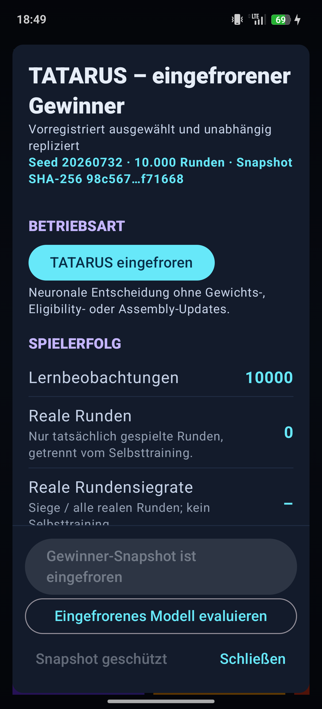</a>
  &nbsp;&nbsp;
  <a href="docs/whitepaper/images/android/runenkrieg_tensorflow_winner_status.png">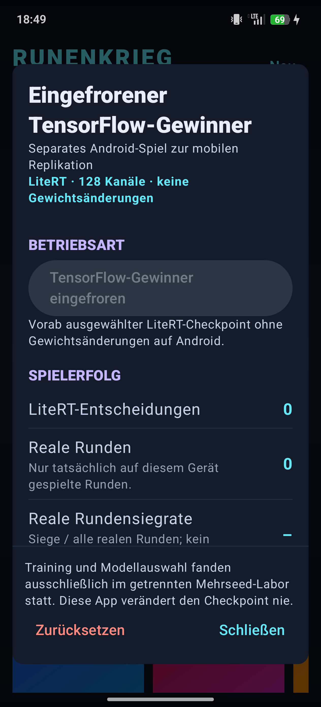</a>
</p>

<p align="center"><sub><strong>Abbildung 2.</strong> Getrennte mobile
Replikationsprogramme. Links: der hash-identifizierte TATARUS-Snapshot aus
Seed 20260732 nach 10.000 Runden, ohne Gewichts-, Eligibility- oder
Assembly-Updates. Rechts: der eingefrorene LiteRT/TensorFlow-Checkpoint mit
demselben 128-Kanal-Zustandsraum und deaktivierten Gewichtsänderungen.</sub></p>

Der TATARUS-Zustand blieb während der Replikation unverändert; Lernen war
deaktiviert. Das ist ein echter Frozen-Winner-Test und kein fortgesetztes
Onlinetraining. Der beobachtete Unterschied beträgt

$$
\Delta\hat p=0{,}70-0{,}60=0{,}10.
$$

Die statistische Einordnung verhindert eine Überinterpretation:

- TATARUS Wilson-95-%-KI: 56,25–80,90 %,
- Contextual-Bandit Wilson-95-%-KI: 46,18–72,39 %,
- Newcombe-95-%-KI der Differenz: −8,51 bis +27,60 Prozentpunkte,
- zweiseitiger Fisher-Test: $p=0{,}4019$.

Damit ist ein **numerischer, auf unberührten Seeds reproduzierter Vorsprung**
beobachtet, aber keine statistisch bestätigte Überlegenheit. Für eine
schmalere Differenzgrenze sind mehr Replikationsseeds und vorzugsweise
bitidentisch gepaarte Episoden nötig.

Auch Effizienzvergleiche bleiben getrennt: TATARUS wurde im Android/Kotlin-
Pfad mit rund 144 ms pro Entscheidung gemessen, der Bandit im Python-Pfad mit
rund 0,01 ms. Diese Werte beschreiben reale Implementierungen, aber wegen
Hardware, Laufzeit, Instrumentierung und unterschiedlich reicher Zustände
keinen isolierten Architektur-Speedtest. Ebenso sind Exportgrößen von
1.564.970 Byte versus 1.504 Byte semantisch nicht direkt gleichzusetzen.

<div align="right"><sub>Seite 29 von 30</sub></div>
<div style="page-break-after: always;"></div>

<!-- PAGE 30/30 -->

## Schlussfolgerung, Grenzen, Open Science und Referenzen

TATARUS zeigt, dass ein künstlicher Agent einen persistierenden,
mehrskaligen und handlungswirksamen Nervenzustand als eigenes
Rechensubstrat besitzen und damit in einer mobilen interaktiven Umwelt eine
Policy lernen kann. Der veröffentlichte Stand verbindet neurodynamische
Zustände, lokale synaptische Erinnerung, Regulation, Assemblybildung,
beschränkte Planungskopplung, Closed Loop und strukturelle Reparatur. Im
symmetrischen Runenkrieg-Benchmark erreichte der eingefrorene Gewinner auf
unberührten Seeds 70 % gegenüber 60 % des besten konventionellen Gewinners.

Die korrekte Anspruchsgrenze lautet dennoch:

> TATARUS ist ein experimentelles, persistentes synthetisches Nervensystem
> für KI. Es zeigte in den dokumentierten synthetischen Aufgaben und im
> Runenkrieg-Reallabor lern- und handlungswirksame Zustände sowie einen
> numerischen, noch nicht statistisch signifikanten Vergleichsvorsprung.

Nicht bestätigt sind Bewusstsein, biologische Gleichwertigkeit, allgemeine
Intelligenz, universelle Kernel- oder Systemüberlegenheit, Echtzeitbetrieb der
65.536-Neuronen-Konfiguration und unabhängige Replikation auf zweiter
Hardware. Der nächste entscheidende Lauf benötigt vorab registrierte,
bitidentisch gepaarte Episoden, mehr Replikationsseeds, gemeinsame Hardware-
und Laufzeitinstrumentierung sowie Tests nach Regelwechsel und Pause.

Quellcode, Rohmetriken, Lernkurven, Auswahlberichte, negative Ergebnisse,
eingefrorene Exporte und Android-Integrationen sind unter Apache 2.0 im
Repository veröffentlicht. Große generierbare Binärsnapshots bleiben wegen
ihrer Größe außerhalb von Git. Abweichende Replikationen sollen als Ergebnis
erhalten und nicht durch nachträgliche Parameterwahl verdeckt werden.

### Primäre TATARUS-Artefakte

- [Projektübersicht](README.md)
- [UI-Dokumentation](UI_DOKUMENTATION.md)
- [Persistenter Kern](research/ag_signal_morpher_1ee27305a6aa/16_persistent_nervous_system/README.md)
- [Stufen 17/18](research/ag_signal_morpher_1ee27305a6aa/17_autonomous_representation/README.md)
- [Cognitive Bridge](research/ag_signal_morpher_1ee27305a6aa/19_persistent_ai_bridge/README.md)
- [Stufen 20–23](research/ag_signal_morpher_1ee27305a6aa/20_23_validation/README.md)
- [Runenkrieg-Vergleichsbericht](RUNENKRIEG_VERGLEICHSBERICHT.md)
- [TATARUS-10k-Statistik](Runenkrieg_Tatarus_10k_Benchmark/results_full/STATISTICAL_REPORT.md)
- [Konventionelle 10k-Statistik](Runenkrieg_TensorFlow_Benchmark/results_full/STATISTICAL_REPORT.md)
- [Provenienz und Hashes der Android-Abbildungen](docs/whitepaper/images/android/README.md)

### Fachlicher Kontext

1. Gerstner, Kistler, Naud, Paninski:
   [*Neuronal Dynamics*](https://neuronaldynamics.epfl.ch/online/).
   Cambridge University Press, 2014.
2. Dayan, Abbott:
   [*Theoretical Neuroscience*](https://mitpress.mit.edu/9780262041997/theoretical-neuroscience/).
   MIT Press, 2001.
3. Maass, Natschläger, Markram:
   [“Real-Time Computing Without Stable States: A New Framework for Neural
   Computation Based on Perturbations”](https://doi.org/10.1162/089976602760407955).
   *Neural Computation* 14(11), 2002.
4. Bi, Poo:
   [“Synaptic Modifications in Cultured Hippocampal Neurons: Dependence on
   Spike Timing, Synaptic Strength, and Postsynaptic Cell
   Type”](https://pubmed.ncbi.nlm.nih.gov/9852584/).
   *J. Neurosci.* 18(24), 1998.
5. Frémaux, Gerstner:
   [“Neuromodulated Spike-Timing-Dependent Plasticity, and Theory of
   Three-Factor Learning Rules”](https://doi.org/10.3389/fncir.2015.00085).
   *Front. Neural Circuits* 9, 2016.

<div align="right"><sub>Seite 30 von 30</sub></div>
