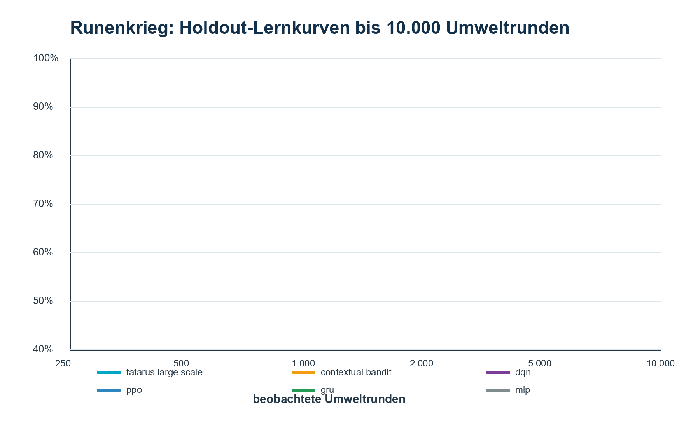
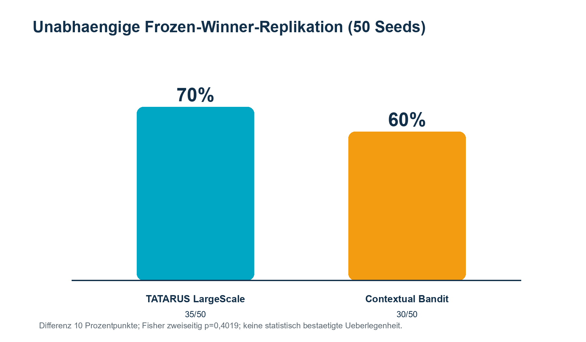

<!-- PAGE 01/40 -->

# TATARUS

## Technisches Supplement und Reproduktionshandbuch

**Zum wissenschaftlichen Forschungsbericht / Preprint Version 2.0**

**Autor:** Ralf Krümmel  
**Affiliation:** unabhängiger Privatforscher, Leipzig, Deutschland  
**Software:** TATARUS - A Persistent Synthetic Nervous System  
**Stand:** 31. Juli 2026  
**Code-Lizenz:** Apache License 2.0

Dieses Supplement beschreibt Modelle, Parameter, Binärformate, Experimente, negative Resultate, Ausschlussregeln und Reproduktionsschritte. Es ist kein Ersatz für externe Begutachtung. Alle Leistungsangaben gelten ausschließlich für die dokumentierten synthetischen Aufgaben und Implementierungen.

Seite 1 von 40

<!-- PAGE 02/40 -->

## Geltungsbereich und Evidenzklassen

Die Dokumentation verwendet vier getrennte Evidenzklassen: **implementiert** bezeichnet ausführbaren Quellcode; **technisch verifiziert** bezeichnet bestandene Unit-, Integrations- oder Snapshot-Tests; **experimentell bestätigt** bezeichnet vorab eingefrorene Kriterien auf getrennten Seeds; **offen** bezeichnet Hypothesen ohne ausreichenden Holdout- oder Replikationsnachweis.

| Aussage | Mindestbeleg | Nicht ausreichend |
|---|---|---|
| Mechanik vorhanden | Test + Quellpfad | UI-Anzeige allein |
| Gedächtnis kausal | Recall + Neutralisierung | Korrelation |
| Überlegenheit | Holdout + Intervall + Kontrolle | bester Einzelrun |
| biologische Relevanz | externe biologische Validierung | biologisch inspirierte Benennung |

Der Ausdruck „synthetisches Nervensystem“ ist eine funktionale Softwaredefinition. Er impliziert weder Bewusstsein noch biologische Identität.

Seite 2 von 40

<!-- PAGE 03/40 -->

## Reproduktionspaket und Verzeichnisstruktur / Softwarelinie und Forschungsstufen

Das Veröffentlichungspaket liegt unter `docs/research_publication`. `reproduction/source` enthält ein Quellmanifest statt einer zweiten, divergierenden Codekopie. `config` und `protocols` enthalten die ausgewählten Konfigurationen und Versuchspläne; `raw_results` enthält unveränderte maschinenlesbare Resultate; `snapshot_hashes` identifiziert eingefrorene Modelle; `analysis` dokumentiert Ableitungen; `figures` enthält reproduzierte Abbildungen.

Jede Kopie wird im Manifest mit relativer Herkunft, Bytezahl und SHA-256 erfasst. Der Git-Status wird gesondert dokumentiert, weil ein Dirty-Worktree eine relevante Reproduktionsvariable ist. Große generierbare Snapshots werden nicht dupliziert; ihr Hash und Erzeugungsprotokoll bleiben erhalten.

### Softwarelinie und Forschungsstufen

Die Entwicklung begann mit der mathematischen Charakterisierung des generierten Operators und führte über ereigniskausale Spikes, zeitliche Klassifikation, konfigurierbare Neurodynamik, Delayed-XOR-Ablationen und trace-essential Memory zu einem persistenten Lebenslaufsystem. Stufen 17-19 prüften Repräsentation, sequenzielles Rohsignal, reizfreien Recall, Reparatur und die Cognitive Bridge. Stufen 20-23 ergänzten offene Lebenswelt, mehrskaliges Gedächtnis, Skalierung und Replikationspaket.

Runenkrieg bildet einen separaten anwendungsnahen Zweig. Tatarus_LLM setzt wiederum auf dem persistenten Kern auf. Diese Zweige dürfen nicht so dargestellt werden, als stammten alle Resultate aus demselben Netz oder derselben Parametrisierung.

Seite 3 von 40

<!-- PAGE 04/40 -->

## Notation, Zeit und Zustandsübergang / Leaky-Integrate-and-Fire-Soma

Der vollständige Nervenzustand wird als `S_t` bezeichnet. Ein Simulationsschritt verwendet standardmäßig `dt = 1 ms`. Externe Sensorwerte bilden einen `SensorFrame`; neuronale und synaptische Variablen werden deterministisch fortgesetzt. Ein Prozessneustart darf den Zustand nur über ein erfolgreich validiertes Snapshotformat verändern.

$$S_{t+1}=F(S_t, X_t, A_t, R_{t-1}; \theta).$$

`X_t` ist die Beobachtung, `A_t` ein begrenzter Planerimpuls und `R_{t-1}` eine von der Umwelt stammende Konsequenz. Parameter `theta` werden pro Experiment gehasht. Der statistische Seed ist nicht mit dem neuronalen Schritt oder einem Bytepositionsindex gleichzusetzen.

### Leaky-Integrate-and-Fire-Soma

Das kontrollierte Basismodell integriert Leckstrom, externe Ströme, rekurrente Übertragung und optional leitwertbasierte Rezeptorströme. In diskreter Form gilt näherungsweise:

$$V_i(t+dt)=V_i(t)+dt[-(V_i-E_L)/tau_m+I_i(t)].$$

Die Referenzparameter sind `E_L=-65 mV`, Reset `-70 mV`, Basisschwelle `-50 mV`, `tau_m=20 ms` und Refraktärzeit `2 ms`. Ein Spike setzt das Soma zurück und erhöht die adaptive Schwelle. Die Parameter sind keine Schätzung eines bestimmten biologischen Zelltyps; sie definieren einen kontrollierbaren synthetischen Phänotyp.

Seite 4 von 40

<!-- PAGE 05/40 -->

## Leitwertbasierte Rezeptoren / Passives Dendritenkompartiment

Der persistente Kern trennt AMPA, NMDA, GABA-A und GABA-B. Für Rezeptor `r` gilt:

$$I_{r,i}=g_{r,i}(E_r-V_i), \qquad g_{r,i}(t+dt)=g_{r,i}(t)e^{-dt/tau_r}+Delta g.$$

Standardzeitkonstanten sind 5, 80, 10 und 120 ms. Umkehrpotentiale liegen bei 0, 0, -75 und -95 mV. Diese Aufteilung erzeugt mehrere dynamische Zeitskalen, bleibt aber phänomenologisch: keine Kanaluntereinheiten, Calciumhaushalte oder molekularen Kaskaden werden simuliert.

### Passives Dendritenkompartiment

Ein optionales passives Dendritenkompartiment trennt Eingangsintegration vom Soma. Der persistente Standard verwendet `tau_d=35 ms` und Kopplung `0,22`; der experimentelle GO-SNN-Zweig verwendet standardmäßig 30 ms und 0,20. Externe Eingänge können anteilig auf den Dendriten gelegt werden.

Die Dendritenablation entfernt dieses Kompartiment bei ansonsten identischen Seeds. Ein Leistungseinbruch belegt einen Nutzen der zusätzlichen Zustandsvariable, nicht die biologische Realitätsnähe eines echten Dendritenbaums.

Seite 5 von 40

<!-- PAGE 06/40 -->

## Dale-konforme E/I-Topologie / Axonverzögerungen und Ereignisqueues

Neuronen werden als exzitatorisch oder inhibitorisch klassifiziert; ausgehende Synapsen behalten ihr Vorzeichen. Der GO-SNN-Referenzzweig verwendet 80 % exzitatorische Neuronen. Getrennte E->E-, E->I-, I->E- und I->I-Operatorrollen erlauben kontrollierte Synapsenklassenablationen.

Diese Dale-Konformität ist eine Modellrestriktion. Moderne Neurobiologie kennt Kotransmission und differenziertere Zelltypen. TATARUS verwendet die Trennung, um E/I-Balance und kausale Kontrollen klar zu definieren, nicht um alle biologischen Synapsen abzubilden.

### Axonverzögerungen und Ereignisqueues

Ein `SpikeEvent` speichert Quelle, Emissionsschritt, Amplitude und am Emissionszeitpunkt berechneten Gatewert. Individuelle Verzögerungen bestimmen den späteren Lieferzeitpunkt. Dadurch bleibt die Modulation kausal an das erzeugende Ereignis gebunden und wird nicht aus einem bereits zurückgesetzten Soma rekonstruiert.

Die Queue ist Teil des Snapshots. Exakte Restaurierung verlangt daher nicht nur gleiche Gewichte, sondern auch identische noch ausstehende Ereignisse, Verzögerungen und Simulationszeit.

Seite 6 von 40

<!-- PAGE 07/40 -->

## STDP-Regel / Lokale Eligibility-Spuren

Der kontrollierte Zweig verwendet prä- und postsynaptische Spuren mit typischer Zeitkonstante 20 ms. Potenzierung und Depression werden durch relative Spikezeit bestimmt; die Depression ist standardmäßig mit Faktor 1,05 leicht stärker. Gewichte werden begrenzt und respektieren das Synapsenvorzeichen.

STDP kann experimentell deaktiviert werden. Die Implementierung ist phänomenologisch und entspricht keiner direkten Messung an einer bestimmten Synapsenklasse. Bi und Poo (1998) bilden den biologischen Referenzkontext, nicht eine Validierung der TATARUS-Parameter.

### Lokale Eligibility-Spuren

Jede Synapse besitzt eine signierte oder nichtnegative lokale Spur, die frühere Prä-/Post-Ereignisse über eine Verzögerung erhält. Im persistenten Kern beträgt die Standardzeitkonstante 400 ms; im Suchraum der Stufe 15 wurden 20, 50, 100, 200 und 400 ms geprüft.

Eligibility allein ändert noch nicht zwingend das Langzeitgewicht. Sie moduliert spätere Übertragung oder wird mit einem neuromodulatorischen Lernsignal verknüpft. Gain 0 ist die Neutralitätskontrolle. Zeitverschiebung, Synapsentausch, Absolutwert und Vorzeicheninvertierung trennen Betrag, Timing, Ort und Richtung.

Seite 7 von 40

<!-- PAGE 08/40 -->

## Kurzzeitressourcen und Facilitation / Generated-Operator und Gatekontrollen

Synapsen führen Ressourcen-, Nutzungs- und Facilitation-Zustände. Referenzwerte des persistenten Kerns sind 180 ms Ressourcenerholung, 120 ms Facilitation und 0,18 Freisetzungswahrscheinlichkeit. Die effektive Übertragung hängt dadurch von jüngster Präsynapsenaktivität ab.

Dieser Mechanismus ist vom ursprünglichen konstanten Reset-Gate zu unterscheiden. Die Event-Konstante von 0,128311 reduzierte jeden rekurrenten Spike gleich; Ressourcenplastizität besitzt dagegen Frequenz- und Erholungsabhängigkeit.

### Generated-Operator und Gatekontrollen

Der Algorithmic-Genesis-Operator wird als experimenteller Modulator eingesetzt. Die Pflichtkontrollen sind deaktiviert, event-gematchte Konstante, Vorzeichengate, tanh, verteilungsgematchtes Zufallsgate, zeitverschoben und state-shuffled.

Im 24-Seed-Lauf betrug die Kernel-Accuracy 0.9043; die Accuracy-Überlegenheit war nicht bestätigt. Die Spikekosten waren gegenüber mehreren Kontrollen geringer, jedoch nicht gegenüber dem Vorzeichengate. Deshalb lautet die zulässige Aussage „spezifischer Effizienzvorteil in der geprüften Aufgabe“, nicht allgemeine Operatorüberlegenheit.

Seite 8 von 40

<!-- PAGE 09/40 -->

## Ereigniskausale Featureprojektion / Assembly-Rekrutierung und Konkurrenz

Der Gateeingang kann E/I-Balance, Membransteigung, Schwellenüberschuss und Inter-Spike-Intervall kombinieren:

$$phi=a_1 b_{EI}+a_2 tanh(v'/s_v)+a_3 tanh(o/s_o)+a_4 r_{ISI}.$$

Standardgewichte sind 0,40; 0,25; 0,15; 0,20. Die Projektion wird im Emissionsmoment ausgewertet und mit dem Spike gespeichert. Komponentenablationen prüfen, ob ein beobachteter Effekt tatsächlich aus einer dynamischen Zustandsprojektion entsteht.

### Assembly-Rekrutierung und Konkurrenz

Assemblies sind wiederkehrende Gruppen aktivierter Neuronen. Neue Muster werden anhand einer Ähnlichkeitsschwelle rekrutiert; der persistente Standard verwendet 0,68. Konkurrenz begrenzt die Zahl gleichzeitig dominanter Repräsentationen. Familiarität, Alter und Aktivierung werden gepoolt an die Cognitive Bridge übertragen.

Stabilität wird über Überlappung, Reaktivierung, Trennung und Snapshotfortsetzung gemessen. Eine Assembly-ID ist keine semantische Bezeichnung. Bedeutung entsteht nur relativ zu Sensorik, Geschichte und Verhalten.

Seite 9 von 40

<!-- PAGE 10/40 -->

## Energie und Homeostase / Strukturplastizität und Reparatur

Jedes Neuron besitzt Energie. Der persistente Standard verwendet Erholung 0,0015 pro ms, Spikekosten 0,025 und Transmissionskosten 0,0004. Ein langsamer Regler mit Zielrate 8 Hz und Zeitkonstante 2.000 ms beeinflusst Erregbarkeit oder Kopplung.

Die Energiegröße ist eine interne Kostenfunktion und keine Messung in Joule. Sie ermöglicht kontrollierte Vergleiche innerhalb derselben Implementierung. Hardwareenergie muss separat instrumentiert werden; Spikezahl oder CPU-Zeit sind nur Proxys.

### Strukturplastizität und Reparatur

In Intervallen von standardmäßig 500 ms werden schwach genutzte und sehr leichte Synapsen für Pruning bewertet; Wachstum kann alternative Pfade erzeugen. Reparaturberichte speichern Pfadprovenienz: verlorene Funktion, übernehmende Struktur und Unterschied zwischen identischer und alternativer Lösung.

Positive Belohnung nach Schaden genügt nicht. Die Stufe-18-Kriterien verlangten funktionale Wiederherstellung und nachvollziehbare Pfadübernahme auf getrennten Seeds.

Seite 10 von 40

<!-- PAGE 11/40 -->

## Snapshotsemantik / Cognitive Bridge

Ein vollständiger Snapshot umfasst Neuronen, Synapsen, Rezeptorleitwerte, Eligibility, Ressourcen, Axonqueues, Assemblies, Neuromodulatoren, Energie, Umweltdaten und Bridgezustand. Laden validiert Version, Größen, Endlichkeit, IDs und Prüfsummen.

„Persistenz“ bedeutet exakte Zustandsfortsetzung, nicht bloß erneutes Laden trainierter Gewichte. Tests vergleichen Zustands- und Funktionshashes vor dem Speichern und nach der Restaurierung.

### Cognitive Bridge

Die Bridge abstrahiert maximal acht Repräsentationen und sechzehn Recallkanäle sowie Neuheit, Salienz, Energiebedarf, Aktivitätsbedarf, Vorhersagefehler, Konfidenz und funktionalen Fingerprint. 64-Bit-IDs werden als Dezimalstrings serialisiert.

Der Planer sieht keine internen Synapsen. Diese Informationsgrenze reduziert Leckage und hält die Rollen getrennt: TATARUS trägt Zustand; der Planer interpretiert und formuliert begrenzte Handlungsimpulse.

Seite 11 von 40

<!-- PAGE 12/40 -->

## Provider und Reward-Isolation / Hamming(12,8)-Sensorrepräsentation

`LlmProvider` besitzt ein gemeinsames Interface für LM Studio, OpenAI und Gemini. Planung und sichtbare Antwort sind getrennte Operationen. Nur die Planungsoperation hat ein Tool; die Sprachantwort kann weder Reward noch neuronale Kommandos setzen.

`PlannerCommand` enthält keinen Reward. `EnvironmentFeedback` stammt aus der Umwelt und wird erst im Host mit dem validierten Kommando kombiniert. Schemafehler, unbekannte Felder oder nichtendliche Zahlen brechen den Schritt ab.

### Hamming(12,8)-Sensorrepräsentation

TSMEMV3 bildet jedes UTF-8-Byte auf zwölf Hammingbits ab. Für jedes Bit existieren getrennte Null- und Eins-Sensorkanäle, insgesamt 24. Diese komplementäre Darstellung macht den sensorischen Ereignisraum explizit und erlaubt WTA-Dekodierung.

Der Hammingcode ist fest vorgegeben. Daher ist die wissenschaftlich korrekte Aussage nicht „spontane Entstehung eines Codes“, sondern „spontane Gewichtskodierung innerhalb einer festen Sensorsprache“. Codec-freie Symbolbildung bleibt eine offene Stufe.

Seite 12 von 40

<!-- PAGE 13/40 -->

## TSMEMV3-Plastizitätsregel / TSMEMV3-Rekonstruktion

Jede neue Byteposition rekrutiert ein Assembly mit derselben schwachen, inhaltsfreien Topologie zu allen 24 Kanälen. Startgewichte liegen deterministisch zwischen 0,01 und 0,05. Sechs Expositionsepochen, Hebb-Rate 0,65, rekurrente Rate 0,70, Depression 0,20 und Eligibility-Zerfall 0,85 bilden die Referenzkonfiguration.

Nur lokale Koinzidenz entscheidet, welche Synapsen wachsen. Gleich lange Texte müssen daher denselben Topologie-, aber unterschiedliche Gewichtshashes erzeugen. Dieser Test ist eine zentrale Strukturkontrolle.

### TSMEMV3-Rekonstruktion

Der Recall startet mit einem Cue-Spike am ersten Assembly. Für jedes Hammingbit gewinnt der stärkere komplementäre Kanal nur oberhalb der Decodierschwelle und bei einem Mindestabstand von 0,10. Recurrent fan-out 4 erzeugt Konkurrenz um die nächste Position.

Nach Hamming-Dekodierung validiert eine 64-Bit-Prüfsumme die gesamte Bytefolge. Eine unvollständige, untrainierte oder beschädigte Episode wird nicht als Teiltext ausgegeben; sie erhöht den Rekonstruktionsfehlerzähler.

Seite 13 von 40

<!-- PAGE 14/40 -->

## TSMEM-Versionen und Migration / Ablationsmatrix TSMEMV3

TSMEMV1 war ein Klartext-JSON und wird nach erfolgreicher Migration entfernt. TSMEMV2 speicherte synaptisch rekonstruierbare Inhalte, hatte die inhaltsabhängige Topologie jedoch konstruktiv gesetzt. V3 rekonstruiert V1/V2 einmalig, exponiert den Ereignisstrom gegenüber dem lokalen Reservoir und speichert anschließend ausschließlich V3.

Der reale Migrationstest wandelte `TSMEMV2` in `TSMEMV3`, erhielt vier Episoden und erzeugte 8.928 Synapsen sowie 53.568 Plastizitätsupdates. Der resultierende Snapshot enthielt weder Prompt noch Codeklartext.

### Ablationsmatrix TSMEMV3

| Bedingung | Gleich gehalten | Manipulation | Erwartung |
|---|---|---|---|
| anchored | alles | keine | Recall |
| plasticity-off | Topologie/Startwerte | Lernen aus | kein Recall |
| weight lesion | Topologie | Gewichte lesioniert | Recallverlust |
| shuffled anchors | Gewichte/Inhalt | Zustandszuordnung | schlechtere Auswahl |
| lexical-only | Rekonstruktion | Ankerbedingung aus | Inhaltsbaseline |
| disabled | Host/LLM | Speicher aus | kein Episodenrecall |

Zusätzlich müssen gleich lange Texte gleiche Topologie und verschiedene Gewichte besitzen. Ein Binärscan prüft das Fehlen von Klartext.

Seite 14 von 40

<!-- PAGE 15/40 -->

## Stufe 11: scoped Effizienz / Stufe 12: negative Delayed-XOR-Replikation

Der vorab festgelegte Versuch `GO-SNN-MS24-C4-v1` umfasste 24 Seeds, vier Belastungsbedingungen und eine Million Permutationen pro Vergleich. Kernel und Konstante erreichten beide rund 90,43 % Accuracy. Die Kernelkosten lagen bei 8.334 Spikes pro korrekter Entscheidung; das Vorzeichengate war mit 8.317 geringfügig sparsamer.

Der Befund rechtfertigt keine globale Überlegenheit. Er motivierte die unabhängige Delayed-XOR-Replikation.

### Stufe 12: negative Delayed-XOR-Replikation

Die Replikation `GO-SNN-DXOR-MS24-D2-v1` umfasste 288 Rohbewertungen. Alle Gatevarianten lagen nahe Zufall; der Kernel erreichte 0.5122. Gegen Konstante und Vorzeichengate bestand kein Spikekostenvorteil. Entscheidung: `NO_EFFICIENCY_REPLICATION`.

Dieses negative Resultat bleibt Bestandteil der Veröffentlichung. Es widerlegt die Verallgemeinerung des früheren Effizienzbefunds auf Delayed XOR und führte zur Entwicklung eines tatsächlichen Gedächtnisreadouts.

Seite 15 von 40

<!-- PAGE 16/40 -->

## Stufe 13: entwickelter Gedächtnisreadout / Stufe 14: lokale synaptische Eligibility

Auf verbrauchten Entwicklungsseeds wurden längere exponentielle Traces, Soma-/Dendritzustände, Eligibility-Memory und Interaktionsprodukte entwickelt. Das Modell wurde mit Hash `EECE7A502A958561` eingefroren. Auf 16 unberührten Seeds erreichte es 0.8926 Accuracy; die einseitige untere 95-%-Grenze lag bei 0.8770.

Delayed XOR wurde damit zuverlässig gelernt. Die Operator-Effizienzüberlegenheit replizierte sich weiterhin nicht; Funktionserfolg und Operatorbehauptung bleiben getrennt.

### Stufe 14: lokale synaptische Eligibility

Stufe 14 verlegte Gedächtnis von expliziten Readoutmerkmalen in lokale Synapsenzustände. Tests prüften Neutralität bei Gain 0 und die tatsächliche Modulation späterer Übertragung.

Der mechanische Nachweis war notwendig, aber noch nicht hinreichend: Solange das Readout frühere Cues direkt sah, konnte die Aufgabe ohne interne reizfreie Speicherung gelöst werden. Deshalb wurde Stufe 15 methodisch neu entworfen.

Seite 16 von 40

<!-- PAGE 17/40 -->

## Stufe 15: trace-essential Memory / Stufe 16: persistenter Nervensystemkern

Zwei frühe Cues tragen XOR-Information, gefolgt von einer vollständig reizfreien Phase und einem klassenidentischen Recall-Cue. Das Readout sieht nur das letzte Recallfenster; Eligibility-Features und Interaktionsprodukte werden nicht ausgegeben.

Pflichtkontrollen isolieren Mittelwert, Verteilung, Synapsenort, Timing und Prä-/Post-Richtung. Der Suchraum umfasst fünf Zeitkonstanten, fünf Gains und fünf Maxima. Entwicklungsseeds wählen Pareto-Kandidaten; unberührte Seeds prüfen nur den eingefrorenen Kandidaten.

### Stufe 16: persistenter Nervensystemkern

Der C++-Kern führt Sensorik, Closed Loop, Snapshots, Neuromodulation, Energie, Homeostase, Strukturplastizität und Mechanismenbibliothek zusammen. Ein Lebenslauf wird nicht zwischen Aufgabenepisoden auf Initialzustand gesetzt.

Die Abnahme prüft deterministische Wiederholbarkeit, Snapshotgleichheit, lokale Neutralisierung und Schaden. Dies bestätigt eine technische Plattform, nicht automatisch jede höhere kognitive Hypothese.

Seite 17 von 40

<!-- PAGE 18/40 -->

## Stufe 17: Repräsentation und rohe Sequenzen / Stufe 18: eingefrorene Endzielkriterien

Stufe 17 prüft Assemblyüberlappung, Wiederaktivierung ähnlicher Reize, Trennung unterschiedlicher Reize, rohe Übergänge und Grenzerkennung. Der Fokus liegt auf selbstgebildeten internen Einheiten statt vorgegebenen Tokenlabels.

„Tokenizerfrei“ bedeutet hier rohe Byte-/Ereigniseingabe in einer synthetischen Grammatik. Es bedeutet nicht, dass natürliche Sprache bereits ohne externen Decoder verstanden oder generiert wird.

### Stufe 18: eingefrorene Endzielkriterien

Auf 8 unberührten Seeds bestanden Assemblybildung 8/8, Sequenzbildung 8/8 und Reparatur 8/8. Trace-essential Recall erreichte 100%; ohne Spur 48.6111%.

Diese Resultate bestätigen die vorab definierten synthetischen Kriterien. Sie sind keine biologische Validierung und keine externe Replikation.

Seite 18 von 40

<!-- PAGE 19/40 -->

## Stufe 19: persistente KI-Kopplung / Stufe 20: prozedurale offene Lebenswelt

Die Cognitive Bridge koppelte einen höheren Planer an denselben fortgesetzten Nervenzustand. Auf 8 Lebenslaufseeds erreichte das Vollsystem 100%; ohne lokale Spur 51.5625%; ohne Nervensystem 50%. Snapshots setzten exakt fort.

Die Aufgabe war kontrolliert und teilweise beobachtbar. Sie belegt kausale Zustandsnutzung in dieser Domäne, nicht allgemeine Intelligenz.

### Stufe 20: prozedurale offene Lebenswelt

Die Lebenswelt führte konkurrierende Ziele, verzögerte Konsequenzen, Regelwechsel und unbekannte Ereignisse ein. Sechs von acht Einzelkriterien bestanden. Zwei offene Kriterien verhindern die Aussage, eine vollständig offene Umwelt sei gelöst.

Der teilweise Erfolg wird als Richtungsnachweis behandelt. Künftige Aufgaben müssen frei entstehende Situationen und eigenständig gewählte längere Handlungsfolgen stärker erzwingen.

Seite 19 von 40

<!-- PAGE 20/40 -->

## Stufe 21: mehrskaliges Gedächtnis / Stufe 22: Sparse-Skalierung

Episodische Einmalerinnerung, Konsolidierung, prozedurale Anpassung, kontrolliertes Vergessen und Schutz vor Interferenz wurden auf acht neuen Seeds geprüft und bestanden. Unterschiedliche Speicherkomponenten dürfen dennoch nicht mit menschlichen Gedächtnissystemen gleichgesetzt werden.

Eine zentrale Folgeprüfung ist Retention über reale Zeit, Softwareversionen und wechselnde Umwelten ohne nachträgliche Parameteranpassung.

### Stufe 22: Sparse-Skalierung

Die größte ausgeführte Konfiguration umfasste 65,536 Neuronen. Der Lauf bestätigte Allokation, Integrität und Snapshot-Restaurierung; er war kein Echtzeitnachweis. Ein dokumentierter Referenzlauf verwendete 2.097.328 aktive Synapsen.

Skalierung wird getrennt nach mathematischer Komplexität, Speicherbedarf, Schrittzeit und funktionaler Qualität berichtet. Mehr Neuronen allein implizieren keine höhere Intelligenz.

Seite 20 von 40

<!-- PAGE 21/40 -->

## Stufe 23: Replikationspaket / Runenkrieg als interaktives Reallabor

Das Paket enthält unabhängige Seeds, erwartete Resultate, Protokoll und Manifest. Der lokale Clean-Build wurde ausgeführt; die externe Replikation auf zweiter Hardware ist weiterhin ausstehend.

Der Status lautet daher `package_ready_external_run_pending`. Eine zweite Maschine, andere CPU/GPU und unabhängig erzeugte Seeds sind der nächste Vertrauensschritt.

### Runenkrieg als interaktives Reallabor

Runenkrieg ist gleichzeitig Spiel, kontrollierte Umwelt und Messlabor. Jede Runde erzeugt Kandidatenaktionen aus denselben 128 Kanälen; Wetter, Kartentyp, Elemente, Token und Verlauf beeinflussen Reward. Reale Spielrunden und Selbsttraining werden getrennt gezählt.

Die Spielintegration zeigt, dass TATARUS unter mobilen Ressourcen kontinuierlich entscheiden und persistieren kann. Sie ersetzt keine standardisierte externe Benchmark-Suite.

Seite 21 von 40

<!-- PAGE 22/40 -->

## TATARUS LargeScale auf Android / Konventionelle Vergleichsmodelle

Der LargeScale-Zweig verwendet 1.024 Neuronen, 32.768 rekurrente Synapsen, 128 verdrahtete Kanäle, 1.024 afferente Projektionen und einen 80-dimensionalen Readout. Snapshots werden flach und gzip-komprimiert persistiert.

Der frühere 72/432/32-Zweig bleibt als Referenz erhalten. Ergebnisse beider Größen werden nicht zusammengelegt. Das mobile Labor protokolliert Beobachtungen, reale Runden, Belohnung, Spikes, Transmissionen und Energieproxy.

### Konventionelle Vergleichsmodelle

Die Vergleichsgruppe umfasst MLP, GRU, DQN, PPO und Contextual Bandit. Alle erhalten denselben 128-dimensionalen aktuellen Zustand und denselben legalen Aktionsraum. Die GRU erhält Verlauf über ihre Rekurrenz; DQN verwendet Replay; PPO wird on-policy trainiert; der Bandit besitzt keine Rekurrenz.

Die Implementierungen sind repräsentative Kontrollarchitekturen, keine erschöpfende Hyperparametersuche für jede Modellfamilie. Der Vergleich gilt für dieses Protokoll.

Seite 22 von 40

<!-- PAGE 23/40 -->

## Training, Holdout und Gewinnerregel

Fünf Trainingsseeds werden bei 250, 500, 1.000, 2.000, 5.000 und 10.000 Umweltrunden geprüft. Pro Checkpoint laufen 20 Holdoutspiele auf Seeds 30000-30019. Die Gewinnerregel priorisiert Spielgewinnrate, Tokenbilanz und Entscheidungszeit.

Erst nach der Auswahl werden Seeds 60000-60049 ausgewertet. Lernen ist deaktiviert; der Zustand muss nach der Evaluation unverändert bleiben. Diese Trennung verhindert Auswahl auf dem finalen Replikationssatz.

Seite 23 von 40

<!-- PAGE 24/40 -->

## Lernkurven bis 10.000 Runden

**Abbildung S1.** Mittelwerte über fünf Trainingsseeds. TATARUS erreicht am 10.000er-Punkt 81 %, der Contextual Bandit 65 %. DQN und GRU zeigen nichtmonotone Verläufe. Lernkurvenpunkte sind keine unabhängigen Stichproben, da sie aus fortgesetzten Trainingsläufen stammen.

Die Darstellung berichtet alle registrierten Checkpoints und ersetzt keinen Punkt nachträglich durch ein besseres Zwischenergebnis.

Seite 24 von 40

<!-- PAGE 25/40 -->

## Frozen-Winner-Replikation

Der TATARUS-Snapshot gewann 35/50 Spiele = 70%. Der eingefrorene Contextual Bandit gewann 30/50 = 60%. TATARUS-Lernen war deaktiviert und der Zustand blieb unverändert.

Der Unterschied von zehn Prozentpunkten war mit Fisher `p=0,4019` nicht signifikant. Er ist ein numerischer Replikationsbefund, keine bestätigte Überlegenheit.

Seite 25 von 40

<!-- PAGE 26/40 -->

## Statistische Interpretation

Seed beziehungsweise vollständiges Spiel ist die statistische Einheit, nicht jeder neuronale Schritt. Gepaarte Designs werden bevorzugt, wenn Episoden bitidentisch erzeugt werden können. Berichtet werden Punktwert, Streuung, Bootstrap- oder Wilson-Intervall und Effektgröße.

Die aktuelle Android/Kotlin- und Python-Umwelt verwendet dieselben Seedbereiche, aber unterschiedliche Zufallszahlengeneratoren. Der Vergleich ist distributionssymmetrisch, nicht bitidentisch gepaart. Entscheidungszeiten stammen zudem aus verschiedenen Laufzeitpfaden.

Seite 26 von 40

<!-- PAGE 27/40 -->

## Fehlschläge und Neuausrichtungen

1. Das Reset-Gate war effektiv eine Konstante von 0,128311; die Kernelgeometrie war nicht nachgewiesen.  
2. Delayed XOR replizierte zunächst nur Zufallsniveau.  
3. Ein Readout konnte Cue-Memory statt synaptisches Gedächtnis nutzen.  
4. Die Operator-Effizienz replizierte nicht auf Delayed XOR.  
5. Die offene Lebenswelt bestand nur 6/8 Kriterien.  
6. Der erste KI-Vergleich war asymmetrisch und wurde durch einen TATARUS-10k-Gegenlauf korrigiert.  
7. Ein Hardwarewechsel pausierte den Lauf sicher.  
8. Android Asset Packaging erforderte ein neutrales Snapshot-Suffix.

Diese Punkte sind Teil der Evidenz und dürfen nicht aus der Veröffentlichung entfernt werden.

Seite 27 von 40

<!-- PAGE 28/40 -->

## Build- und Laufumgebung

Die Referenzumgebung ist Windows 11 auf AMD64 mit MSVC/C++20. Der TensorFlow-Lauf dokumentiert Python 3.12.10, TensorFlow 2.21.0, zwölf logische CPUs, deterministische Ops und deaktivierte oneDNN-Optimierungen. Android-Builds verwenden getrennte App-IDs für Referenz-, LargeScale- und Winner-Varianten.

Jede Replikation soll Compiler, Buildtyp, Commit, Dirty-Status, CPU/GPU, Betriebssystem, Smartphone-Modell, LM-Studio-Version und exakte Modell-ID protokollieren.

Seite 28 von 40

<!-- PAGE 29/40 -->

## Konfiguration und Parameterprovenienz

Parameter stammen aus expliziten C++-Strukturen und JSON-Konfigurationen. Das Reproduktionsmanifest verweist auf `bio_core.hpp`, `nervous_system.hpp` und `tatarus_llm.example.json`. Für jeden Lauf ist der vollständig geparste Konfigurationshash maßgeblich, nicht nur die UI-Anzeige.

Parameteroptimierung und Holdoutauswertung sind zu trennen. Nach Einfrieren eines Kandidaten dürfen weder Projektionsgewichte noch Schwellen anhand des Evaluationssatzes geändert werden.

Seite 29 von 40

<!-- PAGE 30/40 -->

## Testspezifikation

Die Testebenen sind: mathematische Unit-Tests; deterministische Netzwerkregression; Snapshot-Roundtrip; Neutralitätskontrollen; Ablationen; Mehrseed-Holdout; Frozen-Winner-Replikation; Live-Provider-Smoke-Test. Ein bestandener niedrigerer Test ersetzt keinen höheren.

TSMEMV3 verlangt zusätzlich Klartextscan, gleiche Topologie bei gleichem Umfang, verschiedene Gewichtshashes, Plastizität-aus, Läsion und beschädigte Prüfsumme. Provider-Tests prüfen Schema, Reward-Isolation und History-Leerung.

Seite 30 von 40

<!-- PAGE 31/40 -->

## Timeout-, Fehler- und Ausschlussregeln

Provider-Timeouts, ungültige Tool-Calls, Snapshotfehler und Buildabbrüche werden separat gezählt. Sie dürfen nicht stillschweigend als falsche Antwort oder auswertungsfreie Runde verschwinden. Ein Seed wird nur nach einer vorab definierten technischen Regel ausgeschlossen.

Mehrere geladene LM-Studio-Modelle machen den Lauf ungültig und führen fail-closed zum Abbruch. Hardwareabweichungen pausieren Zeitmessungen. Nach einem Absturz wird aus dem letzten validierten Snapshot fortgesetzt oder der Lauf vollständig wiederholt.

Seite 31 von 40

<!-- PAGE 32/40 -->

## Rohdaten und Aggregation

CSV- und JSON-Rohdaten bleiben unverändert. Aggregierte Tabellen werden aus diesen Dateien erzeugt und enthalten Protokoll-ID, Seeds, Checkpoint und Modell. Die Veröffentlichung kopiert nur ausgewählte kleine Rohartefakte; das Manifest verweist auf den vollständigen Repositorypfad.

Analyseskripte müssen fehlende Werte, Duplikate und erwartete Zeilenzahlen prüfen. 30/30 TATARUS-Checkpoints und die registrierten konventionellen Kombinationen bilden Integritätskriterien.

Seite 32 von 40

<!-- PAGE 33/40 -->

## Snapshot- und Gewinnerhashes

Der eingefrorene TATARUS-Gewinner besitzt SHA-256 `98c5671ebfcf64734d4d791e324543a727549b6c2a6aad53db78f445e4f71668` und 1.564.970 Bytes. Der Contextual-Bandit-Export besitzt SHA-256 `e94827bd1a09120e8fe4ec531af9da9a2418971b570c3804b1a6de68f7510e8e` und 1.504 Bytes.

Die Größen sind nicht semantisch vergleichbar: TATARUS speichert einen reicheren neuronalen Zustand. Hashes identifizieren Artefakte, nicht ihre funktionale Gleichwertigkeit.

Seite 33 von 40

<!-- PAGE 34/40 -->

## LM-Studio- und Cloudprotokolle

LM Studio wird über den OpenAI-kompatiblen lokalen Endpunkt angesprochen; das aktuell geladene Einzelmodell wird vor jedem Planungsschritt erkannt. OpenAI und Gemini verwenden denselben internen `PlannerCommand`, aber anbieterspezifische Function-Calling-Formate.

Wissenschaftliche Läufe protokollieren Provider, exakte Modell-ID, Temperatur 0, Requesthash, Antwortstatus und Latenz. API-Schlüssel, vollständige neuronale Zustände und Snapshots dürfen nicht in Protokolle oder Prompts gelangen.

Seite 34 von 40

<!-- PAGE 35/40 -->

## Prompt- und Sprachkanal

Der Systemprompt beschreibt eine begrenzte Planerrolle und verlangt genau einen Tool-Call. Anschließend verarbeitet TATARUS den Schritt. Ein zweiter Request ohne Tools formuliert die sichtbare Antwort aus aktuellem Zustand und ausgewählten, als Daten markierten Episoden.

Im wissenschaftlichen Modus wird der LLM-Verlauf aktiv geleert. Produktmodusresultate müssen gesondert ausgewiesen werden, da dort LLM-Kontext und TATARUS-Gedächtnis gleichzeitig wirken.

Seite 35 von 40

<!-- PAGE 36/40 -->

## Privacy und Sicherheitsgrenzen

Der lokale Demo-Server bindet nur an localhost und begrenzt Requestgröße. Snapshots sind validiert, aber nicht verschlüsselt. Ein bösartiger lokaler Prozess oder kompromittierter LLM-Server liegt außerhalb des Bedrohungsmodells.

Für öffentliche Bereitstellung fehlen TLS, Authentifizierung, Rate Limits und getrennte Versuchszustände. Der Forschungsbericht behauptet daher keine produktionsreife Internetexposition.

Seite 36 von 40

<!-- PAGE 37/40 -->

## Reproduktionsanleitung

1. Repository in einen neuen Pfad klonen und Commit dokumentieren.  
2. C++-Kern und Tests im Release-Modus bauen.  
3. Stufen 18/19 mit den bereitgestellten Seeds regressieren.  
4. TSMEMV3-Tests inklusive Topologie-, Läsions- und Klartextkontrolle ausführen.  
5. Für LLM-Tests genau ein Modell in LM Studio laden.  
6. Mehrseed-Läufe nur mit registrierten Konfigurationen starten.  
7. Rohdaten unverändert sichern und Hashmanifest erzeugen.  
8. Abweichungen als Ergebnis dokumentieren.

Die genaue Befehlsfolge und Pfade stehen in `README_REPRODUCTION.md`.

Seite 37 von 40

<!-- PAGE 38/40 -->

## Artefaktmanifest

Das maschinenlesbare `MANIFEST_SHA256.json` erfasst Dokumente, Konfigurationen, Protokolle, Rohresultate, Abbildungen und Quellverweise. Jeder Eintrag enthält relativen Pfad, Bytezahl, SHA-256 und Rolle.

Der Manifesthash wird nach Erstellung der finalen PDFs erneut berechnet. Die PDFs selbst werden in einem separaten Publikationsmanifest geführt, damit keine zirkuläre Selbsthash-Abhängigkeit entsteht.

Seite 38 von 40

<!-- PAGE 39/40 -->

## Offene Hypothesen und Falsifikationsplan

Offen sind: semantisches TSMEMV3-Mehrseed-Recall ohne LLM-History; Modellwechseltransfer; codec-freie Symbolbildung; langfristige Retention; unabhängige Hardware-Replikation; strikt gepaarter Runenkrieg-Vergleich; statistisch belastbare Leistungsdifferenz; Echtzeitskalierung; Transfer auf Audio und Bilder.

Eine Hypothese gilt als widerlegt oder nicht bestätigt, wenn das vorregistrierte Intervall die praktische Mindestdifferenz nicht überschreitet, eine kausale Kontrolle gleichwertig ist oder ein klartext-/topologiegetragenes Alternativerklärungsmodell den Effekt reproduziert. Negative Resultate bleiben versioniert erhalten.

Seite 39 von 40

<!-- PAGE 40/40 -->

## Abschließende technische Aussagegrenze

TATARUS ist ein ausführbares, persistentes synthetisches Nervensystem mit lokal plastischen, regulatorischen und strukturellen Zuständen. In den dokumentierten synthetischen Aufgaben bestehen kausale Gedächtnis-, Repräsentations- und Reparaturkontrollen. Im Runenkrieg-Labor wurde ein numerischer, nicht signifikanter Frozen-Winner-Vorsprung beobachtet. TSMEMV3 zeigt lokal gelernte, spike-rekonstruierbare Gewichtskodierung innerhalb einer festen Sensorsprache.

Nicht belegt sind Bewusstsein, biologische Gleichwertigkeit, allgemeine Intelligenz, universelle Operatorüberlegenheit, statistisch bestätigte Spielüberlegenheit, codec-freie Sprachentstehung oder externe Replikation. Diese Grenzen sind Bestandteil des Ergebnisses.

Seite 40 von 40

